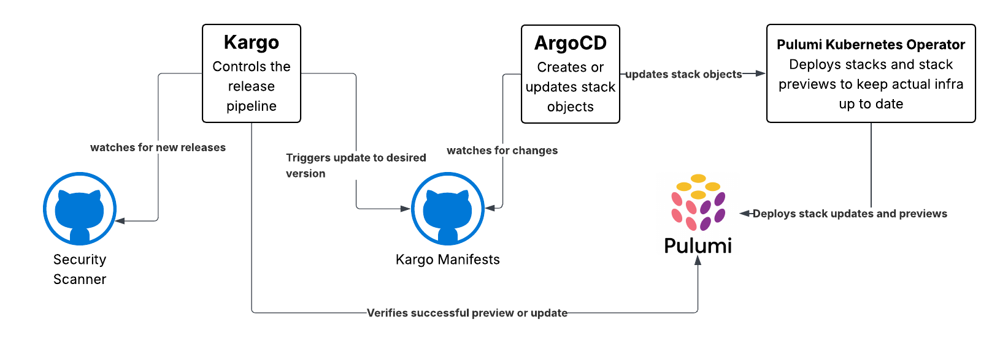
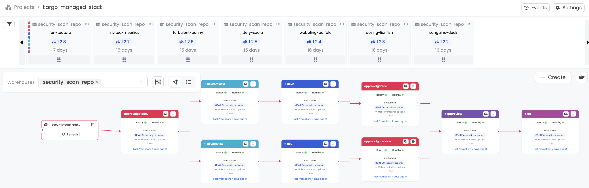
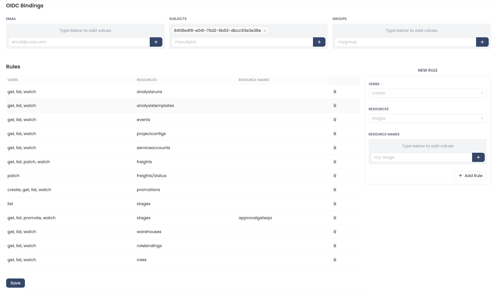

The [Pulumi Kubernetes Operator (PKO)](https://www.pulumi.com/docs/iac/guides/continuous-delivery/pulumi-kubernetes-operator/) enables you to manage Pulumi stacks as Kubernetes resources, but it doesn't provide much guidance on change management. [Kargo](https://kargo.io/) fills this gap by providing controlled, staged promotions with verification steps. Together, they let you keep your infrastructure defined in Pulumi while managing multi-environment rollouts in a systematic way.

This pattern is especially useful for platform teams that need to balance delivery speed with governance as environments and expectations scale.
<!--more-->

{}
Going to [KubeCon Europe 2026](https://www.pulumi.com/kubecon/)?

Visit [Pulumi at Booth 784](https://www.pulumi.com/kubecon/) for live demos of Pulumi Kubernetes Operator and Kargo workflows for managing infrastructure change at scale.
{}

## What you can do with Argo CD, PKO, and Kargo

When you combine these tools, you gain several change management capabilities:

- **Control release timing**: Determine when updates to your Pulumi program are released to different environments, rather than deploying everywhere at once.
- **Visualize deployments**: See which environments are running which versions of your infrastructure code at a glance.
- **Automatic verification**: Automatically verify deployment success before promoting changes to the next environment.
- **Approval gates**: Set up discrete approval requirements before promotion, ensuring human review when needed.
- **Change tracking**: Maintain a clear audit trail of what changed, when, and how it moved through your environments.

## About Kargo

Kargo is a [continuous promotion platform](https://docs.kargo.io/user-guide/core-concepts/) that manages how changes move through application lifecycle stages. While it's commonly used for application deployments, it also works for infrastructure code managed by PKO.

The key concepts you'll work with:

**Freight**: A packaged set of artifacts that move together through your pipeline. When integrating with PKO, this will typically be the pulumi program that defines your infrastructure and the git commit with the latest version.

**Stages**: Promotion targets that represent different lifecycle phases (like dev, staging, production). Each stage corresponds to a different PKO Stack resource managing that environment's infrastructure.

**Promotions**: The process of moving freight from one stage to the next. Kargo updates the Stack resources to point to the promoted freight.

**Warehouses**: Monitors that watch your Git repository for infrastructure code changes and package new commits or releases as freight.

**Projects**: Organizational units that group related stages and warehouses, mapping to Kubernetes namespaces for access control.

When Kargo promotes freight to a stage, it updates the corresponding PKO Stack resource with the new Git reference. PKO then reconciles the stack, and your infrastructure changes are applied.

## Example architecture

### Workflow

To demonstrate how these tools work together, let's look at an example setup that manages infrastructure code through a controlled promotion pipeline:



This architecture includes six main components working together:

1. **[Security Scanner repository](https://github.com/lichtie/security-scanner)**: Contains your Pulumi infrastructure code. Kargo watches this repository for new commits or releases.
1. **Kargo**: Controls the release pipeline. When it detects new code in the security scanner repository, it triggers an update to promote that code to the next stage.
1. **[Kargo manifests repository](https://github.com/lichtie/kargo-manifests)**: Stores the Kubernetes manifests that define PKO Stack resources. Kargo updates this repository with the new Git references when promoting freight.
1. **Argo CD**: Watches the Kargo manifests repository and creates or updates Stack objects in Kubernetes when it detects changes.
1. **Pulumi Kubernetes Operator**: Watches Stack objects and deploys them to Pulumi, triggering stack updates or previews.
1. **Pulumi**: Performs the actual infrastructure deployments and previews based on PKO's instructions.

The workflow follows this pattern: Kargo detects new infrastructure code, updates the manifests repository with the new Git reference, Argo CD syncs the Stack objects to Kubernetes, PKO triggers Pulumi to deploy the changes, and Kargo verifies the successful deployment. This creates a closed loop where infrastructure changes are systematically promoted and verified at each stage.

### Dashboard and Management



The Kargo dashboard brings operational visibility to this entire workflow. The timeline view at the top shows every freight version moving through your pipeline, making it immediately clear which infrastructure code version is running in each environment and how long it has been there.

The flow diagram above maps out your complete promotion path with color-coded stages. You can see at a glance where changes are flowing smoothly and where they are waiting at approval gates or blocked by failed verifications.

Status indicators on each stage show real-time health information, eliminating the need to manually check multiple systems or run status commands. This single-pane view reduces context switching, speeds up troubleshooting when issues arise, and gives an understanding of exactly what infrastructure is deployed where.

{}
You can see the complete setup for this example, including configuration files and manifests, in the [pulumi-operator-with-kargo-change-management](https://github.com/lichtie/pulumi-operator-with-kargo-change-management) repository.
{}

## Setting up the environment

The example repository contains three Pulumi projects that deploy in sequence:

1. **cluster**: Creates a basic Amazon EKS cluster where everything will run.
1. **cluster-setup**: Installs the required dependencies including PKO, cert-manager, Argo CD, Argo Rollouts, and AWS Cognito for authentication.
1. **kargo**: Deploys Kargo via Helm and provides examples to set up the project with stages, approval gates, and analysis templates for the promotion pipeline.

## Configuring Kargo

Once Kargo is installed, you need to configure several components to set up your promotion pipeline.

### Creating a project

Start by creating a [Kargo project](https://docs.kargo.io/user-guide/how-to-guides/working-with-projects), which automatically creates a corresponding Kubernetes namespace.

### Git credentials

Kargo needs access to your Git repositories to monitor for changes and update manifests. Create a secret with your Git credentials, labeled so Kargo recognizes it:

```yaml
apiVersion: v1
kind: Secret
metadata:
  name: github-creds
  namespace: kargo-managed-stack
  labels:
    kargo.akuity.io/cred-type: git
stringData:
  repoURL: https://github.com/YOUR_REPO
  username: YOUR_USERNAME
  password: GITHUB_TOKEN
```

### Setting up approver roles

To control who can approve promotions at approval gates, you can [create custom roles](https://docs.kargo.io/user-guide/security/access-controls/) with the `promote` permission. This requires three resources: a ServiceAccount with OIDC claim mapping, a Role with promotion permissions, and a RoleBinding to connect them. The easiest way to set up these resources is through the Kargo UI.



The screenshot shows a role configured with the `promote` verb on specific stages (like `approvalgateqa`), which allows users bound to this role to approve promotions at that gate. The role also includes permissions to create promotions and view other resources.

### Project configuration

Use a ProjectConfig resource to control [promotion policies](https://docs.kargo.io/user-guide/how-to-guides/working-with-projects#configuring-promotion-policies) for your project. This example enables automatic promotion for preview and deployment stages:

```yaml
apiVersion: kargo.akuity.io/v1alpha1
kind: ProjectConfig
metadata:
  name: kargo-managed-stack
  namespace: kargo-managed-stack
spec:
  promotionPolicies:
    - stageSelector:
        name: devpreview
      autoPromotionEnabled: true
    - stageSelector:
        name: dev2preview
      autoPromotionEnabled: true
    - stageSelector:
        name: dev
      autoPromotionEnabled: true
    - stageSelector:
        name: dev2
      autoPromotionEnabled: true
    - stageSelector:
        name: qapreview
      autoPromotionEnabled: true
    - stageSelector:
        name: qa
      autoPromotionEnabled: true
```

This configuration automatically promotes freight through preview stages and dev environments, while approval gates remain manual.

### Pulumi access token

Kargo needs access to the Pulumi API to verify that infrastructure deployments completed successfully. Create a secret in your project through the Kargo UI:

1. Navigate to your project in the Kargo UI
1. Navigate to **Settings** → **Credentials**
1. Select **Create a new credential** with:
   - Name: `pulumi-api-token`
   - Type: `Opaque`
   - Key: `PULUMI_ACCESS_TOKEN`
   - Value: Your Pulumi access token

This token allows Kargo's analysis templates to query the Pulumi API and confirm that stack updates and previews ran successfully before promoting freight to the next stage.

## Defining stages

[Stages](https://docs.kargo.io/user-guide/core-concepts/#stages) represent different points in your promotion pipeline. This example uses three types of stages to control how infrastructure changes move from development to production.

### Preview stages

Preview stages run `pulumi preview` operations to show what changes would be applied without actually deploying them. These stages help catch issues early by validating that the infrastructure code is valid and showing the expected changes:

- **devpreview** and **dev2preview**: Run previews for the dev environments
- **qapreview**: Runs a preview for QA after passing approval gates

Preview stages automatically promote to their corresponding update stages once the preview completes successfully and verification passes.

### Update stages

Update stages run `pulumi up` to actually deploy the infrastructure changes:

- **dev** and **dev2**: Deploy changes to parallel dev environments for testing
- **qa**: Deploy to the QA environment after all approvals

Update stages are configured to automatically promote once the deployment succeeds and verification confirms the infrastructure is in the expected state.

### Approval gates

Approval gates are stages that require manual approval before freight can proceed. They act as checkpoints where designated approvers review changes before they move forward:

- **approvalgatedev**: Manual checkpoint before dev deployments
- **approvalgateqa**: Functional review gate before QA deployment
- **approvalgateqasec**: Security review gate before QA deployment

The QA preview stage uses `availabilityStrategy: All`, meaning freight must pass through both `approvalgateqa` and `approvalgateqasec` before proceeding. This ensures both functional and security teams approve changes before they reach QA.

### Custom approver roles

Different approval gates may require different approvers. Using the [custom roles](#setting-up-approver-roles) described earlier, you can grant specific users or groups the `promote` permission on individual approval gates. For example, security team members might have the `promote` permission on `approvalgateqasec`, while functional testers have it on `approvalgateqa`. This ensures the right people review changes at each checkpoint.

## Verification

After each stage completes, Kargo can verify that the operation succeeded before promoting to the next stage. This example uses [analysis templates](https://docs.kargo.io/user-guide/reference-docs/analysis-templates/) to query the Pulumi API and confirm deployments completed successfully.

{}
Kargo uses Argo Rollouts for verification, so Argo Rollouts must be installed in your cluster.
{}

### Analysis templates

Analysis templates define how to verify a stage. They can make HTTP requests, run queries, or execute any checks you need. For Pulumi verification, the templates:

1. **Wait for operations to complete**: Include a delay to give Pulumi time to finish the preview or update operation
1. **Query the Pulumi API**: Make HTTP requests to the Pulumi API to retrieve the stack's latest update information
1. **Verify the commit ID**: Check that the deployed commit matches the freight being promoted
1. **Confirm success**: Ensure the operation completed without errors

The analysis template uses the `PULUMI_ACCESS_TOKEN` [secret created earlier](#pulumi-access-token) to authenticate with the Pulumi API.

### Custom verification standards

Analysis templates are flexible enough to enforce other standards your organization requires as well.

This gives you a way to codify your deployment standards and ensure they're enforced automatically as infrastructure changes move through environments.

## Conclusion

Combining the Pulumi Kubernetes Operator with Kargo gives you systematic control over how infrastructure changes move through your environments. Rather than manually managing deployments or pushing changes directly to production, you get automated promotions with verification steps, approval gates where human review is needed, and a clear audit trail of what changed and when. This approach is particularly valuable for teams managing multiple environments where infrastructure changes need to be tested and approved before reaching production. By defining your promotion pipeline as code with stages, approval gates, and verification templates, you ensure that your infrastructure changes follow the same rigorous process every time.

If you want to put this pattern into practice, you can see it live at [KubeCon Europe 2026 (Booth 784)](https://www.pulumi.com/kubecon/) or register for our upcoming [Zero to Production in Kubernetes](https://www.pulumi.com/events/from-zero-to-production-in-kubernetes/) workshop.


