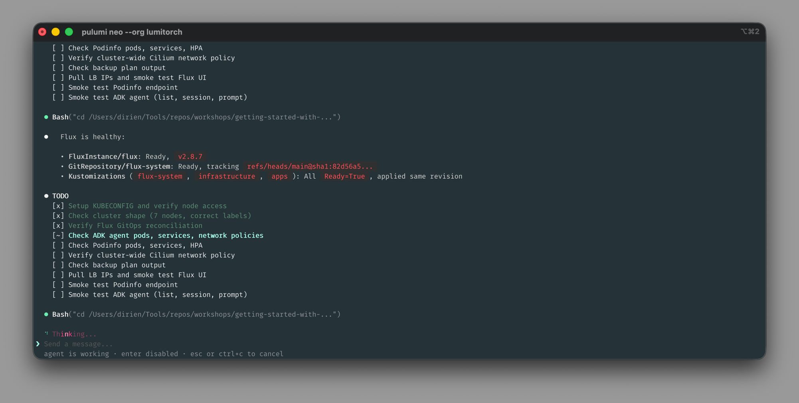

Since launching [Pulumi Neo](/blog/pulumi-neo/), over 4,500 organizations have used it to delegate real infrastructure work: scaffolding, migrating, investigating, operationalizing, and more. Though that usage has come entirely through Pulumi Cloud, we know a large portion of Pulumi users live in the terminal, and increasingly that's where AI tools run too. Now we're bringing Neo there.

`pulumi neo` brings the same Neo experience you've had in Pulumi Cloud to your terminal. Running locally means there's no separate branch to push, no credentials to provision, and no context to paste: Neo picks up the setup you already have.

<!--more-->

## What local execution unlocks

Neo inherits your setup when it runs locally. The CLIs you've authenticated, the environment variables and kubeconfigs you've configured, and the project you're editing right now are all available without any setup on your part. That means Neo can run the same commands you would, against the same systems you have access to.

That makes `pulumi neo` a fit for paired, interactive sessions where you and Neo work through a problem together. For asynchronous, autonomous tasks you set up and come back to, Pulumi Cloud Neo is still the surface to reach for. Both reach the same Neo.

You can also hand tasks to Neo from other agent sessions. Simply ask your agent, such as Claude Code or Codex, to hand the task off to Neo, and the [Neo handoff skill](https://github.com/pulumi/agent-skills/tree/main/delegation) packages the current thread (goal, repo pointers, conversation summary) and starts a Neo task using `pulumi neo` under the hood. This works anywhere skills are supported, without leaving your current session.

## What carries over

Local tools and context are what's new. The full set of controls you have in Pulumi Cloud Neo applies in the terminal: approval modes (manual, balanced, auto) for tool calls, permission modes (default, read-only) for what Neo can change, and [Plan Mode](/docs/ai/tasks/#plan-mode) for research and planning before execution.

Integrations carry over too. The [integration catalog](/blog/neo-integration-catalog/) (connectors to Atlassian, Datadog, Linear, PagerDuty, and others) works the same way from the terminal. Identity, RBAC, and audit all run through your `pulumi login`, the same way they do in the console. See the [Pulumi Neo docs](/docs/ai/) for details.

## Get started

`pulumi neo` ships with the latest Pulumi CLI. To start a session:

1. Authenticate to Pulumi Cloud with `pulumi login`.
1. Run `pulumi neo`, or pass an initial prompt: `pulumi neo "what's in this stack?"`.

`pulumi neo` is part of a [broader launch](/releases/agentic-infrastructure-era/) on [agentic infrastructure](/blog/the-agentic-infrastructure-era/). See the [`pulumi neo` command reference](/docs/iac/cli/commands/pulumi_neo/) and the [Pulumi Neo docs](/docs/ai/) for details. [10 things you can do with Neo](/blog/10-things-you-can-do-with-neo/) is a good starting point for tasks to try. The [Pulumi Community Slack](https://slack.pulumi.com/) is the place for questions and feedback.
