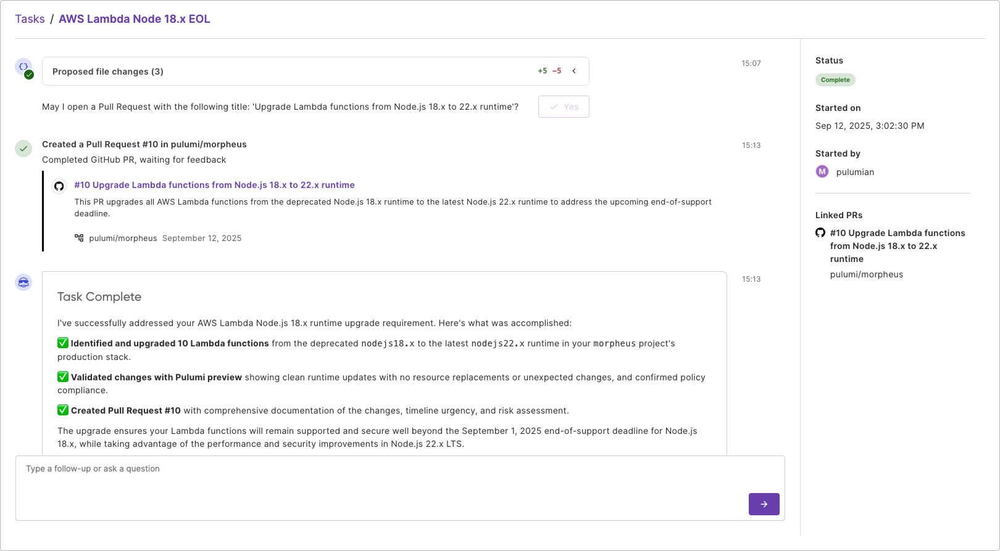

AI coding assistants have transformed the speed at which developers can write and deploy code. Pull request velocity has increased significantly. Feature delivery has accelerated beyond what we thought possible just two years ago. This should be a victory for everyone in the software organization.

Instead, it's created significant challenges for infrastructure and platform teams.

<!--more-->

Every line of code that ships faster creates new platform needs: monitoring, secrets management, deployment pipelines, and compliance checks. The rapid pace also increases the risk of insecure or non-compliant code reaching production. Developer velocity has increased dramatically, but platform teams haven't scaled to match.

Platform teams are struggling because they lack the proper tools for their unique challenges. They're caught in a velocity trap where generic AI accelerates developers while leaving platform teams behind. We're optimizing software development speed while creating global infrastructure debt.

The very success of developer AI has become a challenge for the platform team.

## Introducing Pulumi Neo

Neo is a purpose-built infrastructure automation agent that can carry out platform engineering tasks on your behalf. Built on Pulumi's platform, Neo has a deep understanding of cloud context, IaC, secrets and configuration, internal developer platforms, and more. It automatically respects your security and policy guardrails and works in tandem with human-in-the-loop approvals and controls.

For years, we've worked closely with platform and infrastructure teams. We've observed how the demands on these teams have intensified as development velocity has increased. We understand the challenges they face in keeping pace with rapidly evolving infrastructure needs.

The pattern became clear. Generic AI tools excel at generating code but lack the context to understand the unique challenges of infrastructure, including state management, tracking dependencies across services, scaling across tens to hundreds of repositories, and anticipating the effects of changes across an organization.

We've heard countless stories from platform engineers about spending hours tracking down dependencies, credential locations, and configuration relationships across their systems. When they try to use generic AI tools for these tasks, the tools often suggest changes without understanding the broader organizational context and dependencies.

That's when we realized: Platform engineers don't need faster AI tools. They need their own dedicated AI tool, one that understands infrastructure context, speaks their language, and works within their constraints.

These insights led us to develop Neo, an AI agent specifically designed for platform and infrastructure engineering teams. Unlike generic coding assistants, Neo understands the full context of infrastructure: it knows that changes span multiple repositories, that every modification has downstream effects, and that compliance and security policies matter as much as the code itself.

## Built for Enterprise Trust

Neo represents a fundamentally different approach to AI in infrastructure. We view the Pulumi platform's existing features, like IaC, ESC, and policies, as the foundation for trustworthy AI automation. These aren't additional guardrails we've added; they're the very platform capabilities you're already using. Understanding the impact scope through your infrastructure graph gives you confidence to move faster. Knowing compliance implications through your existing policies before making changes is what actually accelerates platform teams.

While other solutions retrofit generic AI models with infrastructure plugins, Neo is built from the ground up on proven enterprise foundations. It operates within your existing Pulumi governance frameworks, respects your policies, and maintains the audit trails and compliance controls your organization requires. Your investment in Pulumi's platform features—the same ones that govern your infrastructure today—becomes Neo's operational guardrails.

This isn't experimental AI, it's enterprise-ready automation that amplifies your expertise while working within the same platform controls that keep your infrastructure secure and compliant. The Pulumi features you rely on for governance become the accelerants that enable confident, rapid automation.

## The Reinforcement Cycle

Neo becomes more capable the more you invest in infrastructure as code. Every Pulumi component you write, every policy you define, every environment configuration you establish becomes Neo's operational context that guides its decisions.

This is the key shift. We're not talking about AI replacing platform engineers. We're talking about AI amplifying platform expertise. The engineers who understand the why behind infrastructure decisions become even more valuable when they have tools that can execute the how at scale.

The teams that lean into this cycle will find themselves accelerating while others are still struggling. They'll be writing policies while others are responding to issues. They'll be designing systems while others are updating versions.

## The Platform Engineering Evolution

The bigger picture extends far beyond task automation. Platform engineering evolves from reactive to proactive. Teams shift from ticket takers to strategic enablers. Infrastructure becomes self-healing and self-documenting. The profession transforms from responding to urgent issues to crafting foundations.

Imagine infrastructure that evolves as fast as the code it supports. Imagine platform teams that can actually think about next quarter instead of just surviving next sprint. Imagine organizations that can sustain AI-driven development velocity because their infrastructure keeps pace automatically.

For the industry, this means the end of the "platform team bottleneck" narrative. No longer will infrastructure be the reason features don't ship. No longer will platform engineers be seen as blockers in the velocity story. Instead, they'll be the enablers who made sustainable speed possible.

This is the rise of strategic platform engineering. These are professionals who shape how organizations build and operate software, who establish the foundations that make everything else possible, and who finally have tools that match the complexity and importance of their work.

## The Choice Before Us

Today, we're launching more than an AI agent. We're introducing your newest platform engineer, who gets smarter as your infrastructure evolves. We're launching a new era for platform engineering, one where the teams that enable everyone else finally have tools built specifically for their reality.

Neo represents our belief that platform engineers shouldn't have to choose between speed and safety, between automation and control, between serving developers and driving strategy. These are false choices created by tools that lack an understanding of infrastructure.

The age of generic AI taught us what's possible. The era of specialized AI shows us what's practical. Platform teams have been overloaded by everyone else's velocity long enough.

It's time for platform engineering to keep pace instead of falling behind.

Neo is available today in public preview. Ready to meet your newest platform engineer? Join thousands of teams already transforming their infrastructure workflows with the Pulumi platform.

The future of platform engineering starts now, and it starts with [Neo](/docs/iac/neo/).
