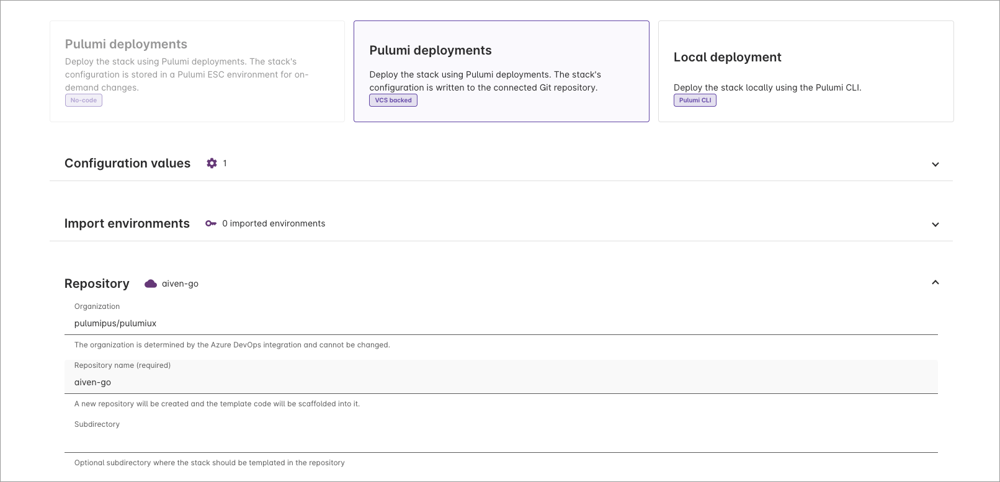
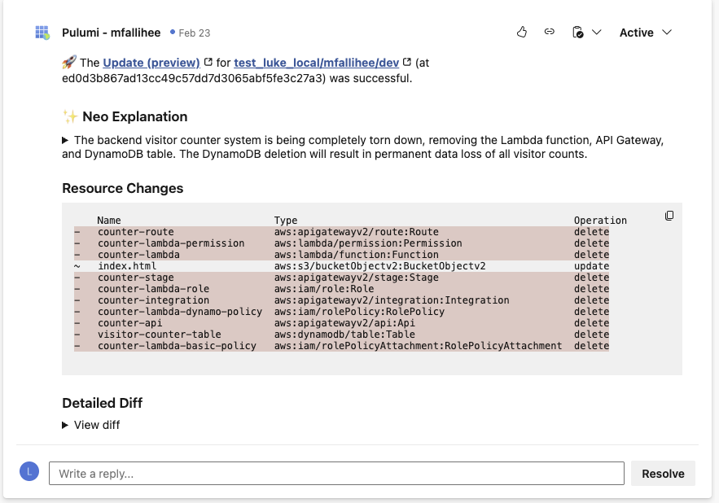

We've added Azure DevOps (ADO) and GitLab as VCS providers for Pulumi. If your team uses ADO or GitLab, you can now deploy infrastructure directly from your repositories - the same git-backed workflow we've had for GitHub.

<!--more-->

## What's included

These features apply to both Azure DevOps and GitLab integrations:

**Org and project discovery**: During setup, Pulumi lists your ADO organizations, GitLab groups, and projects so you can pick where your infrastructure code lives.

**Repo and branch operations**: Browse, select, or create repositories within your project. Pick a branch and wire it up without leaving the wizard.

**OIDC authentication**: Exchange Pulumi's OIDC token for a provider-specific access token — via Entra ID for ADO or GitLab's OIDC provider.

**Neo on pull requests and merge requests**: Neo posts summaries and infrastructure change explanations to your ADO pull requests and GitLab merge requests, same as it does for GitHub.

**Deployment**: Stacks backed by ADO or GitLab support push-to-deploy, pull/merge request previews, path filters, environment variables, secrets, and drift detection schedules.

**...and more.** Anything you can do with GitHub, you can do with ADO and GitLab.

## Getting started

1. An org admin configures the integration under **Settings** > **Integrations**.
1. Authorize with your Azure DevOps or GitLab account via OAuth.
1. Enjoy first-class workflows for deploying infrastructure.

See the [Azure DevOps integration docs](/docs/integrations/azure-devops-integration/) or the [GitLab integration docs](/docs/integrations/gitlab/) for the full setup walkthrough. If you're using GitHub, check out the [Pulumi GitHub App](/docs/integrations/github-app/).
