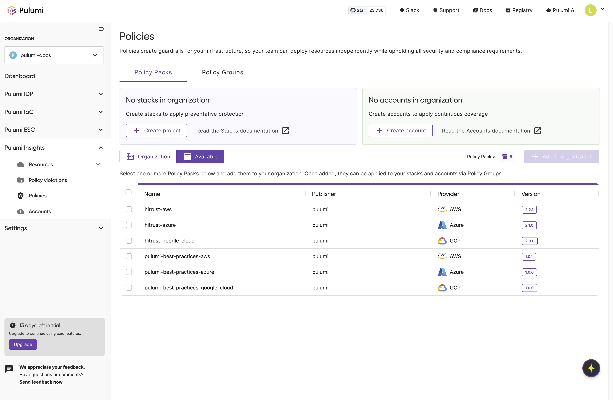
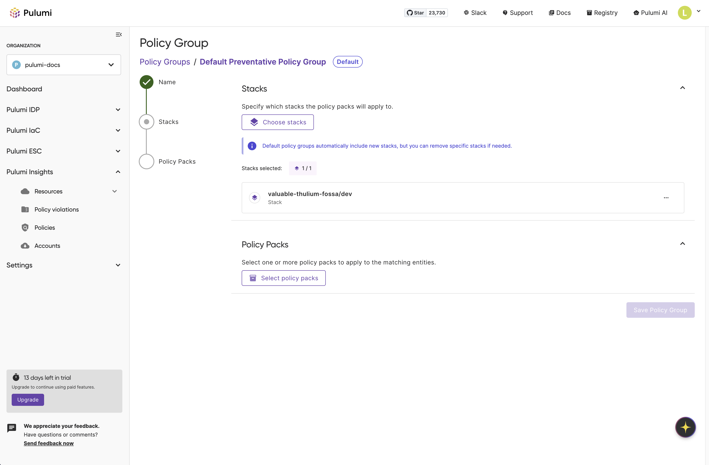

Pulumi’s Infrastructure as Code has included a powerful policy engine from day one. Over the past year, we’ve been enhancing it significantly to provide stronger governance for modern cloud platforms. Until now, these capabilities were limited to our Business Critical tier. Today, we’re excited to announce that [policy guardrails](/docs/insights/policy-as-code/) are now available to all Team and Enterprise customers. Alongside this, we’re launching a redesigned policy management experience and introducing out-of-the-box policy packs that make it easier than ever to secure, govern, and optimize your cloud environments—even when powered by AI agents like [Pulumi Neo](/blog/pulumi-neo/).

<!--more-->

## Policy as Guardrails for AI Infrastructure

As developer velocity accelerates, AI agents like Neo are helping teams create and manage infrastructure at unprecedented speed. That speed creates a governance challenge: how do you ensure security, compliance, and cost-effectiveness without slowing developers down?

Policy guardrails provide the answer. Pulumi’s Policy as Code (PaC) framework applies DevOps best practices to governance, letting you codify rules, test them through pull requests, and version them alongside your infrastructure. With policies in place, you can ensure that every change stays within your organization’s standards, whether it is a human developer or Neo making a change.

## What Makes Pulumi Policy Different

Unlike many other policy solutions, Pulumi Policy uses general-purpose programming languages such as TypeScript and Python rather than restrictive DSLs or YAML. This unlocks richer and more flexible capabilities, including:

- **Conditional logic** to codify your organization's nuanced rules.  
- **Reusable functions and abstractions** to create a shared library of policies.  
- **Unit tests** to validate policy behavior before rollout.  

With today’s updates, this foundation is easier to adopt and scale across your teams than ever before.

## New Simplified Experience

While Pulumi Policy has always allowed you to enforce compliance using TypeScript and Python, the existing workflow could be cumbersome—discovering policies required switching between the console and CLI, and applying them involved multiple steps.

We've removed that friction to provide the seamless guardrails needed for this high-velocity, AI-driven world. The new experience is built around a streamlined, in-console workflow for discovering, applying, and managing your policies.

### In-Console Discoverability

We are making it easier to find and understand policy packs. You can now browse a rich set of pre-built policy packs directly within the Pulumi Cloud console—no CLI or context switching required.

You’ll find:

- **A rich browsing experience:** See all available policy packs in one place.
- **Detailed information:** Each pack comes with a clear description of the policies included.
- **Organization-approved packs:** Org admins can curate a list of approved policy packs, ensuring your teams—and AI agents like Neo—are using a vetted set of policies.

### New Pre-Built Policy Packs

To help you establish guardrails immediately, we have authored several [pre-built policy packs](/docs/insights/pre-built-packs/). We are excited to highlight two that are available today:

- **Pulumi Best Practices:** A foundational set of recommended governance and security controls that serves as a strong starting point for any organization.
- **HITRUST CSF v11.5:** Provides predefined controls that help align cloud resources with HITRUST CSF requirements.

### Streamlined Policy Management and Application

The new policy management experience dramatically simplifies policy application:

- **Intuitive Interface:** Browse, select, and apply policies through a streamlined workflow using **Policy Groups** to bundle related policies and apply them to your stacks or cloud accounts.
- **Expanded Scale:** We've eliminated the 4,000 stack UI limit on policy groups, allowing you to scale policies across your entire infrastructure.
- **Granular Enforcement:** Configure the enforcement level (`advisory` or `mandatory`) for policies to either warn developers or block non-compliant deployments entirely.

### Preventative and Audit Approaches

Pulumi Policy supports two complementary approaches to governance.  

- **Preventative policies**: Block non-compliant deployments during `pulumi up`, providing real-time guardrails for developers and AI agents.
- **Audit policies**: Continuously scan existing resources for ongoing compliance monitoring, giving you a complete picture of your cloud security posture.

This dual approach ensures new deployments meet standards while maintaining visibility across your entire infrastructure. Learn more in our [Preventative vs. Audit Policies](/docs/insights/preventative-vs-audit-policies/) guide.

## How to Get Started

Getting started with the new policy management experience is straightforward:

1. **Browse Policy Packs:** Navigate to the Policies tab in your Pulumi Cloud console to discover pre-built policy packs like Pulumi Best Practices and HITRUST CSF. Learn more about [Policy as Code](/docs/insights/policy-as-code/) configuration and setup.

1. **Choose Your Approach:** Decide whether you need preventative policies (to block non-compliant deployments during `pulumi up`) or audit policies (for continuous compliance monitoring across all cloud resources).

1. **Create Policy Groups:** Set up policy groups to bundle related policies and apply them to your stacks or cloud accounts.

1. **Configure Enforcement:** Set enforcement levels (advisory, mandatory, or remediate) for each policy based on your requirements.

## Now Available To Team and Enterprise Customers

To ensure every organization can build with confidence, these policy management enhancements and the `pulumi-best-practices` policy packs are **now available to Team and Enterprise customers**. Checkout our [pricing](/pricing) page for more information.

## Conclusion

Governance doesn’t need to be a roadblock—it can be a foundation that accelerates innovation. With enhanced policy management and ready-to-use guardrails, Pulumi helps your teams and AI agents like Neo move fast while staying secure, compliant, and cost effective.  

Try the new experience in Pulumi Cloud today, and let us know what you think in the [Pulumi Community Slack](https://slack.pulumi.com/).
