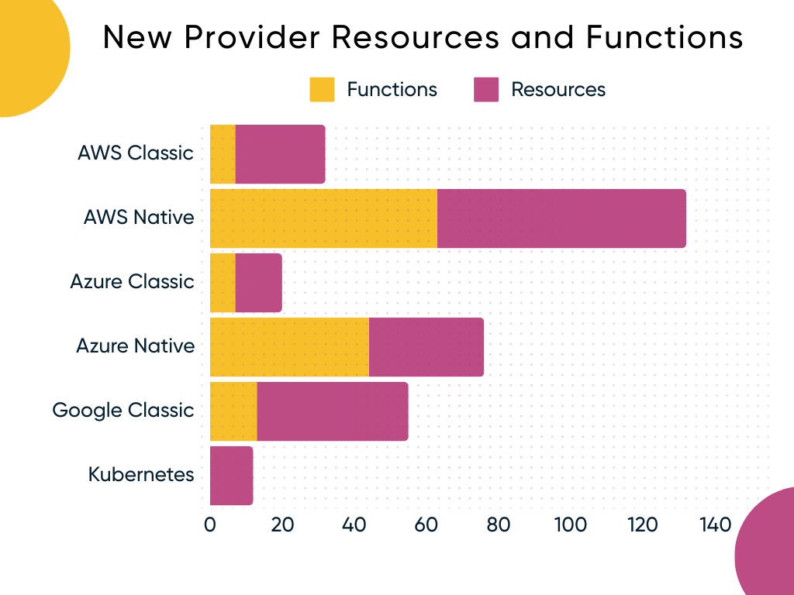

What an incredible two months at Pulumi! From the revolutionary AI-powered Pulumi Copilot to robust infrastructure lifecycle management, enhanced Pulumi ESC with versioning and SDKs, and a brand-new Docker Build provider, this release cycle is packed with high-impact features delivered at an unprecedented pace. Ready to see all the details? We've got a lot to cover, so let's jump right into the highlights of this action-packed release.

<!--more-->

- [AI](#ai)
  - [Pulumi Copilot: The Future of Cloud Infrastructure](#pulumi-copilot-the-future-of-cloud-infrastructure)
- [Pulumi Cloud](#pulumi-cloud)
  - [New Infrastructure Lifecycle Management Features](#new-infrastructure-lifecycle-management-features)
    - [Drift Detection and Remediation](#drift-detection-and-remediation)
    - [Time-to-Live Stacks](#time-to-live-stacks)
    - [Scheduled Deployments](#scheduled-deployments)
  - [Pulumi ESC: New Features to Supercharge Your Secrets and Config Management](#pulumi-esc-new-features-to-supercharge-your-secrets-and-config-management)
    - [Pulumi ESC Versioning](#pulumi-esc-versioning)
    - [Pulumi ESC SDK](#pulumi-esc-sdk)
    - [Pulumi Service Provider for ESC](#pulumi-service-provider-for-esc)
    - [Automation API Support for ESC](#automation-api-support-for-esc)
  - [Pulumi Cloud OIDC Trust Relationship](#pulumi-cloud-oidc-trust-relationship)
  - [New Project Wizard Enhancements](#new-project-wizard-enhancements)
- [Core](#core)
  - [Continue On Error in the Pulumi CLI](#continue-on-error-in-the-pulumi-cli)
  - [Run Pulumi with Any TypeScript Version](#run-pulumi-with-any-typescript-version)
- [Providers and Packages](#providers-and-packages)
  - [Next-Generation Docker Image Builds with Pulumi](#next-generation-docker-image-builds-with-pulumi)
  - [Using Pulumi with Azure Deployment Environments](#using-pulumi-with-azure-deployment-environments)
    - [Helm Chart v4 Resource](#helm-chart-v4-resource)
  - [New Provider Resources](#new-provider-resources)
- [Wrap up](#wrap-up)

## AI

### Pulumi Copilot: The Future of Cloud Infrastructure 

Pulumi Copilot is a game-changing conversational AI assistant for [Pulumi Cloud](/docs/pulumi-cloud/), leveraging large language models (LLMs) to simplify and enhance your cloud management experience. Get instant answers about your cloud by querying the state of any resource managed by Pulumi, across all your clouds and accounts. Explore historical data on stacks, projects, deployments, and more, gaining deep insights into your infrastructure. Write and deploy IaC with ease as Pulumi Copilot brings the power of Pulumi AI directly to your fingertips. Gain insights from cloud provider metadata as Pulumi Copilot integrates with AWS, Azure, Kubernetes, and more; to provide real-time insights into usage, costs, and your infrastructure.

Pulumi Copilot enforces the same strict identity and RBAC rules as Pulumi Cloud, ensuring data security and privacy for your organization. Try Pulumi Copilot for free! It's in public beta and available to all Pulumi Cloud organizations. Enable it in your organization settings: Settings > Access Management > Pulumi Copilot. [Read the blog post](/blog/pulumi-copilot/) | [Explore the docs](/docs/pulumi-cloud/copilot/)



## Pulumi Cloud

### New Infrastructure Lifecycle Management Features

We introduced a wave of new [Infrastructure Lifecycle Management](/blog/infrastructure-lifecycle-management/) capabilities in Pulumi Cloud, building upon the power of [Pulumi Deployments](/docs/pulumi-cloud/deployments/), and directly addressing the needs of our customers for robust Day 2 operations and beyond. These new features—Drift Detection and Remediation, Time-to-Live Stacks, and Scheduled Deployments—enhance security, optimize costs, and automate key infrastructure management tasks. We also announced a new Pulumi Deployments [Free Tier](/blog/deploy-minutes-included/) for all users, providing 3,000 free deployment minutes every month to easily test and use these new features.

#### Drift Detection and Remediation

Uncontrolled configuration drift can wreak havoc on your cloud environments, leading to security vulnerabilities, compliance violations, costly outages, and wasted resources. Pulumi Cloud's new [Drift Detection and Remediation](/docs/pulumi-cloud/deployments/drift/) feature empowers platform teams to maintain complete control over their cloud infrastructure. This feature periodically compares the actual state of cloud resources with the desired state defined in Pulumi programs, identifying any discrepancies. Automatically detect any deviation from your desired state, whether caused by manual edits or external scripts, and receive timely alerts through integrations like [Slack](/docs/pulumi-cloud/webhooks/#slack-webhooks) and [Microsoft Teams](/docs/pulumi-cloud/webhooks/#microsoft-teams-webhooks). Pulumi Deployments users can enable automatic remediation to correct drift and ensure their infrastructure remains consistent with their code. You can manage Drift Detection and Remediation through the [Pulumi Cloud console](/docs/pulumi-cloud/deployments/drift/#pulumi-cloud-ui), the [Pulumi CLI](/docs/pulumi-cloud/deployments/drift/#running-drift-detection-from-the-cli), the [REST API](/docs/pulumi-cloud/deployments/drift/#setting-it-up-via-the-rest-api), or the [Pulumi Service Provider](/registry/packages/pulumiservice/api-docs/driftschedule/). Check out our [detailed post](/blog/drift-detection/).



#### Time-to-Live Stacks

Creating temporary environments is crucial for running experiments, testing new features, and ensuring that everything works smoothly before going live. However, these environments are often forgotten and left running, consuming resources and adding unnecessary costs. Manually managing these temporary stacks is time-consuming, operationally burdensome, and prone to errors. Pulumi's [Time-to-Live Stacks](/docs/pulumi-cloud/deployments/ttl/) feature solves this by allowing teams to set a predefined lifespan on any stack. After the specified time, the stack is automatically destroyed, preventing cost overruns and reducing security risks from idle resources. This automated cleanup process ensures cost control, enhances developer enablement, and improves security. Time-to-Live Stacks can be easily managed through the [Pulumi Cloud console](/docs/pulumi-cloud/deployments/ttl/#pulumi-cloud-ui), [REST API](/docs/pulumi-cloud/deployments/ttl/#rest-api), or the [Pulumi Service Provider](/docs/pulumi-cloud/deployments/ttl/#pulumi-cloud-service-provider). See our launch [blog post](/blog/ttl/).

#### Scheduled Deployments

We also rolled out [Scheduled Deployments](/blog/scheduled-deployments/), extending the automation capabilities of Drift Detection and Remediation and Time-to-Live Stacks. Scheduled Deployments enable precise automation of cloud operations, allowing users to schedule any Pulumi operation—such as pulumi up, pulumi refresh, pulumi destroy, or pulumi preview—for any stack with Pulumi Deployments. This provides greater flexibility for managing your cloud operations, whether it's scheduling off-peak deployments, optimizing resource costs, or automating routine infrastructure updates. You can easily set up and manage Scheduled Deployments through the [Pulumi Cloud console](/docs/pulumi-cloud/deployments/schedules/#pulumi-cloud-ui), [REST API](/docs/pulumi-cloud/deployments/schedules/#setting-it-up-in-the-api), or directly within your code using the [Pulumi Service Provider](/registry/packages/pulumiservice/api-docs/deploymentschedule/).

### Pulumi ESC: New Features to Supercharge Your Secrets and Config Management

We unleashed a wave of powerful new features for [Pulumi Environments, Secrets, and Configuration](/product/esc/) (ESC), taking secrets and configuration management to the next level. [Read the blog post](/blog/esc-software-engineering/) to learn more about these enhancements that bring best-in-class software engineering practices to your fingertips, enabling you to manage secrets and configuration complexity at scale across all your cloud applications and infrastructure.

#### Pulumi ESC Versioning

[Pulumi ESC Versioning](/blog/esc-versioning-launch/) gives you unprecedented control over your secrets and configuration. Every change is captured in an immutable revision history, allowing you to audit modifications, compare versions, and safely roll back. Assign meaningful tags to revisions (e.g., `production`, `v1.2.1`, `stable`) for easy management, just like Docker tags. When importing an environment, pin it to a specific version using tags or a revision number to prevent automatic propagation of changes from the source. This enables phased rollouts and thorough testing before deploying new configurations. You can also reference specific versions with the esc run command, targeting different environments for different tasks. This granular control minimizes risks, enhances collaboration, and streamlines workflows. Access versioning features through the [Pulumi Cloud Console](/blog/esc-versioning-launch/#using-the-console), the [ESC CLI](/docs/esc/cli/commands/esc_env_version/), or the [ESC REST API](/docs/pulumi-cloud/cloud-rest-api/#environments).



#### Pulumi ESC SDK

[Pulumi ESC SDKs](/blog/esc-sdk-launch/) are now available for [Python](/docs/esc/development/languages-sdks/python/), [TypeScript/JavaScript](/docs/esc/development/languages-sdks/javascript/), and [Go](/docs/esc/development/languages-sdks/go/), making it easier than ever to harness the power of ESC directly within your applications using your favorite programming languages. The SDKs provide a simple and intuitive programmatic interface to manage your ESC environments, securely access secrets and configurations at runtime, and eliminate the need for hardcoded credentials. This streamlines your development process, enhances security, and promotes best practices for handling sensitive data. Check out our [docs](/docs/esc/development/languages-sdks/).

#### Pulumi Service Provider for ESC

You can now manage your Pulumi ESC Environments using the powerful [Pulumi Service Provider](/blog/esc-automation-api-pulumi-service-provider-launch/). This means you can [define environments](/registry/packages/pulumiservice/api-docs/environment/), [add version tags](/registry/packages/pulumiservice/api-docs/environmentversiontag/), and even [control access](/registry/packages/pulumiservice/api-docs/teamenvironmentpermission/) using familiar Infrastructure as Code (IaC) practices, ensuring consistency and repeatability across your deployments. The Pulumi Service Provider empowers you to manage your entire infrastructure and application landscape through a unified approach.

#### Automation API Support for ESC

We’ve expanded the powerful Pulumi Automation API to include new methods for interacting with Pulumi ESC Environments programmatically. These new methods– addEnvironments(...), listEnvironments(), and removeEnvironment(environment) – enable you to seamlessly integrate environment management into your automated workflows and build sophisticated custom tooling. The [Automation API](/docs/using-pulumi/automation-api/) provides the building blocks for advanced automation scenarios such as dynamically configuring applications based on environments, managing environment dependencies, and integrating ESC into CI/CD pipelines. Pulumi ESC Automation API capabilities are available for [TypeScript/JavaScript](/docs/reference/pkg/nodejs/pulumi/pulumi/classes/automation.Stack.html#addEnvironments), [Go](https://pkg.go.dev/github.com/pulumi/pulumi/sdk/v3@v3.117.0/go/auto#LocalWorkspace.AddEnvironments), and [Python](/docs/reference/pkg/python/pulumi/#pulumi.automation.LocalWorkspace.add_environments). Check out our [blog post](/blog/esc-automation-api-pulumi-service-provider-launch/#streamline-automated-workflows-with-automation-api-enhancements) for examples.

### Pulumi Cloud OIDC Trust Relationship

Pulumi Cloud now supports [OpenID Connect (OIDC) Trust Relationships](/blog/oidc-trust-relationships/), allowing you to securely integrate Pulumi into any ecosystem that supports OIDC. This feature addresses the "secret zero" challenge by facilitating the exchange of secure platform tokens for short-lived Pulumi tokens, enhancing security and simplifying token management. You can configure trusted OIDC identity providers, such as [GitHub](/docs/pulumi-cloud/oidc/client/github/), GitLab, or Google Cloud, and set granular policies to control token exchange based on issuer, subject, or additional claims. This integration extends to Kubernetes, enabling pods to authenticate to Pulumi Cloud using OIDC tokens issued by Google Kubernetes Engine [GKE](/docs/pulumi-cloud/oidc/client/kubernetes-gke/). To further streamline the integration with GitHub Actions, we introduced a new [GitHub Action](https://github.com/marketplace/actions/pulumi-auth-action) that automates the retrieval of Pulumi access tokens, making it even easier to leverage OIDC for secure authentication within your workflows. Check out our [OIDC docs](/docs/pulumi-cloud/oidc/client/github/).

### New Project Wizard Enhancements

We enhanced the [New Project Wizard](/docs/pulumi-cloud/developer-portals/new-project-wizard/) in Pulumi Cloud to streamline developer workflows and give platform teams more control over deployments.  You can now configure the [Developer Portal Gallery](/blog/developer-portal-gallery/) to exclusively display organization-specific templates, ensuring developers only use approved configurations. This simplifies template discovery and selection, reinforcing governance and compliance across development projects. We also streamlined project creation by introducing default repository locations and auto-generated project names, eliminating manual steps and potential naming conflicts. Read the [New Project Wizard updates blog post](/blog/new-project-wizard-apr2024-updates/) for more details.

## Core

### Continue On Error in the Pulumi CLI

Pulumi now offers more control over error handling during deployments with the new `--continue-on-error` flag for `pulumi up` and `pulumi destroy`. When managing complex infrastructure with Pulumi, deployments can involve a large number of concurrent resource operations. Previously, if an error occurred during a deployment, Pulumi would stop all new operations to prevent potential cascading failures. While this approach is often desirable, there are cases where you might want to continue updating or destroying resources that are independent of the failed resource. The --continue-on-error flag enables this behavior, allowing deployments to proceed even in the presence of errors, while still respecting resource dependencies. This can be especially useful when destroying resources, as it allows you to clean up as much infrastructure as possible. Read the [blog post](/blog/continue-on-error/) for more details.



### Run Pulumi with Any TypeScript Version
Previously, Pulumi's seamless TypeScript experience was limited to version 3.8, requiring manual build steps for newer versions. But now, with the release of the [Pulumi Node.js SDK 3.113.0](https://www.npmjs.com/package/@pulumi/pulumi), you can use any TypeScript version 3.8 or later, including the latest [TypeScript 5.4](https://www.typescriptlang.org/docs/handbook/release-notes/typescript-5-4.html), by simply adding it as a dependency in your project's package.json file. Pulumi will automatically use the specified version for compilation, unlocking access to the newest TypeScript features and improved type checking. Read the [blog post](/blog/typescript-versions/) for a detailed example and instructions on upgrading your projects.

## Providers and Packages

### Next-Generation Docker Image Builds with Pulumi
Pulumi introduces the new [Docker Build provider](/registry/packages/docker-build/), a dedicated package designed to modernize and streamline Docker image builds directly from your Pulumi programs. The new provider exposes Docker's next-generation buildx interface, unlocking advanced features such as multi-platform image support, advanced caching mechanisms, built-in support for build secrets, and seamless integration with Docker Build Cloud. This unlocks powerful scenarios, including building multi-architecture images and optimizing build performance with various cache backends. Read the [blog post](/blog/docker-build/) for detailed examples and migration guides.



### Using Pulumi with Azure Deployment Environments
Pulumi now supports authoring [Azure Deployment Environments (ADE)](https://learn.microsoft.com/en-us/azure/deployment-environments/) environment definitions, empowering developers to self-serve the application infrastructure they need while maintaining centralized management and governance. This integration allows you to leverage Pulumi's familiar programming model and the full power of its Infrastructure as Code (IaC) platform to define and manage Azure resources within ADE environments.  You can define ADE environments using a simple YAML configuration file that references a Pulumi program written in any of Pulumi's supported languages, including C#, TypeScript, Python, Go, and YAML. Leveraging a dedicated Pulumi Docker image, ADE seamlessly executes the selected Pulumi program, provisioning the defined Azure resources. This streamlines the creation of new environments, enhances developer productivity, and ensures consistency and compliance with organizational standards. Read the [blog post](/blog/azure-deployment-environments/) for a detailed walkthrough and examples.

#### Helm Chart v4 Resource

Pulumi introduces a new and improved Helm Chart v4 resource ([kubernetes.helm.sh/v4.Chart](/registry/packages/kubernetes/api-docs/helm/v4/chart/)) in the Pulumi Kubernetes provider, offering enhanced functionality, and a more streamlined experience for deploying Helm charts. A key improvement in v4 is expanded language support. Previous versions of the Chart resource were implemented separately for each Pulumi SDK, leading to inconsistencies and limited language compatibility. The new Chart v4 resource ensures consistent behavior and functionality across all Pulumi SDKs, including Python, TypeScript/JavaScript, Go, C#, Java, and YAML. Other notable enhancements include full OCI registry support, improved handling of chart values, better connectivity for cluster interactions, and improved resource ordering. Read the [blog post](/blog/kubernetes-chart-v4/) for a detailed overview, examples, and migration guidance.

### New Provider Resources

We have added 121 functions and 159 resources across our most popular providers, along with many more throughout our ecosystem. We also welcome our new community provider resource: [Genesis cloud](/registry/packages/genesiscloud/).

## Wrap up

Phew, that's a lot! We've packed this release with features to empower you to build and manage modern cloud infrastructure and applications with greater efficiency, control, and confidence. Explore all the new capabilities and share your feedback – we're always listening! Open an issue in the [Pulumi Cloud requests repository](https://github.com/pulumi/pulumi-cloud-requests/issues/new/choose) or the [pulumi/pulumi repository](https://github.com/pulumi/pulumi) for anything CLI-related. Stay tuned for more exciting updates!
