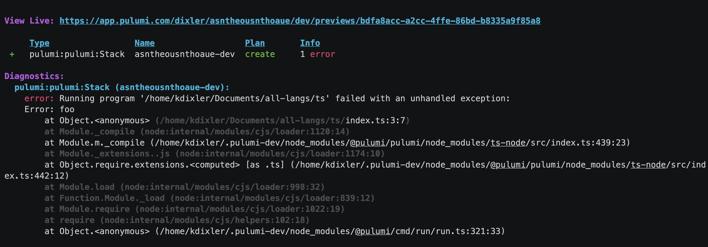

We have been busy shipping improvements in the last 2 months. Let's walk through the release highlights across Pulumi engineering areas from January and February. If you want to learn more between release blogs, follow the CLI improvements in the [pulumi/pulumi repo changelog](https://github.com/pulumi/pulumi-aws-native/releases) and Pulumi Service features in the [new features blogs](/blog/tag/features).

<!--more-->

Quick shortcuts to jump to your favorite area:

- [Pulumi CLI](#pulumi-cli)
  - [Colorized stack traces for Node.js errors](#colorized-stack-traces-for-nodejs-errors)
  - [New `–shell` option for pulumi stack output](#new---shell-option-for-pulumi-stack-output)
  - [`pulumi new` in directories with source control](#pulumi-new-in-directories-with-source-control)
  - [Support plugins hosted in GitLab](#support-plugins-hosted-in-gitlab)
  - [Use access tokens to authenticate to Google Cloud backend](#use-access-tokens-to-authenticate-to-google-cloud-backend)
  - [Delete temporary files from plugin downloads](#delete-temporary-files-from-plugin-downloads)
  - ["Yes, using Update Plans" prompt removed](#yes-using-update-plans-prompt-removed)
- [Pulumi Language SDKs](#pulumi-language-sdks)
  - [Output methods to serialize and deserialize JSON](#output-methods-to-serialize-and-deserialize-json)
  - [Retrieve stack reference outputs as plain values](#retrieve-stack-reference-outputs-as-plain-values)
  - [Native arm64 binaries in Python SDK](#native-arm64-binaries-in-python-sdk)
  - [Go version raised to 1.18](/#go-version-raised-to-118)
  - [Delegate alias computation to the engine](#delegate-alias-computation-to-the-engine)
- [Pulumi Automation API](#pulumi-automation-api)
  - [Adding tags to stacks through Automation API](#adding-tags-to-stacks-through-automation-api)
  - [Support cloning from Azure DevOps in Automation API](#support-cloning-from-azure-devops-in-automation-api)
- [Cloud Providers and Packages](#cloud-providers-and-packages)
- [Pulumi Service & Pulumi.com](#pulumi-service--pulumicom)
  - [OIDC integration](#overview)
  - [Pulumi Deployments](#if-you-havent-yet-tried-out-pulumi-deployments)

## Pulumi CLI

### Colorized stack traces for Node.js errors

When an error happens in a Pulumi program, stack traces can be instrumental to understand the reasons behind the failure. Stack traces can often be large and contain frames unrelated to user code, which makes debugging harder.

We have now changed the CLI to display Node.js stack traces with colors, where the important bits are highlighted and less important parts faded out. The new display technique helps draw attention to relevant details and is similar to running vanilla node programs.



👉  Learn more in the [Emit colorized stack traces pull request](https://github.com/pulumi/pulumi/pull/10410).

### New --shell option for `pulumi stack output`

We added a new `--shell` option to the `pulumi stack output` command that writes the outputs for a stack as a shell script:

```sh
% pulumi stack output --shell
bucketName=mybucket-1234
websiteURL="http://mybucket-1234.example.com"
```

On Windows, it will produce a Powershell script:

```sh
% pulumi stack output --shell
$bucketName = 'mybucket-1234'
$websiteURL = 'http://mybucket-1234.example.com'
```

As a result, Pulumi users are now able to write shell scripts like the one below:

```sh
eval "$(pulumi stack output --shell)"
echo "Created bucket $bucketName"
# => Created bucket mybucket-1234

echo "Visit at $websiteURL"
# => Visit at http://mybucket-1234.example.com
```

👉  Learn more in the [Add --shell option pull request](https://github.com/pulumi/pulumi/pull/11956).

### `pulumi new` in directories with source control

By default, `pulumi new` won't run unless the current directory is empty to avoid overriding any existing files. This behavior meant that the command failed in directories with initialized source control.

We shipped an improvement where Pulumi CLI will ignore .git, .hg, and .bzr files and directories when considering whether a directory is empty.

👉  Learn more in the [Ignore VCS directories pull request](https://github.com/pulumi/pulumi/pull/11804).

### Support plugins hosted in GitLab

Pulumi comes with a wealth of packages but users can also create and use custom providers and components. By default, Pulumi expects the binaries to be hosted on GitHub. On top of that, the CLI now supports GitLab as a first-class source of package downloads.

If your package binary is hosted on GitLab, you can now set its `pluginDownloadURL` property (see [Publish your package](https://www.pulumi.com/docs/using-pulumi/pulumi-packages/how-to-author/#publish-your-package)) to point to your GitLab project, e.g. to `gitlab://gitlab.com/43429536`.

👉  Learn more in the [Support custom plugins from other sources issue](https://github.com/pulumi/pulumi/issues/9007).

### Use access tokens to authenticate to Google Cloud backend

When storing the state files in Google Cloud backend, you can now authenticate to the Google Cloud Storage using Google access tokens. If the environment variable `GOOGLE_OAUTH_ACCESS_TOKEN` is set during a `pulumi login gs://...`, Pulumi will utilize the provided token to login to the bucket, assuming this has not been pre-empted by another authentication type.

👉  Learn more in the [Pulumi login to support google oauth access tokens for GCS buckets pull request](https://github.com/pulumi/pulumi/pull/12102).

### Delete temporary files from plugin downloads

While a plugin is being installed, the CLI downloads the necessary archive and stores the archive in `/tmp/pulumi-plugin-tar*`. The CLI is now more mindful of cleaning the temporary file after plugin installation completes to save disk space.

👉  Learn more in the [Delete temporary files from plugin downloads pull request](https://github.com/pulumi/pulumi/pull/12146).

### "Yes, using Update Plans" prompt removed

[Update Plans](https://www.pulumi.com/docs/concepts/update-plans/) is a preview feature to constrain the update only to the operations that were planned during preview. To get extra feedback from our users, we experimented with showing an extra option "yes, using Update Plans" at the update prompt. The experiment is now complete, so we removed the option.

Lean more in the [Remove the "yes, using Update Plans" prompt issue](https://github.com/pulumi/pulumi/issues/11894).

## Pulumi Language SDKs

### Output methods to serialize and deserialize JSON

Building JSON from values and parsing strings into JSON are two of the most common operations in Pulumi programs. All programming languages have built-in libraries to do so. However, quite often JSON operations need to be combined with Pulumi [Inputs and Outputs](https://www.pulumi.com/docs/concepts/inputs-outputs/), which required writing a cumbersome combination of `Apply` and serialization method calls.

To streamline this experience, Pulumi SDKs shipped helper serialization and deserialization functions that undertand the type `Output<T>` natively. Here is a simple usage example in Python, where `table.arn` is an output coming from another resource:

```python
policy = iam.Policy(
    "iam-policy",
    policy= Output.json_dumps({
        "Version": "2012-10-17",
        "Statement": [{
            "Action": [
                "dynamodb:PutItem",
                "dynamodb:GetItem"
            ],
            "Effect": "Allow",
            "Resource": [table.arn]
        }]
    }))
```

👉  Learn more in the [Output methods issue](https://github.com/pulumi/pulumi/issues/11939) that also tracks a number of futher additions to the toolset of helper methods.

### Retrieve stack reference outputs as plain values

You can read outputs from one stack in another stack's program using [Stack References](https://www.pulumi.com/docs/concepts/stack/#stackreferences). In the past, the resulting values were always wrapped inside an `Output<T>` container in order to preserve secret values (when needed).

With recent SDKs, we shipped an alternative method `StackReference.getOutputDetails`. This method returns a plain object with two fields: `value` and `secretValue`. At most one of these fields is set, depending on whether the stack reference output is a secret or not.

If you know that the output is not a secret, you can write a program to use the plain value immediately, for example, to iterate though a list in a loop and create resources in each iteration.

👉  Learn more for each language:

- [`StackReference.GetOutputDetails` for Go](https://github.com/pulumi/pulumi/pull/12034)
- [`StackReference.get_output_details` for Python](https://github.com/pulumi/pulumi/pull/12071)
- [`StackReference.GetOutputDetailsAsync` for .NET](https://github.com/pulumi/pulumi-dotnet/pull/103)
- [`StackReference.getOutputDetails` for Node.js](https://github.com/pulumi/pulumi/pull/12072)
- [`StackReference.outputDetailsAsync` for Java](https://github.com/pulumi/pulumi-java/pull/986)

### Native arm64 binaries in Python SDK

Pulumi Python SDK has been upgraded to use the `grpcio` library version 1.51.3, which comes with a wheel with native arm64 binaries (`universal2`). The change eases the installation of the Pulumi Python SDK on Apple M1/M2 machines.

👉  Learn more in the [Python grpc 1.51.3 contains universal2 binaries pull request](https://github.com/pulumi/pulumi/pull/12313).

### Go version raised to 1.18

The minimum version of Go required by Pulumi was raised to 1.18. Raising this directive allows us to use language features like generics in the codbase. The change is applied to both `pkg` and `sdk`.

👉  Learn more in the [go.mod: Raise to 'go 1.18 pull request](https://github.com/pulumi/pulumi/pull/11807).

### Delegate alias computation to the engine

Sometimes, two classes in Pulumi SDKs represent the same cloud resource. To enable migration from one to another, Pulumi sets aliases for those classes and declares them to be compatible.

In the past, each SDK was responsible for calculating all possible alias combinations for a given resource and its inherited parent. We recently added [support in the engine](https://github.com/pulumi/pulumi/pull/10819) for this computation along with an optimization to reduce complexity from a multiplicative factor to a linear one.

As a follow-up step, we updated our SDKs to only provide the base aliases, and allow the engine to do this computation. This enables smaller SDKs and faster runtime performance, especially for longer chains of parented resources. Other than that, the user experience hasn't changed.

👉  Learn more in the [Delegate alias computation from SDKs to Engine issue](https://github.com/pulumi/pulumi/issues/11940).

## Pulumi Automation API

### Adding tags to stacks through Automation API

You can now use Automation API to get, set, list, or remove tags on stacks programmatically. Here is a quick example in TypeScript:

```typescript
const workspace = await LocalWorkspace.create({
    projectSettings: projectSettings,
});
await workspace.createStack(stackName);
await workspace.setTag(stackName, "foo", "bar");
const tags = await workspace.listTags(stackName);
// tags will contain tags for `pulumi:project`, `pulumi:runtime`, and `foo` keys.
```

👉  Learn more in the [Add support for adding tags to stacks through Automation API issue](https://github.com/pulumi/pulumi/issues/5681).

### Support cloning from Azure DevOps in Automation API

We implemented a workaround to support Azure DevOps repositories when driving Pulumi from Automation API in Go. This is now also utilized in the [Pulumi Kubernetes Operator](https://github.com/pulumi/pulumi-kubernetes-operator).

👉  Learn more in the [Support clones from Azure DevOps pull request](https://github.com/pulumi/pulumi/pull/12001).

## Cloud Providers and Packages

Every week we keep shipping provider updates. Two highlights on our native providers:

- Azure Native shipped 20 new resources, including support for `networkcloud` and `voiceservices` ([changelog](https://github.com/pulumi/pulumi-azure-native/blob/master/CHANGELOG_OLD.md))
- AWS Native shipped 30 new resources in `apigatewayv2`, `appflow`, `applicationautoscaling`, `cloudtrail`, `connect`, `directoryservice`, `ec2`, `fms`, `gamecast`, `gamelift`, `kendraranking`, `networkmanager`, `omics`, `organizations`, `sagemaker`, `secretsmanager`, `simspaceweaver`, and `systemsmanagersap` modules ([changelog](https://github.com/pulumi/pulumi-aws-native/blob/master/CHANGELOG.md))

Five new community packages were added to the Registry: [Vultr](https://www.pulumi.com/registry/packages/vultr/), Zscaler Private Access (ZPA), Zscaler Internet Access (ZIA), [Statuscake](https://www.pulumi.com/registry/packages/statuscake/), and [Nuage](https://www.pulumi.com/registry/packages/nuage/).

## Pulumi Service & Pulumi.com

After [launching Pulumi Deployments](https://www.pulumi.com/blog/pulumi-deployments) a few months ago and receiving a ton of community feedback (thank you!) we launched an integration with OpenID Connect (OIDC) to enable security first deployments and industry best practices.

[OpenID Connect (OIDC)](https://openid.net/connect) is an identity layer built on top of the OAuth 2.0 framework. It allows third-party applications to verify the identity of the end-user and to obtain basic user profile information. OIDC uses JSON web tokens (JWTs), which you can obtain using flows conforming to the OAuth 2.0 specifications.

### Overview

The main benefits of using the OIDC integration for Pulumi Deployments are as follows:

- *Temporary credentials*: You can move away from long term credentials within your organization to leverage temporary credentials that are generated every time a deployment runs. The Pulumi Service issues a new OIDC token that is limited to that deployment. This token is used to obtain cloud credentials that automatically expire, meaning you do not need to store sensitive credentials that are reused with each deployment.

- *Granular access control*: The OIDC token generated by the Pulumi Service contains detailed information about the deployment with which it is associated. In AWS for example, you can configure our OIDC integration to only use temporary credentials if that token is associated with a particular Pulumi stack or Pulumi organization. This enables you to follow the principle of least privilege access and scope access down to only what is needed. For AWS, Azure, and GCP, Pulumi Deployments can automatically exchange its OIDC token for temporary credentials and make those credentials available to providers. For advanced scenarios or other cloud providers, the OIDC token can be manually exchanged for credentials by the user.

👉  Learn more on how to get started with Pulumi Deployments OIDC by [reading the blog post](https://www.pulumi.com/blog/oidc-blog/).

### If you haven’t yet tried out Pulumi Deployments

You should now see a “Deploy” tab under Stack Settings in the [Pulumi Service console](https://app.pulumi.com/) and have access to the [Deployments REST API](https://www.pulumi.com/docs/reference/deployments-rest-api/). View [the documentation](https://www.pulumi.com/docs/pulumi-cloud/deployments/) for help getting started and join our [Slack](https://pulumi-community.slack.com/archives/C048NVDH6DV) (#pulumi-deployments channel) for questions and feedback.
