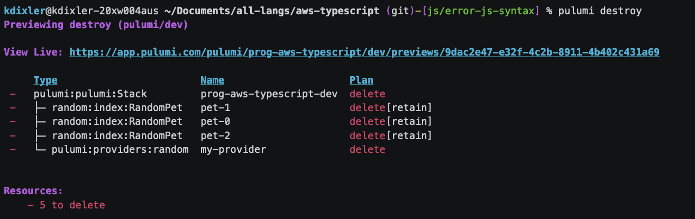
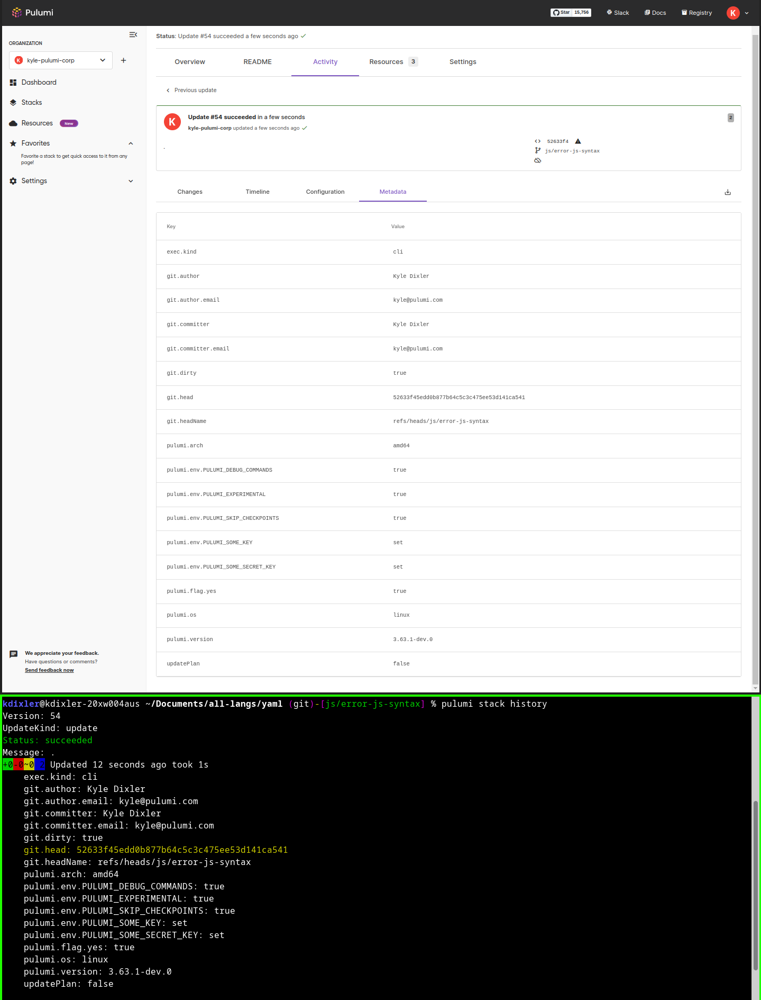
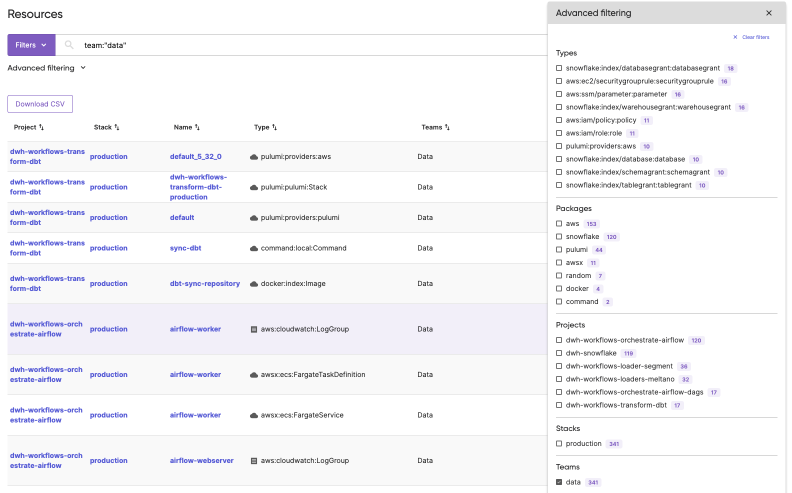
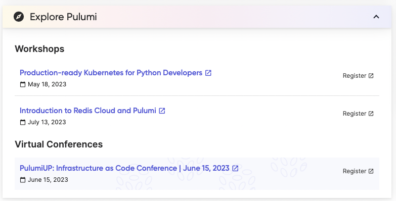
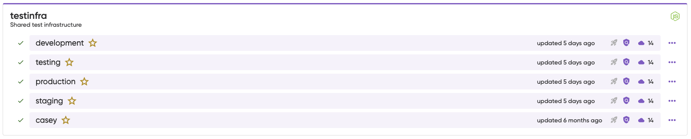
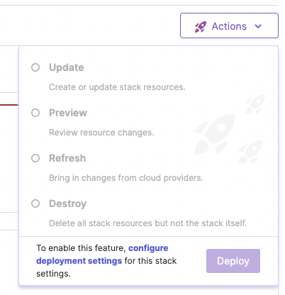

We have been busy shipping improvements in the last 2 months. Let's walk through the release highlights across Pulumi engineering areas from March and April. If you want to learn more between release blogs, follow the CLI improvements in the [pulumi/pulumi repo changelog](https://github.com/pulumi/pulumi-aws-native/releases) and Pulumi Cloud features in the [new features blogs](/blog/tag/features).

<!--more-->

Quick shortcuts to jump to your favorite area:

- [Pulumi CLI](#pulumi-cli)
  - [Aligning Projects between Service and Self-Managed Backends](#aligning-projects-between-service-and-self-managed-backends)
  - [Improved Interactive Scrolling Experience](#improved-interactive-scrolling-experience)
  - [Shortcut to See the Current Update in Web Browser](#shortcut-to-see-the-current-update-in-web-browser)
  - [New Flag to Specify Teams for a Newly Created Stack](#new-flag-to-specify-teams-for-a-newly-created-stack)
  - [Visual Indication of Retained Resources](#visual-indication-of-retained-resources)
  - [View More Details in Stack History](#view-more-details-in-stack-history)
- [Pulumi Automation API](#pulumi-automation-api)
  - [Manage Stack Tags](#manage-stack-tags)
  - [Full “Who Am I” command support](#full-who-am-i-command-support)
- [Cloud Providers and Packages](#cloud-providers-and-packages)
- [Pulumi Cloud & Pulumi.com](#pulumi-cloud--pulumicom)
  - [Resource Search Improvements](#resource-search-improvements)
  - [Events Dashboard card](#events-dashboard-card)
  - [Stacks Page Icons](#stacks-page-icons)
  - [Deployment Actions](#deployment-actions)
  - [SAML Admin](#saml-admin)

## Pulumi CLI

### Aligning Projects between Service and Self-Managed Backends

While the majority of Pulumi users do choose to use Pulumi Cloud, we also know that there are good reasons why some organizations would prefer to use Pulumi IaC alone without Pulumi Cloud. The self-managed backends have historically stored all stacks in a single namespace across all projects.

With the `3.61.0` release of Pulumi, we've added support for project-scoped stacks to the Self-Managed backend. Stacks created in new or empty self-managed backends will automatically use the new project-scoped layout.

👉  Learn more in the [Aligning Projects between Service and Self-Managed Backends blog post](https://www.pulumi.com/blog/project-scoped-stacks-in-self-managed-backend/).

### Improved Interactive Scrolling Experience

We've improved the user experience of deploying a large number of resources interactively in the CLI. The recent changes make two improvements to scrolling through a long list of action:

- The interactive display can now be scrolled using the page-down and page-up keys. These keys scroll the display N lines at a time, where N is the height of the terminal.
- If the display is scrolled to the bottom, it will now autoscroll it as new lines are added to the output.

👉  Learn more in the [Improve interactive scrolling pull request](https://github.com/pulumi/pulumi/pull/12363).

### Shortcut to See the Current Update in Web Browser

While a CLI preview or update operation is running, you can now use the `Ctrl-O` keyboard shortcut to open the same update in Pulumi Cloud using your web browser.

The shortcut and the Pulumi Cloud URL are shown at the top of the update operation:

```
$ pulumi up
Previewing update (dev)

View in Browser (Ctrl+O): https://app.pulumi.com/mikhailshilkov/dev-ts/dev/previews/01234567-ec03-4ccc-9b44-02ec864e14ee

     Type                                  Name    Plan       
 +   pulumi:pulumi:Stack                   ts-dev  create...      
```

👉  Learn more in the [Open in Web Browser shortcut pull request](https://github.com/pulumi/pulumi/pull/12380).

### New Flag to Specify Teams for a Newly Created Stack

We've added a `--teams` flag to `pulumi stack init` command. The flag accepts a string and can be provided multiple times. Each team that is provided is assigned read/write permissions on the stack after it has been initialized.

```
$ pulumi stack init dev-stack --teams devs
```

👉  Learn more in the [Add --teams flag to assign team name to stack pull request](https://github.com/pulumi/pulumi/pull/11974).

### Visual Indication of Retained Resources

You can use the [`RetainOnDelete` resource option](https://www.pulumi.com/docs/intro/concepts/resources/options/retainondelete/) to let Pulumi retain the actual cloud resource while deleting it from your Pulumi stack. This option is useful, for instance, when you need to start managing the same resource from another stack or project.

Now, the CLI will explicitly mark deleted or replaced resources as retained in the cloud. See the Plan column of the preview view:



👉  Learn more in the [Retain display pull request](https://github.com/pulumi/pulumi/pull/12157).

### View More Details in Stack History

Sometimes, to troubleshoot a past action, you would want to see more details about the context of a past CLI operation. We've added more details to `pulumi stack history` command output, so that you could see the names of CLI parameters, the names of environment variables, the version of the Pulumi CLI, and OS architecture:



No sensitive information like parameter or environment variable values is captured or displayed.

👉  Learn more in the [Add more details to `pulumi stack history` pull request](https://github.com/pulumi/pulumi/pull/12574).

## Pulumi Automation API

### Manage Stack Tags

We've added support to set, get, list, and remove tags on Pulumi stacks. Shoutout to [Matthew Rodrigues](https://github.com/mrod-io) for contributions in this area!

👉  Learn more in the [Ensure Parity for Stack Tags issue](https://github.com/pulumi/pulumi/issues/11936).

### Full "Who Am I" command support

The `pulumi whoami` CLI command now added a `--json` flag. The same flag is consumed from the Automation API to return user's organization and URL in addition to the user name.

Another shoutout to [Matthew Rodrigues](https://github.com/mrod-io) for the contribution!

👉  Learn more in the [WhoAmI JSON flag pull request](https://github.com/pulumi/pulumi/pull/12374).

## Cloud Providers and Packages

Every week we keep shipping provider updates. A few highlights on our native providers:

- Kubernetes shipped support for v1.27.0 and all its resources ([changelog](https://github.com/pulumi/pulumi-kubernetes/blob/master/CHANGELOG.md))
- Azure Native shipped six new resources for `containerstorage`, `guestconfiguration`, and `hybridcloud` ([releases](https://github.com/pulumi/pulumi-azure-native/releases))
- AWS Native shipped 33 new resources in `apigatewayv2`, `appconfig`, `chatbot`, `comprehend`, `connect`, `datasync`, `devopsguru`, `ec2`, `frauddetector`, `lambda`, `msk`, `neptune`, `quicksight`, `ram`, `sagemaker`, `ssmcontacts`, and `vpclattice` modules ([changelog](https://github.com/pulumi/pulumi-aws-native/releases))

Two new community packages were added to the Registry: 

- [AzAPI](https://www.pulumi.com/registry/packages/azapi/) - shoutout to [Engin Diri](https://github.com/dirien)
- [StrongDM](https://www.pulumi.com/registry/packages/sdm/) - shoutout to [Piers Karsenbarg](https://github.com/pierskarsenbarg)

## Pulumi Cloud & Pulumi.com

### Resource Search Improvements



**More Advanced Filtering**

Based on customer feedback we have extended the number of advanced filtering options (Stack, Project, Package and Type) to show the top 10 results by resource count instead of top 3. We know our customers are getting a ton of value from these aggregates to inform and refine their searches and expect the 7 additional values to improve this further.

**Pulumi Teams support**

Customers who use Pulumi Teams for role based access control on Pulumi Cloud can now filter resources by team access. We have added a new aggregate on the Resource Search page for Teams, allowing you to see at a glance the teams in your organization with the most resources. You can query which teams have access to what resources, track resource usage by team by exporting your resource data and see in the search results table which teams have access to that resource.

### Events Dashboard card



We have added a new card to the organizations dashboard which shows upcoming Pulumi events and Pulumi workshops to give users a central place to see events of interest.

### Stacks Page Icons



We have added icons on the Stacks page to enable you to see at a glance information about your Pulumi Stacks, such as if Policies are being applied, if Pulumi Deployments is configured for that stack and the resource count. In addition, there is now a quick action menu on each stack to jump to configuring Pulumi Deployments and adding it to a Policy.

### Deployment Actions

You can now view the Pulumi Deployments Click-to-Deploy menu on all stack pages, even if not configured to Pulumi Deployments. This allows users to quickly navigate to Deployments Settings to connect the stack.



### SAML Admin

For customers on the Enterprise or Business Critical Editions of Pulumi Cloud there is a new role for a SAML admin in your organization. SAML Admins can add another identity to authenticate when SAML is the only permitting authentication method.  This could be an email and password or another authentication method, like GitHub. We are slowly rolling this out across our customer base, if it is not yet in your organization you should expect it in the coming weeks.
