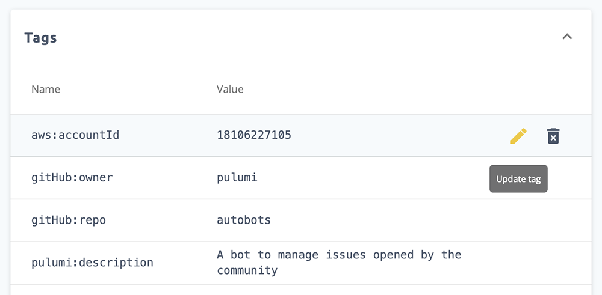
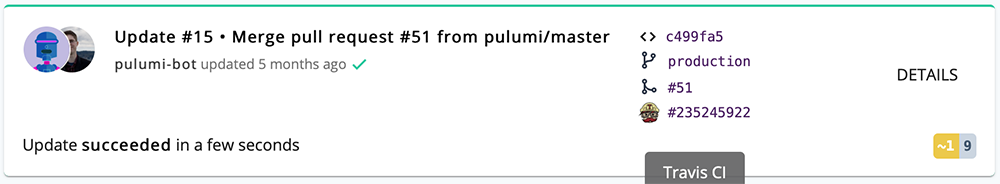
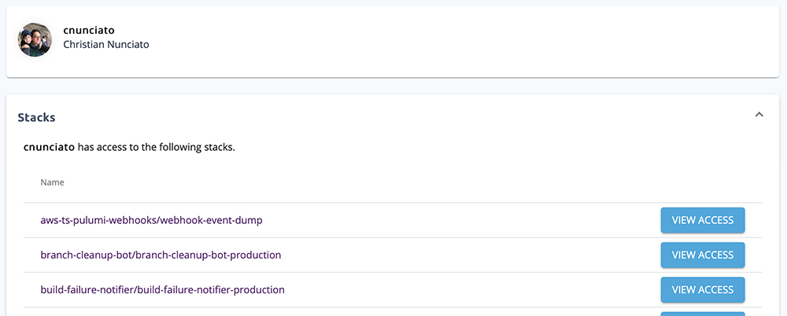
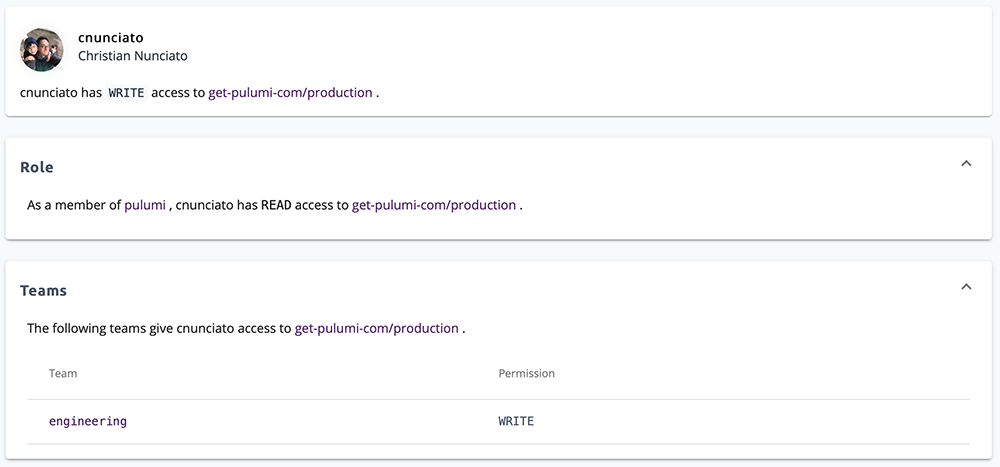

Hello! Many posts here on the [Pulumi blog]() describe new features in our core libraries or
command-line client. But in this post, we'll highlight some of the recent improvements to the [Pulumi Console](https://app.pulumi.com).

We've been hard at work making it easier to manage stacks, permissions, and organizations. So we're super-excited to showcase
what's new!

<!--more-->

## First-class Support for Tags

Pulumi has had support for [stack tags]() for a while, enabling
you to add attributes to your stacks with custom data such as the `account-id` or `environment`. But previously the data was
only available on the command-line, via the `pulumi stack tag` command ([documentation]()).

We've now added first-class support for stack tags in the Pulumi Console as well. You can create, update, and delete tags from within the console.

But making it easier to create and edit tag data is just the beginning. We've started to add new search/filtering capabilities
based on stack tags. For example, you can now use filters to more quickly add stacks to [Pulumi teams]().

We will continue wiring stack tags throughout other parts of the Pulumi Console, so stay tuned! Also, this new feature was
added by Pulumi's first (and extremely awesome) intern, Tasia (👋)!

## Deep Linking into CI/CD Systems

We've also added deep links from the Pulumi Console to the CI/CD job or task that performed an update. So depending on
how you practice [continuous delivery using Pulumi](), you’ll now see
links to things like the [Circle CI job](http://circleci.com) or [Travis CI build](http://travis-ci.com) as appropriate.

> Pulumi supports a variety of CI/CD providers, but if yours isn't listed in [our CI/CD guide]()
> [let us know](https://slack.pulumi.com) or [contribute it](https://github.com/pulumi/pulumi/tree/master/pkg/util/ciutil)
> on your own.

## Pretty Printing JSON / Multi Configuration

We now pretty print configuration values that look like JSON, and have much better support for viewing multi-line data.

## Download Earlier Checkpoints

The most important job of the Pulumi Console is to maintain a durable, accurate snapshot of your cloud resource data.
While in most cases your [stack's checkpoint data]() is a low-level detail
you don't need to worry about, in some advanced scenarios you may need to inspect or edit it manually.

You can now download a stack’s checkpoint file directly from the Pulumi Console. You can also access the
same data from the command-line, using `pulumi stack export` ([documentation]()),
which now supports a `--version` flag to export older checkpoint files too.

## Reverse Stack Permissions View

The Team Pro and Enterprise editions support [role-based access control]()
using [teams](). But a common problem we've heard from people in large organizations
is that it can be difficult to review exactly *_what_* access someone has to a stack and *_why_*.

That's why the recent feature I'm personally the most excited about, is the ability for organization administrators to drill into their
members and review stack permissions.

You can see what stacks a member has access to.

And also see what sources are granting that access.

## Log Rendering Performance

Sadly, there isn't a useful screen shot to go along with this improvement. But we've made some changes that dramatically
improve the Pulumi Console's performance when rendering update logs for large stacks.

## Audit Logs

Users of Pulumi Enterprise typically have a lot of stacks and teams. This can make it difficult to review what's currently in-motion
and to understand a sequence of events a few days or few weeks in the past.

[As we announced earlier]() we launched the ability to view
and download audit logs with all the changes within an organization.

Phew! Like I said, we've been busy this month working on the Pulumi Console. And there is plenty more awesomeness still in the pipe!
If you want to get a peek at other things in-development, check out the [Pulumi 2.0 Roadmap]().

As always, we love to hear if you have any feedback, suggestions, or ideas for other improvements we could make to the
Pulumi Console. Just let us know on the [Pulumi Community Slack](https://slack.pulumi.com), Twitter [@PulumiCorp](https://twitter.com/pulumicorp),
or [on GitHub](https://github.com/pulumi/pulumi).
