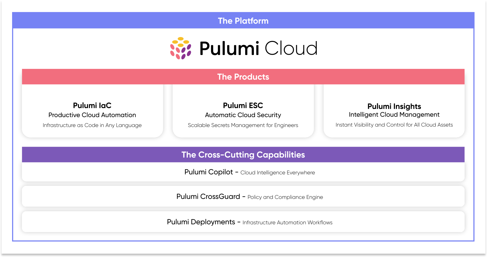

At our fourth annual PulumiUP conference, we unveiled a new vision for Pulumi, going beyond infrastructure as code to a comprehensive product suite. Pulumi’s platform now consists of three core products: Pulumi IaC is open source infrastructure as code in any programming language; Pulumi ESC is centralized secrets management that scales; and Pulumi Insights delivers instant visibility, intelligence, and control over all of your infrastructure. Each product can be adopted independently but is better together. In this post, we will share more about how Pulumi is your trusted partner to automate, secure, and manage everything you run in the cloud.

<!--more-->

## Pulumi - One Unified Platform For All Your Infrastructure Needs

The Pulumi platform solves a broad set of problems that engineering leaders face in the modern cloud era. This spans cloud automation, security, and management, which aligns to our three products: **[Pulumi IaC](/product/infrastructure-as-code/)**, **[Pulumi ESC](/product/secrets-management/)**, and **[Pulumi Insights](/product/pulumi-insights/)**. Our unified approach ensures developers, infrastructure experts, and security teams can collaborate closely and ship faster with high confidence.

In addition to our three products, Pulumi’s platform incorporates three core capabilities that span the entire product suite. **[Pulumi CrossGuard](/crossguard/)** is our policy as code engine which ensures security, compliance, and best practices; **[Pulumi Deployments](/product/pulumi-deployments/)** is our deployment workflow technology that lets us orchestrate infrastructure-oriented tasks; and **[Pulumi Copilot](/product/copilot/)** is our generative AI technology that deeply understands the cloud and infrastructure management and operations.

You can see this visually depicted here:

We’ve now worked with 3,000 customers to help with their cloud journey and have listened to and solved the problems we regularly hear about. That includes Nvidia who is at the forefront of the AI revolution as well as [BMW](/case-studies/bmw) who is reimagining their entire engineering mindset in a cloud-first world, both leveraging Pulumi. [Unity Games](/case-studies/unity) now ships **5x faster** from code to cloud, and Tivity Health **saved 71%** of their cloud spend, automating everything and saving $6.5M annually.

Now let’s dive into the three products and what we announced at PulumiUP:



## Pulumi IaC - Infrastructure as Code in Any Programming Language

[Pulumi IaC](/product/infrastructure-as-code) is our flagship open source technology, and it powers virtually everything we do, even the new products. We have seen accelerated adoption of Pulumi IaC. We’ve had over 100M downloads, are about to crack 21K GitHub stars ([give us a star](https://github.com/pulumi/pulumi/stargazers) and bump us over!), and have seen 167% the contributions of Terraform this past month and 300% of OpenTofu. Not only is Pulumi the most powerful IaC technology, it is becoming more popular and vibrant too.

We are always improving Pulumi IaC and today is no different. We launched a number of new and exciting IaC features. That includes using any Terraform provider, beyond the nearly 200 providers that Pulumi already supports. We also shipped a new [Pulumi VS Code Extension](/blog/pulumi-vscode-extension/) that enables rich debugging and easier editing of your IaC programs. Pulumi Copilot can now diagnose and fix your IaC errors. And finally, we’ve improved our [Kubernetes support](/registry/packages/kubernetes/) with powerful controls over await logic for more robust cloud native deployments. And we're not slowing down anytime soon.

[Pulumi is open source](https://github.com/pulumi/pulumi), of course, but works best with Pulumi Cloud, the easiest, most secure, and most reliable way to adopt Pulumi IaC. [Starburst](/case-studies/starburst) **saved 100 days** per year by moving from DIY state management to Pulumi Cloud. By using Pulumi Cloud, you also gain access to the other products in this post. [Try IaC now](https://www.pulumi.com/docs/iac/get-started/) and choose the option that suits you best.

## Pulumi ESC - Centralized Secrets Management and Orchestration that Scales

[Pulumi ESC](/product/secrets-management) is a new approach to secrets and configuration management that is scalable, secure automatically with easy dynamic credentials, and tames sprawl with engineering best practices. ESC is not just a feature of our IaC product --- it can be adopted entirely independently of it for application and infrastructure secrets. We initially launched ESC in preview nearly a year ago, and since then have had hundreds of customers and thousands of users try it out – many at production scale – who have given us amazing feedback. We are excited to announce that **ESC is generally available**.

Being generally available is a big deal to us, and means it is ready for robust and secure enterprise-grade workloads. New capabilities available at GA include a new projects system which lets you group your environments into familiar hierarchies. We have added versioning, tagging, and pinning, so that you can institute more robust change management practices. ESC can manage encrypted secrets directly, but we have always supported pulling secrets from other secret stores, like AWS Secrets Manager, Azure KeyVault, Google Secret Manager, and HashiCorp Vault. We have now added 1Password to the list. We now also support secrets sync, which lets you still edit your secrets straight from Pulumi ESC, but have them automatically mirrored back to the backing secrets store. Flexible webhooks now support custom workflows triggered by environment changes. The new Pulumi VS Code Extension helps you edit your environments in code. We’ve launched application SDKs for Node.js, Python, and Go, as well as a Kubernetes Operator to inject secrets into Kubernetes workloads.

We aim for you to “fall into the pit of success” with security, so that it is built-in and automatic, and ESC is a major enabler of that. [Try out ESC now](/docs/esc/get-started), or [read more in the launch post](/blog/pulumi-esc-ga).

## Pulumi Insights - Visibility, Intelligence, and Controls Over All Infrastructure

Pulumi Insights already delivers visibility, intelligence, and controls over your infrastructure resources. We began with Insights a year and a half ago as a collection of IaC features. We added resource search with structured and natural language search syntax, to help you find your IaC infrastructure no matter where it is running. We added the ability to export your infrastructure data and slice and dice it from data tools like Snowflake. We also added new dashboards to help visualize your infrastructure at scale.

The big news with Pulumi Insights 2.0 is that *we’re bringing these capabilities to **all of your cloud infrastructure***, no matter where it is, and no matter how it was created. You point Pulumi at your cloud accounts for any of nearly 200 supported clouds, and you get an instant asset inventory of everything you have. This is true even for resources created by Terraform, CloudFormation, Azure Resource Manager, cloud CLIs and SDKs, or even by clicking in your cloud console. An improved resource view gives you pivot-table-like capabilities so you can understand everything you have, and new graph visualizations with inferred dependencies help you to make sense of how things relate. Search and Pulumi Copilot work over discovered cloud resources, letting you explore and ask questions interactively. Pulumi Insights leverages Pulumi CrossGuard, our policy as code technology, and can tap into any existing IaC policies to find issues pertaining to security, compliance, cost, and best practices. Pulumi’s compliance-ready policy packs just work. Insights can also leverage CrossGuard’s ability to automate remediations so that Insights not only tells you about your issues, but helps you fix them with the click of a button. Finally, Insights is better together with Pulumi IaC, and enables you to migrate any resources in the cloud to Pulumi IaC – improving the robustness and built-in security of your operations – with a fully interactive import experience.

This marks the start of an ambitious long-term vision for Pulumi Insights. Some of what was announced is actively shipping while other pieces will ship in the coming weeks. [Learn more in the launch blog](/blog/pulumi-insights-2) and, [get started with Pulumi Insights 2.0](/docs/insights/get-started/).

## Thank You

I am incredibly thankful to our community, 3,000 customers, and the partners and speakers who made PulumiUP 2024 a reality. Your feedback and continued belief in Pulumi has fueled the innovations we’re shipping today and into the future.

All of the talks are [streaming live here](/pulumi-up) and will be up on YouTube afterwards.

We can’t wait to hear what you think about the new vision for Pulumi’s platform as well as the new IaC, ESC, and Insights capabilities announced at PulumiUP 2024. As always, you can [try Pulumi for free here](/start).

Happy cloud spelunking.

-Joe
