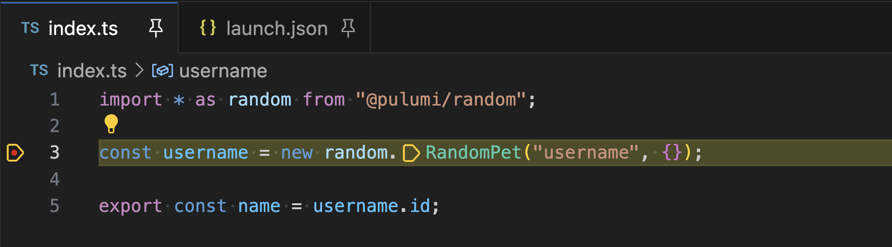

At the heart of Pulumi's approach to cloud infrastructure and secrets management is a belief in empowering engineers to use the best software engineering tools to manage complexity at scale and to be maximally productive building cloud infrastructure and applications for their businesses.  

Today, we're excited to announce a next big step in delivering great software engineering tools for Pulumi users, with the launch of a new **Pulumi Visual Studio Code (VS Code) Extension**.  The [Pulumi VS Code Extension](https://marketplace.visualstudio.com/items?itemName=pulumi.pulumi-vscode-copilot-tools) brings Pulumi key features for Pulumi IaC and Pulumi ESC directly into the IDE environment that many Pulumi users work in every day.  Pulumi IaC users can now debug their applications and get Pulumi YAML language support directly in VS Code. And Pulumi ESC users can now create and manage environments, secrets and configuration directly within the IDE with rich IDE features.

<!--more-->

The following are a few examples of new capabilities available for Pulumi users in VS Code today:

1. Launch your Pulumi program under a debugger
2. Automatically generate a launch configuration for a Pulumi project
3. Create and explore Pulumi ESC (Environments, Secrets, and Configuration) environments
4. Get contextual warnings and errors directly within the editor for Pulumi YAML

## Getting Started

### Install the Software

1. Install Pulumi 3.132.0 (or greater) using [these instructions](/docs/install/).
2. Install the [Pulumi VS Code extension](https://marketplace.visualstudio.com/items?itemName=pulumi.pulumi-vscode-copilot-tools) from the Visual Studio Marketplace.

## Debugging Pulumi IaC Programs

For simple Pulumi programs, it's easy enough to see what will happen when you look at the IaC code.  But as teams build more complex cloud infrastructure components, fully taking advantage of Pulumi's support for all of the rich componentization and control flow features in their language of choice, it can become more challenging to diagnose why a particular input value is being used for a cloud infrastructure resource, and what set of decisions were made by the infrastructure components to arrive at that.  The `pulumi` CLI recently added support for a new `--attach-debugger` flag, which allows attaching a debugger to any language processes that are run as part of a Pulumi operation - regardless of the language.  We've now added native VS Code debugger extension support for it as well, so that you can debug your Pulumi programs in any language with just a couple of clicks.

### Start Debugging

The Pulumi VS Code Extension allows you to run and debug Pulumi programs with ease. Open a new or existing Pulumi project in VS Code and use an automatic or customized launch configuration.

1. Select the __Run and Debug__ icon.
2. Choose __Show all automatic debug configurations__.
3. Select "Pulumi..." then "pulumi preview" or "pulumi up".

Pulumi automatically generates a debug configuration for the current stack, making it simple to get started. You can also set breakpoints in your program and use the full functionality of the VS Code debugger.

You can now step through your code, set breakpoints on resource constructors or inside `apply` callbacks, and see the callstack and the values of variables within the VS Code debugger.

### Create a Launch Configuration

For more control, you can create a customized launch configuration:

1. Click the gear icon when selecting an automatic debug configuration to customize it.
2. Alternatively, create a `launch.json` file and use a configuration template.

You can run without debugging by selecting "Run Without Debugging" from the Run menu or by adding `"noDebug": "true"` to your configuration.

## Using Pulumi ESC

Pulumi ESC manages secrets and configuration for your applications and infrastructure within a centralized and composable secrets store. The environments are stored securely within Pulumi Cloud, and can be edited and opened from the Pulumi Cloud console or from the `esc` CLI or [REST API](/docs/pulumi-cloud/reference/cloud-rest-api).

For developers working with both their application infrastructure code as well as their Pulumi ESC environments, it is convenient to be able to edit ESC environments and the secrets they contain directly within the IDE without switching contexts.

The Pulumi ESC integration in the Pulumi VS Code extensions makes this easy. You can navigate through your environments, see all the projects and versions, and directly edit the source of the environments within VS Code. When you save, the edit to the environment is saved directly back into Pulumi ESC as a new version. And while you have it open in VS Code, you get all the amazing software engineering productivity feature of your IDE - colorization, completion lists, error checking, goto definition, find references and much more!

### Open the ESC Explorer

From the primary sidebar, open the "Pulumi ESC Explorer" view and click "Login" to authenticate to Pulumi Cloud. Once logged in, you'll see a tree of your organizations and environments.

### Key Capabilities

Easily create or edit environments by clicking the plus sign on an organization or project node. The extension opens an editor where you can define and save new environment revisions. The IntelliSense functionality will guide you on various values, such as completion for setting up provider configuration.

You can also:

- Run your application in the context of your environment by hovering over it and selecting the terminal icon

- Delete environments by hovering over them and selecting the delete icon
- Decrypt environments for cloning or moving
- View environment versions over time
- Compare different environments or environment versions
- Use the search icon to quickly find environments
- Tag specific environment revisions for easy reference.

## Pulumi YAML Support

Along with support for many popular programming languages including TypeScript, Python, Go, .NET and Java - Pulumi also supports a simple declarative YAML language for defining and managing infrastructure.  VS Code already has great support for all the other languages Pulumi supports, but for Pulumi YAML, the Pulumi VS Code Extension offers great support for working in this YAML dialect, including support for type checking, completion lists, colorization and more.

Building on a [Pulumi YAML Language Server Protocol (LSP)](https://github.com/pulumi/pulumi-lsp) available for use in any IDE environment, the Pulumi YAML IDE support providers a wide range of editor integrations.

### Type Checking

The Pulumi YAML LSP provides contextual warnings and errors directly within the editor.  

- Warnings: Alerts when a variable is defined but never referenced.
- Errors:
  - Invalid YAML document detection.
  - Reference errors for non-existent variables.
  - Duplicate names for variables/resources.

### Hover Tooltips

Hover over a resource type token or function type token to see a popup with descriptions, helping you understand your resources and functions better.

### Completion Lists

Experience semantic completion for:

- Predefined Pulumi YAML keys such as "resources" or "properties".
- Resource properties or function arguments.
- Type tokens for resources or functions.
- Structured variables (e.g., referencing properties within complex objects).

## Wrapping up

This extension is currently in public beta, and we're eager to hear from the Pulumi community. Your feedback is crucial in helping us shape the future of the extension. If you have suggestions for new features or encounter any bugs, please [open an issue](https://github.com/pulumi/pulumi-vscode-tools/issues).

### What's Next

We're committed to making Pulumi development as efficient and enjoyable as possible. In the coming months, expect even more features and improvements, all aimed at helping you work smarter and faster. Stay tuned for updates as we continue to build out this powerful extension and bring new capabilities to the Pulumi platform.
