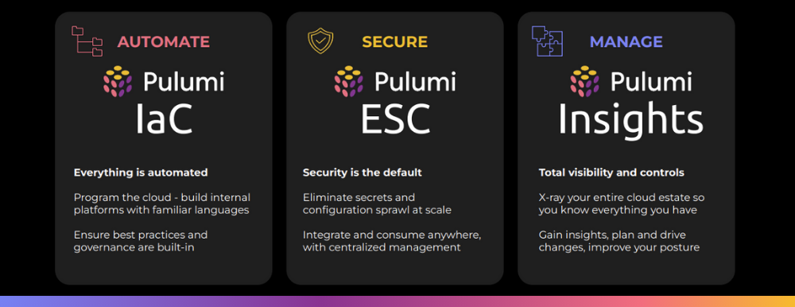
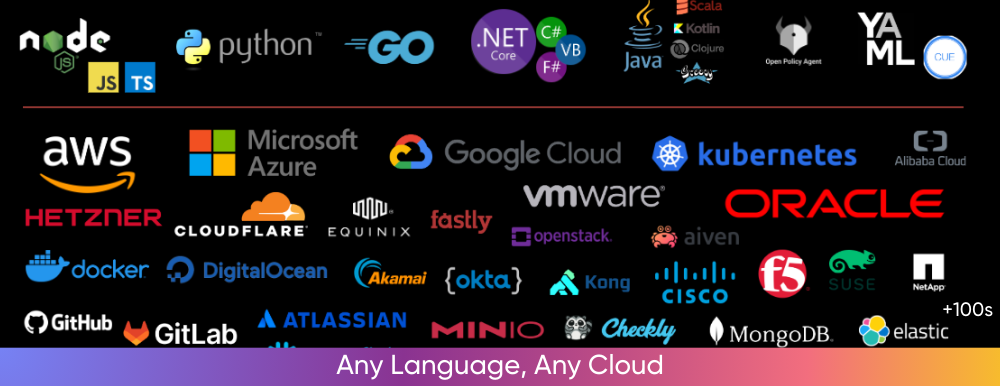
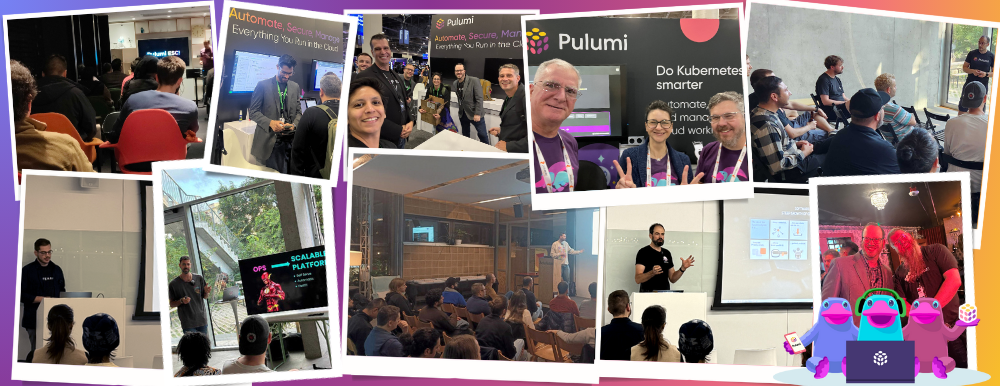

It's the end of 2024, and like everyone, we're counting down until 2025 while looking back at our year. We've had a very exciting year, from unveiling a bold new vision for Pulumi to delivering cutting-edge updates across our Pulumi Cloud.

Here's a look at how Pulumi has grown, evolved, and continued empowering teams worldwide.

<!--more-->

## A Unified Vision: The Pulumi Platform

This year, Pulumi unveiled a bold new vision for Pulumi—[a comprehensive product suite](https://www.pulumi.com/blog/pulumi-up-2024/) that extends far beyond infrastructure as code. The Pulumi platform now consists of three core products:

- **[Pulumi IaC](https://www.pulumi.com/docs/iac/)**: Open source infrastructure as code in any programming language. With over 100M downloads, 167% growth in contributions, and industry-leading innovations, Pulumi IaC continues to redefine cloud automation.
- **[Pulumi ESC](https://www.pulumi.com/docs/esc/)**: Centralized secrets management and orchestration that scales. General availability this year brought features like SDKs, versioning, tagging, and integrations with 1Password and Kubernetes secrets operators.
- **[Pulumi Insights](https://www.pulumi.com/docs/pulumi-cloud/insights/)**: Visibility, intelligence, and control over all infrastructure resources. Insights 2.0 expanded support for resources created outside Pulumi IaC, delivering advanced graph visualizations and policy enforcement powered by Pulumi CrossGuard.



Three core capabilities unite these products:

- **[Pulumi Copilot](https://www.pulumi.com/docs/pulumi-cloud/copilot/)**: Generative AI is used to manage cloud resources.
- **[Pulumi CrossGuard](https://www.pulumi.com/docs/iac/using-pulumi/crossguard/)**: A policy-as-code engine for compliance and best practices.
- **[Pulumi Deployments](https://www.pulumi.com/docs/pulumi-cloud/deployments/)**: Infrastructure task orchestration.

Over 3,000 customers, including Nvidia, BMW, Unity Games, and Tivity Health, leveraged these solutions to enhance velocity, save costs, and secure their infrastructure.

## Highlights of Releases and Enhancements 

Pulumi's product innovations this year have empowered teams to automate, secure, and manage cloud infrastructure with confidence:

- **[Pulumi ESC General Availability](https://www.pulumi.com/blog/pulumi-esc-ga/)**, redefining secrets management with features like dynamic credentials and hierarchical environments. New capabilities include secrets syncing with external stores like AWS Secrets Manager and Kubernetes operators for runtime integration.
- **[Pulumi Insights 2.0](https://www.pulumi.com/blog/pulumi-insights-2/)** delivers AI-powered search, a comprehensive inventory of resources created by Pulumi IaC as well as other tools like Terraform and CloudFormation, and automated remediation capabilities powered by CrossGuard.
- **[Pulumi Copilot](https://www.pulumi.com/product/copilot/)** leverages Generative AI to transform how teams diagnose and resolve IaC issues, providing instant feedback and deployment recommendations.
- **[Pulumi Kubernetes Operator 2.0](https://www.pulumi.com/blog/pulumi-kubernetes-operator-2-0/)** introduced scalable, secure deployments with dedicated workspace pods, enhanced customization options, and improved stability under dynamic conditions.
- **[Drift Detection and Remediation](https://www.pulumi.com/blog/drift-detection/)** in Pulumi Cloud now automates drift detection for all 180+ supported providers, ensuring infrastructure consistency, enhanced security, and reduced operational risks.
- **[Azure Classic Provider v6.0.0](https://www.pulumi.com/blog/azure-v6-release/)** updates included the latest upstream changes and ensured compatibility with Pulumi Azure Native Provider.
- **[Google Cloud Provider v8.0.0](https://www.pulumi.com/blog/gcp-v8-release/)** provides full resource coverage for the latest Google Cloud updates.
- **[AWS CDK 1.0](https://www.pulumi.com/blog/aws-cdk-on-pulumi-1.0/)** expands compatibility with AWS CDK features, bridging the CDK and Pulumi ecosystems and enabling integration with constructs from AWS's construct hub.
- **[Pulumi Visual Studio Code Extension](https://www.pulumi.com/blog/pulumi-vscode-extension/)** empowers developers with tools for debugging Pulumi programs, YAML language support, and direct ESC management within the IDE.
- **[Pulumi Docker Containers](https://www.pulumi.com/blog/docker-containers/)** enhances CI/CD workflows with versioned images, pre-installed tools like Poetry and ppm, and runtime flexibility for Python, Node.js, and .NET.

## By the Numbers

Pulumi's growth and impact this year have been amazing:

- **75,000+ Pull Requests**: Driven by 5,600+ contributors.
- **3,000+ Customers**: Empowering industries like AI, gaming, finance, and healthcare.
- **100M+ Downloads**: Pulumi IaC adoption soared globally.
- **167% Contribution Growth**: Outpacing other IaC tools like Terraform and OpenTofu.
- **71% Cloud Cost Savings**: Customers like [Tivity Health saved millions](https://www.pulumi.com/blog/devsecops-strategy-security-automation-tivity-health/) with Pulumi.

## Community Achievements

Pulumi's vibrant community has been at the heart of everything we've accomplished:

- **Global [Pulumi User Groups](https://www.meetup.com/pro/pugs/) (PUGs)**: With 20 groups across 9 countries, including new meetups in [Chicago](https://www.meetup.com/chicago-pulumi-user-group/), [Columbus](https://www.meetup.com/columbus-pulumi-user-group), [São Paulo](https://www.meetup.com/sao-paulo-pulumi-user-group), and [Tel Aviv](https://www.meetup.com/tel-aviv-pulumi-user-group), our community continues to grow. These meetups collectively hosted over 6,396 members.
- **PulumiUP 2024**: Over 8,000 registrants globally, with nearly 1,000 for the first-ever PulumiUP Europe.
- **[Workshops](https://www.pulumi.com/resources/#upcoming)**: 72 workshops with 14,500+ registrations from engineers wanting to learn Pulumi.
- **22,000 GitHub Stars**: A testament to our community's passion and dedication.

## Looking Ahead to 2025

To our users, customers, partners, Puluminaries, and employees, "thank you!" Your support has made 2024 an amazing year, and we're excited for what's ahead in 2025. Together, we'll continue to build the future of cloud infrastructure and security.

Stay tuned for more innovations, community events, and collaboration opportunities. Here's to another year of growth, transformation, and success!

[Explore Pulumi ➡️](https://www.pulumi.com/docs/)
