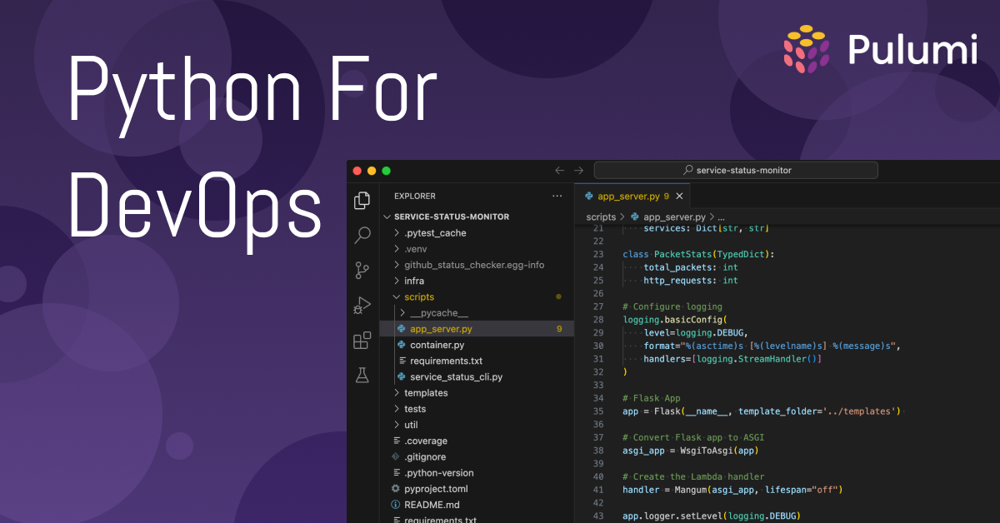

What you put here will appear on the index page. In most cases, you'll also want to add a Read More link after this paragraph (though technically, that's optional. To do that, just add an HTML comment like the one below.

<!--more-->

And then everything _after_ that comment will appear on the post page itself.

Either way, avoid using images or code samples [in the first 70 words](https://gohugo.io/content-management/summaries/#automatic-summary-splitting) of your post, as these may not render properly in summary contexts (e.g., on the blog home page or in social-media previews).

## Writing the Post

For help assembling the content of your post, see [BLOGGING.md](https://github.com/pulumi/docs/blob/master/BLOGGING.md). For general formatting guidelines, see the [Style Guide](https://github.com/pulumi/docs/blob/master/STYLE-GUIDE.md).

## Code Samples

```typescript
let bucket = new aws.s3.Bucket("stuff");
...
```

## Images



## Videos



Note the `?rel=0` param, which tells YouTube to suggest only videos from same channel.
