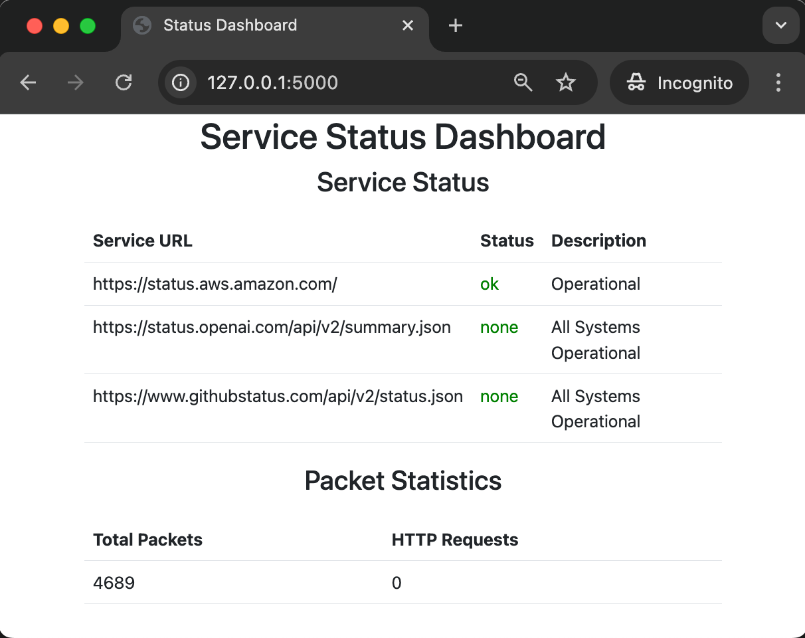
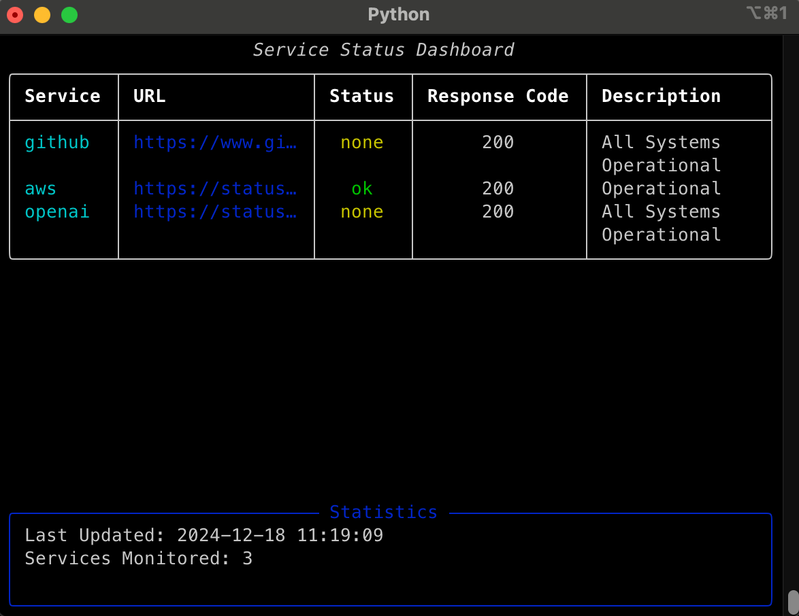
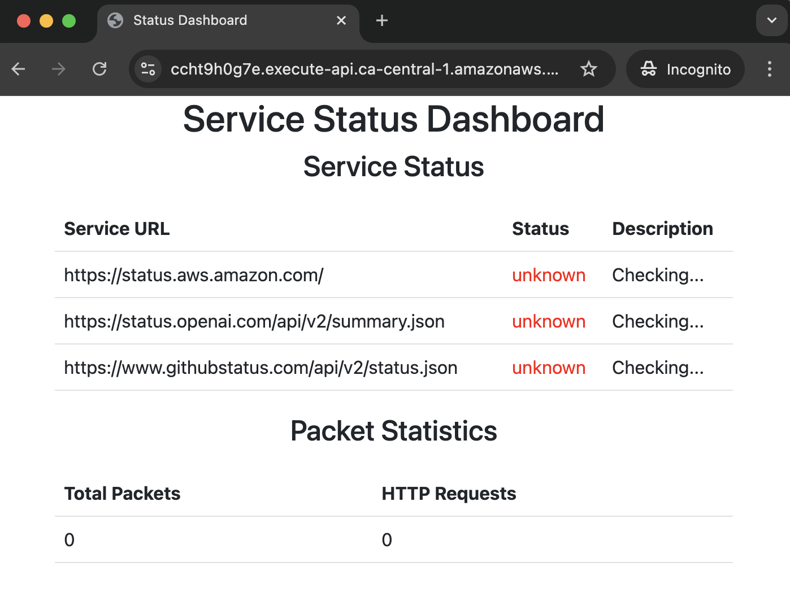

Have you ever had one of those moments: Elasticsearch is crashing, logs are filling up too fast, or a deployment needs data from three different APIs. The big enterprise solutions aren't quite right, and your team estimates six months to build something proper. But you know that with Python and a few choice libraries, you could hack something together by tomorrow.

<!--more-->
<span style="width: 40%; float: left; margin-right: 20px;">
<span style="text-align:center">
    
    <figcaption>
    <i><a href="https://github.com/adamgordonbell/service-status-monitor">Let's build a little web dashboard in Python.</a></i>
    </figcaption>
</span>
</span>

That's where Python really shines. It lets you be the scrappy problem-solver who can travel up and down the stack. But Python isn't just for quick fixes. The same language that helps you hack tomorrow's solution can also build your company's long-term infrastructure.

This guide covers both ends of that spectrum. I'll show you python packages for "we need it yesterday" moments, and then move into solutions that can grow with your team. And along the way I'll build [a little example service monitor and package capturer](https://github.com/adamgordonbell/service-status-monitor) to demonstrate the python packages I'm covering. I'll wrap it in a CLI, in a web dashboard and deploy it to AWS, all while staying in Python.

So here's my list of Python libraries for DevOps work, starting from #15 to the most important last at number #1.

### Dashboards / monitoring

Let's start with building web dashboards. Long-term, it's usually better if there's an off-the-shelf tool for that specific dashboard you need. But if you can create a quick visual on a Django endpoint, you can move on to the next issue.

- **15 and 14. Django and Flask:** ([Django](https://www.djangoproject.com/), [Flask](https://flask.palletsprojects.com/)) While tools like Grafana excel at metrics visualization, sometimes you need custom dashboards that integrate with internal systems. These frameworks let you build dashboards to track and visualize various aspects of your systems. I find Django a great fit here.
- **13\. Prometheus:** ([prometheus-client](https://github.com/prometheus/client_python)) This library is a versatile tool for metrics. Want to expose custom metrics to Prometheus? Use the client to create counters, gauges, or histograms. Need to pull data from a weird API and expose it as metrics? Write a quick exporter that fetches from your API every few minutes and translates the responses into Prometheus metrics.

```python
from flask import Flask, render_template_string
import requests

app = Flask(__name__)

@app.route("/")
def index():
    try:
        response = requests.get("https://www.githubstatus.com/api/v2/status.json", timeout=5)
        if response.status_code == 200:
            data = response.json()
            status = data["status"]["indicator"]
            description = data["status"]["description"]
        else:
            status = "critical"
            description = "Unable to reach GitHub API"
    except Exception as e:
        status = "critical"
        description = f"Error: {e}"

    color = {
        "none": "bg-green-500",
        "minor": "bg-yellow-500",
        "major": "bg-red-500",
        "critical": "bg-red-700",
    }.get(status, "bg-gray-500")

    return render_template_string(
        """
            ...
        """,
        color=color,
        description=description,
    )
```

<span style="text-align:center">
    <figcaption>
    <i><a href="https://github.com/adamgordonbell/service-status-monitor">Code</a> for a simple Dashboard</i>
    </figcaption>
</span>



### Task scheduling and orchestration

Sometimes you need to run things on a schedule. And while I love cron, sometimes you need more. Maybe you need to coordinate multiple tasks, handle retries, or manage complex job dependencies. Here's where Python can help:

- **12\. Schedule:** ([schedule](https://github.com/dbader/schedule)) When cron is too heavy but you need more than a bash script. I use it for quick automation tasks like "check this API every hour and alert if something's wrong." It runs in your Python process - no system configuration needed.
- **11\. RQ (Redis Queue):** ([rq](https://python-rq.org/)) Perfect for local development queues. Need to prototype a GitHub webhook handler that'll eventually use SQS? With Redis in Docker and RQ, you can have a working queue in minutes. No AWS needed until production.
- **10\. Airflow:** ([airflow](https://airflow.apache.org/)) The big gun of scheduling. Yes, it's complex, but sometimes you need that power. I've seen teams replace entire ETL systems with a few Airflow DAGs. When you need to coordinate multiple steps, handle failures gracefully, and have everything visible in a nice UI, it delivers.

```python
def schedule_url_checks():
    for url in urls.values():
        schedule.every(30).seconds.do(lambda url=url: check_url_status(url))

def run_scheduler():
    while True:
        schedule.run_pending()
        time.sleep(1)

if __name__ == "__main__":
    schedule_url_checks()
    threading.Thread(target=run_scheduler, daemon=True).start()
```

<span style="text-align:center">
    <figcaption>
    <i>Adding Schedule to our <a href="https://github.com/adamgordonbell/service-status-monitor">code, so we can request in the background.</a></i>
    </figcaption>
</span>

### Network analysis and security

When your network issues go beyond what tcpdump can tell you, or when you need to automate security checks, Python is here to help:

- **9\. Scapy:** ([scapy](https://scapy.net/)) The Python alternative to Wireshark for programmatic network traffic analysis. Need to figure out why your microservices aren't talking to each other? Want to check your load balancer? Use it to capture and analyze packets with a few lines of code.
- **8\. Bandit:** ([bandit](https://github.com/PyCQA/bandit)) Security scanning for your CI pipeline. Point it at your Python codebase and it'll flag common issues like hardcoded credentials or unsafe deserialization.

```python
def packet_callback(packet):
    global packet_stats
    packet_stats["total_packets"] += 1
    if packet.haslayer("HTTPRequest"):
        packet_stats["http_requests"] += 1

def start_packet_sniffer():
    sniff(prn=packet_callback, store=False, timeout=60)  # Capture packets every 60 seconds

if __name__ == "__main__":
    threading.Thread(target=start_packet_sniffer, daemon=True).start()
```

<span style="text-align:center">
    <figcaption>
    <i>Adding packet sniffing to our <a href="https://github.com/adamgordonbell/service-status-monitor">code, mainly just because we can.</a></i>
    </figcaption>
</span>

### Containerization and cloud interaction

Sometimes you need more control over your containers than Dockerfiles can provide. Maybe you need to dynamically build images based on environment variables, or automate container management:

- **7\. Docker SDK for Python:** ([docker-py](https://docker-py.readthedocs.io/)) When you need to automate Docker operations programmatically. I use it to clean up old containers and images, check container health, and build images dynamically from configuration files. More powerful than chaining Docker CLI commands.
- **6\. Dagger:** ([dagger-io](https://dagger.io/)) Write container build logic in Python instead of Dockerfiles. Need to build multiple similar containers with slight variations? Want to pull in files from different sources based on environment? It lets you programmatically define container contents and build steps. (Bonus: this same code can later be used in CI/CD pipelines.)

```python
import dagger

async def main():
    # Connect to the Dagger Engine
    async with dagger.Connection() as client:
        container = (
            client.container()
            .from_("python:3.11-slim")
            .with_exec(["python", "-c", "print('Hello from Dagger!')"])
        )

        # Execute the container and get the output
        output = await container.stdout()
        print(output)

if __name__ == "__main__":
    import asyncio
    asyncio.run(main())
```

<span style="text-align:center">
    <figcaption>
    <i>Using Dagger makes it easy to stay in Python while building containers.</i>
    </figcaption>
</span>

### Building command-line tools

<span style="width: 50%; float: right; margin-left: 20px;">
<span style="text-align:center">
    
    <figcaption>
    <i><a href="https://github.com/adamgordonbell/service-status-monitor">Let's build a CLI version of our service status dashboard in Python.</a></i>
    </figcaption>
</span>
</span>

Every useful script eventually needs to become a proper tool. When your team starts asking "can I use that script too?" it's time to enhance your CLI skills:

- **5/4. Click/Typer:** ([Click](https://click.palletsprojects.com/), [Typer](https://typer.tiangolo.com/)) Turn your quick scripts into proper CLI tools. Instead of remembering `python cleanup.py --older-than 7 --dry-run`, you get tab completion, help text, and proper argument handling. Typer is particularly nice if you're using modern Python - it uses type hints to build the CLI interface.
- **3\. Rich:** ([rich](https://rich.readthedocs.io/)) Make your terminal output actually readable. Need to display tables of data? Want progress bars for long-running tasks? Rich makes it easy to build user-friendly CLIs. I use it to turn wall-of-text logs into colored, formatted output that helps spot problems quickly.

### 2. The essential toolkit

The foundation of any DevOps tooling consists of these essential libraries:

- **Requests** ([requests](https://requests.readthedocs.io/)) - For making HTTP requests
- **Pytest** ([pytest](https://docs.pytest.org/)) - For testing your code
- **logging** ([Python logging](https://docs.python.org/3/library/logging.html)) - For structured logging
- **YAML/JSON/TOML parsers** ([PyYAML](https://pyyaml.org/), [json](https://docs.python.org/3/library/json.html), [toml](https://github.com/uiri/toml)) - For config file handling

While not flashy, these libraries form the backbone of every tool I build. And so I update my little tool to have some tests, some logging and store the api status urls in a toml file.

Now, #1 and it’s IaC time. I can get my dashboard onto AWS in a lambda using Pulumi.

<span style="width: 50%; float: left; margin-right: 20px;">
<span style="text-align:center">

```python
# Build and push the Docker image to ECR
image = awsx.ecr.Image("app-server-image",
    repository_url=repository.repository_url,
    context="..",  
    dockerfile="Dockerfile",
    platform="linux/amd64"
)
```

  <figcaption>
   <i>Push my Image to ECR</i>
  </figcaption>
</span>
</span>

### 1. Pulumi

While most tools in this list excel at quick solutions, infrastructure demands a more robust approach. This is where **Pulumi** stands apart. It's not just another scrappy tool—it's an enterprise-grade Infrastructure as Code platform that happens to harness Python's power and flexibility.

With support for real Python code instead of configuration languages, you can define, deploy, and manage your cloud resources using familiar programming concepts and practices.

With Pulumi, you get:

- [Complete programming language support](/docs/iac/concepts/) for using loops, functions, and classes in your infrastructure code

- [Infrastructure testing capabilities](/docs/iac/concepts/testing/) to validate your deployments before they go live

- [Container deployment solutions](/containers) for managing Docker images and Lambda functions

- [Rich AWS integration](/registry/packages/aws/) for comprehensive cloud resource management

- [Infrastructure automation](/docs/iac/packages-and-automation/automation-api/) to streamline your deployment workflows

```python
# Create a Lambda function
lambda_function = aws.lambda_.Function("custom-lambda",
    name="custom-lambda",
    package_type="Image",
    image_uri=image.image_uri,
    role=lambda_role.arn,
    timeout=30,
    memory_size=512,
    environment={
        "variables": {
            "FLASK_ENV": "production"
        }
    }
)
```

<span style="text-align:center">
  <figcaption>
    <i>Start it up in a Lambda</i>
  </figcaption>
</span>

## Bringing it all together

<span style="width: 50%; float: right; margin-left: 20px;">
<span style="text-align:center">
    
    <figcaption>
    <i>Dashboard is still pretty basic, but now it's on AWS with a little Python infrastructure code.</i>
    </figcaption>
</span>
</span>

Here's where Python excels - combining these tools to solve real problems. For example:

- Need a dashboard for infrastructure costs? Combine Flask with the AWS SDK and Pulumi Insights.
- Want to automate container cleanup? Mix Docker SDK with Schedule for regular maintenance.
- Building a custom GitHub webhook processor? Use Flask to receive webhooks, RQ for asynchronous handling, and Rich for readable logs.

Start simple (maybe just a script with Requests and PyYAML), then gradually add more tools as needed. That's the beauty of Python in DevOps - you can start small and grow your solution naturally.

## The art of getting things done

The tools I've covered span the full spectrum of DevOps needs—from quick scripts to enterprise-grade solutions. Python's versatility makes it uniquely suited for both ends of this spectrum:

- For urgent needs, tools like Schedule, Rich, and Click let you rapidly prototype solutions.
- For long-term infrastructure, Pulumi and Airflow provide the robustness needed for production systems.
- For everything in between, Python's extensive library ecosystem helps you gradually evolve quick fixes into mature tools.

The key is knowing when to use each tool.
