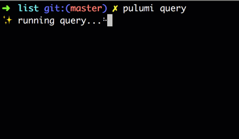
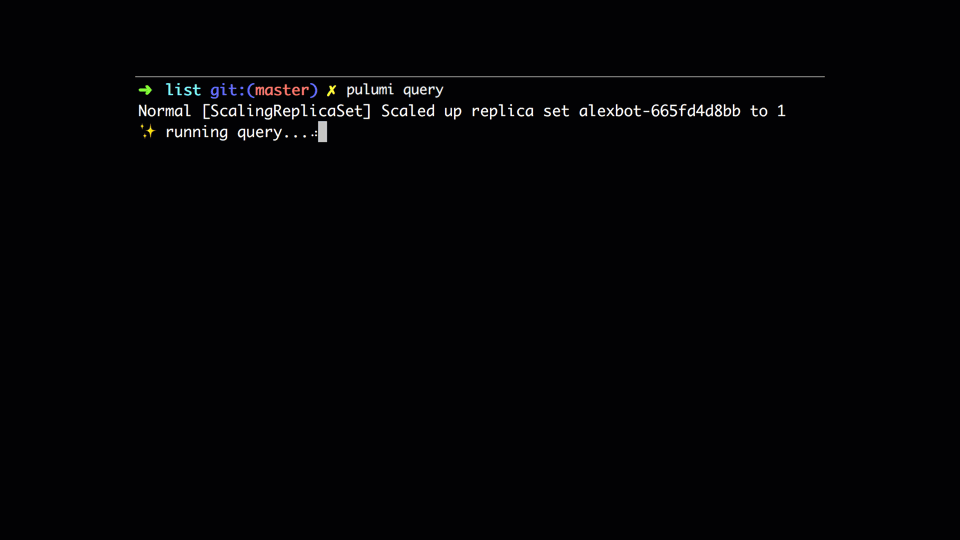

We often need answers to simple questions about Kubernetes resources. Questions like:

* How many distinct versions of MySQL are running in my cluster?
* Which Pods are scheduled on nodes with high memory pressure?
* Which Pods are publicly exposed to the internet via a load-balanced Service?

Each of these questions would normally be answered by invoking `kubectl` multiple times to list
resources of each type, and manually parsing the output to join it together into a single report.

Examples like these motivated us to build Pulumi Query for Kubernetes, which aims to greatly simplify scenarios like the ones mentioned above.

Pulumi Query is a tool and SDK for querying live Kubernetes resources. Pulumi Query supports both
batch and streaming query modes. Batch queries run to completion, generating a fixed report. Streaming queries watch Kubernetes resources in real-time and take action when specific events
occur. For example:

* Post a slack notification when we run out of disk space.
* Page someone when a rollout fails.

In this post, we'll look at both batch and streaming query modes by showing examples of each. The
[Pulumi Query for Kubernetes SDK](https://github.com/pulumi/pulumi-query-kubernetes) also contains a set
of example queries and how to run them.

## Batch queries

A simple example is a query program that finds all distinct versions of MySQL running in the default
namespace of the active cluster of your `$KUBECONFIG` file.

The core primitive of batch queries is `list`. In this case, `list("v1", "Pod")` returns list of all
Pods in the default namespace. The rest of the query "flattens" the list of Pods into a list of all
container images, filters out all images that don't contain the string "mysql", and filters that
to only distinct image names.

```typescript
import * as kq from "@pulumi/query-kubernetes";

// Find all distinct versions of MySQL running in your cluster.
const mySqlVersions = kq
    .list("v1", "Pod")
    .flatMap(pod => pod.spec.containers)
    .map(container => container.image)
    .filter(imageName => imageName.includes("mysql"))
    .distinct();

mySqlVersions.forEach(console.log);
```

Query programs are run via the `pulumi query` command. Note that this feature is in beta, so to run
it, you will need to prepend the command with the beta flag: `PULUMI_EXPERIMENTAL=true pulumi
query`. The output looks like the following:



Batch query mode supports complex join operations via the `join` and `groupJoin` methods. This
allows us to ask complex questions about how resources relate to each other, such as "find all Pods
that reference some Secret." For more examples, check out the examples in the SDK repository!

## Streaming queries

The streaming query SDK continuously observes changes to any set of Kubernetes resources
and takes action as a result.

The core primitive of the streaming SDK is `watch`. In the following example, we use `watch` to
observe all Events related to a Deployment, which we then print to the console. Unlike `list`, which
produces a set of live Kubernetes resources, `watch` publishes a stream of resource updates. Users
get notified if a resource is `ADDED`, `MODIFIED`, or `UPDATED`.

Here is a simple example that watches for Events related to a deployment called `alexbot`

```typescript
import * as kq from "@pulumi/query-kubernetes";

for await (const e of kq.watch("v1", "Event")) {
   const { apiVersion, kind, name } = e.object.involvedObject;
   if (
       apiVersion === "apps/v1" &&
       kind === "Deployment" &&
       name === "alexbot"
   ) {
       const { type, reason, message } = e.object;
       console.log(`${type} [${reason}] ${message}`);
   }
}
```

When run, we can see in real-time as the Deployment controller scales up the new ReplicaSet and
scales down the old one.



For streaming queries over multiple resources, we expose a `ResourceSet`, which is a convenience
data structure that simplifies the code. `ResourceSet` observes a sequence of resource updates
published by `watch`, and uses those updates to keep track of which resources currently exists. It
exposes an `onUpdate` function, which will run when this set is updated; i.e., whenever a resource
is added, modified, or deleted from the set entirely.

In this case, when `onUpdate` is called, we run a query that filters the set of events down to those
specifically having to do with a Deployment called `alexbot`. We can rewrite the previous query
program to use `ResourceSet` in the following way:

```typescript
import * as kq from "@pulumi/query-kubernetes";

new kq.ResourceSet([kq.watch("v1", "Event")]).onUpdate(([events]) => {
   events.filter(e => {
       const { apiVersion, kind, name } = e.involvedObject;
       return (
           apiVersion === "apps/v1" &&
           kind === "Deployment" &&
           name === "alexbot"
       );
   }).forEach(e => {
       const { type, reason, message } = e;
       console.log(`${type} [${reason}] ${message}`);
   });
});
```

Running this code with `pulumi query` results in an infinite stream of events telling us about this
Deployment, i.e. when it's rolling out, when it's scaling down a ReplicaSet, and so on.

## Conclusion

Pulumi Query provides powerful primitives for introspecting and reacting to changes in the state
of Kubernetes resources. These primitives make it simpler to build tools that facilitate
observability and helps to understand Kubernetes applications and to integrate event-based systems
in response to them.

One of our hopes for Pulumi Query is that by building these simple integrations that it will lead to a
groundswell of tooling that makes it easier to operate Kubernetes clusters by automating away
tedious tasks that would normally be scripted. With this toolkit, teams can
write linters, pre- and post-flight deployment checks, and to improve governance and security
operations with minimal effort.
