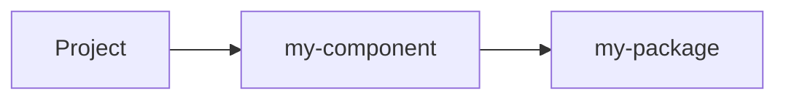
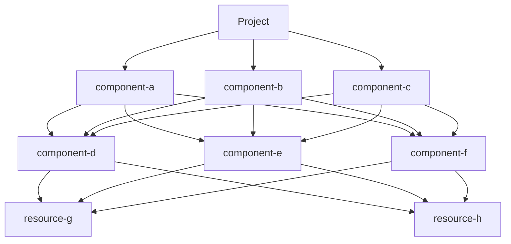

`pulumi install` installs everything you need to run a Pulumi project. That means [plugins](TODO: docs page for source based plugins), [local SDKs](/docs/iac/guides/building-extending/packages/local-packages/) &
language dependencies. A good mental model for `pulumi install` is that the following script works:

```bash
$ git clone https://github.com/your-org/any-repo && cd any-repo/your-pulumi-program
$ pulumi install
$ pulumi up
```

Actually delivering on that promise is harder then you might think, and it's all due to [source based plugins](TODO: docs page for source based plugins).

<!--more-->

## What are source based plugins

To understand the problem, we need to look at the anatomy of a source based plugin. A source based plugin is a
*directory* that contains a [`PulumiPlugin.yaml`](/docs/iac/guides/building-extending/components/build-a-component/#pulumipluginyaml) file:

```go
type PluginProject struct {
	Runtime ProjectRuntimeInfo `json:"runtime" yaml:"runtime"`
	Packages map[string]PackageSpec `json:"packages,omitempty" yaml:"packages,omitempty"`
    ...
}
```

*Source: [project.go:942-953](https://github.com/pulumi/pulumi/blob/f1880936441c60b3ba6faa1d4f80c922fbd6c7bc/sdk/go/common/workspace/project.go#L942-L953)*

`Runtime` is the name of the language that the plugin is written in. `Packages` is the complicated part: `Packages` is a
map of [Pulumi Packages](/docs/iac/concepts/packages/) that need to be installed **with local SDKs** before we can run the source based
plugin. Let's walk through an example:

Consider the following plugin directory:

```
./
├── PulumiPlugin.yaml
├── index.ts
├── package.json
├── package-lock.json
└── tsconfig.json
```

```yaml
runtime: nodejs
packages:
  my-package: https://github.com/moolumi/my-package
```

```typescript
import * as pulumi from "@pulumi/pulumi";
import * as myPackage from "@moolumi/my-package";

interface ComponentArgs {
  message: pulumi.Input<string>;
}

export class Component extends pulumi.ComponentResource {
  result: pulumi.Output<string>;

  constructor(name: string, args: ComponentArgs, opts: pulumi.ComponentResourceOptions) {
    super("example:index:Component", name, args, opts)

    const r = new myPackage.Resource(`${name}-resource`, {
      message: args.message`,
    }, { parent: this });

    this.result = r.result;
  }
}
```

```json
{
    "name": "my-component",
    "dependencies": {
        "@moolumi/my-package": "file:sdks/moolumi-my-package",
        "@pulumi/pulumi": "^3.218.0"
    },
    "devDependencies": {
        "@types/node": "^24.0.0",
        "typescript": "^5.9.2"
    }
}
```

To install `my-component`, we would need to, in order:

1. Clone & install `https://github.com/moolumi/my-package`
1. Get the [Pulumi Schema](/docs/iac/guides/building-extending/packages/schema/) for `my-package`: `pulumi package get-schema ${install-dir(my-package)} > my-package-schema.json`
1. Generate a local SDK for `my-package`: `pulumi package gen-sdk my-package-schema.json --language typescript --out sdk/moolumi-my-package`
1. Install the locally generated SDK: `cd sdk/moolumi-my-package && npm install`
1. Install the dependencies for `my-component`: `npm install`

{}
The steps for an installation include an installation. Installing components is recursive.
{}

## Installing source based plugins

Source based plugins can reference other packages, including source based plugins. This means that every plugin
installation forms a [DAG](https://en.wikipedia.org/wiki/Directed_acyclic_graph).

**Simple dependency chain:**



**Complex dependency graph:**



Because source based plugins declare their own dependencies, the `pulumi` CLI doesn't know what dependencies a source
based plugin has until it's already been downloaded. That leaves us with 2 ways to perform a full download:

1. First download all source based plugins, then install them.
1. Download & install plugins at the same time.

The first option provides a much simpler mental model: download plugins until you understand the full DAG, then perform
a (parallel) depth first traversal of the DAG to install plugins.

The second option is more performant but also more complex: create a mutable DAG & update it as new dependency
information becomes available. This requires the ability to register create nodes in your DAG without knowing their
dependency information.

We actually ended up implementing both options. [#20945](https://github.com/pulumi/pulumi/pull/20945) added a "download, then install" algorithm to `pulumi
install`. [#21320](https://github.com/pulumi/pulumi/pull/21320) followed up with a more general "mutable DAG" traversal.

## Mutable DAG traversal

...
