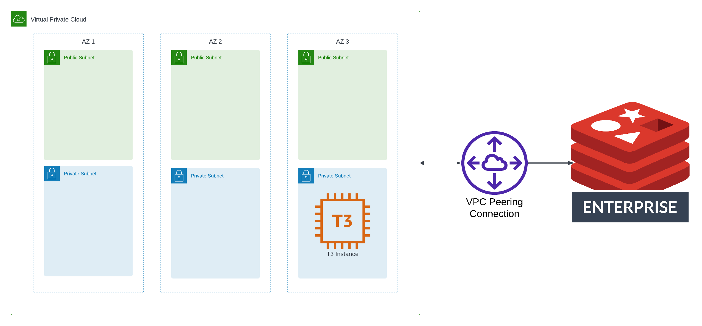
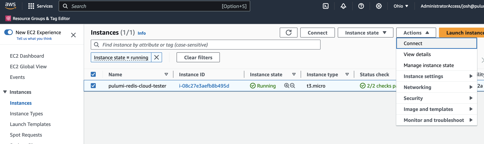
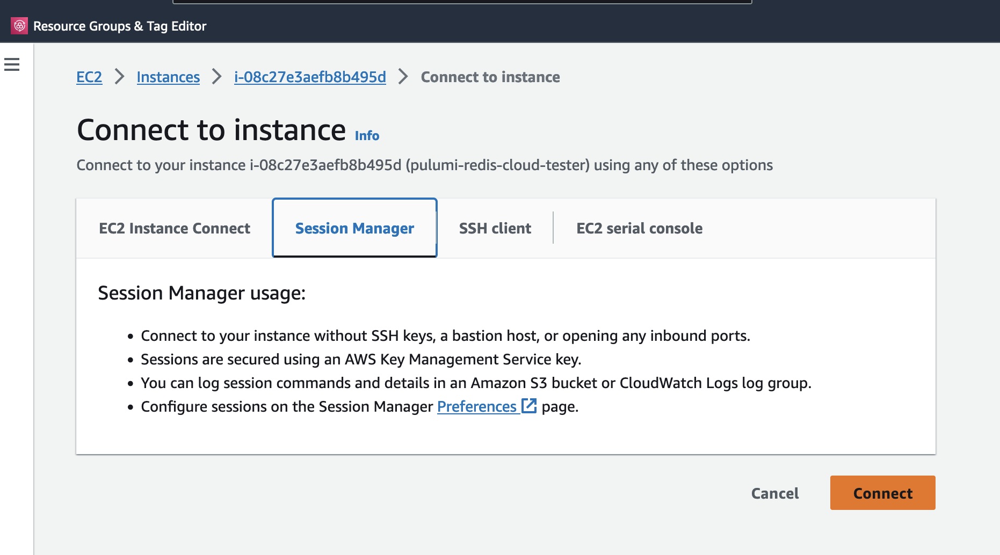
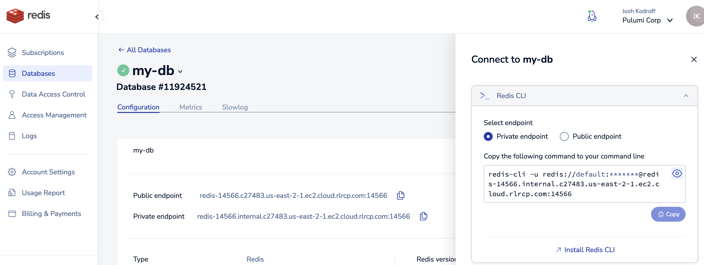
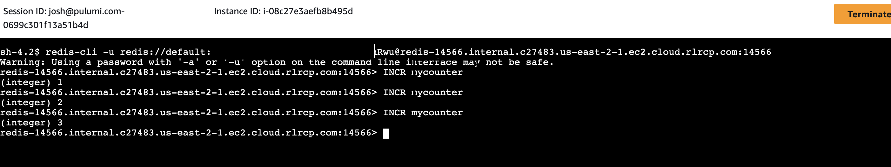

Redis Enterprise Cloud makes apps faster by providing an in-memory database that enables teams to create a real-time data platform. In this post, you'll learn how to enable connectivity between Redis Enterprise Cloud and your workloads using Pulumi and the Redis Cloud provider.

<!--more-->

{}
The full code for this example is available at <https://github.com/pulumi/examples/tree/master/redis-cloud-aws-ts>. The full code differs slightly from the example below in that it has some parameterization that makes the code more portable, whereas in this post we show hardcoded values for simplicity.
{}

## About Redis Enterprise Cloud

[Redis Enterprise Cloud](https://redis.com/redis-enterprise-cloud/overview/) is a fully managed database as-a-service (DBaaS) provider that offers managed Redis clusters. Redis Enterprise Cloud clusters can be accessed via network peering in AWS or Google Cloud, or over the internet. The [Redis Cloud provider](https://www.pulumi.com/registry/packages/rediscloud/) allows you to manage Redis Enterprise Cloud resources in Pulumi programs.

Some of Redis Enterprise Cloud's key features include:

* Automated failover, backups, and scaling.
* Linear scaling based on a serverless architecture, with an optimized engine that provides higher throughput and lower latencies compared to solutions based on Redis' open-source version.
* A subscription-based pricing pricing model based on consumption (as opposed to being billed hourly on provisioned hardware).

## Architecture

One of the most common scenarios for using Redis Enterprise Cloud is to run a workload in a hyperscaler (like AWS or Google Cloud), and then to establish a low-latency connection between your workload and your managed Redis cluster via network peering. In this post, you'll create an architecture for a sample AWS workload. The architecture you'll build will include:

* A Redis Enterprise Cloud database cluster.
* An AWS VPC across 3 Availability Zones, with public and private subnets.
* VPC Peering to enable connectivity between the Redis cluster and the VPC.

You'll also prove the architecture works by spinning up an EC2 instance and running simple commands that target the Redis cluster.

The following diagram shows the major components of the architecture:



## Project Initialization and Redis Enterprise Cloud Resources

{}
Before you begin this tutorial, you will need to add a payment method in the [Redis Cloud console](https://app.redislabs.com/).
{}

To begin, initialize your Pulumi program in an empty directory:

```bash
pulumi new typescript
```

Then, add a reference to the Redis Cloud provider:

```bash
npm i @rediscloud/pulumi-rediscloud
```

Then, in your `index.ts` file, add use the [`getPaymentMethodOutput`](https://www.pulumi.com/registry/packages/rediscloud/api-docs/getpaymentmethod/) function to obtain your payment information, and use the resulting card ID to create a Redis Subscription:

{}
Please note the following:

1. The Redis Cloud provider does not support Fixed subscriptions. You'll need to create a Flexible subscription in order to use the provider to manage resources with Pulumi.
2. The snippet below uses hard-coded values for things like payment info or CIDR blocks for simplicity. In a multi-stack Pulumi program, these should be refactored to configurable values.
{}

```typescript
import * as pulumi from "@pulumi/pulumi";
import * as rediscloud from "@rediscloud/pulumi-rediscloud";

const card = rediscloud.getPaymentMethodOutput({
  cardType: "<YOUR-CARD-TYPE>" // e.g. "Visa" (capitalization matters here),
  lastFourNumbers: "1234",
});

const subscription = new rediscloud.Subscription("redis-subscription", {
  name: "pulumi-redis-aws-example",
  paymentMethod: "credit-card",
  paymentMethodId: card.id,
  cloudProvider: {
    regions: [
      {
        region: "us-east-1",
        // This CIDR block must not conflict with the CIDR block of the AWS
        // VPC to which you wish to connect:
        networkingDeploymentCidr: "10.0.0.0/24",
        // We use a single AZ here to minimize the cost incurred from running
        // this example. For a production workload, consider multiple availability
        // zones:
        multipleAvailabilityZones: false,
        preferredAvailabilityZones: ["use1-az1"],
      },
    ],
  },

  creationPlan: {
    memoryLimitInGb: 10,
    quantity: 1,
    replication: true,
    supportOssClusterApi: false,
    throughputMeasurementBy: "operations-per-second",
    throughputMeasurementValue: 20000,
    modules: ["RedisJSON"],
  },
});
```

Then, create a database in your subscription:

```typescript
const database = new rediscloud.SubscriptionDatabase("redis-db", {
  name: "my-db",
  subscriptionId: subscription.id,
  protocol: "redis",
  memoryLimitInGb: 10,
  dataPersistence: "aof-every-1-second",
  throughputMeasurementBy: "operations-per-second",
  throughputMeasurementValue: 20000,
  replication: true,
});
```

## AWS Networking Resources

Now you are ready to add your AWS resources. First, you'll need to add some reference to your Pulumi program. Add the Pulumi [AWS Classic Provider](https://www.pulumi.com/registry/packages/aws/), which provides basic AWS resources, and the [AWSX package](https://www.pulumi.com/registry/packages/awsx/), which provides a convenient [VPC component](https://www.pulumi.com/registry/packages/awsx/api-docs/ec2/vpc/):

```bash
npm i @pulumi/awsx @pulumi/aws
```

Now you can add some AWS resources to your program. Start by adding `import` statements for the packages you added to our project, then create a VPC with with the AWSX package:

```typescript
import * as awsx from "@pulumi/awsx";
import * as aws from "@pulumi/aws";

const vpc = new awsx.ec2.Vpc("vpc", {
  cidrBlock: "10.1.0.0/16", // Cannot conflict with the Redis CIDR block,
  natGateways: {
    strategy: "Single"
  }
});
```

Next, peer the Redis Cloud subscription with your AWS VPC:

```typescript
const callerIdentity = aws.getCallerIdentity();

const peering = new rediscloud.SubscriptionPeering("redis-peering", {
  subscriptionId: subscription.id,
  region: region,
  awsAccountId: callerIdentity.then(x => x.accountId),
  vpcId: vpc.vpcId,
  vpcCidr: vpc.vpc.cidrBlock,
});

new aws.ec2.VpcPeeringConnectionAccepter("aws-peering-accepter", {
  vpcPeeringConnectionId: peering.awsPeeringId,
  autoAccept: true
});
```

To complete network connectivity between your Redis Cloud database and your AWS VPC, add routes to the private subnets in which your workloads will run that allow traffic to to through the peering connection to the Redis Cloud database's network:

```typescript
vpc.privateSubnetIds.apply(ids => {
  ids.forEach((id, index) => {
    const routeTable = aws.ec2.getRouteTableOutput({
      subnetId: id,
    });

    new aws.ec2.Route(`peering-route-${index}`, {
      routeTableId: routeTable.id,
      destinationCidrBlock: redisVpcCidr,
      vpcPeeringConnectionId: peering.awsPeeringId,
    });
  });
});
```

{}
If you are unfamiliar with the call to `apply()`, you can learn more about why this is necessary in [Inputs and Outputs](https://www.pulumi.com/docs/concepts/inputs-outputs/#apply). Creating resources within `apply` is usually not necessary, but this is one of the few cases where it is.
{}

Now, deploy the infrastructure using the `pulumi up` command:

```bash
pulumi up
```

## Creating an EC2 Instance to Test

To test the architecture, create an EC2 instance running Amazon Linux 2 and enable [AWS SSM Systems Manager](https://docs.aws.amazon.com/systems-manager/latest/userguide/session-manager.html) to allow you easy access to a shell prompt without having to worry about SSH keys. From the shell prompt, you will run the [Redis CLI](https://redis.io/docs/ui/cli/) to prove that network connectivity is working as expected.

First, create a Security Group to allow all egress traffic. This will allow connectivity to Redis, SSM Systems Manager, and HTTP/S to update the underlying operating system and install dependencies:

```typescript
const sg = new aws.ec2.SecurityGroup("instance-sg", {
  description: "Allow all egress traffic.",
  vpcId: vpc.vpcId,
  egress: [{
    cidrBlocks: ["0.0.0.0/0"],
    description: "Allow all",
    protocol: "-1",
    fromPort: 0,
    toPort: 0,
  }]
});
```

Next, create an [EC2 instance role](https://docs.aws.amazon.com/AWSEC2/latest/UserGuide/iam-roles-for-amazon-ec2.html) that grants the necessary permissions to use SSM Systems Manager:

```typescript
const instanceRole = new aws.iam.Role("instance-role", {
  assumeRolePolicy: JSON.stringify({
    "Version": "2012-10-17",
    "Statement": {
      "Effect": "Allow",
      "Principal": {
        "Service": "ec2.amazonaws.com",
      },
      "Action": "sts:AssumeRole",
    },
  })
});

new aws.iam.RolePolicyAttachment("instance-role-attachment", {
  role: instanceRole.name,
  policyArn: "arn:aws:iam::aws:policy/AmazonSSMManagedInstanceCore",
});

const instanceProfile = new aws.iam.InstanceProfile("instance-profile", {
  role: instanceRole.name,
});
```

Then, create the EC2 instance based on the latest Amazon Linux 2 AMI. Note that the `userData` input of the EC2 instance resource installs the Redis CLI, which is not included in the base operating system by default:

```typescript
const amazonLinux2 = aws.ec2.getAmiOutput({
  mostRecent: true,
  owners: ["amazon"],
  filters: [
    { name: "name", values: ["amzn2-ami-hvm-*-x86_64-gp2"] },
    { name: "owner-alias", values: ["amazon"] },
  ]
});

const instance = new aws.ec2.Instance("instance", {
  ami: amazonLinux2.id,
  instanceType: "t3.micro",
  vpcSecurityGroupIds: [sg.id],
  subnetId: vpc.privateSubnetIds[0],
  tags: {
    Name: "pulumi-redis-cloud-tester"
  },
  iamInstanceProfile: instanceProfile.name,
  userData: `#!/bin/bash
  sudo amazon-linux-extras install redis6
  `
});
```

And again, deploy your stack:

```bash
pulumi up
```

{}
If you're new to Pulumi, you may notice that when you run the `pulumi up` command this time, Pulumi does not attempt to re-create the resources you've already declared. This is because Pulumi is a _declarative_ tool: You only need to specify the desired end state of your resources, and Pulumi will figure out what steps (if any) are necessary to get from your infrastructure's current state to your declared desired state.
{}

## Testing the Architecture

Now that you have your EC2 instance up and running, it's time to verify that you can connect to your Redis cluster and run commands:

1. In the AWS Console, find the EC2 instance named `pulumi-redis-cloud-tester`, and connect to it via SSM Systems Manager:

    
    

1. In the [Redis Cloud console](https://app.redislabs.com/), locate your database, and select "Connect":

1. In the connection dialog, copy the connection info for the Redis CLI:

    

1. Paste the command into the Systems Manager shell prompt, which will connect you to the Redis instance. From there you can run Redis commands like `INCR` that will write to the Redis cluster:

    

Now your workloads can use your Redis Cloud cluster! You can tear down all the resources you created with the following command:

```bash
pulumi destroy
```

## Next Steps and Conclusion

Now that you have proven that the architecture works, here are some next steps you might want to take with this codebase:

* Replace the EC2 test instance with a real workload that uses Redis:
  * If your workload is running on EC2, then the code in this post should get you up and running. However, if you find you need some help [Pulumi AI](https://www.pulumi.com/ai) can be a very helpful resource. Simply enter a natural language query and select a support Pulumi language, and Pulumi AI will generate a Pulumi program that can be copy/pasted into your program and iterated on in the same Pulumi AI conversation.
  * If you're using another AWS compute platform, Pulumi also has helpful guides for creating workloads on [ECS](https://www.pulumi.com/docs/clouds/aws/guides/ecs/), [EKS](https://www.pulumi.com/docs/clouds/aws/guides/eks/), or [Lambda](https://www.pulumi.com/docs/clouds/aws/guides/lambda/).
* Try creating [Redis Cloud clusters peered with Google Cloud](https://www.pulumi.com/registry/packages/rediscloud/api-docs/subscriptionpeering/#gcp).
* If you're comfortable using Pulumi and are thinking of adopting it at a team or organizational level, consider [creating an organization in Pulumi Cloud](https://www.pulumi.com/docs/pulumi-cloud/organizations/) and enjoying a [2-week free trial of our full set of features](https://app.pulumi.com/signup), no credit card required!

With Redis Cloud you can enjoy lightning-fast access to whatever data your application needs. When Redis Cloud is coupled with Pulumi, you can manage your Redis databases and all your other cloud infrastructure using a single tool, in any language. That's powerful stuff!
