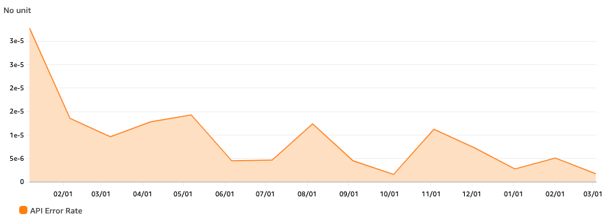

At Pulumi we read every single error message that our API produces. This is the primary mechanism that led to a 17x YoY reduction in our error rate. You’re probably wondering how reading error messages make them go away.<!--more-->



Doesn’t common wisdom tell us that we need a fancy observability toolchain, or to follow the Google SRE model? I can confidently say that you don’t. I’ll go a step further and state that throughout my career, every system I’ve worked on that relied on aggregate views of errors was a complete dumpster fire. In every team where we instead chose to read all the errors, reliability naturally improved over time.

I offer a concrete process that will drive your error rates down over time with math to back it up.

## Read Every Error Message That Your System Produces

You should read every error message that your system produces. Simple but effective. Our team pumps every 5XX into a Slack channel and reviewing each of these is a top priority for the current on-call engineer. There’s a little more to it, but that’s the gist! Commit to this process and your error rates are guaranteed to drop. And I can prove it!

## Reliability from First Principles

Why does reading error messages imply improving error rates? It isn't magic. You still have to dedicate time to fix the bugs you're shipping and make proactive investments. But you can model this process with a simple inequality:

```
(API Call Volume) * (Error Rate) * (Time to Triage an Error) < On-Call Attention
```

This comes with a few important constraints:

1. On-call attention is a fixed commodity
2. API call volume scales with your business
3. This process requires reading every error message

The end result is simple. Your error rate must improve over time to keep the scales balanced. If it doesn’t, the process becomes untenable.

Let’s assume you have one engineer on call, and they spend at most an hour a day triaging errors (they have other responsibilities too!) on each of the ~250 business days per year. That’s a cap of 250 hours per year that can be spent triaging errors. This is effectively fixed. Sure you can hire and split systems out into separate on-call rotations to increase capacity, but our goal is to scale exponentially with respect to humans, not linearly!

Let’s say that triaging an error is a 5-minute process that might involve any of the following:

- Checking the issue tracker for a pre-existing ticket to add additional context, a +1, etc.
- Reaching out to a teammate who just shipped some buggy code so they can get a fix out
- Filing a well-documented bug
- Starting a Slack thread with the team to raise a known issue that seems to be cropping up more regularly
- Just opening a PR if it’s a simple fix

Remember we only have 250 hours or 15,000 minutes per year to triage with a single on-call engineer. At five minutes a pop we can triage ~3000 errors per year until things start dropping on the floor.

Now imagine you work on a new product and you just launched your MVP. It is early days, but there is some traction and you’re seeing API traffic at a rate of 1,000,000 requests per year. Your annual budget for triaging as we previously determined is 3000 errors, which yields a maximum permissible error rate of 0.3%, or a 99.7% success rate.

Over the next six months, the team iterates, listens to customers, and delivers a ton of value. As a result, traffic levels grow to a rate of 10,000,000 requests per year. But still, our team hasn’t grown much and we still have just one engineer on call at any given point in time meaning our error triage capacity remains fixed at 3000 errors per year. In order to keep up with triaging the error stream at the increased levels of traffic, the team must improve the error rate from 0.3% to 0.03%. And hopefully, this team continues to be successful, increasing API traffic superlinearly in years to come.

If you want to be able to read every error message, then the error rate has to come down as API traffic increases.

## Why Should You Care?

Pulumi aspires to be the most reliable infrastructure that our customers interact with, and the benefits towards that end are reason enough for us. But this process is by no means free, and there is always an opportunity cost.

However, we noticed a powerful second-order effect emerge over time. The team began obsessing over the user experience. Following this process builds a visceral understanding of how your system behaves. You know when a new feature has a bug before the first support tickets get opened. You know which customer workloads will require scaling investments in the next 90 days. You know what features see heavy usage and which ones customers ignore. You’re forced to confront every wart in your application. Slowly, your team builds a better understanding of your customers and this trickles down into every aspect of product development. You begin to hold yourselves to higher standards.

A friend and engineer at a large-cap software company read a draft of this post and told me:

 > “I can’t imagine this process being set on any of the systems I work on at [redacted]. They are so prone to 500s and everybody shrugs their shoulders as if it is just commonplace.”

Apathy in place of customer obsession is not an option if you are a startup that wants to disrupt anything.

## The SRE's Folly

Error budgets and the SRE model are haute couture. Some preach that we should never look at errors at this level of granularity and instead use expensive tools that aggregate, categorize, and collect statistics on errors flowing through your system. But all of this automation can actually make things worse when you reach for it prematurely. Aggregating errors is a great way to gloss over important details early on. Collecting fancy metrics does not matter if your users are not happy. Cutting your teeth with the tools and processes that make sense for your level of scale is the only way to build a high-performance culture. Skipping straight to step 100 does not always help.

Admittedly, this process does not work for Google-level scale. But it works a lot longer than you might imagine. Pulumi manages a meaningful percentage of the resources deployed across all clouds. I asked large-cap software engineer about traffic levels and believe it or not, it is in the same order of magnitude as what we see at Pulumi.

We’re still reading every error.
