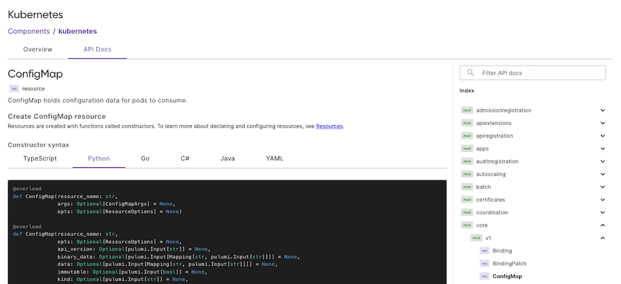

Building and maintaining reusable infrastructure has always been about more than just writing good code—it's about making that code discoverable, understandable, and easy to adopt across your organization. Today, we're excited to announce a new feature that removes significant friction from sharing and consuming infrastructure components: automatic multi-language API documentation in Pulumi Private Registry.

<!--more-->

## The Challenge of Sharing Infrastructure at Scale

Platform teams invest significant effort in creating reusable infrastructure components. But creating the infrastructure is only half the battle. The real challenge comes in making these resources discoverable and usable by development teams across the organization.

Until now, when platform teams publish components to their private registry, developers still had to figure out how to use them. Without proper API documentation, developers resort to reading source code or pinging the platform team on Slack—neither of which scales. Even when documentation exists, keeping it synchronized with the actual component implementation becomes yet another maintenance burden.

## Automatic API Documentation: From Code to Comprehensive Docs

Starting today, whenever you publish a component to your Pulumi private registry—whether it's a brand new component or an updated version—Pulumi automatically generates comprehensive API documentation for all of the component's resources.

### How It Works

When you run `pulumi package publish` for your component, we analyze your component's structure, inputs, outputs, and resources to generate rich, interactive API documentation. This documentation is immediately available in your private registry, formatted consistently across all Pulumi-supported languages.

### Multi-Language Support Out of the Box

One of Pulumi's core strengths is our multi-language components—write once in your preferred language, and teams can consume the component in Python, TypeScript, Go, C#, Java, or YAML. The automatic documentation generation embraces this philosophy.

When you publish a component written in Python, developers using TypeScript can view the TypeScript-specific documentation. The same component shows Go developers idiomatic Go code. This language-specific documentation removes the last barrier to cross-team component adoption.

### Improving Discoverability and Adoption

With automatic API documentation, your private registry transforms from a simple package repository into a comprehensive catalog. Developers can:

* Browse available components and immediately understand their purpose and usage
* See all available configuration options with type information
* Understand the resources that will be created without diving into implementation details

This dramatically reduces the time from component discovery to successful deployment, accelerating your organization's infrastructure velocity.

## Getting Started

Automatic API docs is available today for all Pulumi Cloud customers with access to private registriy. To start generating docs, simply [publish your component](/docs/idp/get-started/private-registry/#publishing-components). Documentation generation happens automatically—no configuration required, and docs will automatically appear for existing components.

## Looking Ahead

Automatic API docs represent our continued investment in making Pulumi the most productive platform for infrastructure teams. By removing friction from the component lifecycle, we're enabling platform teams to focus on what matters most: building robust, secure, and scalable infrastructure patterns that accelerate their entire organization.

We're excited to see how teams use them to build more effective infrastructure development platforms. As always, we'd love to hear your feedback and learn about your use cases.

Ready to streamline your infrastructure development workflow? Get started with [Pulumi Cloud](https://app.pulumi.com/signup) or check out our [documentation](/docs/idp/get-started/private-registry/) to learn more.
