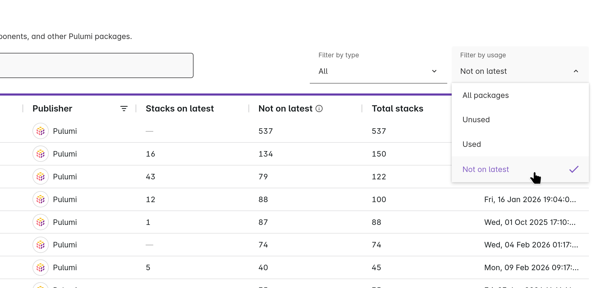

Platform teams need visibility into package adoption at scale. Responding to security advisories, planning deprecations, and tracking version sprawl all require knowing which stacks run which package versions across your organization.

<!--more-->

## From Individual to Organizational Visibility

Previously, we [introduced the "Used by" tab](/blog/announcing-pulumi-private-registry/) on individual package pages, giving you visibility into which stacks use a specific package. However, navigating package by package doesn't scale when you're managing dozens of packages across hundreds of stacks.

Today, we're extending that visibility to the organization level. You can now see adoption data for all packages at a glance, filter by usage status, and share specific views with your team.

## What You Can See

The package list now displays three usage columns for each package:

1. **Stacks on latest**: the number of stacks running the latest version
1. **Not on latest**: the number of stacks running older versions
1. **Total**: all stacks using any version of the package

These numbers update as stacks are deployed, giving you a real-time view of adoption across your organization.

## Find What Matters with Filters

Three filters help you find packages that need attention:

- **Used**: packages with at least one stack
- **Unused**: packages with zero usage
- **Not on latest**: packages where stacks are running older versions

Combine filters with search to find specific packages.

## Browse All Packages in One Place

The new **Registry** tab under Platform shows all packages available to your organization, including public providers and components from [pulumi.com/registry](https://www.pulumi.com/registry/) alongside your organization's private packages. The **Private Components** tab (previously called Components) now includes the same usage columns and filters.

## Share Specific Views

Search queries, filters, and pagination sync to the URL. Copy the URL to share a specific view with your team, or bookmark it for quick access to your regular monitoring workflow.

## Why This Matters

These features are designed for the scenarios platform teams face regularly:

- **Security response**: filter to "Not on latest" to identify stacks running vulnerable versions
- **Deprecation planning**: before retiring a package, check its usage to understand the migration scope
- **Version sprawl**: identify packages where teams are running many different versions and prioritize standardization efforts
- **Adoption tracking**: see which packages are gaining traction and which aren't being adopted

## Get Started

Navigate to **Platform > Registry** in Pulumi Cloud to explore your organization's packages with the new usage columns and filters. For more details on the private registry features, see the [Private Registry documentation](/docs/idp/concepts/private-registry/).
