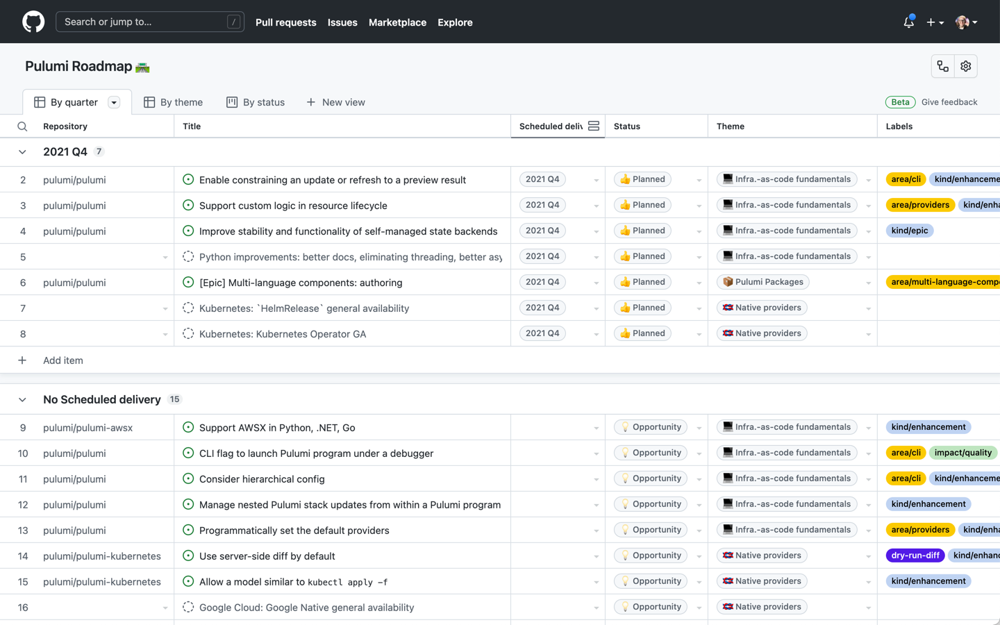
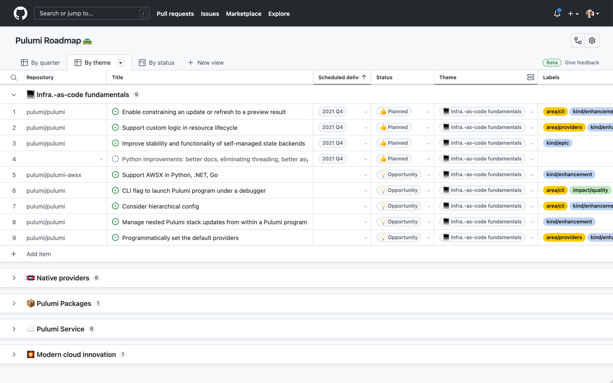

Today, I’m excited to announce the (re-)launch of the [Pulumi public roadmap](https://github.com/orgs/pulumi/projects/44), now built on top of the new [GitHub Issues](https://github.blog/2021-06-23-introducing-new-github-issues/). The roadmap is a core part of the commitment we’re making to our open source product, the Pulumi CLI and SDK, as well as the Pulumi Service. As we’ve talked to many of you that use Pulumi, or are considering using it, we’ve heard that the roadmap is a key tool to help understand what new and exciting work is coming to Pulumi. Open source contributors have told us that it can also help them figure out good places to contribute new and expanded features.

The new roadmap shows the work we’ve planned for the upcoming quarter as well as a selected backlog of issues that are on our mind but not yet scheduled. Most items on the roadmap are pulled directly from GitHub issues in our open source repositories (like [`pulumi/pulumi`](https://github.com/pulumi/pulumi)), so it’s easy to learn more about what’s coming next and to ask questions or discuss roadmap items.

You can also view the roadmap by theme if you want to answer questions like “What’s next for Pulumi’s Native Providers?” or “How is Pulumi continuing to invest in the core infrastructure-as-code capabilities of the `pulumi` CLI?”

We’re excited for your feedback on this new roadmap and, more importantly, on the features that it contains. Visit [Pulumi public roadmap](https://github.com/orgs/pulumi/projects/44) and click into any feature to vote for it, ask a question, or let us know that you’re interested in implementing it or collaborating on it.
