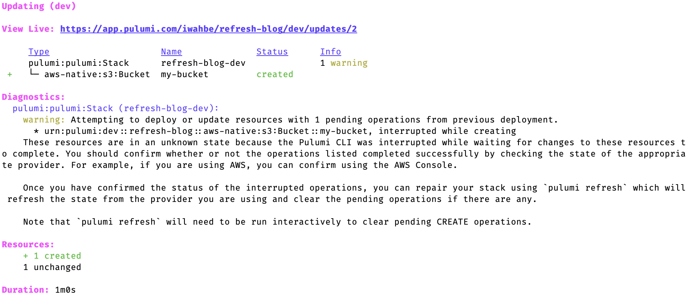
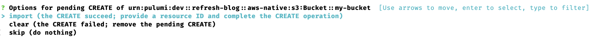

Under the hood, Pulumi is a desired state engine. This means that you tell Pulumi what you want, Pulumi knows what already exists, and it makes targeted changes to match the state of the world with your desired state. This works great as long as Pulumi understands the state of the world, which it nearly always does. We will discuss how `pulumi refresh` can be used to bring Pulumi's state back inline with external state.

<!--more-->

## The Problem

There are scenarios where Pulumi’s understanding of the world differs from what actually exists. For Pulumi to work correctly, it needs to reconcile its known state with the actual state. Before we explore how Pulumi solves this problem, we should explore how the Pulumi state gets out of sync with the actual state of the world. There are two main ways for Pulumi to get out of sync: out of band changes and terminating Pulumi mid-operation. I will explain each in turn.

### Out of Band Changes

Pulumi expects to be the sole controller for the resources it provisions. An out of band change happens when this principle is violated. This is best illustrated with an example. Imagine creating an S3 bucket with Pulumi:

```typescript
const bucket = new aws_native.s3.Bucket("my-bucket", {
    tags: [{
        key: "pulumi-bucket",
        value: "not important",
    }],
});
```

Then someone goes into the AWS console and deletes the bucket. What happens if you then go change a tag on the bucket:

```typescript
const bucket = new aws_native.s3.Bucket("my-bucket", {
    tags: [{
        key: "pulumi-bucket",
        value: "don’t delete me",
    }],
});
```

Pulumi has recorded creating a bucket, but it does not know that the bucket was deleted. It will try to update the bucket and fail, since the bucket does not exist anymore.

### Terminating Pulumi Mid-Operation

Pulumi also gets confused if the CLI or Pulumi Provider process is terminated while an update is taking place. The Pulumi CLI checks in its state before and after each operation it performs. Creating the bucket from above goes something like:

1. Started `pulumi up`.
2. About to create `aws_native:s3:Bucket::my-bucket`.
3. Created `aws_native:s3:Bucket::my-bucket` with ID `my-bucket-6e3d099`.
4. Finished `pulumi up`.

If the Pulumi CLI process is terminated between steps 2 and 3, then Pulumi does not know if
“my-bucket” exists or not. Unlike the first example, Pulumi is aware that it does not know if the resource was created. This will be displayed as a pending CREATE operation. Depending on what type of operation was interrupted, it is possible to have pending CREATE, UPDATE, DELETE, READ and IMPORT operations.



## The Solution

As of [#10394](https://github.com/pulumi/pulumi/pull/10394), the solution to both problems is [pulumi refresh](https://www.pulumi.com/docs/cli/commands/pulumi_refresh/). The `pulumi refresh` command modifies Pulumi's state so it matches the state of the underlying providers. Most discrepancies can be resolved automatically by checking Pulumi's state against the underlying resource provider. For our AWS bucket example, Pulumi would ask the aws-native provider if bucket `my-bucket-6e3d099` exists and what tags it has.

This works for all resources that Pulumi knows about. This set includes Pulumi managed resources that were changed manually, or for pending UPDATE, DELETE, READ and IMPORT operations. Pulumi does not know the resource ID for pending CREATE operations (it might not exist), so it can not resolve everything for you. It needs a little bit of help. For each pending CREATE, Pulumi will ask you what to do:



If the resource was created successfully, you can select `import`, give Pulumi the ID of the
created resource, and Pulumi will bring that resource under management.

If no resource was created, you can select `clear` to tell Pulumi to clear the pending CREATE. It will recreate the resource for you the next time you run `pulumi up`.

You can learn more by going to the [`pulumi refresh` documentation](https://www.pulumi.com/docs/cli/commands/pulumi_refresh/) or by running `pulumi refresh --help`.

### Command Details

There are some flags you can pass to modify the new behavior:

- `--import-pending-creates` gives Pulumi a list of URN ID pairs. This is equivalent to selecting the `import` option when running in interactive mode, but only for the URNs listed.
- `--clear-pending-creates` will remove any pending CREATEs from the state.
- `--skip-pending-creates` will skip all pending CREATEs. This is the default behavior when running the CLI outside of interactive more.

These flags can be combined:

```sh
    pulumi refresh \
        --import-pending-creates="aws_native:s3:Bucket::my-bucket my-bucket-6e3d099"\
        --clear-pending-creates
```

The above command will run the pending CREATE resolution for our example S3 bucket, and will clear all other pending CREATE operations.
