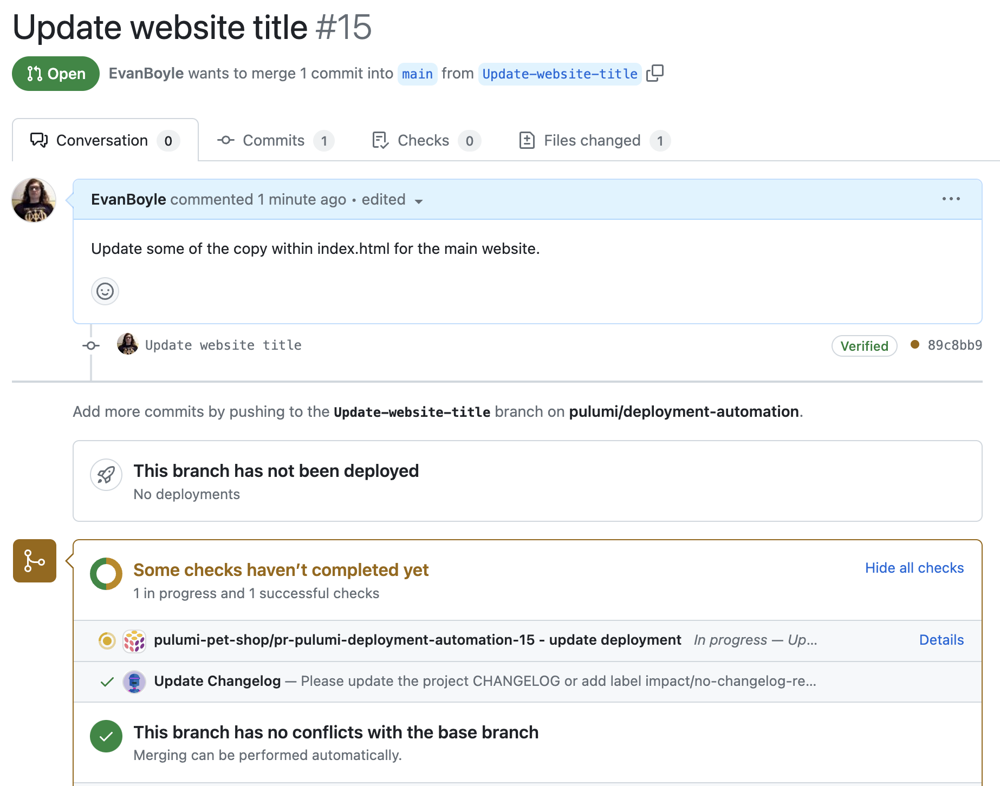
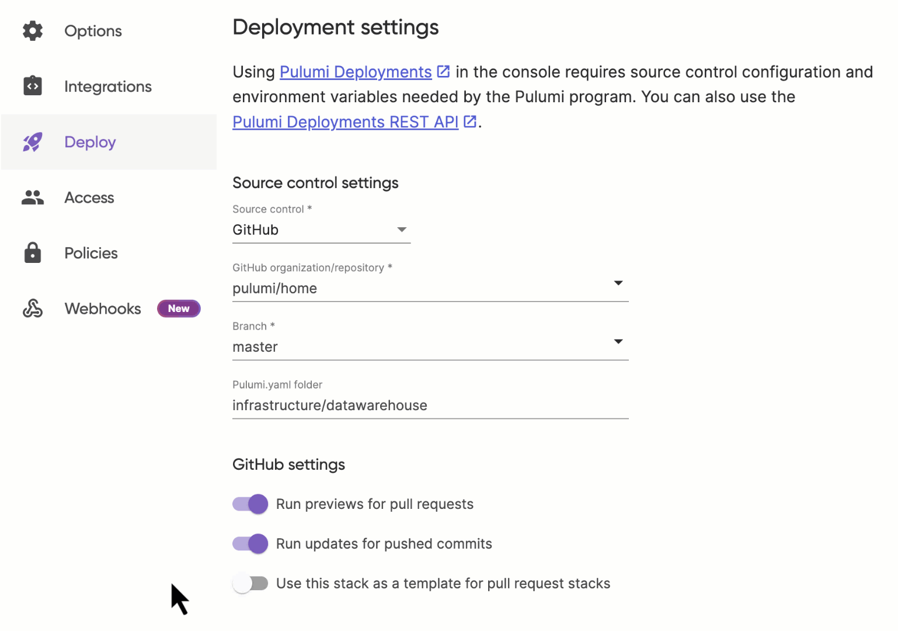

<iframe width="560" height="315" src="https://www.youtube.com/embed/VvQcx51YL4g" title="YouTube video player" frameborder="0" allow="accelerometer; autoplay; clipboard-write; encrypted-media; gyroscope; picture-in-picture; web-share" allowfullscreen></iframe>

Today we’re excited to announce [Review Stacks](/docs/pulumi-cloud/deployments/review-stacks) -- dedicated cloud environments that get created automatically every time a pull request is opened, all powered by [Pulumi Deployments](/docs/pulumi-cloud/deployments). Open a pull request, and Pulumi Deployments will stand up a stack with your changes and the Pulumi GitHub App will add a PR comment with the outputs from your deployment. Merge the PR and Pulumi Deployments will destroy the stack and free up the associated resources. It has never been simpler to pick up an unfamiliar codebase, make changes to **both** application *and* infrastructure code, and share a live environment for review with your teammates.


Ephemeral environments for front-end development and static websites have become commonplace in recent years, but infrastructure and complex systems have been unsupported up until this point. Review Stacks enable you to iterate on both application code changes **and** infrastructure code changes at the same time. Making changes to HTML, CSS, Next.js, Go APIs, Pulumi configuration, subnet configuration, databases, and load balancers are all possible with Review Stacks. No more fumbling with out-of-date READMEs and developer documentation. Just open a pull request and you can start testing changes against everything from simple static websites to API servers, microservices, data pipelines, Kubernetes clusters, and any other piece of infrastructure across Pulumi’s 100+ cloud providers.

Review Stacks manage the full lifecycle of your cloud development environment including creating it when the PR is opened, updating it every time a new commit is pushed, and destroying and cleaning up all cloud resources when the pull request is merged or closed. They even integrate with GitHub checks so that you can gate your pull requests on successful Review Stack deployments.



Pulumi customers already using Review Stacks find that it saves their developers time. Having a standardized process for development environments and change management makes it easier to onboard new developers, and load-balance teammates onto unfamiliar projects and codebases. It also makes it substantially easier for developers to work on multiple feature branches and bug fixes at the same time, as they don’t have to worry about manually maintaining and juggling development environments.

> “Pulumi allows every engineer to build and update infrastructure instead of only our infrastructure team, which enables us to ship faster than if we were using a domain-specific language,” said Aaron Gibralter, head of engineering, Mighty. “With Pulumi Deployments, we could easily set up a standardized CI/CD infrastructure workflow for every engineer that immediately makes them productive. Review Stacks automates the work of managing our own ephemeral infrastructure and makes our lives easier.”

Review Stacks also provide an avenue for optimizing cloud costs. Rather than keeping development infrastructure running 24/7, Review Stacks only exist as long as an engineer works on a feature. Since Review Stacks are flexible and built on Pulumi IaC, it is also possible to configure it to deploy to multi-tenant environments that share development infrastructure to further streamline costs.

> “At GitHub, we are constantly seeking to improve the developer experience and our partner ecosystem plays a big role in that.” said Matthew Manning, Senior Business Development Manager for GitHub Actions, “The launch of Pulumi Review Stacks with GitHub makes it easier for teams to review and test their products before shipping which ultimately improves the developer experience.”

## Configuring Review Stacks

Configuring Review Stacks is a simple three-step process:

1. Create a new stack, by convention named `pr`, and corresponding `Pulumi.pr.yaml` configuration file - this config will be copied into every review stack that gets created, and can even be modified within a PR.
2. Configure [Deployment Settings](/docs/pulumi-cloud/deployments/reference/#deployment-settings) for the stack - this specifies how to acquire source code, cloud credentials and more when deploying via Pulumi Deployments.
3. Set the `pullRequestTemplate` Deployment Setting to true - this indicates that all pull requests against this stack’s branch should reference this stack as a Review Stack template.

You can use an existing stack as a Review Stack template, as long as it has Deployment Settings configured. This will result in Review Stacks being deployed into the same cloud account. If you want to separate the cloud resources in your production stack from the resources created via Review Stacks then you can create a separate stack and template that references a different cloud account (AWS, Azure, GCP, etc).

Review Stacks and Deployment Settings can be configured via the Pulumi Cloud console, the Pulumi Cloud REST API, or within a Pulumi Program using the Pulumi Cloud Resource Provider.

### Pulumi Cloud UI

It is just one click to turn on Review Stacks via the Pulumi Cloud console.



### REST API

You can programmatically configure Review Stacks and Deployment Settings at scale across thousands of projects using the [Deployments REST API](/docs/pulumi-cloud/deployments/api/#patch-settings).

```
curl -i -XPOST -H "Content-Type: application/json" -H "Authorization: token $PULUMI_ACCESS_TOKEN" \
--location "https://api.pulumi.com/api/stacks/org/project/stack/deployments/settings" \
-d '{
  "gitHub":{
    "pullRequestTemplate": true
    }
}'
```

### Pulumi Cloud Resource Provider

You can use Pulumi to manage and code review Deployment Settings and Review Stacks with the [Pulumi Cloud Provider](/registry/packages/pulumiservice).

```typescript
import * as pulumiservice from "@pulumi/pulumiservice";

const deploymentSettings = new pulumiservice.DeploymentSettings("deploymentSettings", {
	organization: pulumi.getOrganization(),
	project: "your project",
	stack: "your stack",
	github: {
		deployCommits: true,
		previewPullRequests: true,
		pullRequestTemplate: true,
		repository: "pulumi/deployment-automation",
	},
	sourceContext: {
		git: {
			branch: "refs/heads/main",
			repoDir: "pulumi-pet-shop",
		},
	},
});
```

## Collaborate in the Cloud

At Pulumi, our engineering team writes *a ton* of code. We have hundreds of repositories with programs managing thousands of stacks and tens of thousands of cloud resources. These tools and services power production workloads, internal tools, business intelligence and process, and more. And of course we use Pulumi to ship all of it. When you’re an engineer working in one of these repositories, making a code change is the easy part. The hard part is figuring out how to get a tight dev loop going---in particular, faithfully verifying your changes before merging and deploying them. Are there instructions in the README for running locally? A Docker Compose file? Or maybe standalone dev environments? Can I figure out what config and upstream stack references are required to stand up a fresh dev stack? And what about service dependencies? Pulumi makes it incredibly easy to build in the cloud and write prolific amounts of code, however, with that increase in development velocity comes a need to standardize the entire process by which we develop, test, review, and ship our code.

We've heard similar stories from hundreds of customers. From startup teams of five to enterprises of thousands, they're all looking for the same thing - so we went ahead and built it. With Review Stacks and Pulumi Deployments, you can ship with greater velocity, confidence, and collaboration.

Check out these resources and get started today:

- [Review Stacks documentation](/docs/pulumi-cloud/deployments/review-stacks)
- [Learn more about Pulumi Deployments](/docs/pulumi-cloud/deployments)
- Join us in the [#pulumi-deployments community slack channel](https://slack.pulumi.com/)

🚀🚀🚀 Happy building! 🚀🚀🚀
