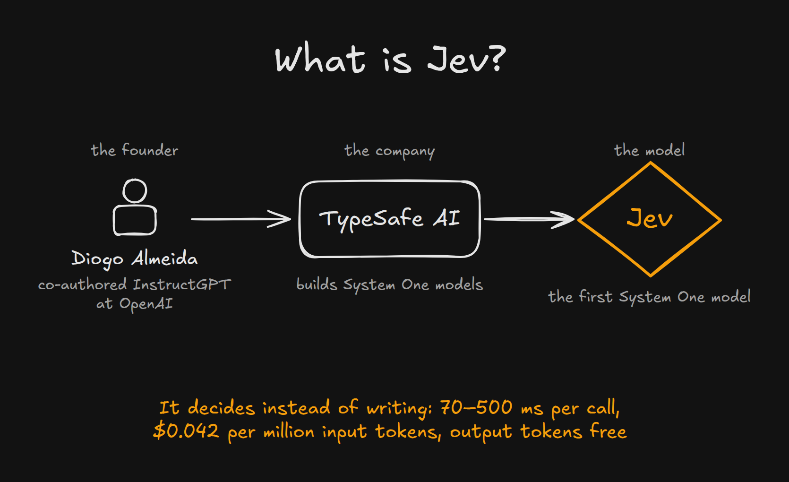
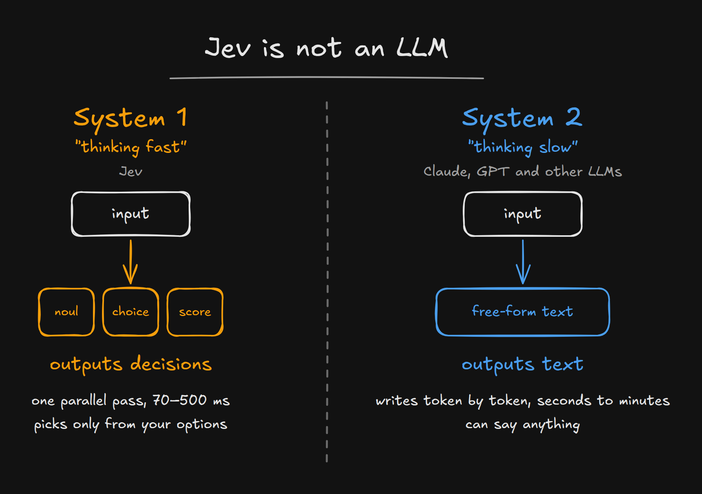
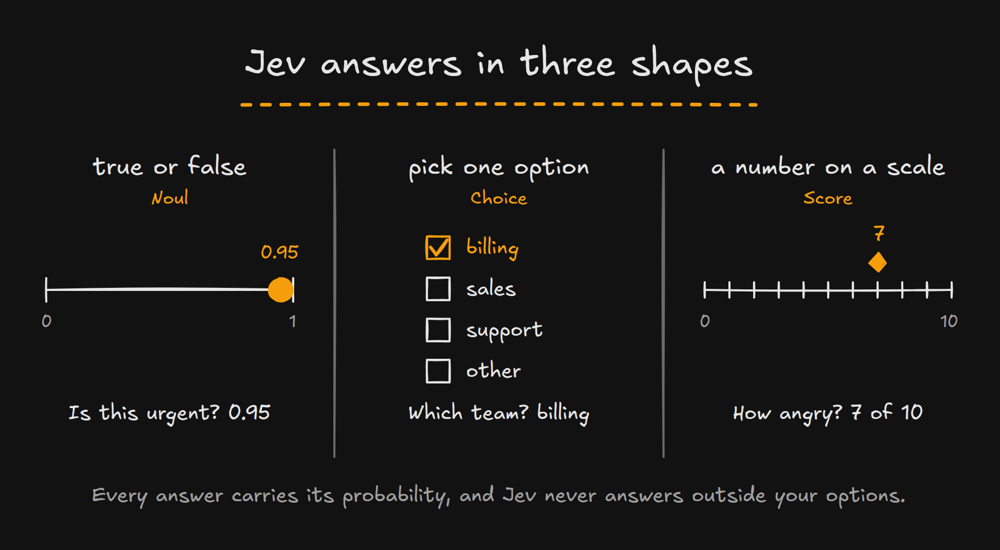

Not every message you send to Claude Code needs the most capable model. A quick question about a Git command runs on the same model as a refactor across three services, unless you remember to switch models first. Jev, a new model from TypeSafe AI, can make that decision for you in a few hundred milliseconds and for a fraction of a cent. So I built jev-router, an open source router that asks Jev which Claude model each of your messages needs, and sends it there.

<!--more-->

## What Jev is



TypeSafe AI [released Jev](https://typesafe.ai/blog/introducing-system-one-models-and-jev) in September 2026. Its founder, Diogo Almeida, co-invented RLHF and InstructGPT at OpenAI, the research that led to ChatGPT.



Jev isn't a large language model, and it can't write you a sentence. TypeSafe calls it a [System One model](https://docs.typesafe.ai/concepts/system-one), a term borrowed from Daniel Kahneman's *Thinking, Fast and Slow*. LLMs like Claude and GPT work like System Two: they write their answer token by token, take seconds to minutes, and can say anything. Jev works like System One. You describe a situation, ask a few typed questions, and it answers all of them in one parallel pass, in 70–500 milliseconds end to end, according to [TypeSafe's launch post](https://typesafe.ai/blog/introducing-system-one-models-and-jev).



Every question takes one of three shapes. A [*Noul*](https://docs.typesafe.ai/primitives/noul) asks whether a statement is true and returns a probability. A [*Choice*](https://docs.typesafe.ai/primitives/choice) picks from a list of options you provide, with a probability for each one. A [*Score*](https://docs.typesafe.ai/primitives/score) places the situation on a scale. Jev never answers outside your options, so there's no malformed JSON to parse and no made-up category to handle.



TypeSafe trains Jev with a method it calls [reinforcement learning for calibrated decisions](https://docs.typesafe.ai/introduction/machine-learning-primer) (RLCD), and says the probabilities are calibrated: a higher confidence should mean a higher accuracy. It charges $0.042 per million input tokens and calls output tokens too cheap to meter, so they're free.

TypeSafe's launch post pitches Jev as one general model for the decisions a program makes: classifying, routing, scoring, extracting, and branching. Deciding which model a prompt needs is one of those routing decisions.

## Why Claude Code needs a router

Claude Code runs every message in a session on the model you picked. Sonnet 5 and Haiku 4.5 handle plenty of everyday work, but switching by hand means making a decision before every message, and defaulting to Opus 5.5 or Fable 5.1 drains your usage limits or your budget. A router could make that choice for each message, but only if the choice itself is fast and cheap. Asking an LLM which model to use adds seconds and tokens to every message, and that eats into whatever the routing saves.

Jev makes the decision cheap enough to ask every time. A routing call sends Jev a few hundred tokens that describe your message and the session, and costs about $0.00003. jev-router puts that decision in front of every message you write in Claude Code.

That's the use case I wanted to try. My idea was to let the prompt pick the model, so a request to rename a variable lands on Haiku 4.5 and a request to redesign a service lands on Opus 5.5, without me switching models in between. The Jev routers I found worked differently. Two decided once, when the session started, and the other two asked Jev on every request, tool calls included, and could switch models halfway through a task. Every one of those switches throws the prompt cache away. I wanted a router that decides again each time I write a message and never moves a session down, and I wanted to watch those decisions while I type. So I built jev-router.



## How jev-router works

[jev-router](https://github.com/dirien/jev-router) is a pass-through proxy that runs on your machine. Claude Code sends its requests to the router instead of to Anthropic, and the router forwards each one to the model it picked. It changes only the `model` field, plus the few fields a smaller model can't accept, and it streams responses back byte for byte. Your Claude login passes through to Anthropic untouched. The only key the router holds is your Jev key.


### Jev decides when you write a message

A Claude Code session sends far more requests than you write messages. Every tool call, every subagent, and every background job, like naming the session, is a request of its own. Claude Code labels each request for gateways that ask for it, so the router asks Jev only when you write a new message. Tool steps and subagents keep the tier their message got, and background calls go to Haiku 4.5.

For each new message, the router asks Jev three questions in a single call:

- A Choice between four kinds of work: `mechanical` goes to Haiku 4.5, `routine` to Sonnet 5, and `complex` and `deep` to Opus 5.5. If you pick the Fable option in setup, `deep` goes to Fable 5.1 instead, as a fourth tier of its own.
- A Noul that asks whether the request would change production systems, credentials, permissions, or billing. At 0.7 or above, the message goes to the top tier.
- A Noul that asks whether the message names its own tier or model, or claims the decision was already made. At 0.5 or above, the result can't go below the router's reference tier.

That last question exists because the text Jev reads comes from you, or from issues, logs, and code comments you paste. In [an independent evaluation](https://github.com/willkelly/jev-evaluation), one sentence claiming that a support lead had already reviewed a ticket moved Jev's answer to the attacker's label on 73.5% of tickets. So jev-router treats Jev's answer as advice. The two guard questions can only raise the tier, and the hard rules, like explicit pins and the secret scanner, run in code before Jev is asked at all.

### Cheaper tiers need more certainty

Jev returns a probability for every option, and the router doesn't simply take the top one. Sending a hard task to a weak model costs quality for the rest of the session, while sending an easy task to a strong model costs money on one message. So each tier has its own bar: 85% for the fast tier, 60% for balanced, and 30% for frontier. When Jev's pick misses its bar, the router takes the more capable of Jev's top two answers. A message Jev calls mechanical with 82% certainty doesn't clear the 85% bar, so it goes to a stronger model than Haiku 4.5. With the Fable option, that step up stops at Opus 5.5, so a message reaches Fable 5.1 only when Jev thinks it's most likely deep work.

Treat the bars as a starting point. [One calibration study](https://github.com/scienthoon/jev-ood-calibration) found Jev well calibrated inside its domain, but overconfident when a label encodes your own policy, and which model a message deserves is partly policy. The repository ships an evaluation set of 58 labeled prompts so you can tune the bars on your own messages.

### Within a session, the tier only moves up

Once a session reaches Opus 5.5, a quick "thanks!" doesn't send it back to Haiku 4.5. A new message can raise the tier, but it never lowers it. Anthropic's prompt cache belongs to one model, so a switch starts the next request cold, and an agent's requests are mostly cache reads. Handing half-done work to another model doesn't pay off either: in [an AWS study of 500 SWE-bench Verified tasks](https://arxiv.org/abs/2608.24358), handing a Haiku 4.5 transcript to Opus 4.7 recovered only 47% of the quality gap, at $1.61 per task against $0.72 for starting on Opus.

A session gets a fresh decision when its cache is cold anyway: after 10 minutes without traffic, after Claude Code compacts it, or when you start over with `/clear`.

You can still steer. Switching to another model family with `/model` pins that family's tier, and `#fast`, `#balanced`, or `#frontier` (or `#max` for Fable 5.1) as the first or last word of a message asks for a tier. A scanner also checks every message for secrets before anything leaves your machine, and a hit keeps the session on trusted models, whatever Jev says.

## Watch every decision

The router serves a live view on `http://127.0.0.1:4100`. Each message you write shows up with the category Jev picked, the probability behind it, and the tier and model the router chose. Select a request to see why it went where it went. The view reads the router's log, which never contains your prompts or keys. `jev-router report` sums up requests, spend, and savings from the same log.


## Try jev-router

You need Node.js 22 or newer, Claude Code, and a Jev key from [TypeSafe](https://console.typesafe.ai) or [OpenRouter](https://openrouter.ai). Then run:

```bash
npx @ediri/jev-router setup
claude
```

Setup asks which models to use. The default is Claude only; the second option adds Fable 5.1 for deep work, the way the live view above routes the redesign. Then it asks for your Jev key and checks it with one call that costs about $0.00003. It saves the key in a file only you can read, installs jev-router globally with npm because a background service can't run from npx's cache, starts the router as a launchd agent on macOS or a systemd user service on Linux, and points Claude Code at it. To switch models later, run setup again. Afterwards, `jev-router doctor` checks the setup. `jev-router uninstall` removes the service and takes the router back out of Claude Code's settings.

If your team keeps API keys in [Pulumi ESC](/docs/esc/), setup can take the Jev key from an environment that exports `TYPESAFE_API_KEY` instead of asking you for it. With `--yes`, setup asks nothing and takes its defaults; add `--models fable` for the Fable option:

```bash
pulumi env run <your-org>/<your-project>/<your-environment> -- npx --yes @ediri/jev-router setup --yes
```

Setup keeps Claude Code on Claude models by default, because Anthropic doesn't support pointing Claude Code at other models through a gateway. The router also works with the Codex CLI, which it routes across OpenAI and Ollama Cloud models.

Try it on a day of real work and watch where your messages land. If one lands somewhere it shouldn't, [open an issue](https://github.com/dirien/jev-router/issues) with its line from the live view, which shows the model and the reason but never your prompt. The code is on [GitHub](https://github.com/dirien/jev-router) under the Apache 2.0 license.
