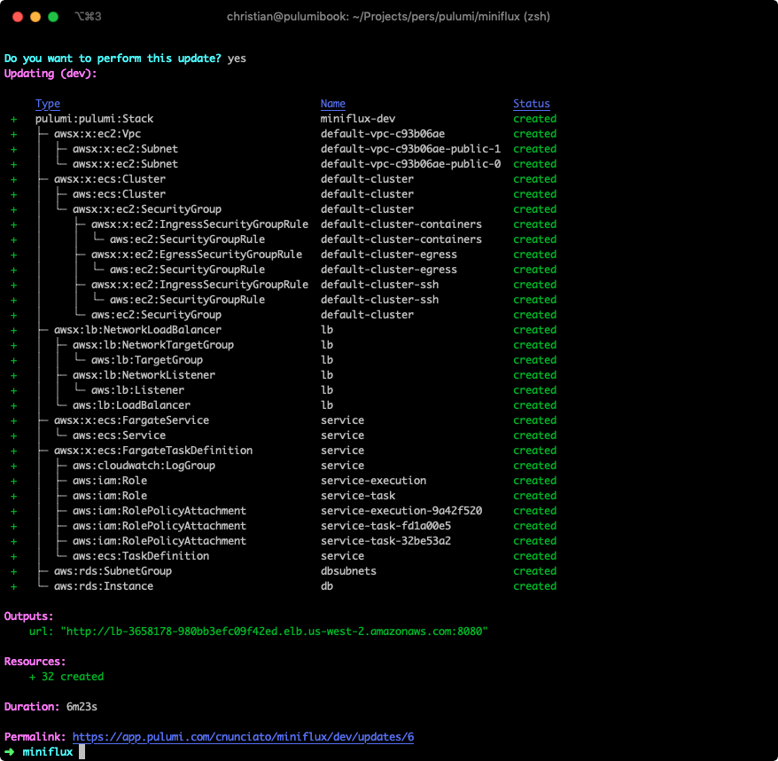
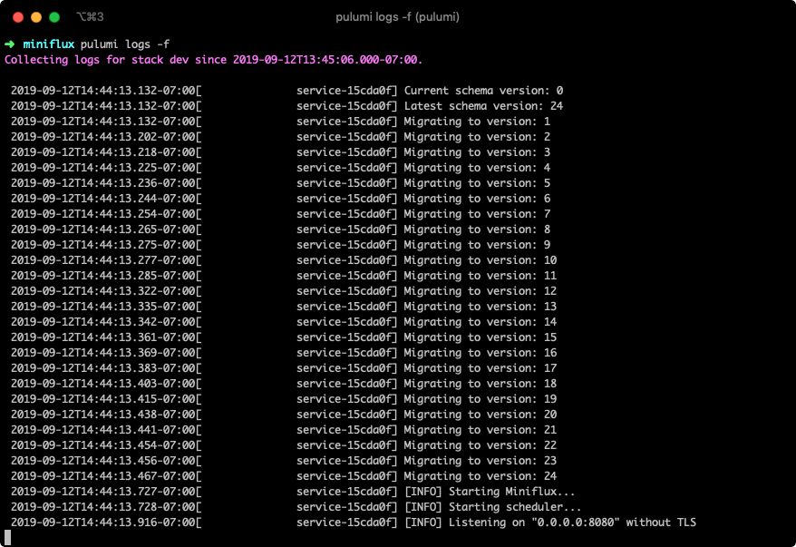
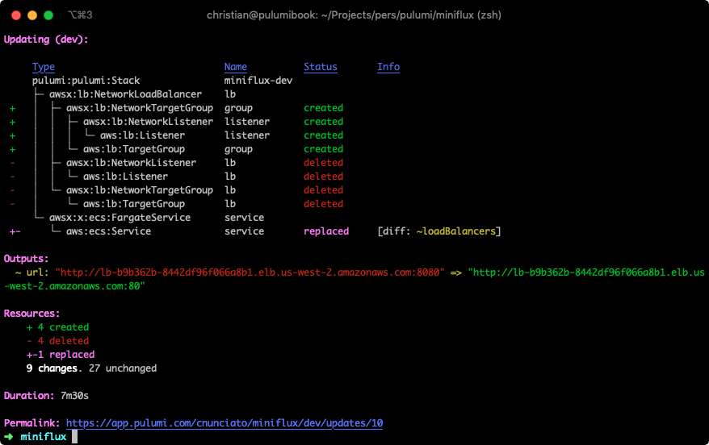
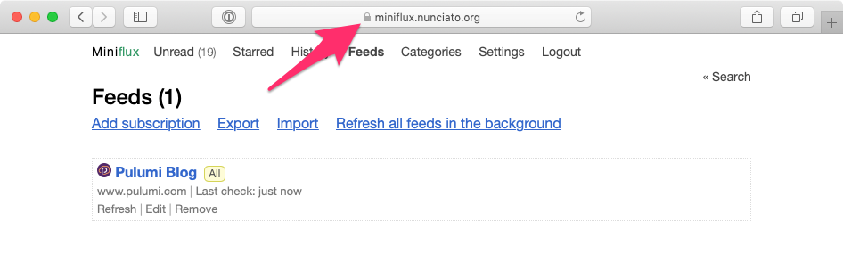

It's been a few years since [Google shut down Google Reader](https://googleblog.blogspot.com/2013/03/a-second-spring-of-cleaning.html), and while a number of nice commercial alternatives have sprung in its wake, none of them has ever been quite the right fit for me personally.

So a while back, after far too much time spent wandering the blogsphere manually, typing URLs into address bars by hand, I decided to go looking to see whether the universe had produced an open-source solution to this problem --- and to my surprise and delight, it had! [Miniflux](https://miniflux.app/) is an excellent little open-source RSS server and reader, written in Go and backed by PostgreSQL, that also happens to be packaged [as a Docker container](https://hub.docker.com/r/miniflux/miniflux). So in this post, I'll show how easy it is to deploy a Miniflux server of your own on AWS, using only Pulumi and a few lines of TypeScript.

<!--more-->

If you're already comfortable with Pulumi, and you just want to get up and running, [I've set up a GitHub repo](https://github.com/pulumi/examples/tree/master/aws-ts-pulumi-miniflux) (complete with a [Deploy with Pulumi button]()!) that should have all you need to get going. Just click the button, set a few configs (like your RSS server's administrative password, which will be stored as an [encrypted Pulumi secret]()), and follow the prompts. Your shiny new server should be up and running within minutes.

## Sketching it Out

First, let's have a look at the app we'll be building. It'll consist mainly of two parts:

* The **Miniflux service**, which runs as a web application and API service, and
* The **Miniflux database**, a PostgreSQL instance whose schema and data are fully managed by the Miniflux service.

As I mentioned, the service is packaged as a Docker container that runs on port 8080 by default, and exposes a number of environment variables we can use to configure it, including:

* `DATABASE_URL`, a PostgreSQL connection string used by the service to communicate with the PostgreSQL database,
* `ADMIN_USERNAME` and `ADMIN_PASSWORD`, which we'll use to sign into the service for the first time, and
* flags for `CREATE_ADMIN` and `RUN_MIGRATIONS`, which denote whether to create the administrative user and run database migrations on startup.

We'll set these properties in the course of developing our program. The service itself, as a container, can easily be run on [AWS Fargate](https://docs.aws.amazon.com/AmazonECS/latest/developerguide/AWS_Fargate.html), so we can use the [`@pulumi/awsx`]() package to declare it, and for the database, we'll use [`@pulumi/aws`]() to provision a small [RDS instance of PostgreSQL](https://docs.aws.amazon.com/AmazonRDS/latest/UserGuide/CHAP_PostgreSQL.html). And finally, to make the Miniflux service publicly accessible (initially over HTTP; we'll switch to HTTPS later), we'll use an AWS [Network Load Balancer](https://docs.aws.amazon.com/elasticloadbalancing/latest/network/network-load-balancers.html), since we'll only need to be able to route traffic by ports and protocols.

Our architecture is therefore shaping up to look something like this:

<div class="my-12">
    
</div>

Let's get started!

## Setting Up

We'll start by creating a new Pulumi project. (If you're completely new to Pulumi, it might be good to begin with our [Getting Started guide](), which walks you through installing Pulumi and configuring it for your cloud provider.) We'll use the built-in `aws-typescript` project template:

```shell
$ mkdir miniflux && cd miniflux
$ pulumi new aws-typescript
```

Once you've stepped through the prompts, you should be left with a minimal `index.ts` file that defines and exports an S3 bucket --- but since we won't be needing an S3 bucket for this project, we can remove that code, and keep only the imports we'll need:

```typescript
import * as pulumi from "@pulumi/pulumi";
import * as aws from "@pulumi/aws";
import * as awsx from "@pulumi/awsx";
```

Now let's define a few configuration values for the project.

## Configuring the Stack

While we could certainly hard-code all of these values into our program, it'd be better to use Pulumi to set them, since doing so give us the option to vary them by [stack]() (say, if we wanted to run this particular app in multiple environments), but more importantly, to set some passwords for the database user and service administrator. So let's do that first, so we'll have them all ready as we develop our program:

```shell
$ pulumi config set db_name miniflux
$ pulumi config set db_username miniflux
$ pulumi config set db_password somesupersecretpassword --secret
$ pulumi config set admin_username admin
$ pulumi config set admin_password anothersupersecretpassword --secret
```

You can change any of these values if you like (and you should definitely change the two passwords, of course), but note that the passwords are set with the `--secret` flag, which encrypts their values using Pulumi's [built-in support for secrets]().

Okay. With our configuration set, we're ready to start building.

## Writing the Code

The Pulumi program we're writing will:

* import our newly created Pulumi configuration, so we can use its values in our program;
* create a new [DB Subnet Group](https://docs.aws.amazon.com/AmazonRDS/latest/UserGuide/USER_VPC.WorkingWithRDSInstanceinaVPC.html) using the default [VPC](https://docs.aws.amazon.com/vpc/index.html) for your region;
* create a new instance of PostgreSQL, with minimal settings, placing it into the subnet group and giving it access to your default [ECS Cluster](https://docs.aws.amazon.com/AmazonECS/latest/developerguide/ECS_clusters.html);
* create a new [Network Listener](https://docs.aws.amazon.com/elasticloadbalancing/latest/network/load-balancer-listeners.html) to define a publicly accessible URL for the Miniflux service;
* create a new Fargate service for the Miniflux app, in your default ECS Cluster, passing it the newly created DB connection and Pulumi config settings; and finally,
* export the URL as a Pulumi stack [Output]() so we can navigate to the service.

Let's get coding!

Replace the contents of `index.ts` with the following code, which comprises the whole program:

```typescript
import * as pulumi from "@pulumi/pulumi";
import * as aws from "@pulumi/aws";
import * as awsx from "@pulumi/awsx";

// Import our Pulumi configuration.
const config = new pulumi.Config();
const dbName = config.require("db_name");
const dbUsername = config.require("db_username");
const dbPassword = config.require("db_password");
const adminUsername = config.require("admin_username");
const adminPassword = config.require("admin_password");

// Get the default VPC and ECS Cluster for your account.
const vpc = awsx.ec2.Vpc.getDefault();
const cluster = awsx.ecs.Cluster.getDefault();

// Create a new subnet group for the database.
const subnetGroup = new aws.rds.SubnetGroup("dbsubnets", {
    subnetIds: vpc.publicSubnetIds,
});

// Create a new database, using the subnet and cluster groups.
const db = new aws.rds.Instance("db", {
    engine: "postgres",
    instanceClass: aws.rds.InstanceTypes.T3_Micro,
    allocatedStorage: 5,
    dbSubnetGroupName: subnetGroup.id,
    vpcSecurityGroupIds: cluster.securityGroups.map(g => g.id),
    name: dbName,
    username: dbUsername,
    password: dbPassword,
    skipFinalSnapshot: true,
});

// Assemble a connection string for the Miniflux service.
const connectionString = pulumi.interpolate `postgres://${dbUsername}:${dbPassword}@${db.endpoint}/miniflux?sslmode=disable`;

// Create an NetworkListener to forward HTTP traffic on port 8080.
const listener = new awsx.lb.NetworkListener("lb", { port: 8080 });

// Create a Fargate service consisting of just one container instance (since that's all we
// really need), passing it the cluster, DB connection and Pulumi config settings.
const service = new awsx.ecs.FargateService("service", {
    cluster,
    desiredCount: 1,
    taskDefinitionArgs: {
        containers: {
            service: {
                image: "miniflux/miniflux:latest",
                portMappings: [
                    listener
                ],
                environment: [
                    { name: "DATABASE_URL", value: connectionString },
                    { name: "RUN_MIGRATIONS", value: "1" },
                    { name: "CREATE_ADMIN", value: "1" },
                    { name: "ADMIN_USERNAME", value: adminUsername },
                    { name: "ADMIN_PASSWORD", value: adminPassword },
                ]
            }
        }
    }
});

// Export the publicly accessible URL.
export const url = pulumi.interpolate `http://${listener.endpoint.hostname}:${listener.endpoint.port}`;
```

With the program in place, we can bring it to life with `pulumi up`:

```shell
$ pulumi up
```

In a few minutes, you should see that Pulumi has created 32 new resources:



And if you examine the logs for this stack using `pulumi logs -f`, you'll see that the database was created, migrations were run, administrative user was created, and the service is now listening:



Finally, looking back at the output of `pulumi up`, you'll see the URL we exported, to which you can navigate, sign in with the administrative user created by our program, and start RSSing:


Excellent! You've now got your very own fully functioning RSS service, created with only a few dozen lines of code.

Technically, we're done --- but there are a couple of things we might like to do to make this project a bit more complete.

## Running on Port 80

Right now, our service's load balancer is configured to listen and forward on the same port, 8080. If we wanted to have the load balancer listen on port 80 (or some other port) instead, we'd need to change its declaration a bit, to create the load balancer and [target group](https://docs.aws.amazon.com/en_pv/elasticloadbalancing/latest/network/load-balancer-target-groups.html) more explicitly. Let's do that:

```typescript
// Create a load balancer, target group and network listener explicitly.
const listener = new awsx.lb.NetworkLoadBalancer("lb")
    .createTargetGroup("group", { port: 8080 })
    .createListener("listener", { port: 80 });
```

Run `pulumi up`, and you'll see that the service is now accessible at a new host and port (though the database was of course left unchanged):



Great! But what if we wanted to run over HTTPS, instead?

## Running over HTTPS

In order to run the Miniflux service over HTTPS, you'll need to have obtained an SSL certificate from [AWS Certificate Manager](https://docs.aws.amazon.com/acm/latest/userguide/acm-overview.html) that corresponds with the domain you plan to use for the service.

Provided you've obtained that certificate, it's defined in the same AWS region as the one you've configured for your Pulumi stack, and you're able to make changes to the DNS records for the domain associated with the certificate, then updating the Pulumi program is easy --- just change the `listener` declaration to use TLS and port 443, and add a `certificateArn` property to apply the certificate:

```typescript
// Run the service over HTTPS, terminating SSL at the load balancer and forwarding to port 8080 on the container.
const listener = new awsx.lb.NetworkLoadBalancer("lb")
    .createTargetGroup("group", { port: 8080, protocol: "TCP" })
    .createListener("listener", { port: 443, protocol: "TLS", certificateArn: "arn:aws:acm:..." });
```

Run `pulumi up` one last time, and you should see your service now running on port 443 --- but you won't be able to access it until you add CNAME record to the DNS settings for your domain (I happen to use Google for mine) mapping a new subdomain to your load balancer's hostname:


And with that, you should now be able to browse your RSS server securely:



## Finishing Up

In this post, we've seen how easy it is to run a container as a service connected to an RDS database with Pulumi, and to expose that container securely on the web. If we wanted, we could go even farther --- we could refactor the program into Pulumi [Components](), perhaps (one for the service, one for the database), package it up for sharing on npm, and so on.

But we'll leave those improvements for another day. For now, let's enjoy what we've created! And start catching up on all that reading we've missed.
