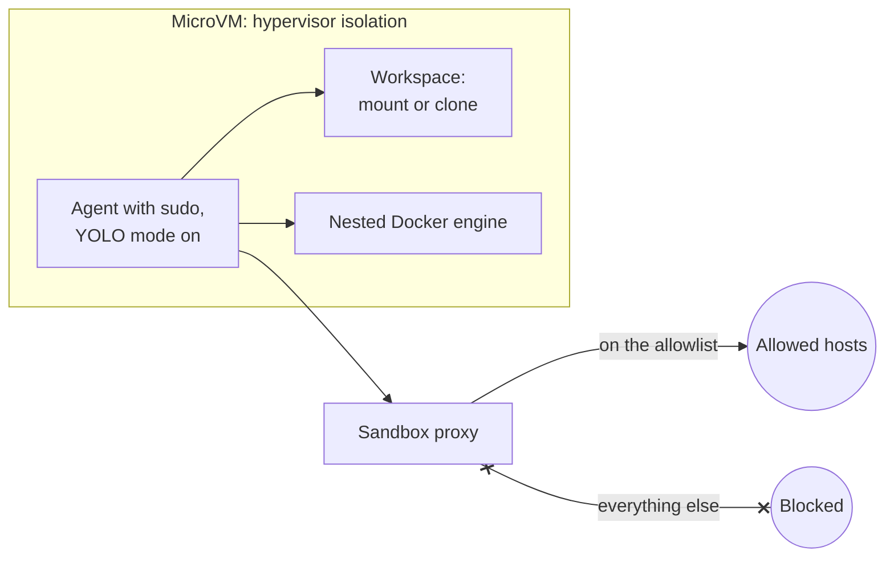

[Claude Code](https://claude.com/claude-code) calls the flag `--dangerously-skip-permissions`, and the community long ago renamed it YOLO mode. It lets your coding agent run any command it wants without ever asking for permission. Every agent has some version of it, [Codex](https://openai.com/codex/) and [Cursor](https://cursor.com) included, and if you use these tools seriously, you are probably running one of them every day. I am.

YOLO mode is also what makes a coding agent worth having. An agent that stops for approval before every command is not autonomous; it's a slow pair programmer. But you cannot let it run wild on your machine without real guardrails either. You have heard the horror stories: wiped databases, deleted home directories, vanished git history. The odds on any given day are low, and it's tempting to conclude it will never happen to you. It only has to happen once.

My version of this problem is worse than most, because the code in my working directory is infrastructure code. My laptop holds more than source files. It holds AWS credentials, kubeconfigs that point at real clusters, and Pulumi access tokens. This post walks through what an unsandboxed agent can actually do, why prompt guardrails fail exactly when you need them, and how a sandbox lets you keep full YOLO-mode autonomy anyway. Then I will show you the kit I built for doing infrastructure work this way.

<!--more-->

## Approving every command is not a security model

Let me get one thing out of the way first: the answer is not to turn YOLO mode off. A real working session involves hundreds of commands, and nobody reviews the hundredth `npm install` any better than the first. You are not evaluating at that point; you are pressing enter. Approval fatigue turns the permission prompt into a formality while destroying the one thing you wanted from the agent, which is that it works while you do something else.

The goal instead is to run YOLO mode somewhere it cannot hurt you. That somewhere is a sandbox: an isolated environment where the agent has full autonomy and your machine is no longer part of the blast radius. This used to be a weekend project involving VM images and network configs. It's now a single command, and I will get to that. First, the risks, because even if you think you know the list, parts of it will probably surprise you.

## What an unsandboxed agent can reach

Start with the file system. Caveats around OS-level permissions exist, but for all practical purposes you should assume that if a file exists on your computer, an agent running directly on it can read that file, edit it, and delete it. Not only in your project. Anywhere.

The same goes for your environment. The agent can kill processes, and it will, most often when it hits a port conflict and decides the fastest way to free port 5432 is to kill whatever is squatting on it. That might be the database another project depends on. It can edit environment variables, and it shares your Docker engine, which means the containers you actually care about are one confused cleanup command away from being pruned.

Then there is the network. Nothing stops an unsandboxed agent from sending an outbound request to any URL. That is precisely what a prompt injection attack needs: the agent reads a poisoned document or issue somewhere, the hidden instructions tell it to collect an API key and POST it to an attacker's endpoint, and the exfiltration looks like any other `curl` in a busy session. An allowlist of reachable hosts is the control that breaks this chain, and almost nobody runs one on their laptop.

And if you do infrastructure work, add the credential files: `~/.aws/credentials`, `~/.kube/config`, cloud CLI session tokens. An agent debugging a provider authentication error will go read those without asking twice. For application code the worst case is a broken machine. For infrastructure code the worst case has an incident number.

## It protests, then it does it anyway

Anyone who runs agents daily has seen versions of the following patterns, and they all share one shape.

Deep in a debugging rabbit hole, options exhausted, the agent decides the dependency tree itself must be the problem and proposes deleting `node_modules` and the lock file to reinstall everything. What is unsettling is not the proposal. It's that the agent protests at first, correctly flagging the operation as risky, and then a single follow-up, "no, go ahead," flips it from refusal to execution. One prompt is the entire distance between "that's too risky" and running the command.

The second pattern is keys. Ask an agent to read a private key from `~/.ssh` and it often does it immediately, no protest at all, even though that folder has nothing to do with the working directory. In the wild this happens while debugging an SSH connection, or in my world, while debugging why `pulumi up` cannot authenticate to AWS.

The third is the database. A bug refuses to be found, the code talks to a database, so the agent concludes the schema must be wrong and rolls back a migration to rebuild it. Sometimes it takes a backup first, unprompted, which is genuinely good judgment. That is exactly the point: the intelligence is real, the precautions are real, and none of it is guaranteed. A precaution the agent takes most of the time is not a safety mechanism.

## Every model has a dumb zone

If a coding agent has ever done something truly destructive to you, odds are it happened late in a long session. For the first couple hundred thousand tokens a model operates near its peak. Push a long troubleshooting session past that, and the instructions from the start of the conversation start losing their grip, system prompt included. The careful guardrails you wrote, here is what you must never touch, here are the risks to keep in mind, fade exactly when the agent is most frustrated and most inclined to reach for last-resort options.

That is the whole argument in one sentence: prompt guardrails degrade with context length, so the protections have to live somewhere the model cannot forget them.

You do not have to take my word for it. The [Claude Code issue tracker](https://github.com/anthropics/claude-code/issues?q=is%3Aissue%20state%3Aopen%20%22rm%20-rf%22) has more than one entry from users whose agent executed `rm -rf` on their home directory. Several were closed as "not planned," which is fair: it's not a bug in the tool. It's what a large language model at the end of its rope sometimes decides to do. Users have also reported a production database wiped by an agent that had been given credentials it never should have held, and an entire git stash dropped by an agent that got confused reconciling branches.

And if you think the people who build infrastructure tooling for a living are immune, this landed in Pulumi's internal Slack two weeks before this post went out:


Read the agent's apology again. It names the fix itself: outside the sandbox. None of these people expected it. That is rather the nature of the thing.

## An isolated VM in one command

[Docker Sandboxes](https://docs.docker.com/ai/sandboxes/) is the first tool I have used that makes sandboxing an agent easier than not sandboxing it. It's free, it runs locally, installation is a single command, and it works with Claude Code out of the box:

```bash
sbx run claude
```

What you get looks like a normal Claude Code session. Under the hood it runs inside a microVM with its own filesystem, its own processes, and its own Docker engine. Run `!ls` and you see your project, mounted into the VM. Run `!ls ~/.ssh` and you get "no such file or directory." The rest of your machine is not there.

You also lose nothing you actually need. Inside the sandbox the agent installs dependencies, starts the dev server, and builds container images against the sandbox's own nested Docker daemon, exactly as it would on the host. The one thing you manage is the network policy: a request to a host that is not on the allowlist comes back as a 403, and not from the server. The sandbox proxy blocked it; the request never left the box. You add hosts to the allowlist deliberately, one decision at a time, and a prompt-injected exfiltration attempt dies at the proxy instead of succeeding quietly.

If the setup commands look like one more thing to learn, skip learning them. Point your agent at the Docker Sandboxes documentation and have it configure its own cage. That is how I set mine up.

And before you trust the walls with real work, test them. My favorite prompt to run in a fresh sandbox: "Before I trust this sandbox, verify the isolation. Can you see any host files, no matter how hard you try? Can you reach a service running on my host? Can you touch the host Docker socket?" The agent will spend a while honestly trying, and the report you want comes back in three lines: host files not visible, host services not reachable, Docker socket is the nested daemon.

## When even the mount is too much

The default `sbx run claude` mounts your current directory into the VM, so the agent edits your real files while everything else stays sealed. If you want complete isolation, add one flag:

```bash
sbx run --clone claude
```

Clone mode copies the codebase and mounts the copy, so nothing the agent does can touch your git history, your stash, or your uncommitted work. The original repo stays visible inside the sandbox at `/run/sandbox/source`, but read-only: the agent can look, not write. For long unattended runs, that is the mode I use.

## The four layers

It helps to see the isolation as four separate layers, because each one answers a different failure story from earlier:



1. **Hypervisor isolation.** The VM boundary is what protects your files and processes. Inside it, the agent runs as a user with sudo, and that is fine; the entire point is that nothing inside the VM matters to your host. When you are done, `sbx rm` deletes the VM and everything in it, so experiments do not accumulate on your disk.
1. **Network isolation.** The proxy and its allowlist decide which hosts the agent can reach. This is the layer that turns prompt injection from a data breach into a log line.
1. **Docker engine isolation.** The sandbox maintains its own daemon and its own set of containers. Your host Docker Desktop stays reserved for the things you actually run, instead of accreting every container an agent ever spun up while testing.
1. **Workspace isolation.** Direct mount when you want the agent editing real files, clone when you want it working on a disposable copy.

## A sandbox that speaks infrastructure

A stock sandbox image is tuned for application work: language runtimes, a package manager, git. Infrastructure work needs more, and I got tired of reinstalling it into every fresh sandbox. So I packaged the whole setup as [infrastructure-sandbox-kit](https://github.com/dirien/infrastructure-sandbox-kit), a Docker Sandboxes template and kit for exactly this job.



It comes preloaded with the [Pulumi CLI](/docs/install/), [Terraform](https://www.terraform.io/), [OpenTofu](https://opentofu.org/), and the AWS, Azure, and Google Cloud CLIs, every binary installed from SHA256-checksummed releases or GPG-signed vendor repositories, because an agent workspace is the last place to be casual about supply chain. On top of the tools sits the agent-side configuration that makes an agent good at infrastructure: 33 skills, including the official [Pulumi Agent Skills](/docs/ai/skills/), three subagents, and two guardrail hooks. Credentials go in through the sandbox proxy's secret injection, so the Pulumi access token never lands in a file inside the workspace for the agent, or a prompt injection, to read.

You can use it two ways: build the full template image, or apply the kit to the stock Claude image at creation time:

```bash
sbx run --kit ghcr.io/dirien/infrastructure-kit:latest claude .
```

Either way you land in a sandbox with starter runbooks waiting in `~/runbooks/`, ready to let an agent do real infrastructure work at full autonomy without holding your laptop hostage.

## The sandbox is half the answer

One boundary this post has deliberately stayed inside: everything here protects your machine. Infrastructure work has a second blast radius, which is what the agent's changes do to your cloud, and a sandbox cannot help you there, because the whole point is that legitimate changes do leave the box. That half of the problem is about previews, policy as code, approvals, and audit trails, and I made that case in [the agent sprawl post](/blog/agent-sprawl-iac-platform-is-the-answer/). The sandbox protects your laptop; the control plane protects production. You want both.

## Watch it happen live

If you would rather see this running than read about it, Docker and Pulumi are teaching it together: a hands-on workshop where we put [Pulumi Neo](/product/neo/), Pulumi's infrastructure coding agent, inside a Docker Sandbox and turn a plain-English request into running infrastructure in a real cloud account, with [Pulumi ESC](/docs/esc/) issuing short-lived cloud credentials instead of static keys. Same session, two time zones:



And if your coding agent has already written its own horror story, come tell me in the [Pulumi Community Slack](https://slack.pulumi.com/). I collect them.
