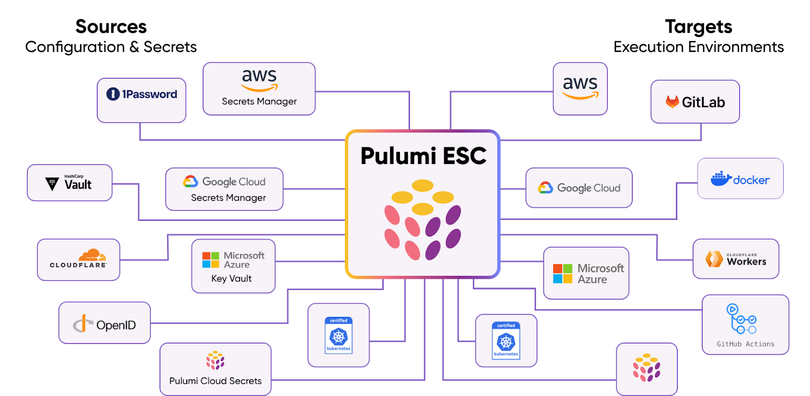

As leadership teams continue to bet big on AI, the tradeoffs between how much to invest and when to expect a reasonable return are ever-present. While exploring scenarios for accelerating this return on investment, organizations are discovering some unique ways to accelerate their AI payback with Platform Engineering.

As innovation and ROI pressures mount, how are savvy tech organizations using Platform Engineering to get more competitive advantage - and perhaps a quantum leap - from their AI investments?

## Changing the Rules of the AI Game

Platform Engineering is transforming how organizations automate, secure and manage their resources - particularly in AI environments that require substantial compute, memory and cloud infrastructure.

### Save Money on Resources

AI’s wide array of disparate technology resources make it an ideal use case for Platform Engineering. Cloud innovators are unifying AI layers, including web frameworks, LLMs, containers, databases, secrets, policies, and configurations, into streamlined Python libraries. Then they leverage these libraries to efficiently manage infrastructure stacks through code.

For example, platform teams can now manage Google Dialogflow, LangChain Llama and other stacks using one platform, and then repurpose these unified resources across projects. Plus, they can author infrastructure as code, using programming languages they know and love, and write statements to define infrastructure using their own IDE’s, with autocomplete, type checking, and documentation. These teams deliver higher quality projects with fewer errors (and better testing), and are frequently happier, more productive, and more innovative.

With this “work smarter, not harder” approach, there’s also less work, as there’s a lot less code required to run infrastructure. In many cases, code can be consolidated by 50% or more, and it can be leveraged across entire organizations without tedious, error-prone copying and pasting.

All these efficiencies combine to reduce cloud, compute and storage costs, so you can re-invest the savings into more AI innovation and/or more scale across your organization.

### Accelerate Time to Market

While speed is a byproduct of these efficiencies, it’s also a key reason to leverage platform engineering for AI. The most recognizable names in the AI industry have many attributes in common, including innovation and speed to market. Many of these leaders leverage Pulumi to achieve this decisive advantage.

Snowflake is a great example of this approach. “There’s no question that, if we had gone down the traditional infrastructure automation route, it would have taken us a week or a week and a half to do one deployment of the cluster, end to end,” said Raman Hariharan, Director of Cloud Platform Engineering. “Plus, that deployment wouldn’t be repeatable, testable or scalable. It would have been a mad scramble to meet our deadline. When we demonstrated to people that what used to take a week and a half now, with [platform engineering], took under a day, they were shocked.” [Read the full Snowflake case study here](https://www.pulumi.com/case-studies/snowflake/).

Pulumi customers regularly rave about their results with platform engineering - many citing 5 to 10X faster time to market. [See more case studies here](/case-studies/).

### Another benefit: more freedom to innovate with more resources

This speed and efficiency also frees up valuable time for engineering staff to work on the creative new projects that drive innovation and new revenue generating applications. By combining generative AI with Pulumi’s insights and knowledge of your entire cloud infrastructure, users are solving a wide array of next-generation cloud development challenges.

Joren McReynolds, VP of Engineering at Panther Labs said, "We are now in the best position to deliver new innovative solutions to our customers and to do so quickly, which is huge for a startup such as ours that needs to accelerate our efforts and to do so efficiently and seamlessly."

To make this process even more efficient, a new AI-driven conversational chat interface called Pulumi Copilot is now integrated throughout Pulumi Cloud, enabling users to quickly accomplish a variety of cloud infrastructure management tasks by leveraging the power of large language models plus the rich capabilities of Pulumi Cloud.

“At Unity Aura we manage hundreds of infrastructure updates per day,” said Eilon Ashkenazi, DevOps Engineer at Unity Aura. “With Pulumi Copilot we can improve the development  process for the team by delivering working reference examples faster and discovery of resources to identify and update infrastructure in production.”

## Dramatically Improve AI Security

Whether it’s cloud settings, API keys, database credentials or VM passwords, AI environments hold a wide variety of secrets, increasing risk, outages, errors and operational friction. Now you can centralize and secure your secrets management using platform engineering best practices within Pulumi. Easily access, share, and manage environments, secrets, and configurations securely on any cloud using your favorite programming languages. Pull and sync with any secrets store, and consume in any application, tool, or CI/CD platform.

Many industry-leading AI technology providers such as Snowflake have already based some of  their competitive differentiation on Pulumi’s unique value. More waves of large organizations are following this example as they navigate their journeys to AI time to market and return on investment.

Learn more about how Pulumi and Platform Engineering can help your organization in the same way it [helped Snowflake speed up its deployment by 10x](/case-studies/snowflake/). Or take a look at [how Aptos Labs achieved 10x faster development cycles](/case-studies/aptos/).

If you are ready to talk to an expert about how platform engineering can help your organization, [click here](/contact/?form=sales). For practitioners on your team, here are some [events and learning assets](/events/) to get up to speed quickly on platform engineering and infrastructure as code.
