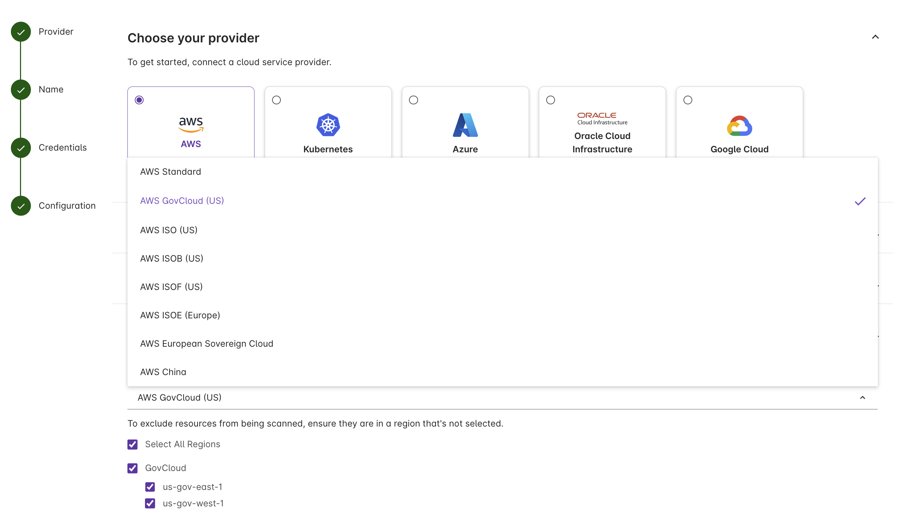

Pulumi Insights account scanning now supports every AWS partition. If your workloads run in GovCloud, China, or one of the intelligence-community clouds, you can get the same resource discovery, cross-account search, and AI-assisted insights that commercial accounts already have.

<!--more-->

## Supported partitions

1. AWS Standard (Commercial)
1. AWS GovCloud (US)
1. AWS China
1. AWS C2S / SC2S (Top Secret / Secret)
1. AWS EU ISOE
1. AWS HCI IC

You can also exclude specific regions from discovery — useful when regions are disabled by SCPs or fall outside an audit's scope.

## Discovery stays inside the partition

Credentials are exchanged against the partition's STS endpoint, and every scanner API call targets that partition's regional endpoints. Discovery traffic doesn't cross the boundary.

## Set it up

In the Pulumi Cloud console:

1. Go to **Accounts → Create account**.
1. Select **AWS** as the provider.
1. Under **Add your configuration**, pick the target partition.
1. Supply credentials via a Pulumi ESC environment. The OIDC trust policy uses the partition-appropriate ARN prefix (`arn:aws-us-gov:`, `arn:aws-cn:`, etc.).

For IAM and ESC setup, see the [Insights accounts docs](/docs/insights/discovery/accounts/). Log in to [Pulumi Cloud](https://app.pulumi.com/) to get started.
