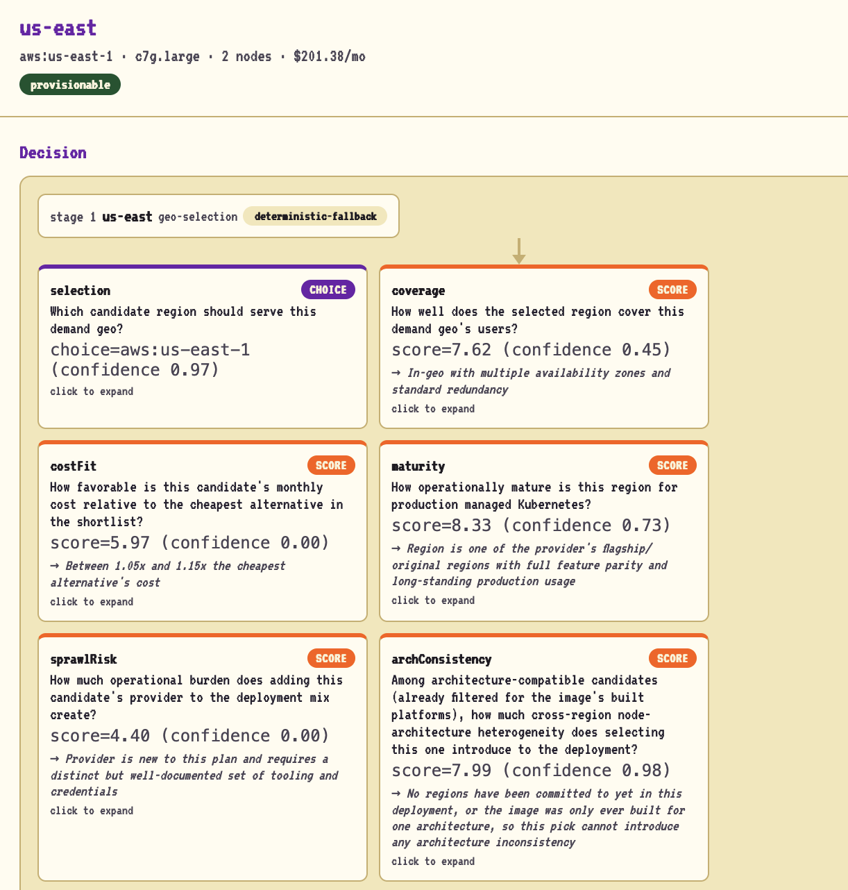
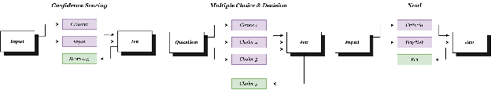

It's been a weirdly great time to be building software. We've never had so many tools that help us get things done: endless cloud providers, regions, deployment frameworks, and now AI agents that can actually build and manage infrastructure for us. That's part of what made this past week feel so big. TypeSafe AI opened early access to Jev, their SystemOne model, and we here at Pulumi were bitten by the excitement bug and got straight to work building.

<!--more-->




Almost immediately we were able to whip up some test agentic workflows that were making real, live decisions about infrastructure. If you're not familiar with [TypeSafe's Jev](https://docs.typesafe.ai/introduction), it comes with a powerful set of AI primitives that let your apps, agents, and workflows make decisions based on context.



*Jev's decision-making primitives are the perfect complement to agentic work.*

When you combine that reasoning power with Pulumi, the gap between dreaming up your ideal infrastructure and deploying it to production practically vanishes.

In the past, having more choices usually meant dealing with more complexity, which added technical debt and inevitably meant someone (perhaps you) spent hours setting things up. Now you can let agents handle provisioning and the day-to-day scaling and reliability decisions while you stay focused on defining how your infrastructure should work.

## Okay, but how does it work?

Our example, [GeoDeploy](https://github.com/pulumi/devx-geodeploy), answers one question: *my users are in these places and I have this container image, so where should it run and what will it cost?* Then it builds the answer.

You give it a deployment request with four parts:

* **Target geos:** where your users are, what share of traffic each place sends, and any data-residency rule (EU-only, US-only, or in-country).
* **An image:** a container image and the platforms it's built for (amd64, arm64, or both).
* **A workload shape:** replicas, CPU and memory per pod, egress, and storage.
* **Constraints:** which providers are allowed, how many providers you'll tolerate, and a budget.

From there, GeoDeploy compares every AWS, Azure, and Google Cloud region that offers managed Kubernetes, picks the best one for each geo, and provisions consistent environments across all three hyperscalers.

### Three systems, three jobs

The design principle that makes this work is a strict division of labor:

| System | Job | Never does |
| :---- | :---- | :---- |
| TypeScript app | Takes in the request, fetches live pricing, does all the math | Make judgment calls |
| Jev | Decides which region wins and which modules to use | Do arithmetic, generate code, or invent region names |
| Pulumi | Provisions clusters, registries, workloads, and DNS | Decide anything |

Here's how a request flows through the pipeline:

1. **Normalize the geos.** Each business region (geo) is mapped to a canonical location and residency class.
1. **Enumerate candidates.** GeoDeploy lists every region with managed Kubernetes and uses great-circle distance as a coverage measure.
1. **Fetch live prices.** Current prices come from the AWS Price List API, the Azure Retail Prices API, and the Google Cloud Billing Catalog, normalized into a single quote format.
1. **Do the math.** Plain, deterministic TypeScript bin-packs pods onto nodes, filters out instance types that don't match the image's architecture, and computes a monthly cost for each candidate.
1. **Decide.** Jev picks the winning region and modules for each geo (more on this below).
1. **Compose.** GeoDeploy assembles a Pulumi program from a curated registry of typed modules: EKS, AKS, or GKE; ECR, ACR, or Artifact Registry; ingress; DNS through Route 53, NS1, or Cloudflare; and observability.
1. **Provision.** The [Pulumi Automation API](/automation/) runs a preview and then an update, with one stack per region. It won't run at all unless your cloud credentials pass readiness checks.
1. **Report.** Every run writes a `plan.json` and `plan.md` with the full decision record, and a web UI shows the deployment on a live globe.

### Why Jev, and not a general-purpose LLM?

Jev doesn't return free text. It returns typed answers with calibrated confidence, through three primitives:

* `choice()` picks one option from a closed list and returns the pick, a probability distribution across all options, and a confidence.
* `score()` rates something against a rubric you describe (GeoDeploy uses 10 levels).
* `noul()` answers a yes/no question with a single probability.

The core rule is that Jev only ever selects from closed sets. It chooses among region IDs that GeoDeploy has already priced and checked. It never writes code or does arithmetic, so a hallucinated `us-west-9` or a made-up Pulumi argument can't happen by construction.

For each geo, GeoDeploy sends Jev a shortlist of up to 40 priced candidates, along with the constraints and the image's architecture. In a single call, it asks for:

* **A selection** (`choice`): which region should serve this geo?
* **Five quality scores** (`score`): coverage, cost fit, maturity, sprawl risk, and architecture consistency.
* **Two hard checks** (`noul`): is data residency satisfied, and is there enough capacity?
* **A fallback** (`choice`): a backup region in case the primary fails at apply time.

Here's what that looks like in `packages/decide/src/questions.ts` (trimmed):

```typescript
import { choice, noul, score } from "@typesafe-ai/sdk";

export function buildStageAQuestions(shortlisted: CandidateCost[]) {
  // "aws:us-east-1" -> { monthlyUsd, distanceKm, azCount, gaStatus, complianceFlags, ... }
  const options = candidateOptions(shortlisted);
  return {
    selection: choice("Which candidate region should serve this demand geo?", options),

    coverage: score("How well does the selected region cover this demand geo's users?", COVERAGE_LEVELS),
    costFit: score(
      "How favorable is this candidate's monthly cost relative to the cheapest alternative in the shortlist?",
      COST_LEVELS,
    ),
    // ...maturity, sprawlRisk, archConsistency

    residencyOk: noul("Does the selected region satisfy the stated data-residency constraint for this demand geo?", {
      true: "The region's jurisdiction and compliance flags fully satisfy the demand geo's residency class ...",
      false: "... or residency cannot be confirmed from the given compliance flags.",
    }),
    // ...capacityOk

    fallback: choice(
      "If the top-ranked candidate becomes unavailable at apply time, which candidate is the best substitute?",
      options,
    ),
  };
}
```

The options passed to `choice()` are the priced candidates themselves, keyed by ID, so Jev literally can't answer with a region that isn't on the list. The rubrics follow TypeSafe's advice to "describe situations, not degrees." Instead of "good coverage," each of the 10 levels is a concrete scenario, running from "Serves users on a different continent with no nearby presence" up to "In-geo with multiple availability zones, directly in or adjacent to the demand geo's primary population center."

The whole question set goes out in one call, along with the state Jev reasons over:

```typescript
const client = new TypeSafeClient();
const resultA = await client.systemOne({ state: toState(stateA), questions: questionsA });
const a = resultA.answers;
// a.selection.choice, a.selection.confidence, a.residencyOk.noul, a.coverage.score, ...
```

The five scores feed a ranking system that runs on weight profiles (latency-optimized by default, plus balanced, residency-first, and failure-domain). Because the weights live in code, we can re-tune the ranking without calling Jev again:

```typescript
// composite = W.cost*norm(costFit) + W.coverage*norm(coverage) +
//             W.maturity*norm(maturity) + W.archConsistency*norm(archConsistency) -
//             W.sprawl*norm(sprawlRisk)
export const WEIGHT_PROFILES: Record<WeightProfileName, CompositeWeights> = {
  "latency-optimized": { cost: 0.13, coverage: 0.48, maturity: 0.17, sprawl: 0.1, archConsistency: 0.12 },
  balanced: { cost: 0.25, coverage: 0.25, maturity: 0.2, sprawl: 0.12, archConsistency: 0.18 },
  "residency-first": { cost: 0.12, coverage: 0.12, maturity: 0.38, sprawl: 0.23, archConsistency: 0.15 },
  "failure-domain": { cost: 0.08, coverage: 0.17, maturity: 0.48, sprawl: 0.15, archConsistency: 0.12 },
};
```

Sprawl risk undermines the good work we've done, so it's subtracted. We're trying to reduce our spend after all, and every extra cloud provider means more credentials, tooling, and on-call runbooks.

A second, smaller set of questions covers the modules. Cluster and registry modules follow directly from the provider (AWS always means EKS and ECR), so Jev is left with the squishy judgment calls that are genuinely open choices: ingress posture, autoscaling posture, and node-pool sizing tier.

### Confidence gates keep the agent contained

The confidence score is how we decide it's safe to let an agent touch production. Every answer is checked against a threshold matched to how risky the decision is:

| Decision | Threshold | If it doesn't pass |
| :---- | :---- | :---- |
| Data residency | 0.95 | Hard reject |
| Region for a new cluster | 0.90 | Top three candidates are flagged for a human to choose |
| Region when a stack already exists | 0.75 | Keep the existing region |
| Ingress or autoscaling module | 0.85 | Use the registry default |
| Node-pool sizing tier | 0.60 | Use the bin-packing result |
| Region pick, residency, or capacity (global floor) | 0.50 | Drop the AI path for that geo |

Enforcing a gate is plain old deterministic code. Here's the residency check from `packages/decide/src/engine.ts`, followed by a validation check that the selection really is one of the candidates:

```typescript
// residencyOk is a hard gate: below 0.95, hard-reject — never soft-fail a
// compliance constraint, even by falling back to the model's own pick.
const residencyGate = applyGate(a.residencyOk.noul, GATE_THRESHOLDS.residencyOk, "residencyOk");
if (!residencyGate.passed) {
  throw new AiPathAborted(
    `residencyOk hard gate failed (${a.residencyOk.noul.toFixed(2)} < ${GATE_THRESHOLDS.residencyOk}); hard-rejecting the AI region selection`,
    stageAAttempt,
  );
}

const chosenId = a.selection.choice;
let chosenCandidate = shortlisted.find((c) => candidateId(c) === chosenId);
if (!chosenCandidate) {
  throw new AiPathAborted(`model selected an unknown candidate id "${chosenId}"`, stageAAttempt);
}
```

Each `AiPathAborted` carries the full attempt (state, questions, and answers), so even a rejected answer ends up in the audit trail.

If a gate check fails, the API times out or returns an error, or the upstream can't be reached, GeoDeploy switches to a deterministic fallback: it compares prices across providers while still enforcing the residency and constraint checks. Run `geodeploy explain` to see why each region won.

### Self-driving mode

When self-driving mode is enabled (`geodeploy monitor`), the agent periodically checks each deployment's CPU utilization and asks Jev one joint question across all regions: `no-change`, `scale-up:<geo>`, `scale-down:<geo>`, or `shift:<from>-><to>`, plus a separate check on disruption risk. Code, not Jev, computes the actual node-count changes. Above 0.85 confidence, the resize is applied automatically. Between 0.70 and 0.85, it's suggested for a human to approve. Below 0.70, GeoDeploy ignores Jev's pick and falls back to a deterministic per-region rule based on the observed utilization.

For builders familiar with the sharp corners of maintaining a reliable service: CPU utilization alone makes a poor autoscaling metric. Once you've established a traffic baseline, it's usually paired with other signals, such as median end-to-end request latency, error rates, or something specific to your application. For our purposes, it's a decent approximation for proving out the test case.

## The power is yours!

From here, the possibilities are quite literally endless for how we could tweak our agentic, self-driving infrastructure, and we're honestly getting dizzy over all the ways we'd like to use Jev internally.

We're releasing GeoDeploy as open source so you can take it and build something of your own. As long as you've got access to Jev and a cloud provider, you can get started today:



Are you currently experimenting with Jev or Pulumi in your infrastructure stack? We'd love to hear about it. [@ us on X at @PulumiCorp](https://x.com/PulumiCorp) and send us a link to what you're building!

Ready to start building your dream infrastructure stack? [Sign up for a free Pulumi account](https://app.pulumi.com/signup) and start shipping today!
