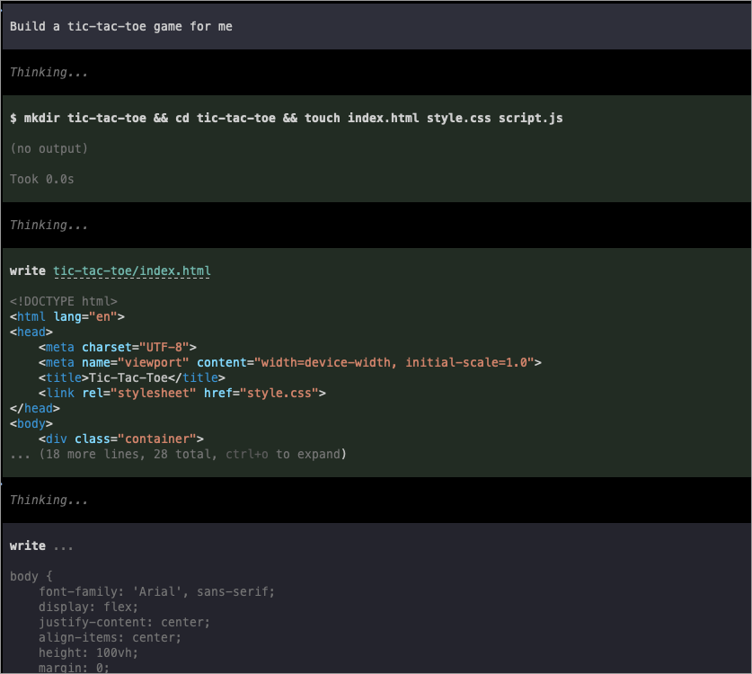

If you run AI tools and agents, you've probably accepted three tradeoffs: your data leaves your network, you can't work offline, and your bill scales with usage.

Open-weight models now run well on consumer hardware. Once the model is on your machine, your data stays local, inference works offline, and tokens cost nothing. If you own a modern Mac, you can run a high-quality model yourself.

<!--more-->

[Gemma 4](https://blog.google/technology/ai/google-gemma-4/) is an open-weights model family from Google. This post focuses on [Gemma 4 12&nbsp;B](https://developers.googleblog.com/gemma-4-12b-the-developer-guide/), released in June 2026, using Unsloth's `Q8_0` [GGUF](https://huggingface.co/docs/hub/en/gguf). The 12&nbsp;B model fits comfortably on a modern Mac while leaving enough headroom for a local server and chat UI.

We'll use `llama.cpp` for host-native inference, `k3d` for a local Kubernetes cluster, Pulumi for infrastructure as code, and Tailscale for secure access.

## Prerequisites

This setup was validated on the following hardware:
- macOS 26.5
- MacBook Pro with Apple M3 Max
- 36 GB RAM

On this machine, `llama.cpp` reported about **20 output tokens per second** for a 160-token validation response with `unsloth/gemma-4-12b-it-GGUF`, `gemma-4-12b-it-Q8_0.gguf`, and a 131,072-token context. Sustained throughput varies by prompt length, thermal state, and server settings.

You'll need `brew`, `docker`, `pulumi`, and `tailscale` installed. We'll also install `k3d` during the process.

## Create a disposable validation folder

Before we start, create a clean workspace to avoid cluttering your system.

```bash
scratch="$(mktemp -d "${TMPDIR:-/tmp}/pulumi-gemma4-blog-qa.XXXXXX")"
mkdir -p "$scratch"/{home,cache,logs,models,repo,stacks,evidence}
cd "$scratch"
```

## Run Gemma 4 with host-native llama.cpp

We use `llama.cpp` directly on macOS to leverage Apple Metal acceleration. Running the LLM on the host is more efficient than trying to pass GPU access into a local Kubernetes VM.

Install the build tools:

```bash
brew install cmake git
```

Then build `llama.cpp` from source and download the multimodal projector. In validation, Homebrew `llama.cpp` 9430 could run text inference, but it could not load the new Gemma 4 12&nbsp;B projector and failed with `unknown projector type: gemma4uv`. Building current `llama.cpp` from source fixed that.

```bash
llm_home="$HOME/pulumi-gemma4-llm"
mkdir -p "$llm_home/models" "$llm_home/logs"

if [ ! -d "$llm_home/llama.cpp/.git" ]; then
  git clone --depth 1 https://github.com/ggml-org/llama.cpp.git "$llm_home/llama.cpp"
fi

cmake -S "$llm_home/llama.cpp" \
  -B "$llm_home/llama.cpp/build" \
  -DGGML_METAL=ON \
  -DGGML_BLAS=ON \
  -DCMAKE_BUILD_TYPE=Release

cmake --build "$llm_home/llama.cpp/build" --target llama-server -j 10

curl -L --fail \
  --output "$llm_home/models/mmproj-F16.gguf" \
  https://huggingface.co/unsloth/gemma-4-12b-it-GGUF/resolve/main/mmproj-F16.gguf
```

Then download and run the model with this command:

```bash
"$HOME/pulumi-gemma4-llm/llama.cpp/build/bin/llama-server" \
  --hf-repo unsloth/gemma-4-12b-it-GGUF \
  --hf-file gemma-4-12b-it-Q8_0.gguf \
  --mmproj "$HOME/pulumi-gemma4-llm/models/mmproj-F16.gguf" \
  --host 127.0.0.1 \
  --port 18080 \
  --ctx-size 131072 \
  --parallel 1 \
  --jinja \
  --reasoning off
```

We use port `18080` because `8080` is commonly used and is likely to conflict with another service you may already have running locally. If your port `8080` is free, you can use it and adjust the Pulumi config later.

The model file is about 12.65 GB, and the projector is about 116 MB. Gemma 4 12&nbsp;B advertises a 131,072-token context, and this Mac loaded that full context with `--parallel 1`. `llama.cpp` projected about 15.1 GiB of Apple Metal device memory for the text model and about 258 MiB worst-case memory for the projector, leaving enough headroom for Open WebUI and the rest of the local stack. The `--reasoning off` flag keeps OpenAI-compatible chat responses visible in clients that do not read separate reasoning fields.

With `--mmproj`, `/v1/models` advertised `capabilities: ["completion","multimodal"]`. In local validation, Open WebUI accepted an uploaded Pulumi logo image and Gemma 4 described it correctly. A small WAV file also worked through the OpenAI-compatible `input_audio` request shape, though `llama.cpp` logs still mark audio input as experimental.

### Verify the LLM API

Open a new terminal and check if the server is responding:

```bash
curl http://127.0.0.1:18080/v1/models
```

The `/v1/models` endpoint should return the model ID `unsloth/gemma-4-12b-it-GGUF`. Now try a chat completion:

```bash
curl http://127.0.0.1:18080/v1/chat/completions \
  -H "Content-Type: application/json" \
  -d '{
    "model": "unsloth/gemma-4-12b-it-GGUF",
    "messages": [{"role": "user", "content": "Reply with exactly: OK"}],
    "temperature": 0,
    "max_tokens": 32
  }'
```

The chat prompt `Reply with exactly: OK` should return content `OK`. In validation, `llama.cpp` reported an output token velocity of about 20 tokens per second for a longer 160-token response.

### Keep llama.cpp running after reboot

For a permanent setup, put the server script and logs under a folder in your home directory and let `launchd` restart it when you sign in:

```bash
llm_home="$HOME/pulumi-gemma4-llm"
mkdir -p "$llm_home/logs" "$HOME/Library/LaunchAgents"

cat > "$llm_home/start-llama-server.sh" <<'EOF'
#!/bin/zsh
set -euo pipefail

export PATH="/opt/homebrew/bin:/usr/local/bin:/usr/bin:/bin:/usr/sbin:/sbin"

exec "$HOME/pulumi-gemma4-llm/llama.cpp/build/bin/llama-server" \
  --hf-repo unsloth/gemma-4-12b-it-GGUF \
  --hf-file gemma-4-12b-it-Q8_0.gguf \
  --mmproj "$HOME/pulumi-gemma4-llm/models/mmproj-F16.gguf" \
  --host 127.0.0.1 \
  --port 18080 \
  --ctx-size 131072 \
  --parallel 1 \
  --jinja \
  --reasoning off
EOF

chmod +x "$llm_home/start-llama-server.sh"

cat > "$HOME/Library/LaunchAgents/com.pulumi.gemma4.llama-server.plist" <<EOF
<?xml version="1.0" encoding="UTF-8"?>
<!DOCTYPE plist PUBLIC "-//Apple//DTD PLIST 1.0//EN" "http://www.apple.com/DTDs/PropertyList-1.0.dtd">
<plist version="1.0">
<dict>
  <key>Label</key>
  <string>com.pulumi.gemma4.llama-server</string>
  <key>ProgramArguments</key>
  <array>
    <string>$llm_home/start-llama-server.sh</string>
  </array>
  <key>WorkingDirectory</key>
  <string>$llm_home</string>
  <key>RunAtLoad</key>
  <true/>
  <key>KeepAlive</key>
  <true/>
  <key>StandardOutPath</key>
  <string>$llm_home/logs/llama-server.out.log</string>
  <key>StandardErrorPath</key>
  <string>$llm_home/logs/llama-server.err.log</string>
</dict>
</plist>
EOF

launchctl bootout gui/$(id -u)/com.pulumi.gemma4.llama-server 2>/dev/null || true
launchctl bootstrap gui/$(id -u) "$HOME/Library/LaunchAgents/com.pulumi.gemma4.llama-server.plist"
launchctl kickstart -k gui/$(id -u)/com.pulumi.gemma4.llama-server
```

Check the service and logs:

```bash
launchctl print gui/$(id -u)/com.pulumi.gemma4.llama-server
tail -f "$HOME/pulumi-gemma4-llm/logs/llama-server.err.log"
```

If you want to stop the background service later, unload it:

```bash
launchctl bootout gui/$(id -u)/com.pulumi.gemma4.llama-server
```

## Deploy Open WebUI with Pulumi and k3d

Now we'll deploy Open WebUI into a local Kubernetes cluster. This provides a polished chat interface that connects to our host-native LLM.

First, install `k3d` if you haven't already:

```bash
brew install k3d
```

Create a new cluster for this project:

```bash
k3d cluster create pulumi-gemma4-blog-qa
```

We'll use the Pulumi program in [`pulumi/examples`](https://github.com/pulumi/examples/tree/master/kubernetes-py-self-host-gemma4-llm). This program defaults to `runtimeMode=host`, which creates a Kubernetes `ExternalName` service pointing to your host machine.

Why not run the LLM inside Kubernetes on this Mac? Pulumi can do that, and the example supports it with `runtimeMode=cluster`, but that path is meant for Linux hosts with NVIDIA or AMD GPU device plugins.

On macOS, [`llama.cpp` enables Metal by default](https://github.com/ggml-org/llama.cpp/blob/master/docs/build.md#metal-build), and Metal acceleration is available to native macOS processes. k3d runs Linux containers through Docker Desktop, so those pods do not get direct access to the Mac's Metal device. Docker's own [vLLM Metal announcement](https://www.docker.com/blog/docker-model-runner-vllm-metal-macos/) calls out the same boundary: Metal-backed inference runs natively on the host because there is no Metal GPU passthrough for containers. That is why this setup keeps inference host-native and lets Pulumi manage the Kubernetes UI, service wiring, and optional Tailscale access around it.

Clone the examples repo, navigate to the program directory, and initialize a new stack:

```bash
git clone https://github.com/pulumi/examples.git
cd examples/kubernetes-py-self-host-gemma4-llm
pulumi stack init gemma4-local
```

Configure the program to match your local setup:

```bash
pulumi config set hostLlmPort 18080
pulumi config set llmBaseUrl http://llm-server:18080/v1
```

The `llm-server` service in Kubernetes maps to `host.k3d.internal`. In our validation, we confirmed that a disposable k3d pod could reach the host LLM at `http://llm-server:18080/v1/models` after a CoreDNS restart.

```bash
kubectl rollout restart deployment coredns -n kube-system
```

Run `pulumi up` to deploy Open WebUI and connect it to your host-native LLM server:

```bash
pulumi up
```

In our validation environment, this command successfully reached the resource synthesis phase without requiring Tailscale credentials because Tailscale exposure is opt-in.

## Access Open WebUI through Tailscale

Tailscale allows you to access your private Open WebUI instance from any device on your tailnet. Note that we only expose the web interface, not the raw LLM API, to keep the system secure.

The base Open WebUI deployment works without Tailscale credentials. To expose the web UI on your tailnet, enable Tailscale resources and provide an explicit `api_key` or OAuth/identity token:

```bash
pulumi config set enableTailscale true
pulumi config set tailscale:apiKey YOUR_API_KEY --secret
```

Once configured, Pulumi will create a Tailscale device or proxy that routes traffic to your Open WebUI service.

## Use the model with Pi

Open WebUI gives you a browser-based chat interface, but local models are also useful from coding agents. Pi can point at the same OpenAI-compatible `llama.cpp` endpoint and use the model running on your Mac.

For a fresh Pi config, create `~/.pi/agent/models.json` with a local provider that points at the `llama.cpp` server:

```json
{
  "providers": {
    "local-llama": {
      "baseUrl": "http://127.0.0.1:18080/v1",
      "api": "openai-completions",
      "apiKey": "local",
      "compat": {
        "supportsDeveloperRole": false,
        "supportsReasoningEffort": false
      },
      "models": [
        {
          "id": "unsloth/gemma-4-12b-it-GGUF",
          "name": "Gemma 4 12B Q8 (local llama.cpp)",
          "reasoning": false,
          "input": ["text"],
          "contextWindow": 131072,
          "maxTokens": 1024,
          "cost": {
            "input": 0,
            "output": 0,
            "cacheRead": 0,
            "cacheWrite": 0
          }
        }
      ]
    }
  }
}
```

Then set Pi to use that provider and model by default in `~/.pi/agent/settings.json`:

```json
{
  "defaultProvider": "local-llama",
  "defaultModel": "unsloth/gemma-4-12b-it-GGUF",
  "defaultThinkingLevel": "off",
  "hideThinkingBlock": true
}
```

If you already have Pi configuration files, merge the `local-llama` provider and defaults into your existing JSON instead of replacing the files.



## Advanced: Linux GPU in-cluster serving

If you're running on a Linux server with an NVIDIA or AMD GPU, you can run the LLM directly inside the Kubernetes cluster. This requires the NVIDIA or ROCm device plugins.

The Pulumi program supports this through `runtimeMode=cluster`. In this mode, it deploys a `LlmServer` pod that manages the `llama.cpp` process within the cluster, using GPU resource requests to ensure hardware acceleration.

## Cleanup

When you're done, you can tear down the resources:

```bash
pulumi destroy
k3d cluster delete pulumi-gemma4-blog-qa
# Stop the llama-server process using the PID from your terminal
kill <PID>
```
