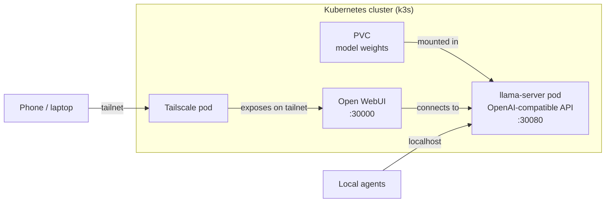
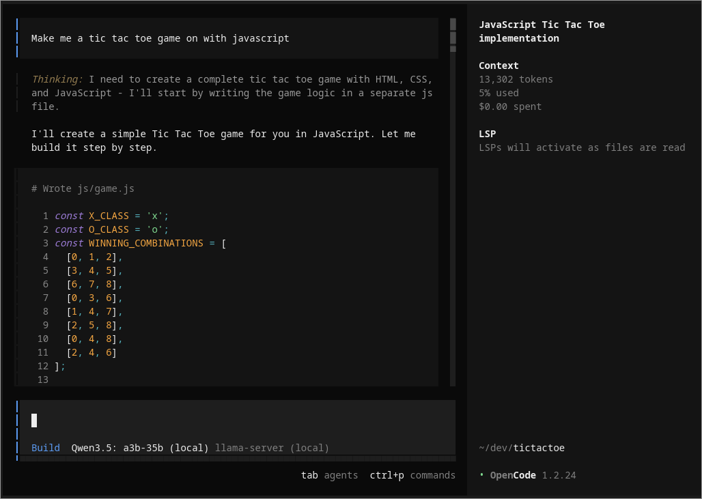

If you run any kind of AI tools and agents, you have probably accepted three tradeoffs: your data leaves your network on every request, you cannot work if your connection drops, and your bill scales with usage no matter how much hardware you already own.

Many open-weight models now run well on consumer GPUs. Once the model is on your machine, your data stays local, inference works offline, and tokens cost nothing. If you already own a compatible machine, you can run a model yourself.

<!--more-->

This post walks through a Kubernetes deployment on a Linux home server. It was tested on a Ryzen 9 5950x with 32 GB DDR4 and an RTX 3080 10 GB, which is high-end 2020 consumer hardware comparable to a mid-range build today. If your rig is in the same ballpark, this setup will likely work for you. If you are on a Mac with an M-series chip, you can run the same model locally with [mlx-lm](https://github.com/ml-explore/mlx-lm) instead.

[Qwen 3.5](https://qwen.ai/blog?id=qwen3.5) is an Apache 2.0-licensed model family from Alibaba. The 35B-A3B variant uses a Mixture-of-Experts (MoE) architecture that activates only 3 billion parameters per token. Thanks to quantized [GGUF](https://huggingface.co/docs/hub/en/gguf) models, models that would normally require datacenter hardware fit on consumer GPUs with acceptable quality loss.

The full 35B-parameter model fits in around 22 GB at Q4_K_M precision, and llama.cpp can split layers between GPU VRAM and system RAM so you do not need all of that in VRAM.

In this post we will set up a complete self-hosted inference stack with a single `pulumi up`: [llama.cpp](https://github.com/ggerganov/llama.cpp) serving an OpenAI-compatible API, [Open WebUI](https://github.com/open-webui/open-webui) for a browser chat interface, and [Tailscale](https://tailscale.com/) for secure access from any device on your tailnet, all orchestrated on a local [k3s](https://k3s.io/) Kubernetes cluster.

## Architecture overview



## GPU and model sizing

The table below shows sizes for the [unsloth/Qwen3.5-35B-A3B-GGUF](https://huggingface.co/unsloth/Qwen3.5-35B-A3B-GGUF) quantizations. The total memory column is the combined VRAM + system RAM needed to run the model. llama.cpp splits model layers between GPU VRAM and system RAM automatically, so any GPU that supports CUDA or ROCm will help accelerate inference.

| Quantization | File size | Total memory needed |
|---|---|---|
| Q3_K_S | 15.3 GB | ~17 GB |
| Q4_K_M | 22 GB | ~22 GB |
| Q6_K | 28.9 GB | ~30 GB |

This walkthrough defaults to **Q4_K_M** because it delivers strong quality while fitting on widely available consumer hardware. Both NVIDIA and AMD GPUs work; adjust the `gpuVendor` config value for your hardware.

With [community-recommended llama.cpp parameters](https://www.reddit.com/r/LocalLLaMA/comments/1rg4zqv/followup_qwen3535ba3b_7_communityrequested/) (`--fit-target`, `-fa on`, `--no-mmap`, `-ctk q8_0`, `-ctv q8_0`), the reference hardware (RTX 3080 10 GB) achieves around 600 tok/s prompt processing and 45 tok/s generation. These flags are already configured in the Pulumi program.

If your machine has less RAM or a smaller GPU, you can try a smaller quantization of the same model (for example, Q3_K_S at 15.3 GB), or switch to a smaller model like the 7B or 14B variants. You can swap the `model` and `modelFile` config values to try a different variant without changing any code.

[llmfit](https://github.com/AlexsJones/llmfit) detects your CPU, RAM, and GPU, then tells you exactly which models and quantizations will run on your machine before you download anything:

```bash
curl -fsSL https://llmfit.axjns.dev/install.sh | sh
llmfit
```

## Prerequisites

Before you start, make sure you have:

- An NVIDIA or AMD GPU with drivers installed
  - **NVIDIA**: `nvidia-smi` should work
  - **AMD**: `amd-smi` should work, plus ROCm drivers with `/dev/kfd` and `/dev/dri` present
- A local Kubernetes cluster. We will use [k3s](https://k3s.io/):

  ```bash
  curl -sfL https://get.k3s.io | sh -

  # k3s writes its kubeconfig to a root-owned path; copy it so
  # kubectl and pulumi can access the cluster without sudo
  mkdir -p ~/.kube
  sudo cp /etc/rancher/k3s/k3s.yaml ~/.kube/config
  sudo chown $USER ~/.kube/config
  ```

- GPU support in k3s. For **NVIDIA**, install the [NVIDIA Container Toolkit](https://docs.nvidia.com/datacenter/cloud-native/container-toolkit/latest/install-guide.html), then configure the runtime for k3s. Create `/etc/rancher/k3s/config.yaml`:

  ```yaml
  nvidia-container-runtime-path: /usr/bin/nvidia-container-runtime
  default-runtime: nvidia
  ```

  Then configure containerd, restart k3s, and install the device plugin:

  ```bash
  # Configure the NVIDIA runtime for k3s's embedded containerd
  sudo nvidia-ctk runtime configure --runtime=containerd \
    --config=/var/lib/rancher/k3s/agent/etc/containerd/config.toml.tmpl

  # Restart k3s to pick up the new runtime
  sudo systemctl enable --now k3s

  # Install the NVIDIA device plugin
  kubectl apply -f https://raw.githubusercontent.com/NVIDIA/k8s-device-plugin/v0.17.0/deployments/static/nvidia-device-plugin.yml
  ```

  For **AMD**, install [ROCm drivers](https://rocm.docs.amd.com/projects/install-on-linux/en/latest/) first. Verify with `rocminfo` and confirm `/dev/kfd` and `/dev/dri` are present. Then apply the [device plugin](https://github.com/ROCm/k8s-device-plugin):

  ```bash
  kubectl apply -f https://raw.githubusercontent.com/ROCm/k8s-device-plugin/master/k8s-ds-amdgpu-dp.yaml
  ```

  Verify your GPU is visible to Kubernetes:

  ```bash
  # NVIDIA
  kubectl get nodes -o jsonpath='{.items[0].status.capacity.nvidia\.com/gpu}'

  # AMD
  kubectl get nodes -o jsonpath='{.items[0].status.capacity.amd\.com/gpu}'
  ```

  Either command should output `1` (or the number of GPUs you have). If it is empty, check that your GPU device plugin pod is running.

- [Pulumi CLI](/docs/iac/download-install/) and Python 3.9+:

  ```bash
  curl -fsSL https://get.pulumi.com | sh
  ```

- A [Tailscale account](https://login.tailscale.com/start) (free tier works)

## The Pulumi program

Create a new project:

```bash
mkdir self-host-llm && cd self-host-llm
pulumi new python --name self-host-qwen-llm
```

Copy the [example program](https://github.com/pulumi/docs/tree/master/static/programs/self-host-qwen-llm-python) into the project directory. Git does not natively support cloning a single folder, so the command uses sparse checkout to avoid downloading the entire repository:

```bash
git clone --depth 1 --filter=blob:none --sparse \
  https://github.com/pulumi/docs.git /tmp/pulumi-docs
git -C /tmp/pulumi-docs sparse-checkout set static/programs/self-host-qwen-llm-python
cp /tmp/pulumi-docs/static/programs/self-host-qwen-llm-python/* .
rm -rf /tmp/pulumi-docs
```



### How it works

The program is split into two files: `__main__.py` orchestrates the full stack, and `llm_server.py` defines a reusable [ComponentResource](/docs/iac/concepts/resources/components/) that encapsulates the LLM inference server.

#### The LlmServer component

`LlmServer` bundles a PVC, an init container that downloads model weights, the llama-server deployment, and a service into a single reusable component. GPU vendor maps to the right resource key and container image, so switching between NVIDIA and AMD is one config change:

```python
GPU_RESOURCE_KEYS = {
    "nvidia": "nvidia.com/gpu",
    "amd": "amd.com/gpu",
}

LLAMA_SERVER_IMAGES = {
    "nvidia": "ghcr.io/ggml-org/llama.cpp:server-cuda",
    "amd": "ghcr.io/ggml-org/llama.cpp:server-rocm",
}
```

The init container uses `uvx` to run `huggingface_hub` without baking it into a custom image. The download is idempotent, so it skips files already on the PVC:

```python
init_containers = [
    k8s.core.v1.ContainerArgs(
        name="download-model",
        image="ghcr.io/astral-sh/uv:python3.12-bookworm-slim",
        command=["sh", "-c",
            f"uvx --from huggingface_hub hf download {model} {download_files} "
            + f"--local-dir {model_dir}",
        ],
        volume_mounts=models_mount,
    ),
]
```

All llama.cpp flags are assembled from config values passed to the constructor, so you can override context size, thread count, or sampling parameters per stack without editing the component:

```python
config = pulumi.Config()
model = config.get("model") or "unsloth/Qwen3.5-35B-A3B-GGUF"
model_file = config.get("modelFile") or "Qwen3.5-35B-A3B-Q4_K_M.gguf"
context_size = config.get_int("contextSize") or 65536

llm = LlmServer(
    "llm",
    model=model,
    model_file=model_file,
    port=llm_port,
    gpu_vendor=gpu_vendor,
    context_size=context_size,
    # ...
)
```

#### Adopting the Tailscale ACL

The Tailscale ACL is a global singleton per tailnet. It cannot be created or deleted, only updated. The program uses [`import_`](/docs/iac/concepts/options/import/) to adopt the existing ACL into state on first `pulumi up`, and [`retain_on_delete`](/docs/iac/concepts/options/retainondelete/) to prevent `pulumi destroy` from trying to delete it:

```python
ts_acl = tailscale.Acl(
    "tailnet-acl",
    acl=pulumi.Output.json_dumps({
        "tagOwners": {
            "tag:llm-server": ["autogroup:admin"],
        },
        "acls": [
            {
                "action": "accept",
                "src": ["autogroup:member"],
                "dst": ["*:*"],
            },
        ],
    }),
    opts=pulumi.ResourceOptions(
        import_="acl",
        retain_on_delete=True,
    ),
)
```

Without these options, destroy+up cycles would fail with a "precondition failed" 412 error.

#### Open WebUI and Tailscale networking

Open WebUI connects to the LLM server via its cluster-internal URL and disables authentication since it is only reachable through the tailnet.

The Tailscale deployment runs as a separate pod that joins your tailnet and forwards traffic to Open WebUI's ClusterIP. An init container enables IP forwarding, and the main container authenticates using a Pulumi-managed auth key. `TS_DEST_IP` is wired directly to the Open WebUI service's cluster IP using a Pulumi output, so the value is always correct even if Kubernetes reassigns it:

```python
k8s.core.v1.ContainerArgs(
    name="tailscale",
    image="ghcr.io/tailscale/tailscale:latest",
    env=[
        k8s.core.v1.EnvVarArgs(
            name="TS_AUTHKEY",
            value_from=k8s.core.v1.EnvVarSourceArgs(
                secret_key_ref=k8s.core.v1.SecretKeySelectorArgs(
                    name="tailscale-auth",
                    key="TS_AUTHKEY",
                ),
            ),
        ),
        k8s.core.v1.EnvVarArgs(name="TS_HOSTNAME", value=hostname),
        k8s.core.v1.EnvVarArgs(
            name="TS_DEST_IP",
            value=webui_service.spec.cluster_ip,
        ),
        # ...
    ],
)
```

Any device on your tailnet can reach the chat interface at `http://<hostname>:30000` without exposing anything to the public internet.

Configure the Tailscale provider:
- Generate an API key from [Settings > Keys](https://login.tailscale.com/admin/settings/keys)
- Find your tailnet name under [Settings > General](https://login.tailscale.com/admin/settings/general)

```bash
pulumi config set tailscale:apiKey tskey-api-XXXXX --secret
pulumi config set tailscale:tailnet your-tailnet-name
```

## Deploy

If you are using an AMD GPU, set the vendor before deploying:

```bash
pulumi config set gpuVendor amd
```

The program defaults to `Qwen3.5-35B-A3B-Q4_K_M.gguf`. To use a different quantization, for example:

```bash
pulumi config set modelFile Qwen3.5-35B-A3B-Q6_K.gguf
```

Run the deployment:

```bash
pulumi up
```

Pulumi shows a preview of all resources it will create. Confirm with `yes`. The first run takes several minutes as the init container downloads the model weights into the PVC.

Once the stack is up, verify llama-server is running:

```bash
curl http://localhost:30080/v1/models
```

You should see your model listed. Try a completion:

```bash
curl http://localhost:30080/v1/chat/completions \
  -H "Content-Type: application/json" \
  -d '{
    "model": "unsloth/Qwen3.5-35B-A3B-GGUF",
    "messages": [{"role": "user", "content": "What is infrastructure as code?"}],
    "max_tokens": 200
  }'
```

Then open `http://localhost:30000` in your browser to access Open WebUI. Select the Qwen model from the model dropdown and start chatting.

## Connect your agents

Any tool that supports the OpenAI API format works out of the box. Point it at your llama-server endpoint:

```bash
export OPENAI_BASE_URL=http://localhost:30080/v1
export OPENAI_API_KEY=not-needed
```

Some examples:

- **[OpenClaw](https://github.com/openclaw/openclaw)**: connect your WhatsApp, Telegram, or Discord to your self-hosted model
- **[OpenCode](https://opencode.ai/)**: terminal-based coding agent with local LLM support


## Access from your phone

Install the [Tailscale app](https://tailscale.com/download) on your phone. Once connected to your tailnet, open the URL from `pulumi stack output tailscale_webui_url` in your mobile browser. Open WebUI works well on mobile and gives you a ChatGPT-like interface backed by your own hardware. For a native app experience, try [Conduit](https://apps.apple.com/us/app/conduit-openwebui-client/id6749840287) ([Android](https://play.google.com/store/apps/details?id=app.cogwheel.conduit)), an Open WebUI client for iOS and Android.



## Conclusion

After following this guide you have:

- An OpenAI-compatible API running on your own GPU via llama.cpp
- A browser-based chat UI accessible from any device on your tailnet
- Tailscale ACLs which allow only you to access the service
- Persistent model storage that survives pod restarts
- Everything running on a local Kubernetes cluster you control

If you outgrow your local GPU, the same Pulumi program can be adapted to target a cloud Kubernetes cluster. Swap your kubeconfig for a managed K8s service with GPU nodes and `pulumi up` again.


