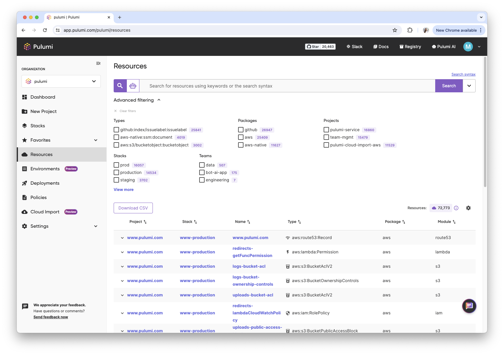

We are excited to introduce two powerful new features for our Self-Hosted Pulumi Cloud offering: Resource Search and Pulumi Deployments. These two additions are the most significant features added to Pulumi Cloud in the last year and we are thrilled to bring them to our self-hosted customers. Resource Search and Pulumi Deployments both improve the way you can manage and deploy your cloud infrastructure, providing greater visibility, control, and automation.

Alongside these features, we are also introducing today a [Self-Hosted Changelog](/docs/pulumi-cloud/self-hosted/changelog), a log of all relevant changes that self-hosted customers should be aware of.

## Self-Hosted Pulumi Cloud Overview

Self-Hosting is available in the Pulumi Business Critical edition of Pulumi Cloud, you can try it out with [our 30 day trial](/product/self-hosted). This allows organizations to run the Pulumi Cloud within their own environments, ensuring data control, compliance, and customizability. While Pulumi manages all aspects of its SaaS offering (Pulumi Cloud), Self-Hosted Pulumi Cloud requires customers to handle data backups, service maintenance, and updates.

Here’s a deep dive into what the new features offer and how they can benefit your organization:

## Resource Search: Find and Analyze Your Cloud Resources with Ease

Pulumi Resource Search offers multi-cloud search and analytics across every resource in your organization. You can issue queries that find all of your AWS VPCs, or all of your VPCs in AWS and VNets in Azure, or all resources with the “production” tag across all cloud environments. You also have access to statistics about cloud usage, including a breakdown by cloud provider, resource type, and department. Resource search enables you to find the needle within your cloud haystack and visualize cloud consumption trends.

### Key Features

- **Multi-Cloud Search:** Query resources across various cloud environments.
- **Advanced Filtering:** See top stacks, projects, providers, teams, and types by resource count.
- **Resource Search API:** Integrate search functionality into your internal systems using the Search API.
- **Search from the CLI:** Issue resource search queries from within the terminal without needing to change contexts.
- **Data Export:** Export resource data for further analysis in your data warehouse.

Get more details on these features in our [Resource Search documentation](/docs/pulumi-cloud/insights/#pulumi-insights). For more information on how to enable it in your self-hosted instance read the [self-hosted Resource Search documentation](/docs/pulumi-cloud/self-hosted/components/search).

## Pulumi Deployments: Automate and Manage Your Infrastructure with Ease

Pulumi Deployments is engineered to streamline infrastructure management tasks with a focus on scalability, automation, and control. This platform allows cloud engineers and platform teams to execute infrastructure actions such as previews, updates, destroys, and refreshes directly within Pulumi’s managed service. By bundling deployment settings like source code, cloud credentials, and environment variables into a single unit, Pulumi Deployments eliminates the complexities of stack management. Users can trigger deployments via Git events, through the Pulumi Cloud UI or leverage REST APIs for custom workflows, providing the flexibility to efficiently transition from code to cloud. In addition, customers using Pulumi Deployments can set up [Drift Detection and Remediation](/docs/pulumi-cloud/deployments/drift), the ability to get notified when the state of your resources changes unexpectedly and optionally remediate it, as well as [Time to Live Stacks](/docs/pulumi-cloud/deployments/ttl), the ability to set a expiration on a stack when it will be destroyed.

### Key Features

- **Git Push to Deploy:** Automatically deploy infrastructure changes with each git push.
- **Click to Deploy:** Deploy infrastructure with a single click from the Pulumi console.
- **REST API:** Integrate Pulumi deployments with your applications using the REST API.
- **Automation API:** Automate infrastructure provisioning and management with Pulumi's Automation API.
- **Drift Detection:** Identify and rectify configuration drift in your deployed stacks.
- **Time to Live Stacks:** Automatically destroy stacks after a specified time period.
- **Scheduled Deployments:** Schedule deployments to occur at specific times.
- **Review Stacks:** Review and approve stack changes before deployment.

Get more details on these features in our [Pulumi Deployments documentation](/docs/pulumi-cloud/deployments). For more information on how to enable it in your self-hosted instance read the [self-hosted Pulumi Deployments documentation](/docs/pulumi-cloud/self-hosted/components/api/#deployments).

## Self-Hosted Changelog

The Self-Hosted Changelog is a newly introduced page that provides a comprehensive log of updates and changes specifically relevant to our self-hosted customers. This changelog ensures customers are fully informed about the latest improvements, bug fixes, and new features in the codebase and associated infrastructure. By keeping up-to-date of these updates, self-hosted customers can better manage their systems, anticipate and resolve potential issues, and take advantage of new functionalities as soon as they become available. Some examples of the types of recent updates on the changelog are adding support for expiration dates on access tokens or adding the ability to enable OTel metrics. This transparency not only helps in maintaining an optimal system but also empowers customers with the knowledge needed to leverage the full potential of our platform.

## Wrapping It Up

The addition of Resource Search and Pulumi Deployments to our Self-Hosted Pulumi Cloud offering empowers you to manage your cloud resources more effectively and ensure the stability of your infrastructure. Whether you are looking to gain insights into your cloud usage or automate the detection and correction of configuration drift, these features provide the tools you need to succeed.

As of today, all Pulumi Cloud features that have been made generally available are supported in the self-hosted version. We intend to continue to have parity with Pulumi Cloud features in the self-hosted version within 6 months of making the feature generally available.

Try these new features today and experience the enhanced capabilities of the Self-Hosted Pulumi Cloud. For more information or to start a 30-day trial, contact us or visit our [self-hosting documentation](/docs/pulumi-cloud/self-hosted).
