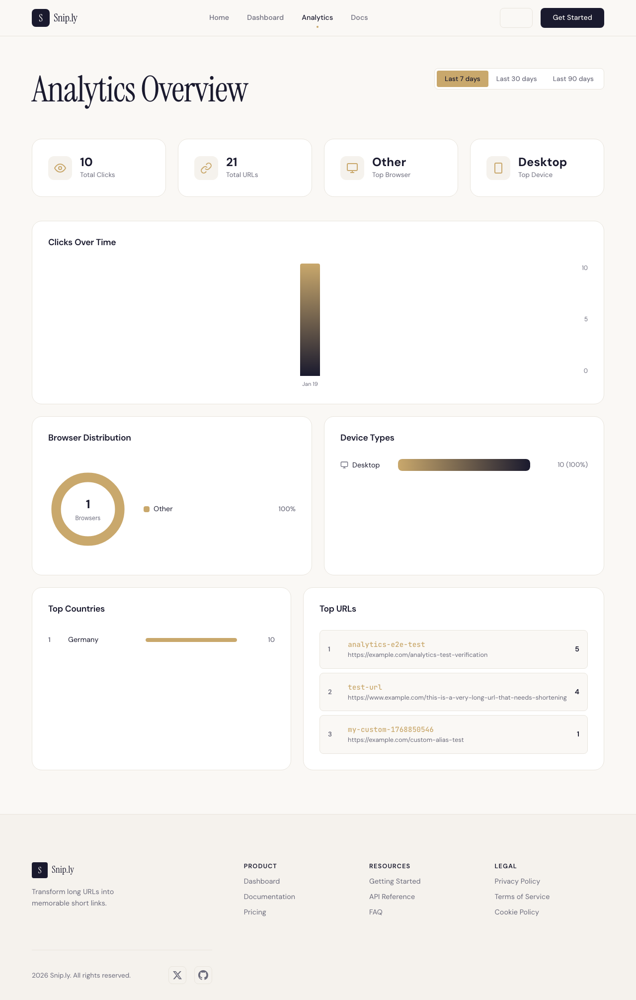

In my [previous post about the Ralph Wiggum technique](/blog/how-ralph-wiggum-built-a-serverless-saas-with-pulumi/), Claude Code built a complete serverless URL shortener on AWS. The setup included [Playwright MCP](https://github.com/microsoft/playwright-mcp) for end-to-end testing. It worked. But I kept wondering if there was something better for AI-driven browser automation. Then Vercel released [agent-browser](https://github.com/vercel-labs/agent-browser), and I had to try it.

<!--more-->

## Why browser automation matters for AI coding

When an AI coding agent builds a frontend, someone has to verify it works. Without browser automation, that someone is you. The AI finishes and says "done," but you can't trust that claim until you open a browser and click around yourself.

Browser automation changes this. The AI verifies its own work. It builds a component, launches a browser, tests the interaction, confirms behavior matches expectations. If something breaks, it fixes the code and tests again. The validation loop runs without you.

This matters more as AI agents take on larger tasks. A quick component fix might not need automated testing. But when an agent builds an entire dashboard from scratch, you need proof that the deployed application actually works.

## The context problem with browser automation

Playwright MCP gives you powerful browser control, but it comes with overhead. Every screenshot, every DOM snapshot, every accessibility tree adds tokens to your context window. [GitHub issue #889](https://github.com/microsoft/playwright-mcp/issues/889) documents a 6x token increase between versions 0.0.30 and 0.0.32. Users report single screenshots consuming over 15,000 tokens. Some exhausted their entire five-hour token allocation in just a few automation steps.

The problem is verbose output. Full accessibility trees contain every element on the page with all their properties. Console message logging adds more. Each piece of information might be useful for debugging, but together they overwhelm the context window.

This creates a frustrating tradeoff. You want rich browser interaction for thorough testing, but that richness costs tokens. Fewer tokens means fewer iterations before hitting limits.

## Vercel's "less is more" philosophy

Vercel ran into something similar with their D0 text-to-SQL agent. [Their research](https://vercel.com/blog/we-removed-80-percent-of-our-agents-tools) documents what happened when they reduced tool complexity.

The original architecture used 17 specialized tools. Each tool handled one specific operation: create tables, insert rows, run queries, validate schemas. The approach seemed logical. Specialized tools should produce better results than general ones.

The numbers told a different story. With 17 tools, they got 80% success (4 out of 5 queries), averaging 274.8 seconds and ~102,000 tokens. The worst case took 724 seconds, burned 145,463 tokens, and still failed.

Then they rebuilt with just two tools: ExecuteCommand and ExecuteSQL. Success jumped to 100%. Average execution dropped to 77.4 seconds (3.5x faster). Token usage fell to ~61,000 (37% reduction). The worst case took 141 seconds, used 67,483 tokens, and succeeded.

Vercel's takeaway: "We were constraining reasoning because we didn't trust the model to reason." Fewer tools meant the model could think more freely about how to accomplish tasks. The simplicity reduced confusion and context waste.

## Applying "less is more" to browser automation

agent-browser takes the same approach. Instead of separate tools for clicking, typing, scrolling, and navigating, it has a unified CLI with one clever idea: the snapshot + refs system.

When you request a page snapshot, agent-browser returns something like this:

```text
- button "Sign In" [ref=e1]
- textbox "Email" [ref=e2]
- textbox "Password" [ref=e3]
- link "Documentation" [ref=e4]
```

Those `@e1`, `@e2` references are stable element identifiers. To click the sign-in button, you run `click @e1`. No CSS selectors. No XPath expressions. No waiting for the DOM to stabilize. The reference points to that exact element.

This cuts out the verbosity of full accessibility trees. You get just enough information to understand the page structure and interact with elements. The AI can reason about what it sees without drowning in metadata.

## Installing agent-browser

Setup is simple:

```bash
npm install -g agent-browser && agent-browser install
```

This installs the CLI and downloads a bundled browser. You don't need to install any additional browsers.

For Claude Code integration, install the official skill from the agent-browser package. You can either copy it from node_modules:

```bash
cp -r node_modules/agent-browser/skills/agent-browser .claude/skills/
```

Or download it directly:

```bash
mkdir -p .claude/skills/agent-browser
curl -o .claude/skills/agent-browser/SKILL.md \
  https://raw.githubusercontent.com/vercel-labs/agent-browser/main/skills/agent-browser/SKILL.md
```

The skill gives Claude Code better context than just running `agent-browser --help`.

Unlike Playwright MCP, there's no server configuration. Agent-browser runs as a standalone CLI that Claude Code invokes directly through bash.

## The experiment: adding analytics

I wanted a realistic test scenario, so I added an analytics dashboard to the [url-shortener-saas](https://github.com/dirien/url-shortener-saas) project from my previous post. The feature tracks click events with metadata (browser, device, country, referrer) and displays them through interactive charts.

This follows the same "Ralph Wiggum" workflow from my previous post: write a `feature-prompt.md` that describes what you want, then let Claude Code implement, deploy with Pulumi, and verify with browser automation. Here's a snippet from the feature prompt:

```markdown
## Backend Requirements

### New DynamoDB Table: Analytics Events

Create a new DynamoDB table `url-shortener-analytics-{stack}` with:
- Partition Key: shortCode (String)
- Sort Key: timestamp (String, ISO 8601 format)
- Attributes: browser, deviceType, country, referrer, etc.

### New Lambda: analytics.ts

GET /api/analytics/{shortCode}
- Returns timeline, browsers, devices, countries, referrers
- Query params: from, to, granularity

## Success Criteria

1. `pulumi up` deploys successfully without errors
2. All existing E2E tests still pass
3. New analytics E2E tests pass
4. Charts render with real data after generating test clicks
```

Claude Code reads this, writes the Lambda handlers, updates the Pulumi infrastructure code, and deploys. The infrastructure changes are straightforward:

```typescript
// Analytics events table
const analyticsTable = new aws.dynamodb.Table("analytics-table", {
  name: `${projectName}-analytics-${stack}`,
  billingMode: "PAY_PER_REQUEST",
  hashKey: "shortCode",
  rangeKey: "timestamp",
  attributes: [
    { name: "shortCode", type: "S" },
    { name: "timestamp", type: "S" },
  ],
  globalSecondaryIndexes: [{
    name: "by-date",
    hashKey: "shortCode",
    rangeKey: "timestamp",
    projectionType: "ALL",
  }],
});
```

After `pulumi up` succeeds, the agent needs to verify the deployed feature works. That's where browser automation comes in. The feature prompt specifies verification requirements:

```markdown
## End-to-End Verification

After deployment, use the `/agent-browser` skill to verify:
1. Analytics link appears in navigation
2. Analytics page loads without errors
3. Charts render (timeline, browser, device, geographic)
4. URL-specific analytics work from dashboard
5. Click data appears after generating test clicks
```



The test suite covered six scenarios: homepage load, URL shortening, dashboard view, analytics navigation, analytics overview, and date filter functionality. Nothing fancy, just the basics you'd want to verify after deploying.

I ran the exact same tests with both Playwright MCP and agent-browser to see how much context each consumed.

## Agent-browser workflow in practice

Here's what the CLI interaction looked like during my test run.

Navigate to the deployed application:

```bash
$ agent-browser open https://d1232drths1aav.cloudfront.net
✓ Snip.ly - Modern URL Shortener
  https://d1232drths1aav.cloudfront.net/
```

Snapshot to see available elements (the `-i` flag filters to interactive elements only):

```bash
$ agent-browser snapshot -i
- link "S Snip.ly" [ref=e1]
- link "Home" [ref=e2]
- link "Dashboard" [ref=e3]
- link "Analytics" [ref=e4]
- link "Docs" [ref=e5]
- button "Switch to dark mode" [ref=e6]
- link "Get Started" [ref=e7]
- textbox "Paste your long URL here..." [ref=e8]
- button "Shorten URL" [ref=e9]
```

That entire homepage snapshot is 896 characters. Playwright MCP returned 8,247 characters for the same page.

Fill the URL input and click the shorten button:

```bash
$ agent-browser fill @e8 "https://example.com/agent-browser-e2e-test"
✓ Done

$ agent-browser click @e9
✓ Done
```

Each action confirmation is 12 characters. Playwright MCP returns the full page state after every click - 12,891 characters when I clicked the shorten button.

Navigate to analytics:

```bash
$ agent-browser click @e4
✓ Done

$ agent-browser wait --load networkidle && agent-browser snapshot -i
✓ Done
- link "S Snip.ly" [ref=e1]
- link "Home" [ref=e2]
- link "Dashboard" [ref=e3]
- link "Analytics" [ref=e4]
- button "Last 7 days" [ref=e8]
- button "Last 30 days" [ref=e9]
- button "Last 90 days" [ref=e10]
- link "1 analytics-e2e-test https://example.com/analytics-test-verification 5" [ref=e11]
- link "2 test-url https://www.example.com/this-is-a-very-long-url... 4" [ref=e12]
```

The analytics snapshot shows date filter buttons and top URLs with click counts. 876 characters versus Playwright MCP's 4,127.

Test the date filter:

```bash
$ agent-browser click @e9
✓ Done

$ agent-browser screenshot analytics-30-day-filter.png
✓ Screenshot saved to analytics-30-day-filter.png
```

The ref-based workflow is deterministic. Each command operates on a specific element from the snapshot. No guessing about selectors.

## The numbers: 82.5% context reduction

Same six tests, both tools:

| Metric | Playwright MCP | Agent-Browser | Reduction |
|--------|---------------|---------------|-----------|
| Total response characters | 31,117 | 5,455 | **82.5%** |
| Largest single response | 12,891 | 2,847 | **77.9%** |
| Average response size | 3,112 | 328 | **89.5%** |
| Homepage snapshot | 8,247 | 896 | **89.1%** |
| Dashboard snapshot | 12,891 | 2,847 | **77.9%** |

The difference is what each tool returns after every action.

Playwright MCP returns the full accessibility tree after every click:

```yaml
### Page state
- Page URL: https://d1232drths1aav.cloudfront.net/dashboard
- Page Title: Snip.ly - Modern URL Shortener
- Page Snapshot:
- generic [ref=e2]:
  - banner [ref=e3]:
    - generic [ref=e4]:
      - link "S Snip.ly" [ref=e5] [cursor=pointer]:
        - /url: /
        - generic [ref=e6]: S
        - generic [ref=e7]: Snip.ly
      - navigation [ref=e8]:
        - link "Home" [ref=e9] [cursor=pointer]:
          - /url: /
          - text: Home
        ...
[12,891 characters continues...]
```

Agent-browser returns:

```text
✓ Done
```

12 characters versus 12,891 for the same button click.

Six tests consumed ~31K characters with Playwright MCP versus ~5.5K with agent-browser. At roughly 4 characters per token, that's ~7,800 tokens versus ~1,400. An AI agent could run 5.7x more tests in the same context budget.

## What I noticed

Past the numbers, working with agent-browser felt different in ways that are hard to quantify.

The compact snapshots changed the rhythm of iteration. A typical page fit in a few hundred tokens instead of thousands, so Claude Code could run more test cycles before hitting limits. I spent less time worrying about context and more time actually testing.

Element refs removed a frustration I'd had with Playwright. CSS selectors break when someone changes a class name or restructures the DOM. With agent-browser, a button is just `@e9`. It doesn't care about styling. That predictability was a relief.

What worked well:

- Snapshots stay small enough that you don't think about them
- Refs mean no selector debugging
- The CLI just works with Claude Code's bash tool
- No MCP server to configure

Agent-browser is early. Documentation is thin, and I read the source more than once to figure out edge cases.

Where I hit friction:

- Modals that appear after API calls needed manual wait logic
- Playwright's waiting mechanisms are more mature
- Hidden or dynamically loaded elements sometimes didn't show up without explicit waits

For my URL shortener tests, agent-browser used fewer tokens per cycle, and the ref-based approach was more predictable than selector-driven automation.

Playwright MCP still wins on depth. Network interception, multi-tab handling, PDF generation, better waiting logic—if you need those, you need Playwright. For complex browser automation, it's the more capable tool.

## When to use each

**Agent-browser** fits long autonomous sessions where context budget matters, basic navigation and verification tasks, and setups where you want to skip MCP configuration. CLI-based skills also avoid the schema overhead—tool definitions for multi-tool MCPs eat tokens even when idle.

**Playwright MCP** fits when you need the advanced stuff: network interception, PDF generation, multi-tab workflows, or sophisticated synchronization. It's also the right choice if you have existing Playwright test suites. If the full MCP schema feels heavy, [Playwright skills](https://github.com/lackeyjb/playwright-skill) offer a lighter wrapper.

Start with agent-browser for AI validation loops. Move to Playwright when you outgrow it.
