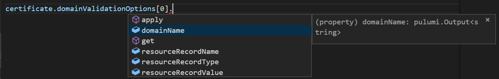

Pulumi allows cloud developers to use programming languages like
JavaScript, TypeScript and Python to define and deploy cloud
infrastructure and applications. To do this, Pulumi exposes a notion of
[Outputs]()
that track how the outputs of one cloud resource are used and
transformed as part of creating another cloud resource.

These `Output` types are heavily used in many Pulumi application. They
are the way that Resources expose their values and are commonly used to
pass values from one Resource to another. `Outputs` are also a key part
of how Pulumi tracks dependencies between resources. In fact, Outputs
are similar to promises/futures that you may be familiar with from other
programming models but also carry along dependency information.

We've heard a lot of feedback about how Outputs can lead
otherwise-simple code to become hard to write and reason about. So we've
looked into what we can do to significantly simplify the experience
working with Outputs - making the user experience simpler while
maintaining the rich dependency tracking and type checking that Pulumi
has always provided for cloud infrastructure.

#### Simplifying Outputs

In 0.17.0 of the `@pulumi/pulumi` package, we've made most common
patterns for working with Outputs much simpler.

Prior to this release of `@pulumi/pulumi` package, it was fairly common
to have to write code like the following:


const cert = new aws.acm.Certificate("cert", {
    domainName: "example.com",
    validationMethod: "DNS",
});

const certValidation = new aws.route53.Record("cert_validation", {
    records: [cert.domainValidationOptions.apply(domainValidationOptions => domainValidationOptions[0].resourceRecordValue)],
    ttl: 60,
    type: cert.domainValidationOptions.apply(domainValidationOptions => domainValidationOptions[0].resourceRecordType),
});


In particular, creating the aws.route53.Record involves a fair amount of
complexity with those arrow functions. i.e.:


    records: [cert.domainValidationOptions.apply(domainValidationOptions => domainValidationOptions[0].resourceRecordValue)],
    ttl: 60,
    type: cert.domainValidationOptions.apply(domainValidationOptions => domainValidationOptions[0].resourceRecordType),
    zoneId: zone.apply(zone => zone.id),


Yikes! This is so verbose, it doesn't even fit on the width of the page!

The idea of the `.apply` function is similar to `Promise.then`. It
allows one to pass a piece of code that will be applied to the
underlying value once it becomes available (after the corresponding
cloud resource is created or updated) and will return an `Output` that
then points to the transformed underlying value. Importantly, the new
`Output` will still track dependency information properly. In the above
example the `aws.route53.Record` will know that it depends on `cert`,
even though the Certificate resource is not itself passed directly do
the constructor.

Unfortunately, while `.apply` gives a lot of power and flexibility, it
is also somewhat verbose and clunky for describing such a simple
concept. Fortunately, we found a way to improve the situation greatly.
This realization came about from great work done in our Python package.
First, before diving into the low level details, let's first see what
the above code would now look like in 0.17.0:


const certValidation = new aws.route53.Record("cert_validation", {
    records: [cert.domainValidationOptions[0].resourceRecordValue],
    ttl: 60,
    type: cert.domainValidationOptions[0].resourceRecordType,
    zoneId: zone.id,
});


That's a lot nicer than before! The following improvements happened:

1. There's no more callbacks!
2. There's no need for a repetitive lambda parameter (which might
   conflict with some other name in scope).
3. The code is just pure simple idiomatic JavaScript/TypeScript that
   clearly conveys its intent.

Importantly, no information has been lost here. The exact same
dependency information flows along here like it did before. And, thanks
to TypeScript's flexible type system, the above is totally typesafe and
will let you know the right types of things and will still error if you
happen to make mistakes.

So, how was this done? Well, the core part of the change is thanks to a
little-known feature of JavaScript:
[Proxies](https://developer.mozilla.org/en-US/docs/Web/JavaScript/Reference/Global_Objects/Proxy).

JavaScript proxies allow libraries to return objects that intercept and
override many facets of how JavaScript works at runtime. There are many
things a Proxy lets you control, however for our needs the most
important bit was that it allows you to override how member-lookup
works. In other words, when the code contains `someProxy.someMember` the
proxy actually gets a chance to determine what should happen and what
someMember should actually return! With that flexible interception point
available, we actually took our core Output type and made it into a
Proxy. We then added the right interception code so that if the code
contains someOutput.someMember that that gets translated exactly into
`someOutput.apply(o => o.someMember)`.

This also works just fine for array-accesses (which are just
property-lookups from JavaScript's perspective). In other words, at
runtime, the member-lookup form and the `.apply` form will be equivalent
(except that the former is so much nicer to write!). This is why, for
example,
`certCertificate.domainValidationOptions[0].resourceRecordValue` will
have the correct value (with all the right dependency information). At
runtime it really will be equivalent to the original
`certCertificate.apply(certCertificate => certCertificate.domainValidationOptions[0].resourceRecordValue)`
form.

Now, while this was fairly easy to get working at runtime from a
JavaScript perspective, it was a little more challenging to figure out
how to make this work in TypeScript's typing system. For example, if you
had a value like so:

```javascript
const cert: Output<{ domainValidationOptions: pulumi.Output<{ domainName: string, resourceRecordName: string, resourceRecordType: string, resourceRecordValue: string }[]> }>;
const firstOption: Output<{ domainName: string, resourceRecordName: string, resourceRecordType: string, resourceRecordValue: string }> = cert[0];
const domainName = firstOption.domainName;
```

Then how does TypeScript know that `cert` should have a property on it
called `domainValidationOptions`? And how can it know that
`domainValidationOptions` can be indexed into? And how would it know
that once indexed, that `Output` would have a `domainName` property?
Clearly, these are all `Outputs`. Yet, each `Output<...>` has a
different set of properties exposed off of it!

To do this required taking advantage of some very interesting and
advanced parts of TypeScript's type system. If this is a part of
TypeScript that interests you, or you just want to see how we did this,
you can dive in deep into the source
[here](https://github.com/pulumi/pulumi/blob/7d7e104ee3184d1244ea3517ab5cae5f52170dba/sdk/nodejs/output.ts#L624-L631)!
And, if you want to see how we did the actual runtime Proxy work, that
code is self-contained
[here](https://github.com/pulumi/pulumi/blob/7d7e104ee3184d1244ea3517ab5cae5f52170dba/sdk/nodejs/output.ts#L220-L282).
Thanks to TypeScript's advanced type-system, these types can be properly
expressed and the entire tooling ecosystem understands them. For
example, in VSCode, if you try to write code like the above, you'll see
all the expected properties with the expected types:



## Conclusion

We definitely hope these changes to `@pulumi/pulumi` in 0.17.0 will make
the programming experience simpler and smoother for many common use
cases. And, if you've ever wanted to do some fancy tricks like what
we're doing here, these updates can show you how you too can approach
some of these advanced techniques for both JavaScript and TypeScript!
