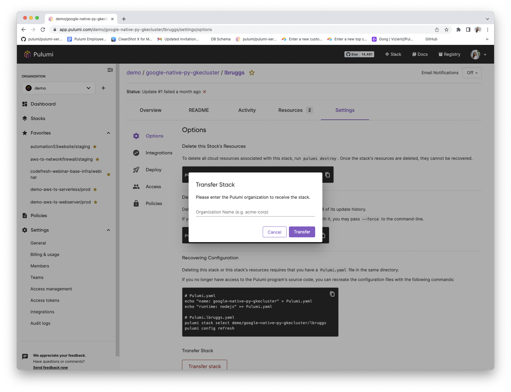
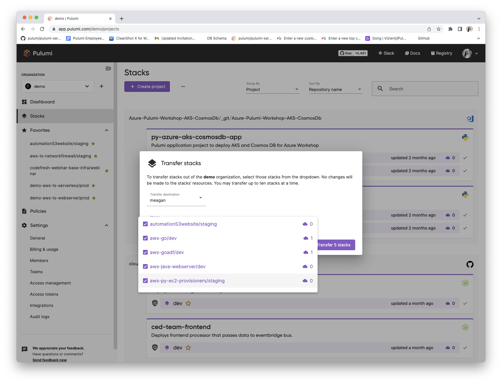
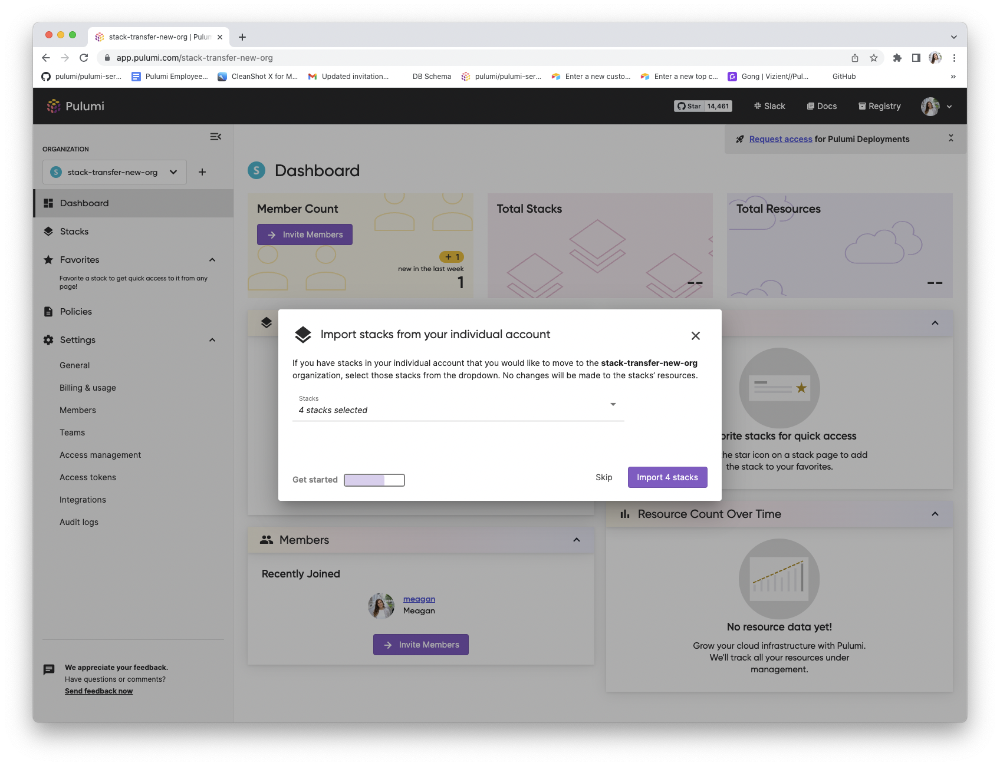

Exactly 3 years ago we added support in the [Pulumi Service](/product/pulumi-service) to transfer stacks from an Individual account to a Pulumi organization and between Pulumi organizations. We heard from customers that they love this feature but found it both hard to discover and tedious when moving a large workload from one organization to another and from Individual accounts to organizations. We are excited to announce bulk stack transfer to address this feedback and a new organization set up wizard to improve discovery of the feature.

<!--more-->

Let’s review how bulk stack transfers can be used and when you would use them. Stack transfers relocate a stack between organizations and Individual accounts. Let’s highlight some use cases:

- **Use case #1: Individual account to a collaborative organization:** We know that users are building projects in Individual accounts and want to easily move their stacks to an organization so they can collaboratively build infrastructure with others.
- **Use case #2: Organization to Individual account:** There may be instances where users want to take a stack from an organization into their Individual org. This could be due to mistakenly creating a stack in the wrong location.
- **Use case #3: Organization to organization:** As customers scale there may be use cases where they want to add additional organizations and being able to transfer stacks in bulk will help with this.

### Transferring one stack

To transfer a specific stack, you can navigate to that stack and then go to Settings > Transfer Stack. To transfer a stack, you need to be either the Stack Admin or an Organization Admin. For organizations on the Pulumi Enterprise or Business Critical Editions, an audit log will be produced each time a stack is transferred and it records which organization the stack was transferred to.

### Transferring multiple stacks

To transfer multiple stacks, you can navigate to the Stacks page and then click the `...` icon beside the ‘Create a Project’ button in a collaborative organization and the `Transfer stacks` button in an Individual account. In order to transfer multiple stacks you need to be an Organization Admin. For organizations on the Pulumi Enterprise or Business Critical Editions, an audit log will be produced each time a stack is transferred and it records which organization the stack was transferred to.

### Bringing stacks into new organizations

We recently added a new organization setup wizard that will walk you through inviting members, importing stacks and setting your preferred cloud and language when you create a new organization. This compacts common usage patterns into one place to make it easier for you.

See it in action!

Learn more in the [Stack Transfer documentation](/docs/pulumi-cloud/projects-and-stacks/#transferring-stacks). Please submit an issue in the [Pulumi Service Requests repo](https://github.com/pulumi/pulumi-cloud-requests/issues/new?assignees=&labels=kind%2Fenhancement&template=feature-request.md) if you have feature requests for the Pulumi Service or [join our Slack channel](https://slack.pulumi.com) if you have questions.

Until next time!
