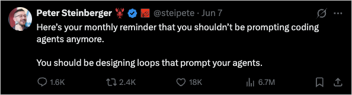

For about two years, the unit of work with a coding agent was the prompt. You wrote a good one, you gave it enough context, you read what came back, and you wrote the next one. The agent was a tool, and you were holding it the entire time, one turn after another.

That part is ending. [Addy Osmani](https://x.com/addyosmani), a director of AI at Google Cloud, has a name for what replaces it, and I have not stopped thinking about it since: [loop engineering](https://x.com/addyosmani/status/2064127981161959567). You stop being the person who prompts the agent. You design the loop that prompts it for you.

In my phrasing: you stop being the thing that runs, and start designing the thing that runs. The leverage moves up a layer. What I want to do here is take an honest look at the pieces, and at the part nobody automates.

<!--more-->

## The leverage moved up a layer

The people building these tools have already made the jump. [Peter Steinberger](https://x.com/steipete) has been posting it as a monthly reminder.

<figure>
    
    <figcaption><em>Peter Steinberger (<a href="https://x.com/steipete">@steipete</a>) on X.</em></figcaption>
</figure>

[Boris Cherny](https://x.com/bcherny), who heads Claude Code at Anthropic, says the same thing about his own job. He does not prompt Claude anymore. He has loops running that prompt Claude and decide what to do next, scanning the issue tracker, the team chat, and the timeline for what to build. "My job is to write loops."

A loop is a goal that prompts itself. You set the purpose, and the system keeps iterating until it's met. In practice it finds the work, hands it out, checks the result, writes down what got finished, and decides the next thing, then it pokes the agent instead of you. You build that small system once and let it run.

Look closer, and a loop is really two loops nested. The inner one does the work against a spec. The outer one decides what the work should be: it watches an issue tracker, an error feed, a changelog, then writes the next spec and hands it down. Most people are still running that outer loop by hand, in their head, and calling it a backlog.

The part that surprised me is that this is barely a tooling problem anymore. A year ago a loop meant a pile of bash you wrote and maintained forever. Now the pieces ship inside the products, and the same shapes show up in Claude Code and in Codex. Osmani puts loop engineering one floor above the harness, the context and tooling you wire around a single agent. I wrote about [that harness](/blog/stop-tuning-prompts-build-a-harness/) a couple of weeks ago. The loop is the thing that runs on top of it: it runs on a timer, it spawns helpers, and it feeds itself.

## The five pieces, and the one that holds them together

Strip loop engineering down and you get roughly five building blocks, plus one place to remember things. Both Claude Code and Codex have all five now. The names differ here and there; the capability is the same.

1. **Automations are the heartbeat.** They are what make a loop an actual loop and not one run you did once. A prompt or command on a cadence, a scheduled task, a hook that fires at a point in the agent's lifecycle, or a job on CI that keeps running after you close the laptop. Discovery and triage run themselves, and the findings that matter come to you.
1. **Worktrees keep parallel from turning into chaos.** The second you run more than one agent, the files start colliding. Two agents writing the same file is the same headache as two engineers committing to the same lines with nobody talking first. A git worktree is a separate working directory on its own branch, so one agent's edits cannot touch another's checkout.
1. **Skills are intent, written down.** An agent starts every session cold and fills any hole in your intent with a confident guess. A skill is that intent written on the outside: the conventions, the build steps, the "we don't do it like this because of that one incident," recorded once where the agent reads it every run. Without skills, the loop re-derives your whole project from zero every cycle.
1. **Connectors let the loop touch your real tools.** Built on MCP, they let the agent read the issue tracker, query a database, hit a staging API, or drop a message in chat. This is the difference between an agent that says "here is the fix" and a loop that opens the pull request, links the ticket, and pings the channel once CI goes green.
1. **Sub-agents keep the maker away from the checker.** The model that wrote the code is far too generous grading its own homework. A second agent with different instructions, and sometimes a different model, catches the things the first one talked itself into. Worktrees and a cold-context reviewer are two pieces I have [written about before](/blog/parallel-coding-playbook-for-pulumi/), back when the question was running agents in parallel without them trampling each other.

Then the sixth thing: memory. A markdown file, a Linear board, a state file, anything that lives outside the single conversation and holds what is done and what is next. It sounds too dumb to matter, and it's the whole game. The model forgets everything between runs, so the memory has to live on disk, not in the context window. The agent forgets. The repo does not.

## What makes a loop hold together

A loop running unattended is also a loop making mistakes unattended. The one thing that keeps it honest is verification, and verification needs an oracle, something outside the model that returns a hard yes or no. Passing tests, a clean build, a green pipeline, a real production signal. Without an oracle, the loop compounds confidently wrong work, faster than you can read it.

The cleanest version of this already ships in the tools. Claude Code's `/goal` keeps working across turns until a condition you actually wrote holds, something like "every test in `auth/` passes and lint is clean," and after every turn a separate, faster model reads the transcript and decides whether you are there yet. The agent that wrote the code is not the one that grades it. That is the maker-and-checker split applied to the stop condition itself. Codex's `/goal` reaches the same finish line a different way: the agent audits its own work against the evidence before it can call the goal done.

## What the loop still won't do for you

The loop changes the shape of the work. It does not take it off your desk. And a few things get sharper as the loop gets better, not softer.

**Verification is still on you.** The split reviewer is what makes "it's done" mean something, but "done" is a claim, not a proof. Your job is still to ship code you confirmed works, which is harder to remember when the diff arrived while you were at lunch.

**The bill comes in two currencies.** Tokens and attention. A single unattended run can burn through millions of tokens, and that is only worth it when the tokens buy something worth more than they cost. The quieter trap is the second currency: memory is what lets a loop compound over time, and slop compounds right alongside it. A loop pointed at a vague goal does not get tired and stop. It gets faster.

**Your understanding rots if you let it.** The faster the loop ships code you did not write, the wider the gap between what exists in the repo and what you actually understand. A smooth loop grows that gap faster, not slower, unless you read what it made. The comfortable posture, where you stop having an opinion and take whatever the loop gives back, is the risky one. Two engineers can build the exact same loop and get opposite results, one moving faster on work they understand deeply, the other avoiding the work entirely. The loop cannot tell which one you are.

## When the loop reaches production

Most of this thinking grew up around application code, where a bad run costs you a revert. When the loop reaches into infrastructure, the blast radius is a production outage rather than a revert, and the verification bar has to rise to meet it. The upside is that infrastructure hands the loop a better oracle than application code does. A plan diff is deterministic and machine-readable, a policy check returns a hard verdict, and drift and cost are numbers you can put a threshold on. A reviewer, whether human or agent, can read the change cold, with no memory of the prompt that produced it. That cold-context check is exactly what an unattended loop needs, and it's the reason an infrastructure loop can be built to hold together while you sleep. [Pulumi Neo reasons over the state graph directly](/blog/grounded-ai-why-neo-knows-your-infrastructure/), so the checker grounds every claim in what the change actually does, not in what the writer says it does.

## Where to start

Pick the loop you can actually trust first. In order:

1. **Start where "done" is unambiguous.** CI triage, dependency bumps, a flaky-test hunt, a failing job you keep re-running by hand. Loops need an oracle, so begin where the oracle already exists.
1. **Write the memory file before the loop.** One markdown file, or a board. What is done, what is next, what was tried and failed. This is the spine, and everything else hangs off it.
1. **Split the checker from the maker.** Use `/goal` with a verifiable condition, or a second agent with its own instructions. Never let the agent that did the work be the one that decides the work is finished.
1. **Cap it, then read everything.** A max-iteration count, a token budget, a teardown step. Run it once, end to end, then read every line it shipped. The first run is the measurement, not the payoff.

Then look at what you built. You designed it once, and it ran without you steering each step. That is the real shift. But the leverage only holds if you wire the loop like an engineer, not like someone looking for permission to stop thinking. Read what it ships. Keep an opinion. Judgment is the one part that does not move up a layer.

The loop will do the typing. The thinking is the work.


