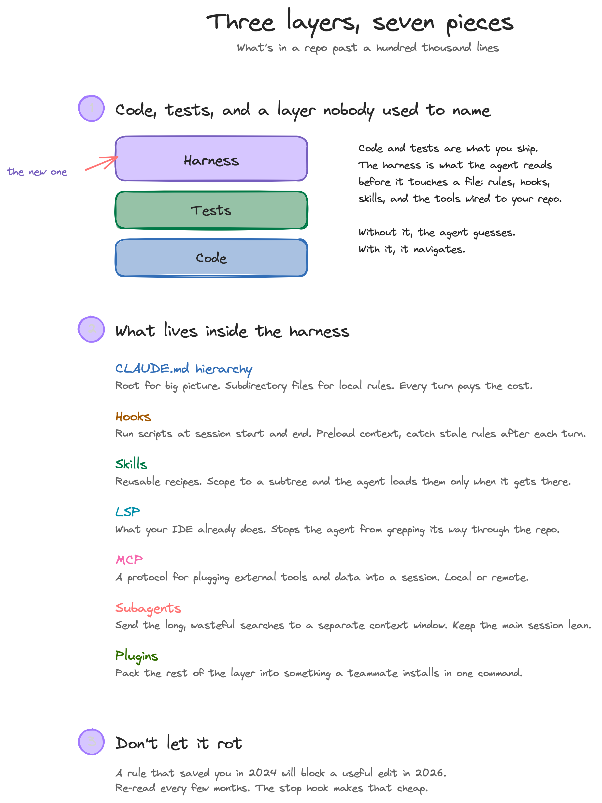
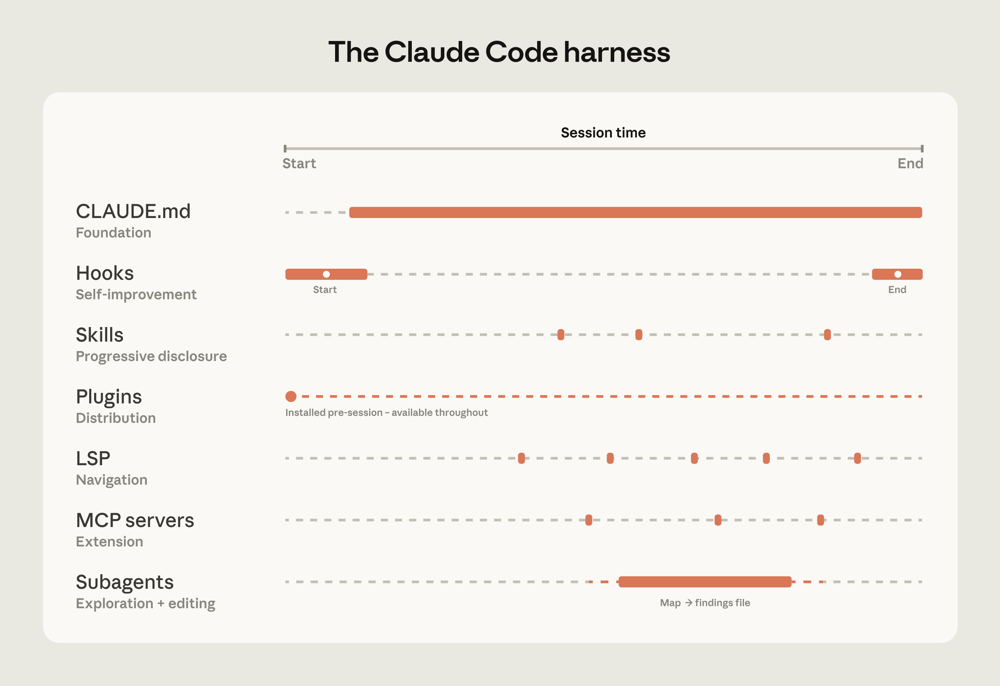

Anthropic shipped a piece earlier this month called [How Claude Code Works in Large Codebases](https://claude.com/blog/how-claude-code-works-in-large-codebases-best-practices-and-where-to-start). It is the most useful thing I have read about coding agents this year. The core claim, in their words: *"the ecosystem built around the model — the harness — determines how Claude Code performs more than the model alone."* In other words, in a real codebase the model is the smaller variable. The layer of context and tooling you wire around the agent matters more than which version of Sonnet or Opus is behind it.

The post names the seven pieces and stays high-level, which is the right move for a launch piece. What I want to do here is land it. Same seven pieces, but with the wiring you would actually put in a repo, in the order I would put it.

<!--more-->

## How Claude Code navigates without an index

Claude Code does not embed your repo. There is no vector database, no semantic index, no chunking job to keep in sync. The agent navigates the way an engineer would, with `grep`, `find`, `ls`, file reads, and reference-following. Anthropic calls this agentic search, and the upside is obvious: no index can go stale because there is no index.

The downside is also obvious. An engineer who has never seen your repo and only has shell tools will flounder if you drop them in the root with no map. That is your agent on day one. Everything that follows is about giving it the map.

## The AI layer in seven pieces

Every codebase used to have two artifacts engineers cared about: the code and the tests. There is a third now. Call it the AI layer, or the harness, or whatever you want. It is the set of context and tools you give your coding agent to operate in this specific repo. Anthropic breaks it into seven pieces, and each one solves a different scaling problem.



Anthropic gives each piece a role: CLAUDE.md is the foundation, hooks do self-improvement, skills are progressive disclosure, plugins handle distribution, LSP gives navigation, MCP is extension, subagents split exploration from editing. They are not equal in usage either. CLAUDE.md is loaded every turn. The others fire when relevant.

## Lean and layered CLAUDE.md

The single biggest mistake I see is a root `CLAUDE.md` that has grown into a small book. Two thousand lines of conventions, mostly for parts of the repo the current task will never touch. Every turn pays the tax. Anthropic's own guidance is to keep these files focused on what applies broadly so they do not become a drag on performance, and you can feel that drag in practice: the agent gets cautious, slow, and oddly literal.

Keep the root file lean. What is this repo, broadly. The tech stack. The commands the agent will need (`make test`, `make lint`, how to run the dev server). General conventions that apply everywhere. That is most of what belongs there.

Local conventions go in subdirectory `CLAUDE.md` files. When the agent works inside a subdirectory, Claude Code loads that file alongside the root one, so the root context is never lost. The agent picks up `services/api/CLAUDE.md` only when it starts touching that service. Same for `services/billing/`, the frontend, the data layer.

If you already know the task is scoped to one service, start the agent in that subdirectory. The working directory becomes the focus, and the agent stays out of unrelated code unless you tell it otherwise. Most of the time, you know.

Two more cheap wins live in the same neighborhood. Scope the `make test` and `make lint` commands so the subdirectory version runs only the slice the agent is working in, instead of the whole repo on every change. And version-control your exclusion rules in `.claude/settings.json` so the agent never reads `dist/`, generated SDKs, or vendored code. Every file the agent skips is tokens you keep for the work that matters. If your directory layout is unconventional or has historical baggage, Anthropic also suggests adding a short "codebase map" to the root `CLAUDE.md` so the agent has somewhere to anchor.

## Hooks that make the harness self-improving

Most teams use hooks as guardrails. Block edits in `vendor/`, refuse to delete migrations, kill the run if a secret turns up in a diff. That is fine and you should do it. But hooks have a second life that almost no one uses, and it is the more interesting one.

Both kinds register the same way, in `.claude/settings.json`, against named events Claude Code fires during a session:

```json
{
  "hooks": {
    "SessionStart": [
      {
        "hooks": [
          {
            "type": "command",
            "command": "uv run --directory \"$CLAUDE_PROJECT_DIR\" python .claude/hooks/session_start_context.py"
          }
        ]
      }
    ],
    "Stop": [
      {
        "hooks": [
          {
            "type": "command",
            "command": "uv run --directory \"$CLAUDE_PROJECT_DIR\" python .claude/hooks/propose_claude_md.py"
          }
        ]
      }
    ]
  }
}
```

A `SessionStart` hook fires before the agent has done anything. Whatever the script prints to stdout is injected straight into the session as context, so you can preload the things the agent would otherwise have to spend a turn discovering: the current branch, the uncommitted diff, the last few commits. For a larger team you might fetch the Confluence or Notion page that owns the directory the engineer is working in. Every developer starts each session pre-oriented, with no manual setup.

```python
"""SessionStart hook — prints orientation Claude reads as session context."""
import os, subprocess
from pathlib import Path

root = Path(os.environ.get("CLAUDE_PROJECT_DIR", "."))

def git(*args):
    out = subprocess.run(["git", *args], cwd=root, capture_output=True, text=True)
    return out.stdout.strip()

print("# Orientation\n")
print(f"## Branch\n{git('rev-parse', '--abbrev-ref', 'HEAD')}\n")
print(f"## Uncommitted changes\n{git('status', '--porcelain') or '(clean)'}\n")
print(f"## Recent commits\n{git('log', '-5', '--oneline')}\n")
```

The `Stop` hook is the more interesting one. It fires when the agent finishes its turn. At that moment the session context is still fresh, the diff is still small, and you have a free shot at a question nobody asks: did anything I just changed invalidate the rules I wrote down? Spawn a separate headless Claude session, hand it the diff and the relevant `CLAUDE.md` files, ask it to propose updates, and write the result to a markdown review file. You read it when you are ready. The CLAUDE.md files stop going stale on their own.

The trick is to make the hook itself cheap and dispatch the LLM call in the background, so the end of every turn does not block on a reflection:

```python
"""Stop hook — dispatch a headless Claude reflection in the background."""
import os, subprocess, sys
from pathlib import Path

# The reflector spawns its own headless Claude, whose Stop hook lands back
# here. The lock prevents infinite recursion.
if os.environ.get("REFLECT_LOCK"):
    sys.exit(0)

root = Path(os.environ.get("CLAUDE_PROJECT_DIR", "."))
diff = subprocess.run(
    ["git", "diff", "HEAD"], cwd=root, capture_output=True, text=True
).stdout
if not diff.strip():
    sys.exit(0)

env = {**os.environ, "REFLECT_LOCK": "1"}
subprocess.Popen(
    ["uv", "run", "python", ".claude/hooks/reflect_claude_md.py"],
    cwd=root, env=env,
    stdout=subprocess.DEVNULL, stderr=subprocess.DEVNULL,
)
```

`reflect_claude_md.py` is the part that calls a headless `claude` against the diff and writes `.claude/claude-md-review.md`. You can grow it from twenty lines to two hundred without ever blocking the agent.

The pattern that ties the two together: hooks let the harness improve itself in the background while you do the actual work.

## Path-scoped skills

Skills are where the agent learns how to do a *thing*. CLAUDE.md is conventions ("every route is registered here"). Skills are workflows ("here is how you add a new route in this repo, end to end"). The two overlap, but the framing keeps me honest: rules in CLAUDE.md, recipes in skills.

The piece of the skills system most teams miss is the path scope. A skill can declare which directories it activates in. A `create-api-endpoint` skill that only loads when the agent is editing under `services/api/` is invisible the rest of the time. With dozens of skills in a real repo, scoping is the difference between a useful library and a wall of irrelevant prompts.

The mental model: progressive disclosure for expertise. Most knowledge in a large codebase is local. Load it locally.

## Symbol-level search through LSP and MCP

`grep` is fine until it isn't. Past six-digit line counts, plain string search gets slow, returns too much, and burns tokens reading files the agent did not need to open. You also lose what every IDE has done since the 2000s: jump-to-definition, find-references, hover-for-types.

You can give the agent the same navigation. Run a language server locally, wrap it in a small MCP server, expose two or three tools: `where_is`, `find_references`, `goto_definition`. The agent now searches by symbol, not by string. A request like "find every place `monthly_total_cents` is referenced" returns one definition and the actual references, instead of fifty grep hits that mention the substring in unrelated comments.

This is also where bigger orgs invest. Custom MCP servers that expose internal search systems, the code-ownership graph, the design-doc index. The patterns are the same; the targets are domain-specific. The point is that the agent does not have to brute-force its way through your repo when you already have better tools for finding things.

<figure>
    
    <figcaption><em>Image: <a href="https://claude.com/blog/how-claude-code-works-in-large-codebases-best-practices-and-where-to-start">Anthropic, How Claude Code Works in Large Codebases</a>.</em></figcaption>
</figure>

## Subagents for exploration

The rule I follow: split exploration from editing. A subagent runs in its own context window. You hand it a question ("which files implement the billing webhook flow?", "what does the user model look like across services?"), it does the digging, and only the summary comes back to your primary session.

The win is not the parallelism. It is the context budget. Exploration is wasteful by nature. The agent reads forty files to find the three that matter, and most of those forty get thrown away. If that happens in your primary session, your editing turns start with a context window already half full of noise. If it happens in a subagent, the noise stays there. You get the answer.

Use the built-in Explore subagent liberally. Custom subagents earn their place when you have a workflow specific enough that a generic explorer is the wrong tool. The file shape is small. A single markdown file under `.claude/agents/`, four frontmatter keys, and a prompt body:

```markdown
---
name: explorer
description: Read-only repo explorer. Map a service or package without burning the main session's context, then return findings.
tools: Read, Grep, Glob
model: sonnet
---

You are a read-only explorer. The parent agent will hand you one service or
package to map. Read its `CLAUDE.md` if there is one, then trace entry points,
the public surface, and dependencies. Return findings as your final response.
No edits.
```

Restricting `tools` to read-only is the load-bearing line. The model never sees `Write` or `Edit`, so the subagent physically cannot reach back into the codebase, even if the prompt body forgot to say so.

## Don't let it rot

The harness is not a one-time setup. Models improve, and rules written for last year's model often constrain this year's. A note like "always split refactors into single-file changes" might have saved you in 2024 and might block a beneficial cross-file edit in 2026. Anthropic suggests reviewing your CLAUDE.md files every three to six months, or whenever performance feels like it has plateaued after a major model release. The stop-hook reflection gives you a head start. The rest is on you.

## Assign an owner

The last piece is not technical. The teams that get value out of Claude Code at scale have someone who owns the harness. A small platform-engineering team, or one DRI, or a hybrid PM/engineer doing it half-time. Their job is the same shape as owning a CI pipeline: write the conventions, build the skills, run the LSP wrapper, version the hooks, evangelize what works, retire what does not.

Plugins are the distribution vehicle. A good harness that lives in one engineer's dotfiles stays tribal. The same harness packaged as a plugin (or a private marketplace) is how a team of five hundred ends up running the same skills, the same MCP servers, and the same hooks without anyone having to remember to copy a config.

The pattern that fails: ship Claude Code to the org on a Friday, hope adoption goes viral, watch every team grow its own slightly-different version of `CLAUDE.md` for six months. The pattern that works: a quiet build-out period, a small set of approved skills, a working plugin or two, a documented governance story, then broad access.

Treat the harness like infrastructure. It is.

## Where to start

The order that has worked for me, in any repo:

1. Trim the root `CLAUDE.md` until it fits on one screen. Move the rest into subdirectories.
1. Add a `Stop` hook that proposes updates to those `CLAUDE.md` files in headless mode.
1. Convert your three most common repeated tasks into path-scoped skills.
1. Run a language server behind an MCP server. Stop searching by string.
1. Get comfortable dispatching exploration to subagents.

Most teams will plateau on step one for a week and find the agent is already noticeably sharper. The rest compounds. I have written more on the agent-tooling shift this is part of in [How Building AI Agents Has Changed in 2026](/blog/how-building-ai-agents-has-changed/), and on the workflow side in [The Claude Skills I Actually Use for DevOps](/blog/top-8-claude-skills-devops-2026/) and [Superpowers, GSD, and GSTACK](/blog/claude-code-orchestration-frameworks/).

The model is going to keep getting better. That is the easy part now. The harness is the work.
