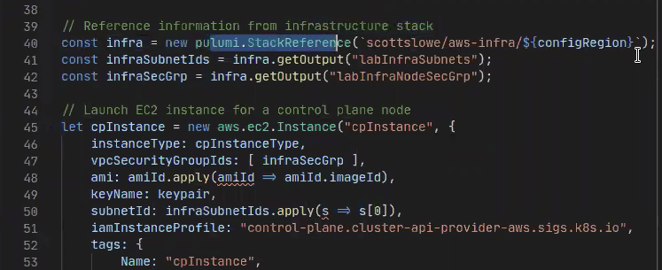

Scott Lowe is a 20+ year veteran of the IT industry and a Staff Kubernetes Architect at VMWare. He’s a prolific author (seven books) and [blogger](https://blog.scottlowe.org). His technology-focused blog covers a range of topics that include cloud computing (AWS, Azure, and Kubernetes), virtualization (KVM, VMware vSphere), open-source tools (Terraform, Ansible, Vagrant, and others), and networking (Open vSwitch, Linux networking).

For this guest post, Scott demonstrates how he uses Pulumi to deploy AWS test environments across multiple regions to help with testing various Kubernetes tools and projects, including the [Cluster API project](https://github.com/kubernetes-sigs/cluster-api).

<!--more-->

## Cluster API

The Cluster API project is a Kubernetes project for implementing a declarative API to manage the lifecycle of a Kubernetes cluster from creation, configuration, and maintenance. The project lives outside of the Kubernetes core project but follows best practices for using a declarative API. Ultimately, it seeks to define everyday operations, provide a default implementation, and the ability to swap between implementations seamlessly.

Cluster API allows you to define Kubernetes clusters as a Kubernetes resource. It lets you use the Kubernetes API to manage Kubernetes clusters, which sounds a little bit like inception, but it greatly simplifies lifecycle management both on-prem and in the cloud.

## Benefits of Infrastructure as Code

Pulumi is well suited for enabling me to help test projects like Cluster API. I'm not a developer (not yet), but by helping to test projects like Cluster API as they are developed, I can provide useful feedback. Pulumi makes it possible to define, test quickly, and deploy infrastructure components, whether those components are used to test new builds, verify functionality, assist with capturing information in documentation, or something else entirely.

## Infrastructure as Code in Practice

To help with testing parts of Cluster API's functionality, as well as to help with testing other configurations or tools related to Kubernetes, Pulumi helps manage my test environment or sandbox. In this instance, I'm using a Pulumi project written in TypeScript. This Pulumi project manages a consistent configuration across four AWS regions worldwide. This is set up as a single Pulumi project with four stacks; each stack defines infrastructure for a different AWS region worldwide.

All the TypeScript code is parameterized, so all you have to do is change the stack and then spin it up in your desired region. It looks for resources in that region like the right AMIs, etc. Right now, the code only accommodates four specific regions, but adding new regions would be pretty trivial.

It then spins up a VPC with both private and public subnets, attaches an internet gateway, creates security groups for various hosts, and creates one instance for an SSH bastion host that only allows SSH traffic into the cluster. This bastion host serves as the gateway by which you reach everything else inside the VPC.

Maps provide different configuration values for each region, such as different IP address values per region and different "friendly names" for each region.

A second Pulumi project, again with four stacks, is used to spin up AWS EC2 instances, which are used as Cluster API management clusters. This second project creates instances inside the infrastructure that was spun up by the first project. A stack reference is used to refer to a stack in the first project; this connection is what enables the second project to place its resources inside the infrastructure created by the first project.

Once there are a couple of instances running in the region, native Kubernetes tools bootstrap the initial Kubernetes cluster for that region. This first Kubernetes cluster becomes the management cluster, and from there, it's possible to create additional Kubernetes clusters as needed using Cluster API.

Aside from helping create clusters in multiple regions, Pulumi makes it easy to spin up other, independent new environments for testing. A third Pulumi project creates a VPC with all the necessary added components (subnets, route tables, route table associations, NAT gateways, and an Internet gateway) for testing other Kubernetes-related technologies or projects. Because this environment is ephemeral, it isn't parameterized for multiple regions and is typically used only within a single AWS region.

It's not a complex environment: you create the base AWS infrastructure then add Pulumi stack references to build on top of that infrastructure to add additional instances. That enables you to spin up instances inside those environments as needed, and then tear them down when testing completes.

For example, I recently needed to refresh my AWS lab infrastructure. There were a variety of reasons, but in the end, I had a set of changes I needed to apply to all four regions where my Pulumi project maintains infrastructure. After making the necessary changes to the TypeScript code, I was able to tear down all my lab infrastructure and re-create it in a matter of 10 to 15 minutes with a simple `pulumi destroy` followed by `pulumi up`. Making these changes without an infrastructure-as-code tool like Pulumi would have taken a lot longer.

Watch Scott's demo.



## Your Infrastructure as Code Story

We appreciate Scott taking the time to share his infrastructure as code story. Let us know you’re using Pulumi on [Twitter](https://twitter.com/pulumicorp) or on [Slack](https://slack.pulumi.com/).
