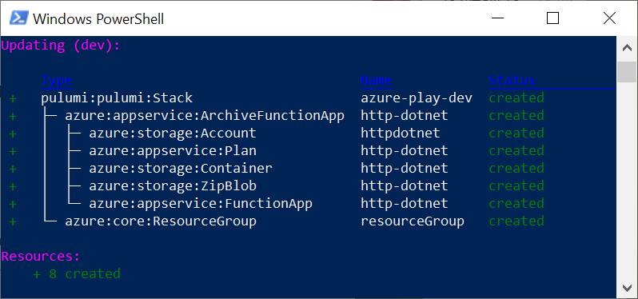

In this post, we'll take a look at 10 "pearls"&mdash;bite-sized code snippets&mdash;that demonstrate using Pulumi to build serverless applications with Azure Functions and infrastructure as code. These pearls are organized into four categories, each demonstrating a unique scenario:

- **Function App Deployment**: Deploy an existing Azure Functions application using infrastructure as code.
- **HTTP Functions as Callbacks**: Mix JavaScript or TypeScript functions with your infrastructure definition to produce strongly-typed, self-contained, serverless HTTP endpoints.
- **Cloud Event Handling**: Leverage a variety of event sources available to Azure Functions with lightweight event handlers.
- **Data Flows with Function Bindings**: Take advantage of function bindings&mdash;declarative connectors to Azure services.
<!--more-->

Our Azure Functions pearls are:

[**Function App Deployment**](#function-app-deployment)

- [Deploy a Function App written in .NET or any other supported runtime](#1-deploy-a-net-function-app)
- [Configure Functions to run on an Elastic Premium Plan](#2-run-functions-using-an-elastic-premium-plan)

[**HTTP Functions as Callbacks**](#http-functions-as-callbacks)

- [Define Node.js Functions as inline callbacks](#3-define-node-js-functions-as-inline-callbacks)
- [Implement REST APIs as multiple Functions](#4-rest-apis-as-multiple-functions)
- ["Warm" the Functions to avoid Cold Starts](#5-function-warming-with-a-timer-function)

[**Cloud Event Handling**](#cloud-event-handling)

- [Process events from Azure Event Hub](#6-process-events-from-azure-event-hubs)
- [Subscribe to Blob creation with Azure Event Grid](#7-subscribe-to-azure-event-grid)
- [Run a Function every time an Azure resource is modified](#8-respond-to-resource-level-events)

[**Data Flows with Function Bindings**](#data-flows-with-function-bindings)

- [Push a message to a Storage Queue with an output binding](#9-output-bindings)
- [Pull a Storage Table row with an input binding](#10-input-bindings)

## Function App Deployment

Azure Functions can be written in many languages, and Pulumi supports whatever choice you make. You can take any existing serverless application and deploy it using infrastructure-as-code.

### 1. Deploy a .NET Function App

[ [Runnable Example](https://github.com/pulumi/examples/tree/master/azure-ts-functions-raw) ]

Many Function Apps are .NET applications created with native tooling like Visual Studio or the Functions CLI. Pulumi can simply deploy such an application in only a few lines of JavaScript:

``` ts
const dotnetApp = new azure.appservice.ArchiveFunctionApp("http-dotnet", {
   resourceGroupName: resourceGroup.name,
   archive: new pulumi.asset.FileArchive("./app/bin/Debug/netcoreapp2.1/publish"),
   appSettings: { runtime: "dotnet" },
});
```

There are only four things required:

- the Function App name ("http-dotnet")
- the resource group it belongs to
- the path to the compiled .NET assemblies, and
- the desired runtime

Pulumi takes care of the rest for you. It handles the following tasks:

- Creating a Storage Account and a Blob Container
- Zipping up the binaries and uploading them to the blob container
- Calculating a SAS token
- Preparing a Consumption Plan and a Function App using this Consumption Plan
- Configuring the required application settings, including a reference to the zip archive with the SAS token



While a few values are required, you are not restricted to the default behavior and can change any setting.

### 2. Run Functions using an Elastic Premium Plan

While the Consumption Plan is the ultimate serverless option, there are other ways to host Azure Functions. Azure also offers the Premium Plan: a combination of the power and guarantees of a fixed App Service Plan with the elasticity of Consumption.

If you want to take advantage of a Premium Plan, go ahead and define it as a Pulumi resource, then link to it in the Function App definition:

``` ts
const premiumPlan = new azure.appservice.Plan("my-premium", {
   resourceGroupName: resourceGroup.name,
   sku: {
       tier: "Premium",
       size: "EP1",
   },
   maximumElasticWorkerCount: 20,
});

const javaApp = new azure.appservice.ArchiveFunctionApp("http-java", {
   resourceGroupName: resourceGroup.name,
   plan: premiumPlan,
   archive: new pulumi.asset.FileArchive("./java/target/functions/fabrikam"),
   appSettings: { runtime: "java" },
});
```

In this example, I deployed a Java application. The Premium Plan has a couple of configuration knobs: the *instance size* and the *maximum scale-out limit*.

## HTTP Functions as Callbacks

Node.js is another runtime supported by Azure Functions. Like before, you can use the `ArchiveFunctionApp` class to deploy the application from an external folder. However, Pulumi's Node.js SDK provides a way to mix the code of your functions directly into your infrastructure definition.

### 3. Define Node.js Functions as Inline Callbacks

[ [Runnable Example](https://github.com/pulumi/examples/tree/master/azure-ts-functions) ]

A TypeScript or a JavaScript function becomes an Azure Function deployed to the cloud:

``` ts
const greeting = new azure.appservice.HttpEventSubscription('greeting', {
   resourceGroupName: resourceGroup.name,
   callback: async (context, req) => {
       return {
           status: 200,
           body: `Hello ${req.query['name'] || 'World'}!`,
       };
   }
});

export const url = greeting.url;
```

You are free to use any NPM module inside the callback, and the dependencies will be automatically packaged into the deployment artifact. Alternatively, you can extract the callback function into a separate file or package and import it from your infrastructure code.

While mixing infrastructure and application code in the same file may seem counterintuitive, it provides many benefits:

- Combined code binaries (data plane) and infrastructure (control plane) as a single unit of deployment
- Eliminate the need for boilerplate configuration like `host.json` and `function.json` files
- Robust typing out-of-the-box: For instance, you can flawlessly "dot into" the `content` and `req` object above.

You can read more about the motivation in [Serverless as Simple Callbacks with Pulumi and Azure Functions]().

The previous example deployed a Function App with a single Function. However, Azure supports applications with multiple Functions bundled together.

### 4. REST APIs as Multiple Functions

It's common to use Azure Functions for implementing RESTful APIs. As an API may consist of multiple endpoints, we may need to combine several HTTP Functions into a single deployment unit.

To achieve that, we define an `HttpFunction` object per Azure Function, each with its callback and settings. Then, we pass an array of these objects into a `MultiCallbackFunctionApp` constructor. Each Function definition may have a specific route and HTTP methods to handle:

``` ts
const get = new azure.appservice.HttpFunction("Read", {
   route: "items",
   methods: ["GET"],
   callback: async (context, request) => {
       const items = await repository.list();
       return { status: 200, body: items };
   },
});

const post = new azure.appservice.HttpFunction("Add", {
   route: "items",
   methods: ["POST"],
   callback: async (context, request) => {
       const id = await repository.add(request.body);
       return { status: 201, body: { id }  };
   },
});

const app = new azure.appservice.MultiCallbackFunctionApp("multi-app", {
   resourceGroupName: resourceGroup.name,
   functions: [get, post],
});
```

You can combine as many Functions as you want, including functions of different types, as shown in the next example.

### 5. Function "Warming" with a Timer Function

[ [Runnable Example](https://github.com/pulumi/pulumi-azure/blob/master/examples/http-multi) ]

Scheduled jobs are another frequent use case for serverless functions. It's possible to define a [*cron expression*](https://docs.microsoft.com/azure/azure-functions/functions-bindings-timer#cron-expressions) and get the code executed at designated intervals.

The Consumption Plan disposes a worker if no Function runs in about 20 minutes. After disposal, the next execution will cause a [*cold start*](https://mikhail.io/serverless/coldstarts/define/), and the response latency, will increase.

In order to avoid this disposal, we can combine a target HTTP Function with a Timer Function. The body of the Timer Function is empty, since its sole purpose is to trigger the Function App and keep the worker "warm":

``` ts
const warmer = new azure.appservice.TimerFunction("warmer", {
   schedule: "0 */5 * * * *",
   callback: async () => {},
});

const http = new azure.appservice.HttpFunction("hello", {
   callback: async (context, req) => {
       return {
           status: 200,
           body: "Hello World!",
       };
   }
});

const app = new azure.appservice.MultiCallbackFunctionApp("always-warm-app", {
   resourceGroupName: resourceGroup.name,
   functions: [http, warmer],
});
```

It's easy to imagine a custom component `WarmedFunctionApp` which appends a standard Timer Function to an array of Functions passed to its constructor.

## Cloud Event Handling

While HTTP is a widespread use case, Azure Functions support many other trigger types too. [The previous post]() featured Storage Queues and ServiceBus Topics. Pulumi supports Timers, Events Hubs, Event Grid, Storage Blobs, Service Bus Queues, and Cosmos DB Change Feed events, too! Let's see how that looks using Azure Event Hubs.

### 6. Process Events from Azure Event Hubs

[ [Runnable Example](https://github.com/pulumi/pulumi-azure/tree/master/examples/eventhub) ]

Azure Event Hubs is a fully-managed log-based messaging service comparable to Apache Kafka. In contrast to a self-hosted Kafka cluster, it only takes a few lines of JavaScript to create an Event Hub and start processing events:

``` ts
const eventHub = new eventhub.EventHub("my-hub", {
   resourceGroupName: resourceGroup.name,
   namespaceName: namespace.name,
   partitionCount: 2,
   messageRetention: 7,
});

eventHub.onEvent("MyHubEvent", async (context, msg) => {
   console.log("Event Hub message: " + JSON.stringify(msg));
});
```

Every time a new event comes in, be it once per hour or a thousand times a second, the Function is executed. Azure manages the scale-out for you.

### 7. Subscribe to Azure Event Grid

[ [Runnable Example](https://github.com/pulumi/pulumi-azure/blob/master/examples/eventgrid) ]

Azure Event Grid is another trigger type for Azure Functions. It is a dispatcher service for distributing events from many other Azure services as well as external data sources.

A classic example is subscribing to events from Azure Blob Storage. The Event Grid subscription connects to a given Storage Account and provides several handy options to filter the event stream. The following example subscribes to all JPG files created in any container of the account:

``` ts
const storageAccount = new azure.storage.Account("eventgridsa", {
   resourceGroupName: resourceGroup.name,
   accountReplicationType: "LRS",
   accountTier: "Standard",
   accountKind: "StorageV2",
});

azure.eventgrid.events.onGridBlobCreated("OnNewBlob", {
   storageAccount,
   subjectFilter: {
       caseSensitive: false,
       subjectEndsWith: ".jpg",
   },
   callback: async (context, event) => {
       context.log(`Subject: ${event.subject}`);
       context.log(`File size: ${event.data.contentLength}`);
   },
});
```

The `event` object is strongly typed: The snippet above logs the file size, but there are many other properties at your disposal. Code completion makes the discovery process painless.

It's worth mentioning that Pulumi does much of the work behind the scenes here, allowing you to focus on the important parts of the task at hand. In particular, Pulumi retrieves the appropriate secret key from Azure Functions ARM API and creates an Event Grid subscription which points to a specific webhook containing that key.

### 8. Respond to Resource-level Events

[ [Runnable Example](https://github.com/pulumi/pulumi-azure/blob/master/examples/eventgrid) ]

Here is a good illustration of the power of Event Grid. A callback function gets triggered for each change to any resource belonging to the target Resource Group:

``` ts
const resourceGroup = new azure.core.ResourceGroup("eventgrid-rg");

eventgrid.events.onResourceGroupEvent("OnResourceChange", {
   resourceGroupName: resourceGroup.name,
   callback: async (context, event) => {
       context.log(`Subject: ${event.subject}`);
       context.log(`Event Type: ${event.eventType}`);
       context.log(`Data: ${JSON.stringify(event.data)}`);
   },
});
```

This simple piece of code is an easy launching point for many automation, auditing, and governance scenarios.

## Data Flows with Function Bindings

Azure Functions come with a powerful system of bindings. So far, we only saw examples of using event sources as trigger bindings. However, Azure also supports a powerful set of so called "input" and "output" bindings.

### 9. Output Bindings

[ [Runnable Example](https://github.com/pulumi/pulumi-azure/blob/master/examples/queue) ]

Output bindings enable developers to easily forward the data from an Azure Function to an arbitrary destination in a declarative manner. For instance, if a queue handler needs to send a message to another queue, we don't have to use cloud SDKs. Instead, we can return the message-to-be-sent from the callback and wire it to the output queue. Here is a quick example:

``` ts
const incoming = new azure.storage.Queue("queue-in", {
  storageAccountName: storageAccount.name,
});

const outgoing = new azure.storage.Queue("queue-out", {
   storageAccountName: storageAccount.name,
});

incoming.onEvent("NewMessage",  {
   outputs: [outgoing.output("queueOut")],
   callback: async (context, person) => {
       return {
           queueOut: `${person.name} logged into the system`,
       };
   },
});
```

Two elements play together here:

- The `outputs` property defines an output binding with the name `queueOut` and the destination to `outgoing`
- The `queueOut` property of the resulting object contains the output message

Note that the binding name must match the output property.

### 10. Input Bindings

[ [Runnable Example](https://github.com/pulumi/pulumi-azure/tree/master/examples/table) ]

Input bindings pull extra bits of information and pass them as input parameters to the callback. The exact usage depends on the trigger and binding types and might be tricky to get right with JSON configuration files. Here is one example of wiring done in a Pulumi program:

``` ts
const values = new azure.storage.Table("values", {
   storageAccountName: storageAccount.name,
});

const getFunc = new azure.appservice.HttpEventSubscription('get-value', {
   resourceGroupName: resourceGroup.name,
   route: "{key}",
   inputs: [
       values.input("entry", { partitionKey: "lookup", rowKey: "{key}" }),
   ],
   callback: async (context, request, entry) => {
       return {
           status: 200,
           body: entry.value,
       };
   },
});
```

There are three crucial bits here:

- The `route` property of this HTTP Function contains a template parameter `key`. The runtime extracts the actual `key` value from the HTTP request.
- The `inputs` option contains a reference to a Storage Table with a hardcoded `partitionKey` and a `rowKey` bound to the `key` template parameter. At execution time, a row is retrieved based on the combination of the keys. The entry, if found, is passed to the callback.
- The `callback` has three input parameters, while all previous examples had two. The third parameter contains the retrieved row.

It's possible to have multiple input and output bindings, and any combination of those.

## Wrapping Up

In this post, we've seen some of the exciting things you can do with Azure Functions in Pulumi. Developers use serverless functions as a glue between managed cloud services. Pulumi offers a compelling way to define the links between these pieces of cloud infrastructure in a simple and expressive way.

For a streamlined Pulumi walkthrough, including language runtime installation and cloud configuration, see the  [Azure Quickstart](), check more examples at [Pulumi Azure GitHub](https://github.com/pulumi/pulumi-azure/tree/master/examples), and join the [Pulumi Community Slack](https://slack.pulumi.com/).
