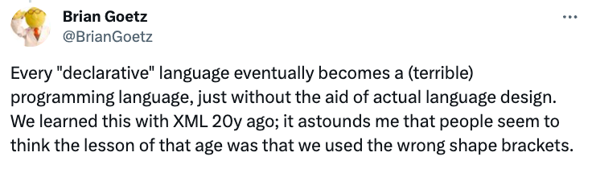
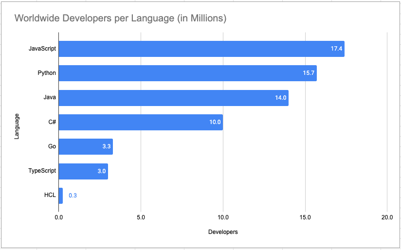

The Java Language Architect at Oracle, Brian Goetz, author of Java Concurrency in Practice, has this to how declarative
languages can be a double-edged sword:



## Summary

HashiCorp’s infrastructure as code solution, Terraform, uses a domain-specific language (DSL) to declare cloud
resources. Pulumi’s infrastructure as code solution, on the other hand, lets you choose from any number of modern
languages – C#, Java, JavaScript, Go, Python, or TypeScript – or the industry-standard markup language YAML, to declare
cloud resources. Although both Terraform and Pulumi are declarative infrastructure as code engines at their core, this
fundamentally different approach to expression languages has significant consequences.

## Real-World Consequences

We’ve worked with 1,000s of companies and 100,000+ developers and infrastructure experts alike to adopt infrastructure
as code using Pulumi and modern languages, and we see several significant recurring themes as they migrate away from
Terraform and HCL.

### Tapping into Millions of Developers

Pulumi allows developers to use widely-adopted general-purpose languages for infrastructure as code. This approach taps
into vast existing developer communities, with JavaScript boasting over 17 million developers, Python 15 million, and Go
3 million worldwide. By utilizing these languages, Pulumi enables teams to leverage their current programming expertise
and access extensive resources, libraries, and tools. Meanwhile, HCL maintains a dedicated user base of several hundred
thousand developers who appreciate its specialized syntax for infrastructure description.



### Pulumi leverages rich ecosystems of general-purpose languages

Pulumi harnesses the extensive ecosystems surrounding popular programming languages for infrastructure as code. While
domain-specific languages like HCL have their strengths, Pulumi's approach offers developers access to:

1. Comprehensive IDE support, including features like autocompletion, syntax highlighting, and real-time error
   detection, which may be more advanced than those available for specialized IaC languages

2. wide array of established linting tools to enforce coding standards and catch potential issues early in the
   development process

3. Robust testing frameworks that allow for thorough verification and validation of infrastructure configurations, often
   more mature than those specific to IaC languages

4. Extensive libraries and packages that can be seamlessly integrated into infrastructure code, expanding possibilities
   beyond traditional IaC toolsets

This approach allows teams to utilize familiar tools and workflows, potentially increasing productivity and code
quality. Developers can leverage their existing programming expertise and the vast resources available in these language
communities when working on infrastructure projects, which may require less additional learning compared to adopting a
specialized syntax

### Pulumi embraces open-source languages and principles

Languages like Python, JavaScript, and Go are developed and maintained by diverse global communities, ensuring
transparency and collective innovation. These languages have remained open-source throughout their history, with their
core components freely available for use, modification, and distribution.

In contrast, some domain-specific IaC languages have different ownership and licensing models. For example, HCL has
always been under the control of a single company. Recently, there have been changes in its licensing, with parts of its
execution engine moving to a "source available" license that is no longer considered fully open-source.

By using mainstream open-source languages, Pulumi offers teams the benefits of well-established ecosystems,
community-driven development, and the assurance of continued open availability. This approach can provide additional
confidence for organizations concerned about long-term access and evolution of their IaC tooling.

Here's a list of languages Pulumi commonly uses, along with their licenses:

| **Language** | **License**                               |
|--------------|-------------------------------------------|
| C#           | MIT (.NET Core)                           |
| Java         | GNU v2.0 (OpenJDK)                        |
| JavaScript   | MIT (ECMAScript), BSD-style 3-Clause (V8) |
| Go           | BSD-style 3-Clause                        |
| Python       | BSD-style Python Software Foundation      |
| TypeScript   | Apache 2.0                                |
| YAML         | Creative Commons Attribution              |

### Developers Prefer Pulumi for Infrastructure as Code

While HCL serves its purpose in infrastructure as code, many developers find Pulumi's approach more appealing. Pulumi
allows engineers to use familiar programming languages, making it easier to leverage existing skills and tools.

This familiarity often leads to faster onboarding and more efficient debugging processes. Pulumi's flexibility enables
developers to create custom solutions with ease, tapping into the full power of general-purpose languages. Additionally,

Pulumi's open architecture provides developers with the freedom to integrate various tools and services, fostering a
diverse and adaptable ecosystem for infrastructure management.

### Enhancing Team Collaboration with Pulumi

Pulumi offers several advantages for fostering better collaboration across teams compared to HCL. While HCL is a
powerful tool primarily utilized by operations and DevOps teams, its specialized nature for infrastructure tasks might
limit broader engagement with development teams who use other programming languages.

Pulumi, on the other hand, supports multiple languages, allowing development teams to use familiar tools and languages
which can enhance collaboration and streamline processes. Additionally, Pulumi's flexibility in integrating with a
variety of tools can help bridge gaps between different teams, ensuring smoother communication and more effective
teamwork.

This inclusive approach not only accelerates progress but also democratizes access to infrastructure management,
avoiding bottlenecks and enhancing overall team efficiency.

### Reducing Redundancy: The Benefits of Pulumi Over HCL's Copy-Paste Challenges


HCL often encounters a significant challenge with "copy-pasta," where developers frequently copy and paste code. This
practice can lead to redundant configurations across environments, bloating the codebase and complicating management.

Additionally, this increases the risk of errors as small mistakes can propagate across multiple instances, and each one
must be manually updated when changes are needed, heightening the chance for inconsistencies. As projects evolve,
maintaining a codebase with extensive copy-pasta becomes burdensome, slowing development and elevating the likelihood of
bugs.

In contrast, Pulumi reduces the need for such redundancies by enabling more dynamic code reuse and better resource
management, streamlining updates and fostering more robust and error-resistant infrastructure development.

### Pulumi's Advantage Over Custom Tool Requirements

As projects expand, managing HCL configurations becomes increasingly complex, often necessitating custom tools for
efficient large-scale management. While HCL is adept at defining infrastructure as code, it lacks built-in features to
orchestrate, validate, and deploy configurations across extensive networks smoothly. Teams usually need to develop
bespoke tools or integrate external solutions like Terragrunt, Atlantis, and Sentinel to automate tasks, ensure
consistency, and facilitate integration with other systems. This process can demand significant resources and expertise.

In contrast, Pulumi is designed to scale seamlessly with projects, reducing the need for external tools or extensive
custom solutions. Pulumi provides robust capabilities for managing large-scale projects efficiently, streamlining the
deployment process, and ensuring consistency across various environments without the overhead of additional tooling.
This makes Pulumi a more straightforward and resource-efficient choice for teams looking to manage their infrastructure
effectively as they grow.

### Future-Proofing Infrastructure: The Flexibility of Pulumi

HCL, while robust, lacks the future-proof qualities of Pulumi SDKs due to its fixed syntax and usage constraints. In
contrast, Pulumi's support for multiple programming languages like Python, TypeScript, and Go, coupled with the
potential to adopt new languages over time, offers unparalleled flexibility and adaptability.

This allows developers to write infrastructure as code in familiar languages, facilitating easier integration with
existing projects and workflows. As technology progresses, the capacity to embrace new programming languages and
paradigms becomes essential. Pulumi's adaptable model supports this continuous evolution, ensuring that infrastructure
as code practices can keep pace with the dynamic nature of development environments and preferences, thereby offering a
more sustainable and scalable solution for long-term projects.

### The Growing Complexity of HCL: Pulumi as a Simplified Alternative

As HCL continues to evolve, its fixed syntax and structured approach are likely to lead to greater complexity. This
evolution could make the language increasingly specialized and challenging for newcomers, particularly those already
proficient in more widely-used programming languages. As HCL adapts more bespoke features to meet specific needs, it may
become less intuitive and harder to handle effectively, potentially resulting in a language that is cumbersome to use
and maintain, especially in long-term projects.

In contrast, Pulumi offers a more streamlined and adaptable alternative. Supporting multiple mainstream programming
languages like Python, TypeScript, and Go, Pulumi enables developers to work with tools and languages they are already
familiar with, greatly reducing the learning curve and enhancing productivity. This flexibility allows Pulumi to
integrate seamlessly into existing projects and workflows, making it a more sustainable and scalable choice for modern
infrastructure needs.

## HCL in the Wild: Practical Comparisons with Pulumi

In this section, we'll explore real-life examples to compare and contrast HCL with Pulumi programs. By examining how
each approach handles similar infrastructure tasks, you'll quickly appreciate the advantages of leveraging a familiar
programming language through Pulumi.

This comparison aims to highlight the practical benefits and increased efficiency that Pulumi offers over traditional
HCL configurations.

### `for_each` loop with conditional expression

First, let's look at an HCL example featuring a for_each loop with a conditional statement. At first glance, it may seem
straightforward, but we can immediately see the unique way a loop must be defined in HCL.

Initially, you must decide whether to use count or for_each. Following this, you must adhere to the strict format for
implementing conditional statements.

This contrasts starkly with how you would use these constructs in a generic programming language.

```hcl
variable "storage_account_names" {
  type = list(string)
  default = ["mickey", "donald", "goofy"]
}

resource "azurerm_resource_group" "example" {
  name     = "storage-rg"
  location = "West Europe"
}

resource "azurerm_storage_account" "my_storage" {
  for_each = {
    for name in var.storage_account_names :
    name => name
    if name != "goofy"
  }
  name                     = each.value
  resource_group_name      = azurerm_resource_group.example.name
  location                 = azurerm_resource_group.example.location
  account_tier             = "Standard"
  account_replication_type = "GRS"
}
```

Now let’s look at how we can approach the same example using Pulumi and TypeScript.

```typescript
const storageAccountNames: string[] = [
    "mickey",
    "donald",
    "goofy",
];
const example = new azure.core.ResourceGroup("example", {
    name: "storage-rg",
    location: "West Europe",
});

storageAccountNames.filter((name: string) => name !== "goofy").forEach((name: string) => {
    new azure.storage.Account(`my_storage-${name}`, {
        name: name,
        resourceGroupName: example.name,
        location: example.location,
        accountTier: "Standard",
        accountReplicationType: "GRS",
    });
});
```

We can see that we leverage the full potential that the generic programming language offers, using `filter` to
streamline
our array without the need for conditional statements, and then iterating through the reduced array with `forEach`. This
approach is less error-prone, faster, and easier to debug.

However, implementing a `for_each` in HCL can become even more complicated.

### `for_each` loop with multi-level nested dynamic blocks

To give you an idea of how HCL handles cascading nested dynamic providers, consider this: dynamic providers are intended
to dynamically construct repeatable nested blocks. However, this complexity can make the code difficult to read and
maintain. We will examine a specific resource from this
GitHub [repository](https://github.com/Azure/terraform-azurerm-aks/blob/main/main.tf) to provide a clearer illustration:

```hcl
variable "enable_auto_scaling" {
  type        = bool
  default     = false
  description = "Enable node pool autoscaling"
}

variable "agents_pool_kubelet_configs" {
  type = list(object({
    cpu_manager_policy = optional(string)
    cpu_cfs_quota_enabled = optional(bool, true)
    cpu_cfs_quota_period = optional(string)
    image_gc_high_threshold = optional(number)
    image_gc_low_threshold = optional(number)
    topology_manager_policy = optional(string)
    allowed_unsafe_sysctls = optional(set(string))
    container_log_max_size_mb = optional(number)
    container_log_max_line = optional(number)
    pod_max_pid = optional(number)
  }))
  default = [
    {
      cpu_manager_policy        = "none"
      cpu_cfs_quota_enabled     = true
      cpu_cfs_quota_period      = "100ms"
      image_gc_high_threshold   = 85
      image_gc_low_threshold    = 65
      topology_manager_policy   = "none"
      allowed_unsafe_sysctls = ["net.*", "kernel.*"]
      container_log_max_size_mb = 10
      container_log_max_line    = 10
      pod_max_pid               = 100
    }
  ]
  nullable = false
}

resource "azurerm_resource_group" "example" {
  name     = "storage-rg"
  location = "West Europe"
}

resource "azurerm_kubernetes_cluster" "main" {
  name                = "example-aks"
  location            = azurerm_resource_group.example.location
  resource_group_name = azurerm_resource_group.example.name
  dns_prefix          = "exampleaks"

  dynamic "default_node_pool" {
    for_each = var.enable_auto_scaling == true ? [] : ["default_node_pool_manually_scaled"]
    content {
      name                = "default"
      vm_size             = "Standard_DS2_v2"
      zones = [1, 2, 3]
      enable_auto_scaling = true
      min_count           = 1
      max_count           = 3
      dynamic "kubelet_config" {
        for_each = var.agents_pool_kubelet_configs
        content {
          allowed_unsafe_sysctls = kubelet_config.value.allowed_unsafe_sysctls
        }
      }
    }
  }
  identity {
    type = "SystemAssigned"
  }
}
```

As we can see, incorporating even one nested dynamic provider block can make the code difficult to read. We recommend
using dynamic blocks sparingly to maintain readability and ease of maintenance, particularly when creating an
abstraction with the help of a module. Overuse of these blocks, especially when defining a resource’s arguments and
nested blocks directly from input variables, might not provide a useful abstraction.

Have look how this would look like when using Pulumi and one of its generic programming languages:

```typescript
const config = new pulumi.Config();
const enableAutoScaling = config.getBoolean("enableAutoScaling") || false;

const agentsPoolKubeletConfigs = config.getObject("agentsPoolKubeletConfigs") || {
    allowedUnsafeSysctls: [
        "kernel.*",
        "net.*",
    ],
    containerLogMaxLine: 10,
    containerLogMaxSizeMb: 10,
    cpuCfsQuotaEnabled: true,
    cpuCfsQuotaPeriod: "100ms",
    cpuManagerPolicy: "none",
    imageGcHighThreshold: 85,
    imageGcLowThreshold: 65,
    podMaxPid: 100,
    topologyManagerPolicy: "none",
};
const example = new azure.core.ResourceGroup("example", {
    name: "storage-rg",
    location: "West Europe",
});

let kubeletConfigs: azure.types.input.containerservice.KubernetesClusterDefaultNodePoolKubeletConfig = agentsPoolKubeletConfigs;

let defaultNodePool: azure.types.input.containerservice.KubernetesClusterDefaultNodePool = {
    name: "default",
    vmSize: "Standard_DS2_v2",
    zones: [
        "1",
        "2",
        "3",
    ],
    enableAutoScaling: enableAutoScaling,
    minCount: 1,
    maxCount: 3,
    kubeletConfig: kubeletConfigs,
};
```

In Pulumi, using TypeScript as an example, we can easily create new objects of a specific type and populate them with
values from our configuration. If we need to add conditions, we can include our usual if statements. This approach
greatly simplifies the code, making it easy to read and maintain for any future changes.

### Execute code programing code with `null_resource`, `local_file` and `provisioners`

There are sometimes situations where there is a strong need to execute a script written in a programming language. Most
prominent use case is packaging up the source code for an AWS lambda function. Let's have a look into an example from
the Terraform AWS Lambda [module](https://github.com/terraform-aws-modules/terraform-aws-lambda/blob/master/package.tf)

```hcl
locals {
  python = (substr(pathexpand("~"), 0, 1) == "/") ? "python3" : "python.exe"
}

# Generates a filename for the zip archive based on the content of the files
# in source_path. The filename will change when the source code changes.
data "external" "archive_prepare" {
  count = var.create && var.create_package ? 1 : 0
  program = [local.python, "${path.module}/package.py", "prepare"]
  query = {
    paths = jsonencode({
      module = path.module
      root   = path.root
      cwd    = path.cwd
    })
    docker = var.build_in_docker ? jsonencode({
      docker_pip_cache          = var.docker_pip_cache
      docker_build_root         = var.docker_build_root
      docker_file               = var.docker_file
      docker_image              = var.docker_image
      with_ssh_agent            = var.docker_with_ssh_agent
      docker_additional_options = var.docker_additional_options
      docker_entrypoint         = var.docker_entrypoint
    }) : null
    artifacts_dir = var.artifacts_dir
    runtime       = var.runtime
    source_path = jsonencode(var.source_path)
    hash_extra    = var.hash_extra
    hash_extra_paths = jsonencode(
      [
        # Temporary fix when building from multiple locations
        # We should take into account content of package.py when counting hash
        # Related issue: https://github.com/terraform-aws-modules/terraform-aws-lambda/issues/63
        # "${path.module}/package.py"
      ]
    )
    recreate_missing_package = var.recreate_missing_package
  }
}

# This transitive resource used as a bridge between a state stored
# in a Terraform plan and a call of a build command on the apply stage
# to transfer a noticeable amount of data
resource "local_file" "archive_plan" {
  count                = var.create && var.create_package ? 1 : 0
  content              = data.external.archive_prepare[0].result.build_plan
  filename             = data.external.archive_prepare[0].result.build_plan_filename
  directory_permission = "0755"
  file_permission      = "0644"
}

# Build the zip archive whenever the filename changes.
resource "null_resource" "archive" {
  count = var.create && var.create_package ? 1 : 0
  triggers = {
    filename  = data.external.archive_prepare[0].result.filename
    timestamp = var.trigger_on_package_timestamp ? data.external.archive_prepare[0].result.timestamp : null
  }
  provisioner "local-exec" {
    interpreter = [
      local.python, "${path.module}/package.py", "build",
      "--timestamp", data.external.archive_prepare[0].result.timestamp
    ]
    command = data.external.archive_prepare[0].result.build_plan_filename
  }
  depends_on = [local_file.archive_plan]
}
```

We see a confusing mix of different providers (`local` and `null_resource`) and even the use of `provisioner` here. This
setup is overly complex to read and maintain, leading to a split-brain situation where some logic is in the code and the
rest in HCL. It also becomes very challenging to debug, especially if the team lacks experience with the Python code.

In Pulumi, simplicity is key: simply write your Python code and seamlessly integrate it with Pulumi SDK calls. No
additional steps are necessary, and there's no need to run the Python binary separately to execute the file. It's all
about streamlining the process to make your life easier. For instance, consider this example where we read the name of
an Azure Resource Group from a JSON file (`config.json`, illustrating how effortlessly Python can blend with Pulumi’s
infrastructure management capabilities.

```python
import json
import pulumi
import pulumi_azure_native as azure_native

# Load the JSON file
with open('config.json') as json_file:
    config = json.load(json_file)

# Extract values from the JSON file
resource_group_name = config['resourceGroupName']
location = config['location']

# Create an Azure Resource Group
resource_group = azure_native.resources.ResourceGroup(
    "resourceGroup",
    resource_group_name=resource_group_name,
    location=location
)

# Export the name of the resource group
pulumi.export('resourceGroupName', resource_group.name)
```

### If Statements Constructed with `count`

```hcl
variable "mode" {
  default = "not-spoke"
}

variable "restricted_net_hub_project_id" {
  default = "xxx"
}

data "google_compute_network" "vpc_restricted_net_hub" {
  count   = var.mode == "spoke" ? 1 : 0
  name    = "vpc-c-shared-restricted-hub"
  project = var.restricted_net_hub_project_id
}
```

In this HCL
[example](https://github.com/terraform-google-modules/terraform-example-foundation/blob/master/3-networks-hub-and-spoke/modules/restricted_shared_vpc/main.tf),
we see the `count` parameter being used in a way that stretches its original intent—essentially using it to
conditionally create or skip resources based on the value of `var.mode`. This method, while functional, can make the
code more difficult to understand and maintain, as it repurposes Terraform constructs in unintended ways.

Contrast this with Pulumi, which allows you to use native if statements from the programming language, such as
TypeScript or Python. This native approach enhances readability and maintainability because it aligns with standard
programming practices, making it easier for developers to follow and debug. Pulumi's use of familiar programming
constructs means you can write more intuitive and straightforward infrastructure code without bending the tool to fit
unusual patterns.

```typescript
import * as pulumi from "@pulumi/pulumi";
import * as gcp from "@pulumi/gcp";

const config = new pulumi.Config();
const mode = config.get("mode") || "";
const restrictedNetHubProjectId = config.get("restrictedNetHubProjectId") || "";
if (mode == "spoke") {
    const vpcSharedSpoke = gcp.compute.getNetworkOutput({
        name: "vpc-c-shared-spoke",
        project: restrictedNetHubProjectId,
    });
}
```

### HCL Function Frenzy

Another source of extreme confusion and constant re-learning is the heavy usage of built-in functions within HCL
expressions. At first glance, while it seems helpful for performing complex operations quickly, it can lead to overly
complex expressions.

Here is an example of very complex expressions involving extensive function usage from the Google Network
[module](https://github.com/terraform-google-modules/terraform-google-network/blob/master/modules/network-peering/main.tf):

```hcl
locals {
  local_network_name = element(reverse(split("/", var.local_network)), 0)
  peer_network_name = element(reverse(split("/", var.peer_network)), 0)

  local_network_peering      = "${var.prefix}-${local.local_network_name}-${local.peer_network_name}"
  local_network_peering_name = length(local.local_network_peering) < 63 ? local.local_network_peering :
    "${substr(local.local_network_peering, 0, min(58, length(local.local_network_peering)))}-${random_string.network_peering_suffix.result}"
  peer_network_peering      = "${var.prefix}-${local.peer_network_name}-${local.local_network_name}"
  peer_network_peering_name = length(local.peer_network_peering) < 63 ? local.peer_network_peering :
    "${substr(local.peer_network_peering, 0, min(58, length(local.peer_network_peering)))}-${random_string.network_peering_suffix.result}"
}
```

In Pulumi, we can use the same functions from the programming language we pick for our infrastructure. This makes things
easier because we don't need to learn new, special functions like in HCL. We can also use extra libraries if we need
them. Compared to HCL, where you have to learn unique functions, Pulumi lets you work with tools you might already know,
making the whole process simpler and more flexible.

```typescript
import * as pulumi from "@pulumi/pulumi";

const config = new pulumi.Config();
const localNetwork = config.require("localNetwork");
const peerNetwork = config.require("peerNetwork");
const prefix = config.require("prefix");

const localNetworkName = localNetwork.split("/").reverse()[0];
const peerNetworkName = peerNetwork.split("/").reverse()[0];

const localNetworkPeering = `${prefix}-${localNetworkName}-${peerNetworkName}`;
const peerNetworkPeering = `${prefix}-${peerNetworkName}-${localNetworkName}`;
const networkPeeringSuffix = "peering";
const localNetworkPeeringName = localNetworkPeering.length < 63
    ? localNetworkPeering
    : `${localNetworkPeering.substring(0, Math.min(58, localNetworkPeering.length))}-${networkPeeringSuffix}`;

const peerNetworkPeeringName = peerNetworkPeering.length < 63
    ? peerNetworkPeering
    : `${peerNetworkPeering.substring(0, Math.min(58, peerNetworkPeering.length))}-${networkPeeringSuffix}`;

export const outputs = {
    localNetworkName,
    peerNetworkName,
    localNetworkPeeringName,
    peerNetworkPeeringName,
};
```

### Pitfalls of HCL's `try` Function

HCL’s `try` function can be problematic because it evaluates each argument until one does not produce an error. While it
seems useful for navigating complex data structures, it often masks underlying issues by ignoring errors rather than
addressing them.

This behavior can make debugging difficult because it can hide the real reasons behind failures, leaving configurations
brittle and error-prone. Here is an example of the overuse of the try
[function](https://github.com/terraform-aws-modules/terraform-aws-eks/blob/master/node_groups.tf#L333-L345)

```hcl
platform = try(each.value.platform, var.eks_managed_node_group_defaults.platform, "linux")
cluster_endpoint = try(time_sleep.this[0].triggers["cluster_endpoint"], "")
cluster_auth_base64 = try(time_sleep.this[0].triggers["cluster_certificate_authority_data"], "")
cluster_service_ipv4_cidr = var.cluster_service_ipv4_cidr
cluster_ip_family         = var.cluster_ip_family
cluster_service_cidr = try(time_sleep.this[0].triggers["cluster_service_cidr"], "")
enable_bootstrap_user_data = try(each.value.enable_bootstrap_user_data, var.eks_managed_node_group_defaults.enable_bootstrap_user_data, false)
pre_bootstrap_user_data = try(each.value.pre_bootstrap_user_data, var.eks_managed_node_group_defaults.pre_bootstrap_user_data, "")
post_bootstrap_user_data = try(each.value.post_bootstrap_user_data, var.eks_managed_node_group_defaults.post_bootstrap_user_data, "")
bootstrap_extra_args = try(each.value.bootstrap_extra_args, var.eks_managed_node_group_defaults.bootstrap_extra_args, "")
user_data_template_path = try(each.value.user_data_template_path, var.eks_managed_node_group_defaults.user_data_template_path, "")
cloudinit_pre_nodeadm = try(each.value.cloudinit_pre_nodeadm, var.eks_managed_node_group_defaults.cloudinit_pre_nodeadm, [])
cloudinit_post_nodeadm = try(each.value.cloudinit_post_nodeadm, var.eks_managed_node_group_defaults.cloudinit_post_nodeadm, [])
```

Switching to Pulumi and TypeScript provides a clearer, more maintainable approach:

```typescript
import * as pulumi from "@pulumi/pulumi";

// Example configuration using TypeScript for better error handling
const config = new pulumi.Config();
const platform = config.get("platform") || "linux"; // Default to "linux" if undefined

// Output using straightforward TypeScript logic
pulumi.output({ platform });
```

This Pulumi example uses TypeScript's native error handling to provide a more robust and intuitive setup. Unlike
HCL's `try`, which potentially sweeps errors under the rug, TypeScript encourages addressing them directly,
resulting in cleaner and more reliable code.

## In Conclusion

In conclusion, Pulumi's approach to infrastructure as code offers significant advantages over HCL, positioning it as a
more developer-friendly and future-proof solution. By leveraging general-purpose programming languages, Pulumi addresses
many of the limitations and complexities inherent in HCL.

Pulumi's use of languages like TypeScript, Python, and Go brings several key benefits:

1. Larger ecosystem and community support, providing better tooling, debugging capabilities, and resources.
2. Familiar syntax and constructs for developers, reducing the learning curve and improving code readability.
3. Greater flexibility and expressiveness, allowing for more elegant solutions to complex infrastructure challenges.
4. Better integration with existing development workflows and practices.
5. Improved collaboration between development and operations teams, helping to break down silos.

The examples provided throughout this comparison demonstrate how Pulumi's approach leads to cleaner, more intuitive
code. Complex operations that require convoluted HCL expressions or multiple custom resources can often be accomplished
with straightforward programming constructs in Pulumi.

Moreover, Pulumi's model is inherently more adaptable to future changes in cloud technologies and programming paradigms.
As new languages or cloud services emerge, Pulumi can easily incorporate them, ensuring that your infrastructure-as-code
practices remain current and effective.

For organizations looking to modernize their infrastructure management, streamline their DevOps processes, and empower
their development teams, Pulumi presents the only alternative to HCL. Its ability to unify application and
infrastructure code under a single programming model offers a path to more efficient, maintainable, and scalable cloud
engineering practices.

By choosing Pulumi, teams can enjoy the benefits of true programming languages for infrastructure, leading to more
robust, flexible, and developer-friendly cloud deployments.

As always, we welcome your feedback and contributions in
the [Pulumi Community Slack](https://slack.pulumi.com/), [GitHub repository,](https://github.com/pulumi/pulumi)
and [Pulumi Community Discussions](https://github.com/pulumi/pulumi/discussions).

New to Pulumi? Signing up is easy and free. [Get started today](/docs/get-started/)!
