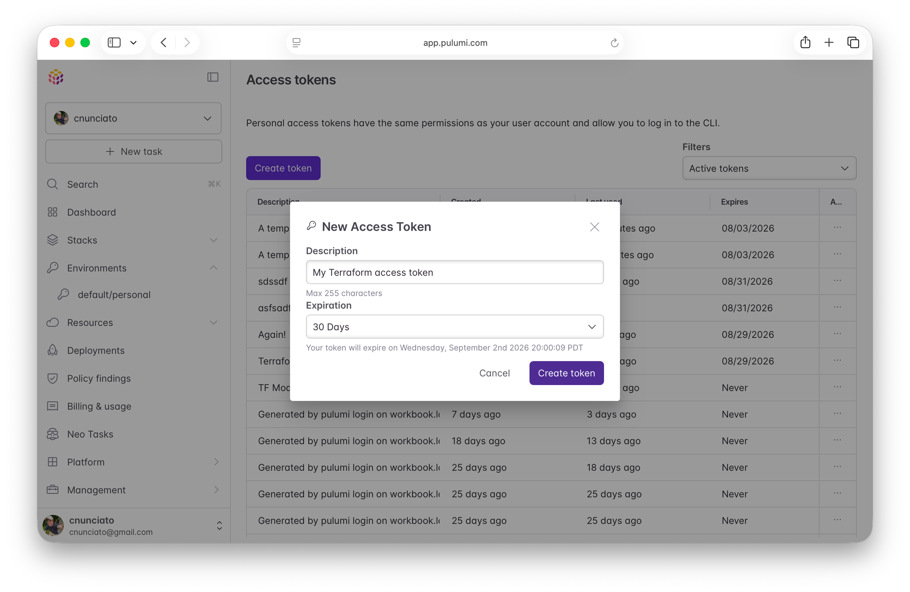
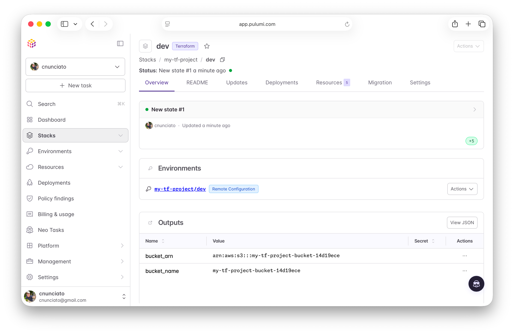
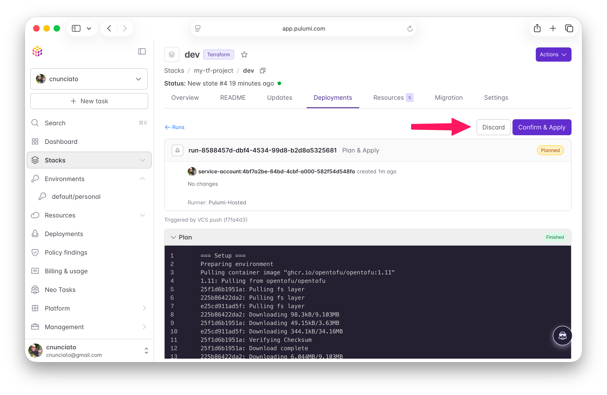
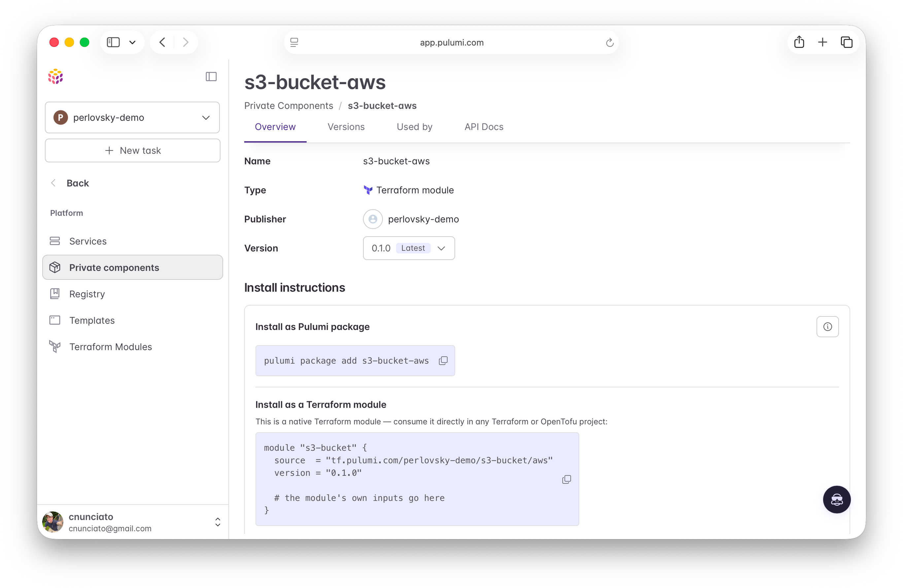

[Today's big release](/releases/terraform-state-backend-modules-hcl/) contains a whole new set of features designed for seamless interoperability with the Terraform and OpenTofu ecosystems, and there's a lot there — so much that it can be tough to get your head around all of it. But it generally falls into three major categories:

* **Support for Pulumi Cloud as a Terraform state backend**, including remote execution with human approvals
* **A Terraform module registry** in Pulumi Cloud that lets you publish, document, and share your modules even across language boundaries
* **First-class support for HCL** as an authoring language in the Pulumi engine

To make this release a little easier to appreciate holistically, I've put together a quick end-to-end walkthrough that doesn't quite cover _everything_, but does cover the big stuff, and should give you a sense of how it all comes together. We'll start with a simple Terraform project that you'll deploy to AWS, and then one step at a time, bring it into Pulumi Cloud and kick the tires on each of these new features as we go. It'll take a bit, but all you'll need are a free Pulumi account and the ability to deploy an S3 bucket to AWS.

We've got a bunch to cover, so let's jump right in.

<!--more-->

## Start with a Terraform project

Our tour begins with a tiny Terraform project that provisions a single Amazon S3 bucket using a locally defined module that we'll publish later. The project is [available on GitHub](https://github.com/cnunciato/simple-tf-template) as a template, and the easiest way to use it is with the GitHub CLI:

```bash
$ gh repo create my-tf-project \
    --template cnunciato/simple-tf-template \
    --public \
    --clone && cd my-tf-project

```

We'll use the local Terraform backend to start. Set your AWS credentials (preferably with [environment variables](https://docs.aws.amazon.com/cli/latest/userguide/cli-configure-envvars.html)), then deploy the project with Terraform or OpenTofu. (This walkthrough uses the `terraform` CLI, but you can swap in `tofu` if that's your preference.)

```bash
$ terraform init && terraform apply
...

Apply complete! Resources: 2 added, 0 changed, 0 destroyed.

Outputs:

bucket_arn = "arn:aws:s3:::my-tf-project-bucket-14d19ece"
bucket_name = "my-tf-project-bucket-14d19ece"
```

Now let's see how to move this project into Pulumi Cloud.

## Migrate the state to Pulumi Cloud

First, [create a Pulumi Cloud account](https://app.pulumi.com/signup) if you don't already have one (it's free for individuals) and sign in to the Pulumi console. Then, add a `backend` block to `main.tf`, swapping `<your-org>` for your own Pulumi Cloud account or organization name:

```hcl
terraform {
  # ...

  backend "remote" {
    hostname     = "tf.pulumi.com"
    organization = "<your-org>"

    workspaces {
      name = "my-tf-project_dev"
    }
  }
}
```

The workspace `name` is an underscore-delimited string that expresses the name of the [project](/docs/iac/concepts/projects/) you'd like to use (here, `my-tf-project`) and the [stack](/docs/iac/concepts/stacks/) (`dev`). A single Pulumi project can have as many stacks as you like.

Next, sign in to Pulumi Cloud with the Terraform CLI:

```bash
$ terraform login tf.pulumi.com
```

Choose `yes` when prompted, and you'll be taken to Pulumi Cloud to create a [personal access token](/docs/administration/access-identity/access-tokens/#personal-access-tokens), which you can paste into the prompt to authenticate:



```
Success! Logged in to Terraform Enterprise (tf.pulumi.com)
```

With the `backend` block in place and your `terraform` CLI signed in to Pulumi Cloud, you're ready to complete the migration:

```bash
$ terraform init -migrate-state
```

Terraform should detect the `backend` change and offer to copy your existing state:

```
Do you want to copy existing state to the new backend?
  Pre-existing state was found while migrating the previous "local" backend
  to the newly configured "remote" backend. [...] Enter "yes" to copy and
  "no" to start with an empty state.

  Enter a value: yes
```

Choose `yes`, and you're done:

```
Successfully configured the backend "remote"! Terraform will automatically
use this backend unless the backend configuration changes.
```

Note that nothing about your deployed infrastructure has changed here; all we did was migrate your local state to Pulumi Cloud, and the process is identical whether you're moving from S3, Azure, Google Cloud, or HCP Terraform or Terraform Enterprise. See [Store Terraform state in Pulumi Cloud](/docs/iac/get-started/terraform/terraform-state-backend/) for details.

Now hop over to the Pulumi Cloud console, choose **Stacks**, and you'll see your new stack in the list, along with its first update:



### Runs happen remotely by default

Another thing to note is that Terraform stacks backed by Pulumi Cloud run *remotely* by default, just as they do in HCP Terraform and Terraform Enterprise. Plans and applies are executed on a Pulumi Cloud-hosted runner, and output is streamed simultaneously to your terminal and to the browser. Try making a small change to `main.tf` — adding a tag, say — and run `terraform apply`:

```diff
  tags = {
    Environment = "dev"
+   Owner       = "me"
  }
```

```bash
$ terraform apply
...

Running apply in the remote backend. Output will stream here.

To view this run in a browser, visit:
https://tf.pulumi.com/app/cnunciato/my-tf-project_dev/runs/run-8a635542-334f-4367-b188-8b4b442b2550
...
```

Confirm with another `yes`, and you'll notice the `apply` *fails* — which makes sense, considering the runner doesn't have your AWS credentials yet. That's where [Pulumi ESC](/docs/esc/) comes in.

### Configure cloud credentials with ESC

When you create a new Terraform stack, Pulumi Cloud automatically creates a linked [ESC environment](/docs/esc/concepts/environments/) for you with the same name. You can use this environment to configure settings of all kinds, including cloud credentials and other encrypted secrets, and make those settings available to the stack at runtime.

In the stack's **Overview** tab, click the linked `my-tf-project/dev` environment to open the environment editor, where you can either set your AWS credentials directly or wire up a new [connection](/docs/esc/guides/configuring-oidc/) by choosing **Add new** → **Login provider/configuration** and following the steps for AWS.

Since I've already configured an environment for sharing my AWS credentials across all of my stacks (which I've named `default/personal`), I can just [import that environment](/docs/esc/concepts/imports/) into this one to use it:

```yaml
imports:
- default/personal
```

Try this yourself, then run the `apply` again, and see that it succeeds:

```bash
$ terraform apply -auto-approve
...

OpenTofu will perform the following actions:

  # module.s3-bucket.aws_s3_bucket.this will be updated in-place
  ~ resource "aws_s3_bucket" "this" {
        id                          = "my-tf-project-bucket-b64b8e37"
      ~ tags                        = {
            "Environment" = "dev"
          + "Owner"       = "me"
        }
      ~ tags_all                    = {
          + "Owner"       = "me"
        }
    }

Plan: 0 to add, 1 to change, 0 to destroy.
...

Apply complete! Resources: 0 added, 1 changed, 0 destroyed.

Outputs:

bucket_arn = "arn:aws:s3:::my-tf-project-bucket-b64b8e37"
bucket_name = "my-tf-project-bucket-b64b8e37"
```

Remote execution is powered by [Pulumi Deployments](/docs/deployments/), which means your Terraform stacks can also be triggered by VCS events — pull requests and pushes to GitHub, GitLab, and others — as well as manual human approvals. Wiring that up is pretty simple as well:

1. Under **Management → Version Control** in the Pulumi console, configure your VCS provider and add the `my-tf-project` repository.
1. In your stack's **Settings** tab, choose **Deploy**, configure the repository and the base branch to build from (e.g., `main`), and save.
1. Push a commit to that branch.

When you do that, you'll see a new plan in the **Deployments** tab, and once that finishes, you'll be prompted to approve or decline the run:



Click **Confirm**, and you're off and running.

And that's it! Your Terraform stacks are now first-class citizens in Pulumi Cloud, with [access control](/docs/administration/access-identity/rbac/), [Neo code reviews](/docs/ai/neo/code-reviews/), and [Pulumi Policies](/docs/insights/policy/) all available to them. [Audit policies](/docs/iac/get-started/terraform/terraform-state-backend/#audit-policies) are runnable on any Terraform stack, and preventative policies can be used to block non-compliant changes before they happen.

Next up: modules.

## Publish a Terraform module

If your team's been using Terraform for a while, chances are you've also written some Terraform modules, so you'll need somewhere to keep them as you move to Pulumi Cloud. In addition to its role as a Terraform state backend, Pulumi Cloud now includes a [private registry](/docs/idp/concepts/terraform-modules/) that can host your Terraform modules and make them available across your organization.

Module publishing requires an [Enterprise or Business Critical](https://www.pulumi.com/pricing/) plan, so you'll need an organization with one of those for this part — but you can easily [create one](https://app.pulumi.com) with a free trial if you don't have one already. In the Pulumi console, open the organization menu, choose **Create organization**, give it a name, and you're good to go.

Pulumi Cloud's Terraform registry API is wire-compatible with HCP Terraform's, which means the tools you already use for publishing — e.g., the [`go-tfe`](https://github.com/hashicorp/go-tfe) library or the [`hashicorp/tfe`](https://registry.terraform.io/providers/hashicorp/tfe/latest/docs) Terraform provider — need only be pointed at `tf.pulumi.com`. To make this easy, our project includes a small Go program that uses `go-tfe` to do just that. Set a Pulumi access token in your terminal (you may need to [obtain a new one](https://app.pulumi.com/user/settings/tokens)), then run it from the project root, passing your organization name:

```bash
$ export PULUMI_ACCESS_TOKEN=<your-access-token>

# Install Go at https://go.dev/doc/install if you don't have it already.
$ go -C upload-module run . \
    -org <your-org> \
    -provider aws \
    -version 0.1.0 \
    -path ./modules/s3-bucket
```

You should see a confirmation:

```
creating module veridian/s3-bucket/aws
uploaded veridian/s3-bucket/aws@0.1.0
```

Then, in the Pulumi console, navigate to **Platform → Private components**, and you should see your newly uploaded module in the list. Click into it to see its details, available versions, usage instructions, and API docs:



With the module now hosted in Pulumi Cloud, you can update your project to use the hosted version instead. Delete the local `./modules` folder entirely, and then in `main.tf`, update the `source` and add a `version`, replacing `<your-org>` with your chosen org name:

```hcl
module "s3-bucket" {
  source  = "tf.pulumi.com/<your-org>/s3-bucket/aws"
  version = "0.1.0"

  # ...
}
```

Now run `terraform plan` and see that the module is downloaded and the plan, as expected, produces no changes:

```bash
$ terraform plan
...

Initializing modules...
Downloading tf.pulumi.com/veridian/s3-bucket/aws 0.1.0 for s3-bucket...
...

No changes. Your infrastructure matches the configuration.
```

Now let's have a look at how you can use this module in other ways.

## Consume the module from a Pulumi program

The whole point of a shared module registry is to help you get more mileage out of the work you put into your Terraform modules. When you use Pulumi Cloud for that registry, you can consume those modules not just from a Terraform program, but from any Pulumi program as well — and in any supported language.

Let's see how this looks with a TypeScript project. If you haven't already, [install Pulumi](/docs/install/), then run:

```bash
$ mkdir ../my-typescript-project && cd $_
$ pulumi new typescript
```

Follow the prompts, accepting the defaults. Then, add the Terraform module to your TypeScript project with `pulumi package add`:

```bash
$ pulumi package add s3-bucket-aws
```

This fairly magical command generates a local TypeScript SDK at `./sdks` that wraps the module as a [Pulumi component](/docs/iac/concepts/components/). To use it, open up `index.ts` and replace its contents with the following:

```typescript
import * as bucket from "./sdks/s3-bucket";

const myModule = new bucket.Module("my-module", {
    bucketPrefix: "my-new-bucket",
    tags: {},
});

export const { bucketName, bucketArn } = myModule;
```

Configure your AWS credentials locally as before — or alternatively, [use the ESC environment you created earlier](/docs/esc/concepts/environments/#using-environments-with-pulumi-iac) if you set one up — then run `pulumi up` to deploy in the usual way:

```bash
$ pulumi up

Updating (dev)

     Type                       Name                       Status
 +   pulumi:pulumi:Stack        my-typescript-project-dev  created (8s)
 +   └─ s3-bucket:index:Module  my-module                  created (5s)
 +      ├─ random:index:Id      my-module-suffix           created (0.21s)
 +      └─ aws:index:S3Bucket   my-module-this             created (2s)

Outputs:
    bucketArn : "arn:aws:s3:::my-new-bucket-bbfa52db"
    bucketName: "my-new-bucket-bbfa52db"

Resources:
    + 4 created
```

Having a language-specific, locally managed SDK at hand comes with many benefits, including IDE support, typed inputs and outputs, and more — but there may be times when you'll prefer a simpler or more dynamic option. In these situations, you can instead choose to load the module at runtime.

In TypeScript, you'd do that with the [`@pulumi/hcl`](/registry/packages/hcl/) module. Try that now by installing it in your project:

```bash
$ npm install @pulumi/hcl
```

... and using it in your program:

```typescript
import * as hcl from "@pulumi/hcl";

const myModule = new hcl.Module("my-module", {
    source: "tf.pulumi.com/<your-org>/s3-bucket/aws",
    version: "0.1.0",
    inputs: {
        bucket_prefix: "my-new-bucket",
        tags: {},
    },
});

export const { bucket_name, bucket_arn } = myModule.outputs;
```

Because this approach uses untyped references, you'll trade a little type safety for flexibility — but either way, you're able to keep using the modules you've already built, while migrating to *new* infrastructure in general-purpose languages on whatever schedule works best for your team.

## Write and run HCL, natively

For as much flexibility as general-purpose languages offer, some teams simply prefer to use HCL. So as of today, HCL is now a first-class language in the Pulumi engine, right alongside TypeScript, JavaScript, Python, Go, .NET, Java, and YAML.

The easiest way to get a feel for it is to create a new project from a template:

```bash
$ mkdir ../my-hcl-project && cd $_
$ pulumi new aws-hcl
```

As before, step through the prompts, then open the generated Pulumi project's `main.tf`:

```hcl
terraform {
  required_providers {
    aws = {
      source = "pulumi/aws"
    }
  }
}

# Create an AWS resource (S3 Bucket)
resource "aws_s3_bucket" "my-bucket" {}

# Export the name of the bucket
output "bucket_name" {
  value = aws_s3_bucket.my-bucket.id
}
```

You can deploy this out of the box (after setting your AWS credentials again, of course) to see the magic happen:

```bash
$ pulumi up

Updating (dev)

     Type                 Name                Status
 +   pulumi:pulumi:Stack  my-hcl-project-dev  created (6s)
 +   └─ aws:s3:Bucket     my-bucket           created (3s)

Outputs:
    bucket_name: "my-bucket-7282e67"

Resources:
    + 2 created

Duration: 7s
```

This template happens to use the `pulumi/aws` provider, but you're free to pull in any others as well: [native Pulumi providers](/docs/iac/concepts/providers/), official `hashicorp/*` providers, community-supported providers, and more. In fact, you can try that now by replacing the code in `main.tf` with the same code you used in the Terraform program you left off with earlier — only without the explicit `terraform > backend` block, as it's no longer needed:

```hcl
module "s3-bucket" {
  source  = "tf.pulumi.com/<your-org>/s3-bucket/aws"
  version = "0.1.0"
  bucket_prefix = "my-tf-project-bucket"
  tags = {}
}

output "bucket_name" {
  value = module.s3-bucket.bucket_name
}

output "bucket_arn" {
  value = module.s3-bucket.bucket_arn
}
```

Run `pulumi up` again, and you'll see the module get picked up and used, just as before:

```bash
$ pulumi up

Updating (dev)

     Type                                  Name                Status
 +   pulumi:pulumi:Stack                   my-hcl-project-dev  created (10s)
 +   └─ components:index:C619d883588c0366  s3-bucket           created (8s)
 +      ├─ random:index:Id                 s3-bucket.suffix    created (0.22s)
 +      └─ aws:index:S3Bucket              s3-bucket.this      created (3s)

Outputs:
    bucket_arn : "arn:aws:s3:::my-tf-project-bucket-f61cea35"
    bucket_name: "my-tf-project-bucket-f61cea35"

Resources:
    + 4 created

Duration: 12s
```

And with that, our tour is complete. Be sure to clean up both projects with a `terraform destroy` and `pulumi destroy` when you're done.

## Where to go next

Now you've seen it all come together: You can back your Terraform state with Pulumi Cloud, publish and share your modules, consume those modules from any Pulumi language, and write HCL that runs natively — all without having to rewrite what you've already built.

A few next steps to keep the learning going:

* Explore our [architecture templates](/templates/) to bootstrap new HCL projects easily
* Read up on [Terraform state](/docs/iac/get-started/terraform/terraform-state-backend/), [remote execution](/docs/iac/get-started/terraform/terraform-remote-execution/), and [Terraform modules](/docs/idp/concepts/terraform-modules/) in Pulumi Cloud
* Dive into [Pulumi and HCL](/docs/iac/languages-sdks/hcl/)
* Check out the [full set of features](/releases/terraform-state-backend-modules-hcl/) in this release

We'd love for you to kick the tires on all of this and let us know what you think. If something seems missing or doesn't behave as you'd expect, [open an issue](https://github.com/pulumi/pulumi/issues), let us know in the [Pulumi Community Slack](https://slack.pulumi.com/), or [reach out](/contact/?form=sales) if you'd like to learn more.

Happy building!
