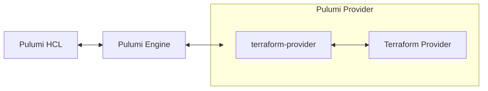
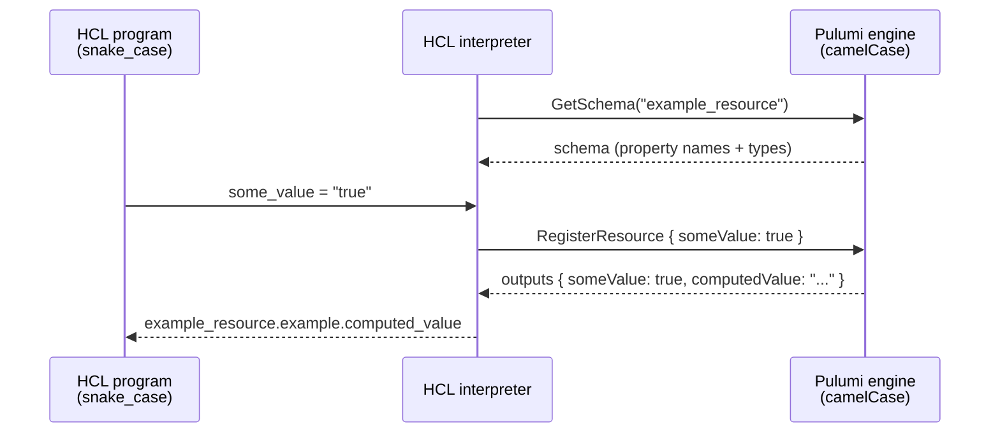

The core promise of Pulumi's HCL support is that you can bring your existing Terraform configuration and modules, and `pulumi` will run them. If it works in OpenTofu and doesn't work in Pulumi, we would like to fix that. Given that goal, our HCL interpreter needs to take HCL as input and emit instructions to the Pulumi engine that semantically match how `tofu` would interpret the same input. This is made harder by the fact that Pulumi and OpenTofu have fundamentally different engine semantics and provider ecosystems. This blog post will explore how we have implemented that mapping well enough to get 96%[^1] of our top Terraform modules working on Pulumi. We'll briefly walk through how Pulumi's HCL interpreter handles Terraform's resource semantics, providers, and modules. It will also call out where Pulumi's HCL support lets you do things that Terraform and OpenTofu will not allow.

<!--more-->

[^1]: This is 56/58 of the top Terraform AWS Module by usage. Failures are due to ephemeral resources.

## Providers

Both Pulumi and Terraform have providers, but they don't have the same providers. While there are providers that Terraform [does](/registry/packages/pulumiservice/) [not](/registry/packages/azure-native/) [have](/registry/packages/kubernetes/), Pulumi can always resolve a Terraform provider using Pulumi's confusingly named [`terraform-provider`](/registry/packages/terraform-provider/) provider.[^2] This is the same provider that lets you consume *Any Terraform Provider* in another Pulumi program with `pulumi package add terraform-provider ...`. The `terraform-provider` provider acts as a relay: it speaks Pulumi's protocol to the Pulumi engine, and speaks Terraform's provider protocol to the Terraform provider it stands up. Because Pulumi HCL needs to work with all Pulumi providers and because `terraform-provider` lets Pulumi HCL speak to Terraform providers via the Pulumi protocol, Pulumi HCL actually only speaks Pulumi protocols directly:



All internals of [github.com/pulumi/pulumi-hcl](https://github.com/pulumi/pulumi-hcl) are implemented in Pulumi's language protocol.

Because the `terraform-provider` natively understands Terraform version ranges and defaults to the OpenTofu registry, we can directly translate normal provider requests to the `terraform-provider`. It takes its arguments as an untyped list of strings, since the interface was originally intended for the command line. Let's walk through some simple examples:

```hcl
resource "aws_s3_bucket" "example" {
  bucket = "my-bucket-123"
}
```

Pulumi's HCL interpreter sees that there is no `terraform.required_providers` block, so it cuts the resource token at the first `_` and uses the default registry and namespace. This is what the request that goes to the Pulumi engine looks like:

```go
pulumirpc.PackageSpec{
	Source:     "terraform-provider",
	Parameters: []string{"registry.opentofu.org/hashicorp/aws"},
}
```

Because no version was specified, we leave it to `terraform-provider` to determine the version. It will [use the latest version](https://github.com/pulumi/pulumi-terraform-bridge/blob/v3.135.0/dynamic/internal/shim/run/loader.go#L240-L252).

Just like Terraform, you can override this with a `required_providers` block:

```hcl
terraform {
  required_providers {
    example = {
      source  = "my.custom.registry/me/example"
      version = "~> 5.0"
    }
  }
}

resource "example_resource" "another_example" {
}
```

We perform the same mechanical translation. The source is fully specified, and there is a version, so we [pass it along to the Pulumi engine](https://github.com/pulumi/pulumi-hcl/blob/3e810b1c378abc0e0134810f897a85903f4c0abf/pkg/server/server.go#L232-L239), which passes it along to `terraform-provider`:

```go
pulumirpc.PackageSpec{
	Source:     "terraform-provider",
	Parameters: []string{"my.custom.registry/me/example", "~> 5.0"},
}
```

Pulumi HCL will automatically translate almost all provider calls through the `terraform-provider` translator. Providers with the source `pulumi/*` will instead be routed directly. This is how you can use a native Pulumi provider in Pulumi HCL:

```hcl
terraform {
  required_providers {
    kubernetes = {
      source  = "pulumi/kubernetes"
      version = "4.33.0"
    }
  }
}

resource "kubernetes_yaml_config_file" "app" {
  file = "app.yaml"
}
```

Our HCL interpreter routes this directly to the Pulumi Kubernetes package:

```go
pulumirpc.PackageSpec{
	Source:  "kubernetes",
	Version: "4.33.0",
}
```

Observe that the version moved from `Parameters` to the `Version` field. That's because providers written with `source = "pulumi/*"` are talking about the plugin directly.

[^2]: I named it, naming is hard. I wanted you to be able to type `pulumi package add terraform-provider <your-provider>`.

## Resources

Both Pulumi programs and Terraform config exist to express a resource graph. It is their primary purpose. I don't have the time or the pixels to explain everything, so I'll restrict myself to three sub-topics here:

- Property name translation
- Provisioners and conditions
- Resource options

### Property name translation

If you've ever looked at the schema behind any of our providers, you will observe that names are camelCase.

```json
    "aws:s3/bucket:Bucket": {
        "properties": {
            "accelerationStatus": { "type": "string", "description": "...", "deprecationMessage": "..." },
            "bucketDomainName": { "type": "string", "description": "..." },
            "bucketNamespace": { "type": "string", "description": "..." },
            ...
```

Our codegen actually relies on this fact, which means that even the schemas produced by `terraform-provider` use camelCase property names. The clever among you will see the problem: Terraform uses snake_case by convention. When Pulumi HCL sends a resource request with property values, it needs to translate from the snake_case text to camelCase for the engine, and then back again on values returned by the engine.



Doing this correctly actually requires you to be aware of the resource's schema; the raw value is not enough. Let's work through an example to understand why:

```hcl
resource "example_resource" "example" {
  some_value = "true"
  block {
    inner_value = false
  }
  another_attribute = {
    "trap_one" = 1
    "trap_two" = 2
  }
}
```

Here are two different value blobs (represented as JSON) that correspond to the inputs for `"example"` above. Both are valid, depending on the type of `"example_resource"`:

```json
{
  "someValue": "true",
  "block": {
    "innerValue": false
  },
  "anotherAttribute": {
    "trap_one": 1,
    "trap_two": 2
  }
}
```

```json
{
  "someValue": true,
  "block": [{
    "innerValue": "false"
  }],
  "anotherAttribute": {
    "trapOne": "1",
    "trapTwo": 2
  }
}
```

Let's break down the difference between the two potential value blobs:

- HCL converts scalar values to the type the provider expects, so if `someValue` is typed as a string, we keep the `"true"`. If it's typed as a boolean, we convert and pass the provider the converted value: `true`.
- If `block` is typed as an object, the Pulumi provider expects to see an object back on the wire. If `block` is typed as a list of objects, then the Pulumi provider needs to see a list of objects back, even if it's a list of one.
- `innerValue` can have the same type conversion as `someValue`. Type conversion doesn't stop at the top level.
- If `anotherAttribute` is a map type, then its keys are user-provided values and need to be kept as they are. If it's an object type, then its keys need to be shifted back to camelCase.

Pulumi's HCL interpreter is thus type aware. It queries the engine for the schema of each provider it translates for and does the correct conversion, tracking the target type as it walks the value for translation. This is not limited to resources; it does the same translation for data sources, modules, and provider blocks.

For Pulumi providers that are [bridged](https://github.com/pulumi/pulumi-terraform-bridge) from Terraform providers, we apply an additional step. Bridged providers expose an explicit naming table used by [`pulumi convert --from terraform`](/docs/iac/guides/migration/migrating-to-pulumi/from-terraform/). Pulumi HCL queries the engine for this mapping also, and uses that to make sure that resource and property names line up exactly with the underlying Terraform provider, even if the property was renamed or hidden in Pulumi.

### Provisioners and conditions

[Terraform provisioners](https://opentofu.org/docs/language/resources/provisioners/syntax/) allow the Terraform config to specify commands to run at various points in the resource lifecycle. [Conditions](https://opentofu.org/docs/language/expressions/custom-conditions/) allow the same, but for boolean expressions to be evaluated instead. For example:

```hcl
resource "example_resource" "example" {
  input = var.input

  lifecycle {
    precondition {
      condition     = var.input > 3
      error_message = "var.input must exceed 3"
    }
  }

  provisioner "local-exec" {
    command = "echo An example output is ${self.output} >> file.txt"
  }
}
```

Pulumi only has one mechanism to hook into the resource lifecycle: [hooks](/docs/iac/concepts/resources/options/hooks/). Pulumi's resource hooks are powerful enough to express both provisioners and conditions. The easiest way I can express this is by comparison to another language. I'll use TypeScript. The example configuration block above is equivalent to this TypeScript program:

```typescript
const config = new pulumi.Config();

const precondition = new pulumi.ResourceHook("example_resource:precondition:example", async args => {
  const inputs = args.newInputs as example.ResourceArgs;
  if (inputs.input <= 3) {
    throw new Error("var.input must exceed 3");
  }
});

const provisioner = new pulumi.ResourceHook("example_resource:provisioner:example", async args => {
  const self = args.newOutputs as example.ResourceState;
  const { exec } = require('child_process');
  exec(`echo An example output is ${self.output} >> file.txt`);
});

new example.Resource("example", {
  input: config.requireNumber("input"),
}, {
  hooks: {
    beforeCreate: [precondition],
    beforeUpdate: [precondition],
    afterCreate:  [provisioner],
  },
});
```

The full mapping between Terraform provisioners and conditions and Pulumi hooks can be found below:

| Terraform | Pulumi |
|-----------|--------|
| `lifecycle.precondition` | `beforeCreate`, `beforeUpdate` |
| `lifecycle.postcondition` | `afterCreate`, `afterUpdate` |
| `provisioner` (creation-time) | `afterCreate` |
| `provisioner` with `when = destroy` | `beforeDelete` |
| `lifecycle.prevent_destroy` | `beforeDelete` (always errors) |

Creation-time provisioners bind only to `afterCreate`: Terraform does not re-run provisioners on update, and neither do we.

### Resource options

Our final challenge for resources is Terraform's various resource options. Resource options in both Terraform and Pulumi exist to give special instructions to the engine concerning a specific resource. We can classify Terraform's resource options into two kinds:

- Those that can be handled at the language level.
- Those that need engine support.

Let's start by going through those that can be handled at the language level without engine support in Pulumi:

- `count`/`for_each`: The HCL interpreter unrolls `count` and `for_each` and sends a request for each underlying resource. These are equivalent to using a for-loop in any of Pulumi's programming languages.
- `lifecycle.prevent_destroy`: Pulumi doesn't have an equivalent in-language hook ([`protect`](/docs/iac/concepts/resources/options/protect/) is stored in state). We emulate `prevent_destroy` with a `beforeDelete` hook, exactly like our destroy-time provisioners.

For most of the resource options that require real engine support, Pulumi has equivalent options:

- `lifecycle.replace_triggered_by`: Terraform allows specifying either resources or values here. We evaluate every element and feed it to [`replacementTrigger`](/docs/iac/concepts/resources/options/replacementtrigger/). Elements that reference a resource also contribute that resource to [`replaceWith`](/docs/iac/concepts/resources/options/replacewith/), which covers the case where the referenced resource is replaced without any of its attribute values changing.
- `lifecycle.ignore_changes`: We map this directly to Pulumi's `ignoreChanges`. We translate the paths from Terraform's snake_case to Pulumi's camelCase for you.
- `lifecycle.create_before_destroy`: To replicate Terraform's default behavior, we register all resources with [`deleteBeforeReplace`](/docs/iac/concepts/resources/options/deletebeforereplace/) set to true. When `lifecycle.create_before_destroy` is set, we go back to Pulumi's default behavior here.
- `provider`: Pulumi has exactly [this concept](/docs/iac/concepts/resources/options/provider/). We pass it through to the engine as is.
- `depends_on`: We pass this directly to the Pulumi engine.

That's how we map Terraform's resource options. Of course, Pulumi has its own set of resource options, and we expose those on resources with a `pulumi` block. You can see the remaining resource options in the [Pulumi resource options docs page](/docs/iac/concepts/resources/options/).

## Modules

Terraform has modules, and Pulumi has [components](/docs/iac/concepts/components/). Naturally, we represent Terraform modules as components. Under the hood, Pulumi has two different kinds of components:

- [In-language components](/docs/iac/concepts/components/)
- [Multi-language components](/docs/iac/guides/building-extending/components/packaging-components/) (MLCs)

In-language components are components that are consumed directly within the language. They don't need the Pulumi engine's intervention to serve them. In Pulumi HCL, this is what you get when you write a `module` block. The same language host running the rest of your program loads that HCL and interprets it.

Pulumi HCL also supports MLCs as both a consumer and a provider. That means it can work with the engine to let you consume MLCs written in other Pulumi languages in HCL, and that you can consume HCL modules in other Pulumi languages.

From HCL's perspective, an MLC is just like any other resource, so consuming one looks like any other resource construction. Here is what it looks like to consume our [AWSx VPC resource](/registry/packages/awsx/api-docs/ec2/vpc/) (written in TypeScript) in HCL:

```hcl
terraform {
  required_providers {
    awsx = {
      source = "pulumi/awsx"
    }
  }
}

resource "awsx_ec2_vpc" "example" {
  availability_zone_names = ["us-west-2a", "us-west-2b"]
}
```

We can consume HCL modules in other Pulumi languages as well. Here is what it looks like to consume the unrelated [`terraform-aws-modules/vpc/aws`](https://registry.terraform.io/modules/terraform-aws-modules/vpc/aws/latest) module in a Pulumi language:



{}

```typescript
import * as pulumi from "@pulumi/pulumi";
import * as hcl from "@pulumi/hcl";

const vpc = new hcl.Module("vpc", {
    source: "terraform-aws-modules/vpc/aws",
    version: "5.0.0",
    inputs: {
        name: "example-vpc",
        cidr: "10.0.0.0/16",
    },
});

export const vpcId = vpc.outputs.apply(o => o["vpc_id"]);
```

{}

{}

```python
import pulumi
import pulumi_hcl as hcl

vpc = hcl.Module("vpc",
    source="terraform-aws-modules/vpc/aws",
    version="5.0.0",
    inputs={
        "name": "example-vpc",
        "cidr": "10.0.0.0/16",
    })

pulumi.export("vpc_id", vpc.outputs["vpc_id"])
```

{}

{}

```go
package main

import (
	"github.com/pulumi/pulumi-hcl/sdk/go/hcl"
	"github.com/pulumi/pulumi/sdk/v3/go/pulumi"
)

func main() {
	pulumi.Run(func(ctx *pulumi.Context) error {
		vpc, err := hcl.NewModule(ctx, "vpc", &hcl.ModuleArgs{
			Source:  "terraform-aws-modules/vpc/aws",
			Version: pulumi.StringRef("5.0.0"),
			Inputs: pulumi.Map{
				"name": pulumi.String("example-vpc"),
				"cidr": pulumi.String("10.0.0.0/16"),
			},
		})
		if err != nil {
			return err
		}
		ctx.Export("vpcId", vpc.Outputs.MapIndex(pulumi.String("vpc_id")))
		return nil
	})
}
```

{}

{}

```csharp
using System.Collections.Generic;
using Pulumi;
using Pulumi.Hcl;

return await Deployment.RunAsync(() =>
{
    var vpc = new Module("vpc", new ModuleArgs
    {
        Source = "terraform-aws-modules/vpc/aws",
        Version = "5.0.0",
        Inputs =
        {
            { "name", "example-vpc" },
            { "cidr", "10.0.0.0/16" },
        },
    });

    return new Dictionary<string, object?>
    {
        ["vpcId"] = vpc.Outputs.Apply(o => o["vpc_id"]),
    };
});
```

{}

{}

```java
package myapp;

import com.pulumi.Pulumi;
import com.pulumi.hcl.Module;
import com.pulumi.hcl.ModuleArgs;
import java.util.Map;

public class App {
    public static void main(String[] args) {
        Pulumi.run(ctx -> {
            var vpc = new Module("vpc", ModuleArgs.builder()
                .source("terraform-aws-modules/vpc/aws")
                .version("5.0.0")
                .inputs(Map.of(
                    "name", "example-vpc",
                    "cidr", "10.0.0.0/16"))
                .build());

            ctx.export("vpcId", vpc.outputs().applyValue(o -> o.get("vpc_id")));
        });
    }
}
```

{}

{}

```yaml
name: example
runtime: yaml
resources:
  vpc:
    type: hcl:index:Module
    properties:
      source: terraform-aws-modules/vpc/aws
      version: "5.0.0"
      inputs:
        name: example-vpc
        cidr: 10.0.0.0/16
outputs:
  vpcId: ${vpc.outputs["vpc_id"]}
```

{}



If you want strongly typed SDKs for your Terraform modules, you can generate them with [`pulumi package add`](/docs/iac/guides/building-extending/using-existing-tools/use-terraform-module/).

## Conclusion

This has been a brief survey of how we have mapped Terraform's semantics onto Pulumi's engine. Providers are bridged into Pulumi, resource options are translated or handled directly in the Pulumi HCL interpreter, and modules are components... in any language.

If you want to try it yourself, start with the [get-started guide](/docs/iac/get-started/terraform/). And if you find a program that works in OpenTofu but not in Pulumi, that's a bug: [file an issue](https://github.com/pulumi/pulumi-hcl/issues) and we would love to fix it.
