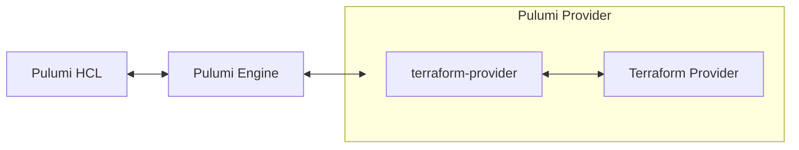

The core promise of Pulumi's HCL support is that your can bring your existing Terraform configuration & modules, and `pulumi` will run them. If it works in OpenTofu and doesn't work in Pulumi, we would like to fix that. Given that goal, our PCL interpreter needs to take as input HCL and emit instructions to the Pulumi engine that semantically match how `tofu` would interprets the same input. This is made harder by the fact that Pulumi & OpenTofu have fundamentally different engine semantics and provider ecosystems. This blog post will explore how we have implemented that mapping well enough to get TODO% of the top Terraform Modules working on Pulumi. This blog post will briefly walk through how Pulumi's HCL interpreter handles Terraform's resource semantics, providers and modules. It will also call out where Pulumi's HCL support lets you do things that Terraform & OpenTofu will not allow.

<!--more-->

## Providers

Both Pulumi & Terraform have providers, but they don't have the same providers. While there are providers that Terraform does (link: PSP) not (link: azure-native) have (link: kubernetes), Pulumi can always resolve a Terraform provider using Pulumi's confusingly named `terraform-provider` provider (link: to registry).[^1] This is the same provider that lets you consume *Any Terraform Provider* in another Pulumi program with `pulumi package add terraform-provider ...`. The `terraform-provider` provider acts as a relay, it speaks Pulumi's protocol to the Pulumi engine, and speaks Terraform's protocol to the terraform provider it stands up. Because Pulumi HCL needs to work with all Pulumi providers & because `terraform-provider` lets Pulumi HCL speak to Terraform providers via the Pulumi protocol, Pulumi HCL actually only speaks Pulumi protocols directly:



All internals of [github.com/pulumi/pulumi-hcl](https://github.com/pulumi/pulumi-hcl) are implemented in Pulumi's language protocol.

Because the `terraform-provider` natively understands Terraform version ranges and defaults to the OpenTofu registry, we can directly translate normal provider requests to the `terraform-provider`. It takes its arguments as an untyped list of strings, since the interface was originally intended for the command line. Let's walk through some simple examples:

```hcl
resource "aws_s3_bucket" "example" {
  bucket = "my-bucket-123"
}
```

Pulumi's HCL interpreter sees that there is no `terraform.required_providers` block, so it cuts the resource token at the first `_` and uses the default registry and namespace. This is what the request that goes to the Pulumi engine looks like:

```go
workspace.PackageDescriptor{
	PluginDescriptor: workspace.PluginDescriptor{
		Name: "terraform-provider",
		Kind: apitype.ResourcePlugin,
	},
	Parameterization: ["registry.opentofu.org/hashicorp/aws"],
}
```

Because no version was specified, we leave it to `terraform-provider` to determine the version. It will use the latest version. (link: latest version code in dynamic bridge)

Just like Terraform, you can override this with a `required_providers` block:

```hcl
terraform {
  required_providers {
    example = {
      source  = "my.cusom.registry/me/example"
      version = "~> 5.0"
    }
  }
}

resource "example_resource" "another_example" {
}
```

We perform the same mechanical translation. The source is fully specified, and there is a version, so we pass a it along to the Pulumi engine (link: where we construct the request in pulumi-hcl), which passes it along to `terraform-provider`:

```go
workspace.PackageDescriptor{
	PluginDescriptor: workspace.PluginDescriptor{
		Name: "terraform-provider",
		Kind: apitype.ResourcePlugin,
	},
	Parameterization: ["my.cusom.registry/me/example", "~> 5.0"],
}
```

Pulumi HCL will automatically translate almost all provider calls through the `terraform-provider` translator. Providers with the source `pulumi/*` will instead be routed directly. This is how you can use a native Pulumi provider in Pulumi HCL:

```hcl
terraform {
  required_providers {
    kubernetes = {
      source = "pulumi/kubernetes"
      version = "4.33.0"
    }
  }
}

resource "kubernetes_yaml_config_file" "app" {
  file = "app.yaml"
}
```

Our HCL interpreter routes this directly to the Pulumi Kubernetes package:

```go
workspace.PackageDescriptor{
	PluginDescriptor: workspace.PluginDescriptor{
		Name:    "kubernetes",
		Kind:    apitype.ResourcePlugin,
        Version: "4.33.0"
	},
}
```

Observe that the version moved from the `Parameterization` block to the plugin block. That's because providers written with `source = "pulumi/*"` are talking about the plugin directly.

[^1]: I named it, naming is hard. I wanted you to be able to type `pulumi package add terraform-provider <your-provider>`.

## Resources

Both Pulumi programs & Terraform config exist to express a resource graph. It is their primary purpose. I don't have the time or the pixals to explain everything, so I'll restrict myself to 3 sub-topics here:

- Property name translation
- Provisioners & validators
- Resource options

### Property Name Translation

If you've ever looked at the schema behind any of our providers, you will observe that names are camelCase.

```json
    "aws:s3/bucket:Bucket": {
        "properties": {
            "accelerationStatus": { "type": "string", "description": "...", "deprecationMessage": "..." },
            "bucketDomainName": { "type": "string", "description": "..." },
            "bucketNamespace": { "type": "string", "description": "..." },
            ...
```

Our codegen actually relies on this fact, which means that even the schemas produced by `terraform-provider` use camelCase property names. The clever among you will see the problem: Terraform uses snake_case by convention. When Pulumi HCL sends a resource request with property values, it needs to translate from the snake\_case text to camelCase for the engine, and then back again on values returned by the engine.

```mermaid
TODO: I think a diagram would be helpful here
```

Doing this correctly actually requires you to be aware of the resource's schema, the raw value is not enough. Let's work through an example to understand why:

```hcl
resource "example_resource" "example" {
  some_value = "true"
  block {
    inner_value = false
  }
  another_attribute = {
    "trap_one" = 1
    "trap_two" = 2
  }
}
```

Here are two different value blobs (represented as JSON) that correspond to the inputs for `"example"` above. Both are valid, depending on the type of `"example_resource"`:

```json
{
  "someValue": "true",
  "block": {
    "innerValue": false
  },
  "anotherAttribute": {
    "trap_one": 1,
    "trap_two": 2
  }
}
```

```
{
  "someValue": true,
  "block": [{
    "innerValue": "false"
  }],
  "anotherAttribute": {
    "trapOne": "1",
    "trapTwo": 2
  }
}
```

Let's break down the difference between the two potential value blobs:

- HCL converts scalar values to the type the provider expects, so if `someValue` is typed as a string, we keep the `"true"`. If its typed as a boolean, we convert and pass the provider the converted value: `true`.
- If `block` is typed as an object, the Pulumi provider expects to see an object back on the wire. If `block` is typed as a list of objects, then the Pulumi provider needs to see a list of objects back, even if its a list of one.
- `innerValue` can have the same type conversion as `someValue`. Type conversion doesn't stop at the top level.
- If `anotherAttribute` is a map type, then it's keys are user provided values and need to be kept as they are. If it's an object type, then its keys need to be shifted back to camelCase.

Pulumi's HCL interpreter is thus type aware. It queries the engine for the schema of each provider it translates for and does the correct conversion, tracking the target type as it walks the value for translation. This is not limited to resources, it does the same translation for data sources, modules & provider blocks.

For Pulumi providers that are bridged (link: bridge) from Terraform providers, we apply an additional step. Bridged providers expose an explicit naming table used by `pulumi convert --from terraform` (link: converter). Pulumi HCL queries the engine for this mapping also, and uses that to make sure that resource & property names line up exactly with the underlying Terraform provider, even if the property was renamed or hidden in Pulumi.

### Provisioners & Validators

Terraform provisioners (link: Terraform provisioners doc page) allow the Terraform config to specify a commands to be run at various points in the resource lifecycle. Conditions (link: Terraform validators doc page) allow the same, but for boolean expressions to be evaluated instead. For example:

```hcl
resource "example_resource" "example" {
  input = var.input
  
  lifecycle {
    precondition {
      condition     = var.input > 3
      error_message = "var.input must exceed 3"
    }
  }
  
  provisioner "local-exec" {
    command = "echo An example output is ${self.output} >> file.txt"
  }
}
```

Pulumi only has one mechanism to hook into the resource life-cycle: hooks (link: Pulumi hooks doc page). Pulumi's resource hooks are powerful enough to express both provisioners & conditions. The easiest way I can express this is by comparison to another language. I'll use TypeScript. The example configuration block above is equivalent to this TypeScript program:

```typescript
const config = new pulumi.Config();

const precondition = new pulumi.ResourceHook("example_resource:precondition:example", async args => {
  const inputs = args.newInputs as example.ResourceArgs;
  if (inputs.input > 3) {
    raise new Exception("var.input must exceed 3");
  }
});

const provisioner = new pulumi.ResourceHook("example_resource:provisioner:example", async args => {
  const self = args.newOutputs as example.ResourceState;
  const { exec } = require('child_process');
  exec(`echo An example output is ${self.output} >> file.txt`);
})

new example.Resource("example", {
  input: config.require("input"),
}, {
  hooks: {
    beforeCreate: [precondition],
    afterCreate:  [provisioner],
  },
})
```

The full mapping between Terraform provisioners and validators and Pulumi hooks can be found below:

| Terraform | Pulumi |
|-----------|--------|
| TODO      | TODO   |

### Resource Options

TODO

## Modules

TODO

## Conclusion

This has been a brief survey of how we have mapped Terraform's semantics onto Pulumi's engine.

TODO
