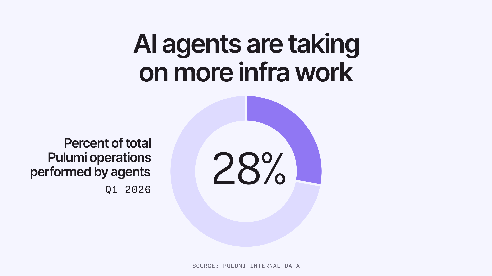

The first frontier agents excelled at was coding. The reason is evident: we have billions of lines of self-documenting code available on the internet for the LLMs to learn from. We can measure their performance on coding thanks to linters, type checkers, compilers, and test suites. The most advanced agentic systems to hit product/market fit have been coding-oriented, and it has resulted in an intense velocity increase in how much and how fast code we can write.

But as the AI tsunami whips up reams of code, what happens to it becomes just as critical. As an industry, we've moved beyond just coding to engineering, which includes documentation, tests, automation, and, yes, managing the very infrastructure our applications need to run. The deeper into production you go, however, the less good agents naturally are at helping. At Pulumi, we live and breathe infrastructure, and have seen this firsthand. But we've also been hard at work building the platform this new era runs on. In this post, I'll share our point of view, what we've built, what we're launching today, and why all infrastructure is about to be agentic.

<!--more-->

## LLMs are natural coders

It is remarkable to look back and note that frontier models, less than two years ago, in August 2024, scored just 33% on SWE-bench Verified. Present-day models score 86%, which represents a 4x reduction in the errors models will make when coding. This enables models to solve increasingly difficult coding problems, and humans can lean more heavily on them to offload tasks. Anthropic's new Mythos model scores 94% and, although it isn't generally available at the time of this article, there's no question we'll close in on 95% by the end of 2026. That is another 2.3x reduction in error rates. This very naturally puts us onto the last mile of fully agentic coding.

This has been the result of code being highly in-distribution combined with the relentless pursuit of solving coding problems from the frontier labs, especially with Anthropic's Claude Code, but now with OpenAI's Codex, driving a tight feedback loop that turns into an improvement flywheel.

Given that LLMs are natural coders, most of us simply assumed that the breakout success we've seen with agents for coding would automatically translate into new problem domains. And for sure, we have seen some success. But perhaps not as much as we'd like. Not all problem domains are documented equally well so that the models can naturally learn about them.

Andrej Karpathy noted nearly a year ago that, "Building a modern app is a bit like assembling IKEA furniture," observing that, though writing the code was easy, fun, and fast, the next mile of actually getting the application running in production entailed many things the LLM wasn't naturally good at, including "services, API keys, configurations, dev/prod deployments."

At the same time, we're seeing something magical happen here at Pulumi: LLMs are now doing over 20% of the infrastructure deployments, up from virtually zero a year ago. We expect this to grow to over 50% before the end of this year and well beyond afterwards.



The agentic infrastructure era is here. Today we're announcing several new platform capabilities to accelerate it further.

Before getting to what's new, however, why are we seeing this happening in reality?

## Turning infrastructure problems into coding problems

We began our journey with our open-source infrastructure-as-code project nearly ten years ago. Having spent much of my career working on programming languages and compilers, I had a strong conviction that the right substrate for infrastructure was the languages developers already knew and loved, not yet another DSL and certainly not piles of YAML. So we focused first on great ergonomics for humans, and for us, that meant letting you use programming languages, tools, and ecosystems that humans already know and love. Languages like Python, TypeScript, Go, C#, Java, and more. Infrastructure as code also, importantly, comes with guardrails to make infrastructure deployments dependable, reviewable, and auditable. Over time we've built out an entire platform with security, compliance, and governance capabilities.

One way of thinking about this is we modeled the realm of cloud infrastructure inside the realm of programming languages: cloud resources become objects, configurations are just variables, dependencies between resources are just references, standard blueprints become classes. Doing so turns the cloud into something that is suddenly programmable, and allows us to apply real software engineering patterns and practices to infrastructure.

Here's the twist we've realized this past year. It is a happy accident that the combination of this plus the verifiability of every change is the exact combination that empowers agents to do infrastructure. LLMs are natural coders. By mapping infrastructure space in code space, agents can do what they're great at – code – and the infrastructure as code engine is the link that maps those code edits back down into infrastructure space. And as the SWE-bench curve plays out, every domain expressed in code rides it. Infrastructure, thanks to the bet we made nine years ago, is now one of them.

This isn't just about volume of in-distribution code. Most production infrastructure code lives in private repositories. In contrast, public Python and TypeScript include vast amounts of genuinely production-grade open source, demonstrating real patterns at scale. Public infrastructure DSL corpora skew heavily toward tutorial-grade content that doesn't scale. By modeling infrastructure in real languages, Pulumi inherits at-scale in-distribution directly. Patterns in Python or TypeScript generalize from what the model has practiced, while DSL patterns are idiosyncratic by definition and don't compound the same way. Code can express everything an engineer can do, which is exactly why models trained on it have become prolific engineers.

What does this look like in practice? For example, an agent can define reusable infrastructure:

```python
import pulumi
import pulumi_coreweave as coreweave
import pulumi_nvidia_aicr as aicr

class TrainingCluster(pulumi.ComponentResource):
  """A reusable training cluster resource."""
  kubeconfig: pulumi.Output[str]
  def __init__(self, name: str, *, nodes: int, accelerator: str):
    super().__init__("training:Cluster", name)
    self.cluster = coreweave.KubernetesCluster(f"{name}-k8s",
      accelerator=accelerator, # gb200/b200/h100
      count=nodes)
    self.stack = aicr.ClusterStack(f"{name}-aicr",
      kubeconfig=self.cluster.kubeconfig,
      accelerator=accelerator,
      intent="training",
      platform="kubeflow")
```

And then flexibly consume it – all using languages, like Python, it is already fluent in:

```python
import pulumi
from infra import TrainingCluster
from orchestration import RLFleet

# Spin up an RL stack with 1 learner and 8 rollout workers.
learner = TrainingCluster("learner",
    nodes=4, accelerator="gb200")
rollouts = [
  TrainingCluster(f"rollout-{i}",
    nodes=2, accelerator="b200")
  for i in range(8)
]

fleet = RLFleet("ppo",
  learner=learner, workers=rollouts)

pulumi.export("login", fleet.head_node)
```

Beyond just being in-distribution, infrastructure as code also gives us a critical piece: the ability to diff changes at the infrastructure layer. Just as we wouldn't vibe code without git showing us the source changes, we shouldn't vibe infrastructure without a tool that shows what it will do before it does it, and what it has already done in the past. It's like git diff for your infrastructure.

The combination of languages, type systems, linting, testing, and infrastructure diffs gives agents enough of what they need to create a fully closed, verifiable, self-correcting loop. Verifiability is the thing that ultimately matters. Every action an agent takes can be previewed, policy-checked, reviewed, and audited. By humans, by other agents, by CI/CD automation. Guardrails guide the agent and verifiability proves the end result.

When I say "infrastructure" by the way, I mean something quite broad. It includes public cloud hyperscalers, of course, like AWS, Azure, Google Cloud, and CoreWeave. It includes cloud native technologies like Kubernetes and Helm. It also includes private clouds powered by VMware and other data center technologies. It includes broad cloud platforms like Cloudflare. But, subtly, also any hosted managed infrastructure service, such as Snowflake, MongoDB, Databricks, and more. And increasingly, the observability, security, and operational tooling that wraps everything else, like Datadog, Sentry, PagerDuty, and other systems that give agents the context to reason about what's actually happening in production. We support thousands of providers with a consistent programming model and agents are increasingly writing those too.

## What we're shipping today

The foundation of expressing infrastructure as code, combined with verifiable changes, makes a 100% agentic infrastructure future even conceivable. But we still have work to realize this vision.

### Meeting agents where they work (the CLI)

We know real code is the right substrate for agentic infrastructure – but we also know agents want to start with the smallest possible commitment and progressively level up. So we've designed the Pulumi experience as a progression: an agent should be able to sign up, run its first command, and grow into a full infrastructure as code workflow without ever hitting a wall or manual intervention. Here's what we're launching today to make that journey work end-to-end:

**Agent accounts.** Now agents can use free, ephemeral Pulumi Cloud accounts straight from Claude Code, Codex, OpenCode, Copilot, Cursor, and others. This lets an agent do anything a human could with the Pulumi product without a manual signup step, removing friction while letting agents benefit from robust infrastructure management. A human can claim that account at any time to make it permanent and to share with their team.

**One-command execution.** Today an agent needs to know how to find, download, and install Pulumi, and manage subsequent versioning and upgrades. Anything that adds friction is discouraging to an agent. We now have an npm package that enables `npx pulumi <anything>`-style commands so agents can run any Pulumi command anywhere without needing to worry about installation or version pinning.

**Imperative infrastructure operations.** The new `pulumi do` command enables direct create, read, update, delete, list, and API operations with a single command. For example, `pulumi do create eks:Cluster` spins up an AWS EKS cluster with built-in best practices, and `pulumi do update cloudflare:r2:Bucket --tags '{ "Foo": "Bar" }'` updates a bucket's tags. All thousands of providers and hundreds of thousands of resource types in the Pulumi ecosystem are supported across clouds. As the complexity of your scenario outgrows singular commands, it is easy to eject out into a full-blown infrastructure-as-code project.

**Pulumi Cloud in the CLI.** Over the years, we've added tons of great capabilities to Pulumi Cloud – things like change history, time-to-live stacks, drift detection, resource discovery and search, private registries, IDP, audit logs, secrets management, team-wide policy enforcement – but didn't add the respective ergonomic commands to the CLI. These are the sort of features that matter at scale. Now it's all there in your terminal where agents can use them. Over 30 new commands, you can think of this as the equivalent of the `gh` CLI which agents really like.

[**Read the blog**: Better CLI Interactions for Agents and Humans &rarr;](/blog/better-cli-interactions-for-agents-and-humans/)

### Neo, everywhere you work

Once an agent (or a team) has graduated through these capabilities, what comes next is asynchronous infrastructure work and, increasingly, autonomy. That's where Neo comes in: Pulumi's own infrastructure agent, now upgraded with the surfaces, integrations, and cadences teams actually need to run agentic infrastructure in production. We are shipping:

**Neo in the CLI.** The new `pulumi neo` command lets you run the same agent that is already in Pulumi Cloud. It even shares the same agentic loop and uses a sophisticated architecture where the agent workstation is your local computer, allowing it to more seamlessly access source context and tools. This allows you to do agentic infrastructure wherever you prefer: Neo in the cloud for asynchronous, autonomous tasks, or your workstation for more intensive deep-dive paired sessions.

**Neo GitHub and Slack Apps.** Now you can @-mention Neo from GitHub pull requests, and/or straight from Slack, to kick off agentic infrastructure workflows wherever it is most convenient, complete with whatever guardrails you've configured already.

**Neo Integration Catalog.** A new integration catalog lets you configure connectors to other systems that bring valuable infrastructure management context, including Atlassian, Datadog, Honeycomb, Linear, PagerDuty, and Supabase. This lets you tap into additional planning, specification, observability, and live site incident data, expanding what agents can do on Days 0, 1, and especially 2.

**Scheduled Tasks and Read-Only Sessions.** Now you can automate recurring infrastructure tasks, including confining Neo to read-only operations for extra safety. This opens up scenarios like reporting on infrastructure patterns weekly, automatically cleaning up waste in your dev accounts daily, or scheduled maintenance and upgrades.

[**Read the blog**: 10 More Things You Can Do with Pulumi Neo &rarr;](/blog/10-more-things-you-can-do-with-neo/)

### Partnering with the frontier of AI infrastructure

We're investing in deep partnerships with the companies building the frontier of AI infrastructure, and are shipping two new partner providers in close collaboration with the teams behind them:

**CoreWeave provider.** This new provider brings the full power of the CoreWeave platform, the leader in GPU infrastructure, to help teams provision AI workloads with ease. This includes support for all of the CoreWeave services including CoreWeave Kubernetes Service (CKS) and includes several examples and templates out of the box for training and inference architectures written in AI-native languages.

**NVIDIA AI Cluster Runtime (AICR) provider.** This new provider delivers fully functional NVIDIA software stacks atop the underlying cloud provider's GPU infrastructure. This packages out-of-the-box components like NVIDIA GPU Operator, Kubeflow, NIM Operator, and dozens more otherwise tricky-to-configure cluster components. We're excited to showcase the new AICR provider in tandem with our new CoreWeave provider: you can now spin up a CKS cluster and configure it with AICR in one program.

### Educating and measuring agentic infrastructure intelligence

We've also invested in making Pulumi maximally legible to agents, because the best tools only matter if agents can find them, read them, and know which one to reach for and when:

**Agent-friendly docs.** We now serve our docs website in markdown to agents and did a pass over our documentation and CLI text to ensure it's maximally useful to agents.

**Agent-friendly CLI ergonomics.** We have added `--json` and structured errors across the CLI to help agents parse and react to outputs appropriately.

**New skills.** We've done a pass over our skills and added a new uber-skill that describes how an agent should leverage the full suite of capabilities we now offer, from Level 0 (agent accounts), to Level 1 (`pulumi do`), to Level 2 (full IaC and `pulumi up`), to Level 3 (Pulumi Cloud governance and full autonomy with Neo), and beyond. It's handy for humans too.

**InfraBench.** We have created a new benchmark to measure how well an agent performs on a wide array of representative infrastructure tasks. This is the infrastructure equivalent to SWE-bench and lets us measure stock agents, agents plus the new tools and skills, and Neo, and how they're improving over time. Although we are still hard at work on building out the comprehensive suite, and will keep it internally for now, we will begin publishing our progress against InfraBench as we continue tackling new problems and improving agent performance.

## What comes next

We're primarily focused on two pillars as we go forward:

First, we are making agentic infrastructure a reality with increasingly autonomous workflows. The pace and scale of infrastructure in an AI era are beyond anything we've seen before, and we need to ensure infrastructure doesn't become the bottleneck to velocity. We will be shipping steady improvements that help agents score better on InfraBench as a measure of their abilities. This will begin with new building blocks and in-context improvements, but we're really excited that every improvement the frontier labs ship in general-purpose coding ability is automatically an improvement in agentic infrastructure on Pulumi, at zero cost to us or to our users. The result is that Pulumi-equipped agents will consistently and measurably outperform raw agents on real infrastructure work, and that gap will compound as the substrate and the models both improve.

Next, a world in which agents are provisioning, updating, monitoring, and managing all of our infrastructure changes the human/agent/infrastructure interface greatly. We need better change management, policy enforcement, and observability tools. Going from a single human doing a single infrastructure task at a time, to a single agent doing that task, to teams of agents doing lots of autonomous infrastructure tasks at once, will reveal new bottlenecks needed to fully govern your infrastructure. We have a lot of those facilities in Pulumi Cloud already but we will continue pushing here to improve them and ensure they scale up as fast as they need to. This is the layer that matters even as agents themselves get great at infrastructure. The smartest agent in the world still needs guardrails, audit trails, and policy enforcement to be trusted with production systems at scale, and that layer gets more valuable as agents get more capable, not less.

The combination of these two things will lead to a world where agents are able to manage more infrastructure, and to do so with increasing autonomy, while human operators retain full visibility, understanding, and control over what their teams of agents are doing at all times. This is the full engineering loop applied to infrastructure. Not just code generation, but design, review, deployment, and operation, with agents and humans collaborating across every step.

## It's a new era, and we're just getting started

It was remarkable to see in practice and at scale that what's good for humans is good for agents: ergonomic infrastructure as code. We've seen every point along the spectrum, ranging from Wiz managing 1 million resources and doing 100k daily deployments, to Compostable.ai already living the 100% agentic infrastructure dream, to a frontier lab who grew their infrastructure footprint by 982% in a year, all using infrastructure modeled in true code. All very different scales and teams, but with one thing in common: it was code all the way down.

Languages and verifiability already provide strong foundations, however, there are still clear areas we need to improve, beginning with making the full suite of infrastructure automation, security, and governance tools more accessible to agents. That's what today is all about. To deep dive on details of the launches, check out the companion blog posts released today.

Agentic infrastructure is a super exciting one-way door for our industry. We're pushing hard to take this beyond 20% and toward 100% in the years ahead. This is uniquely enabled by infrastructure as code in languages the models already speak combined with built-in verifiability that makes agentic work automatically safe. There's more to be done, however, today's launch will bend the curve even further upwards. We're still only just getting started.

Happy clouding,

\-Joe
