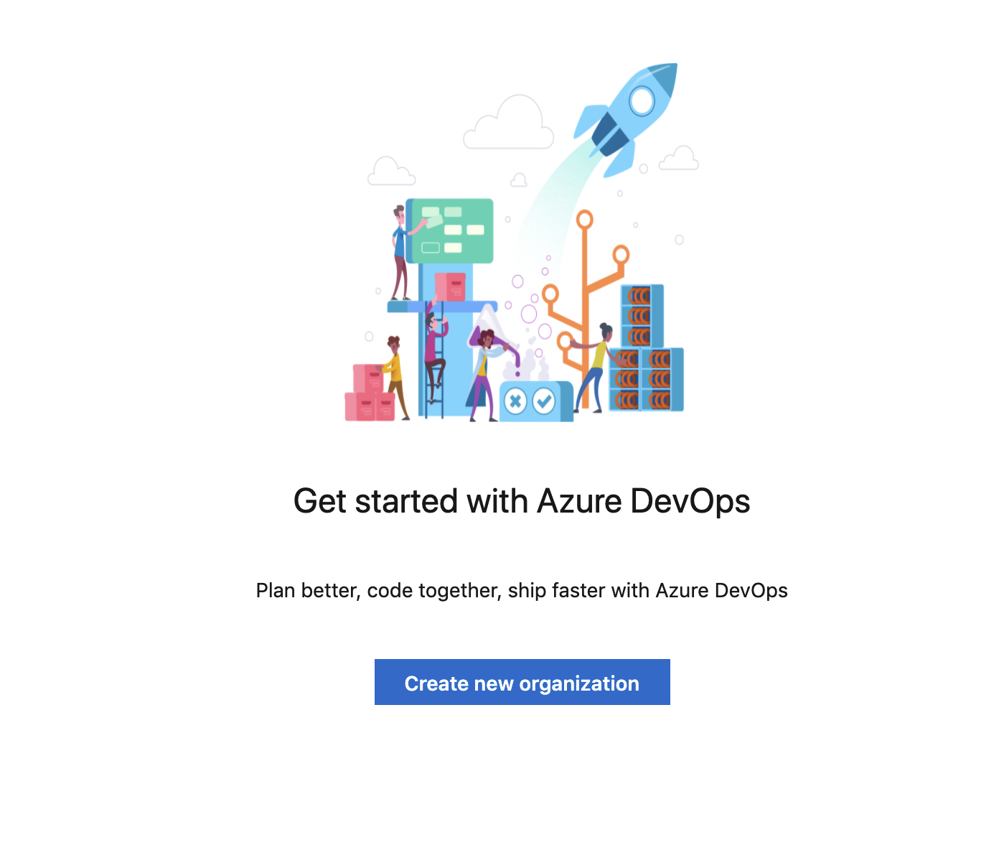
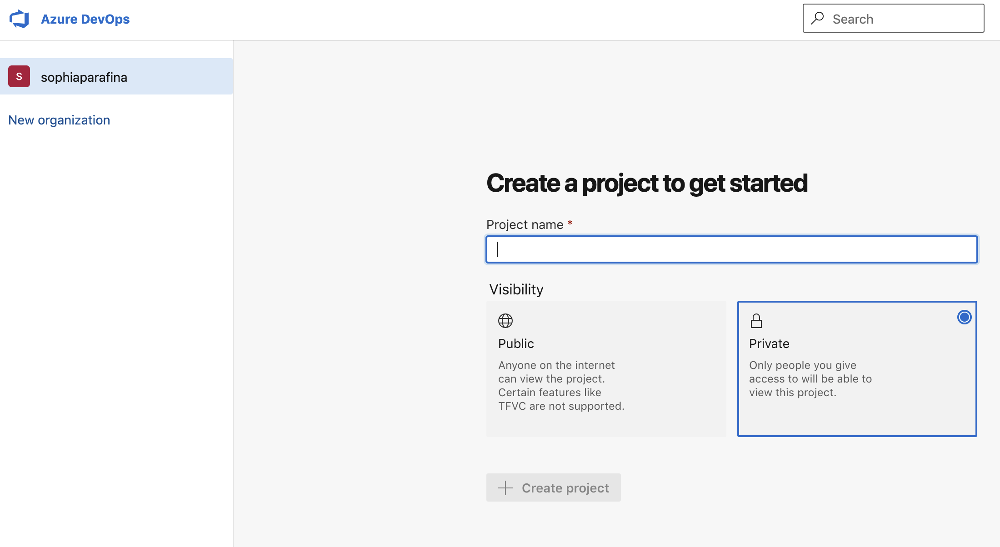
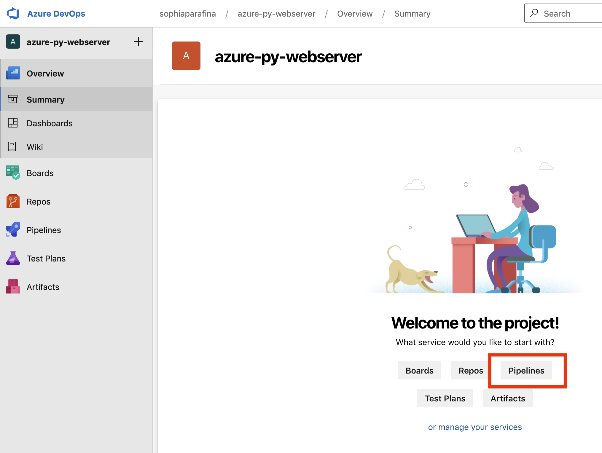
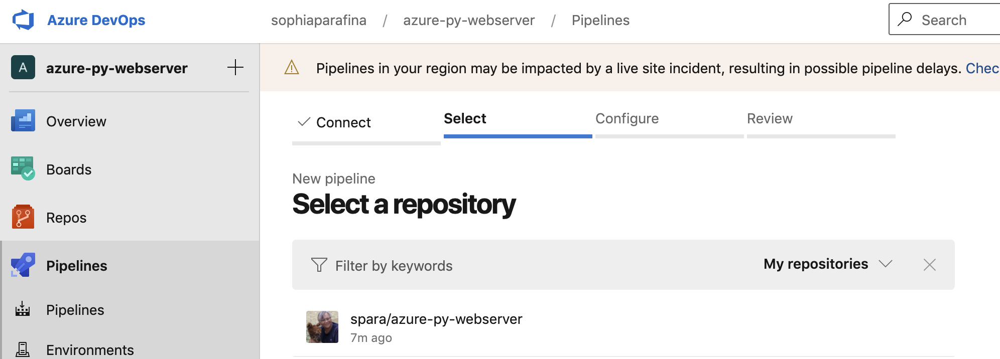
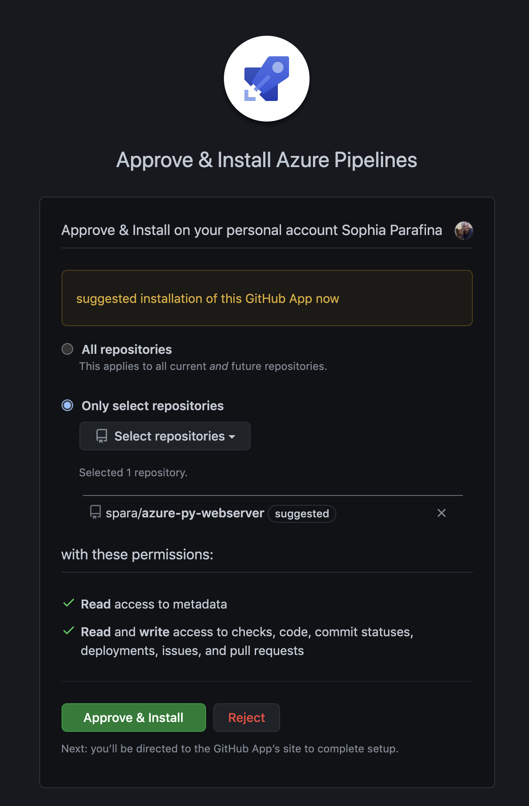
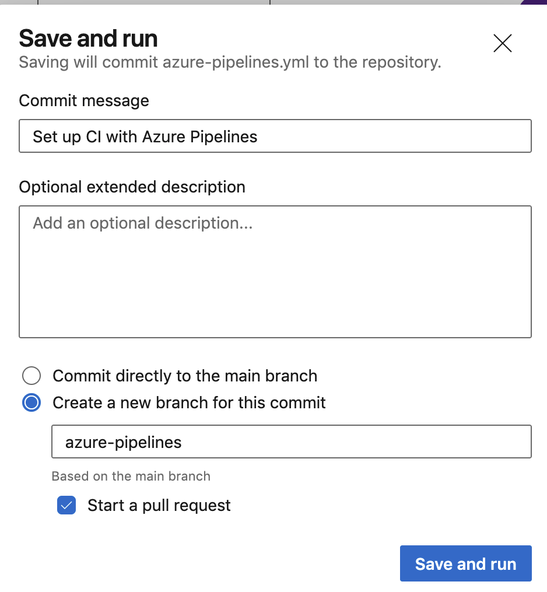

What comes to mind when you hear DevOps? Frequently, DevOps is described as a cultural practice that enables an organization to deliver high-quality applications quickly. The DevOps model emphasizes the "breaking down of silos" and combining development and operations into a single team. Developing, deploying, and maintaining an application is the responsibility of both developers and operators across the application lifecycle.

DevOps processes rely on tooling to automate delivering and maintaining applications. This article demonstrates how to implement Azure Pipelines to build and deploy applications.

In this series guide, we've covered:
* [Top Azure Services Every Developer Should Know: Overview](/blog/top-5-things-for-azure-devs-intro/)
* [Top Azure Services Every Developer Should Know: Virtual Machines](/blog/top-5-things-for-azure-devs-vm/)
* [Top Azure Services Every Developer Should Know: Serverless](/blog/top-5-things-for-azure-devs-serverless/)
* [Top Azure Services Every Developer Should Know: Static Websites](/blog/top-5-things-for-azure-devs-static-websites/)
* [Top Azure Services Every Developer Should Know: Building on AKS](/blog/top-5-things-for-azure-devs-kubernetes-infrastructure/)
* [Top Azure Services Every Developer Should Know: Deploying on AKS](/blog/top-5-things-for-azure-devs-kubernetes-apps/)
* **Top Azure Services Every Developer Should Know: DevOps** (this post)

## Azure Pipelines

Azure Pipelines is a Continuous Integration/Continuous Delivery (CI/CD) system that builds and tests code. A key practice of DevOps is Continuous Integration (CI), which merges and tests code automatically. CI catches bugs with [automated testing](/blog/infrastructure-testing-concepts/) before software is released, which decreases the cost to fix. The Azure DevOps Build process produces artifacts that drive small and frequent deployments. Continuous Delivery (CD) tests and deploys the artifacts in test or production environments. The automated release process updates existing systems with patches, bug fixes, and new features.

CI/CD systems store environment-specific configurations for every artifact produced. They use this information to perform any changes to the environment when software is deployed. For example, these systems can refresh database connections or restart services on a deployment.

[Azure Pipelines](https://azure.microsoft.com/en-us/services/devops/pipelines/) supports the following tools:

- **version control systems** - Git and Team Foundation Version Control
- **languages** - Python, Java, JavaScript, PHP, Ruby, C#, C++, and Go
- **application types** -  tasks to build .Net, Java, Node, Android, Xcode, and C++ applications
- **deployment targets** - virtual machines, containers, on-premises and cloud platforms, or PaaS services
- **continuous testing** - automating build-deploy-test workflows with the technologies and frameworks you choose
- **package formats** - supports publishing NuGet, npm, or Maven packages.

## Deploy code with Pipelines

Let's go step-by-step to create a pipeline.

**Step 1**: Sign in to your Azure DevOps organization or create one if you don't have one.



**Step 2**: Create a project.



**Step 3**: Create a pipeline.



**Step 4**: Connect and select your repository.



**Step 5**: Connect the pipeline to the repository on GitHub by approving the install.



**Step 6**: Examine the pipeline YAML and, if everything appears correct, select **Save and run**.



You can follow the [Azure DevOps Pipelines tutorial](https://docs.microsoft.com/en-us/azure/devops/pipelines/create-first-pipeline?), which covers creating software artifacts. However, because we are deploying infrastructure and an application, we will need to expand pipeline tasks with an extension.

## The Pulumi task extension for Azure DevOps

The Pulumi task extension runs the Pulumi CLI in your CI/CD pipelines. The pipeline builds your application and deploys the infrastructure it runs on in the same pipeline. You can install the Pulumi task extension from the [Visual Studio Marketplace](https://marketplace.visualstudio.com/items?itemName=pulumi.build-and-release-task) into your Azure DevOps Organization.

The task has two requirements:

- The pipeline must connect to your Azure Subscription through a service connection.
- The build variable, `pulumi.access.token` is mapped to the environment variable [`PULUMI_ACCESS_TOKEN`](https://app.pulumi.com/account/tokens), which the CLI uses for non-interactive logins.

There are two ways to run the pipeline. You can use the console to configure the pipeline or add an `azure-pipelines.yml` file to your repository. Let's look at an example YAML file.

```yaml
# A minimal Azure Pipelines build configuration file for running
# Pulumi apps that use the dotnet runtime and the Azure Native
# Nuget package.

trigger:
  batch: true
  branches:
    include:
      - master
  paths:
    include:
      - "**/*"

pool:
  vmImage: "ubuntu-latest"

variables:
  solution: "**/*.sln"
  buildPlatform: "Any CPU"
  buildConfiguration: "Release"

jobs:
  - job: infrastructure
    steps:
      - task: NuGetToolInstaller@1

      - task: Pulumi@1
        inputs:
          # To use an Azure Service Connection, un-comment the following line.
          azureSubscription: "$(ServiceConnectName)"
          # Pulumi will automatically build/restore the dotnet project.
          # Unless you are using a pre-built binary.
          command: "preview"
          stack: "$(StackName)"
          cwd: "./"
```

Let's focus on `jobs`. The first step is to find, download, and install [NuGet](https://www.nuget.org/), which is required to build this C# application. The second task uses the Pulumi task extension to run a Pulumi `preview` of the stack (`$(StackName)`) located at the root of the Pulumi project. The complete example is available on [GitHub](https://github.com/pulumi/pulumi-az-pipelines-task/tree/master/examples/azure-native-dotnet).

If we wanted to build and deploy the infrastructure, we could add another task. The `azure-pipelines.yml` file would be similar to this.

```yaml
jobs:
  - job: infrastructure
    steps:
      - task: NuGetToolInstaller@1

      - task: Pulumi@1
        inputs:
          # To use an Azure Service Connection, un-comment the following line.
          azureSubscription: "$(ServiceConnectName)"
          # Pulumi will automatically build/restore the dotnet project.
          # Unless you are using a pre-built binary.
          command: "preview"
          stack: "$(StackName)"
          cwd: "./"
      - task: Pulumi@1
        inputs:
          # To use an Azure Service Connection, un-comment the following line.
          azureSubscription: "$(ServiceConnectName)"
          # Pulumi will automatically build/restore the dotnet project.
          # Unless you are using a pre-built binary.
          command: "up"
          stack: "$(StackName)"
          cwd: "./"
```

You can chain tasks to run the build process, including building and deploying applications in the same pipeline. The Pulumi [Continuous Delivery User Guide](/docs/iac/packages-and-automation/continuous-delivery/azure-devops/) provides an in-depth walkthrough for configuring an Azure pipeline.

## Summary

As a developer on a DevOps team, you may not be the person to configure a pipeline. However, it's a good cloud engineering practice to understand how your application is built and deployed. Although we focus on Azure, the Pulumi task extension works with many other CI/CD systems. Check out our [User Guides](/docs/iac/packages-and-automation/continuous-delivery/) for all the CI/CD systems Pulumi supports.
