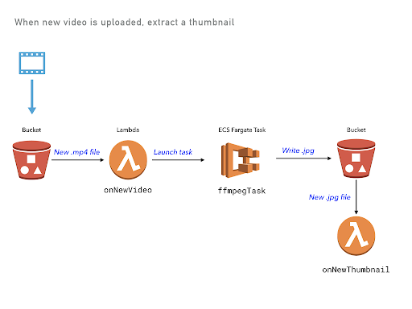
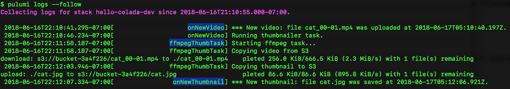

Pulumi makes developing and deploying
[rich serverless and container-based applications]()
a breeze. But how do you monitor and observe those applications while
they are being developed and once they are deployed? There are many
great answers: from the built-in capabilities of the underlying cloud
services (Lambda, ECS, Kubernetes, and more), to great 3rd party
solutions like [IOpipe](https://github.com/pulumi/pulumi-iopipe) and
[Epsagon](https://github.com/pulumi/pulumi-epsagon) which
[we highlighted recently]()
on this blog.

The Pulumi CLI provides another way to do logging, without requiring the
additional setup of these existing solutions and seamlessly integrated
into your Pulumi development workflow. The `pulumi logs` command
provides a great first place to start for understanding your Pulumi
application's behaviour. Especially during development, this command
provides direct insight into the behaviour of your application, bringing
together logs across all of the different forms of compute you are using
- from code running in serverless functions to containers to VMs.

Let's take a quick look at `pulumi logs` and some of the ways it can be
used as part of the inner loop of your Pulumi development.
<!--more-->

> *Note: Currently `pulumi logs` supports only logs for applications
> running in AWS. In the near future it will be expanded to Kuberentes,
> Azure, GCP and additional cloud platforms.*

## Logging for Inner-Loop Development

When developing locally, it is common to use logging as an interactive
part of the development process. With `pulumi logs`, we can bring some
of these same approaches into the inner loop of the development process
even for applications being actively developed/deployed in the cloud.

Let's take a simple example:

```typescript
import * as aws from '@pulumi/aws'
const bucket = new aws.s3.Bucket("mybucket");
bucket.onObjectCreated("newObject", async (ev) => {
    console.log(JSON.stringify(ev));
});
export const bucketName = bucket.id;
```

We can deploy this app, copy an object into the newly provisioned
bucket, and then see the logs with the following:

    $ pulumi up --skip-preview
     
    $ aws s3 cp somefile.txt s3://$(pulumi stack output bucketName)
     
    $ pulumi logs -f
    Collecting logs for stack dev since 
     
     2019-03-28T21:10:05.667-07:00[                     newObject] {"Records":[{"eventVersion":"2.1","eventSource":"aws:s3","awsRegion":"us-west-2","eventTime":"2019-03-29T04:10:05.318Z","eventName":"ObjectCreated:Put","userIdentity":{"principalId":"AWS:AIDAIB2I7NPKMQ2QAKXZ6"},"requestParameters":{"sourceIPAddress":"24.35.94.249"},"responseElements":{"x-amz-request-id":"F2D7DF26693AEFEE","x-amz-id-2":"o2leqNNwCVXTI8jfvUGk5KE7w6CiKsJYP/Q4nT0fHqZPrqwaVlSP0lNhspv5NiLAAwutCzJwlLc="},"s3":{"s3SchemaVersion":"1.0","configurationId":"tf-s3-lambda-20190328222809603300000002","bucket":{"name":"mybucket-97f10e0","ownerIdentity":{"principalId":"A3FZDZNSWOKQHV"},"arn":"arn:aws:s3:::mybucket-97f10e0"},"object":{"key":"out.txt","size":36000,"eTag":"818ac0cf0273f7e40e673d9892405e31","sequencer":"005C9D9A9D311D5C11"}}}]}

I can use this to quickly see what kind of values I get back on an S3
Bucket Object event, using live data running in the cloud. But I can do
this whole thing in just a couple of seconds - from deployment to logs.
This lets me iterate on my application live in the cloud with ease.

If there are errors in my code, I find out about them immediately:

```typescript
bucket.onObjectCreated("newObject", async (ev, ctx) => {
    throw new Error("oops");
});
```

Results in:

    $ pulumi logs --since 1m
    Collecting logs for stack dev since 2019-03-28T20:17:28.000-07:00.
     
     2019-03-28T21:17:01.269-07:00[                     newObject] {"errorMessage":"oops","errorType":"Error","stackTrace":["/var/task/__index.js:26:11","Generator.next (<anonymous>)","/var/task/__index.js:12:71","new Promise (<anonymous>)","Object.<anonymous> (/var/task/__index.js:8:12)","Object.__f1 [as __awaiter] (/var/task/__index.js:17:34)","/var/task/__index.js:24:21","__f0 (/var/task/__index.js:30:34)"]}

## Aggregating Logs

As applications grow to span multiple forms of compute -- such as micro
services, lambdas, containers, and VMs -- it becomes important to be
able to correlate logs across services.

One great example of this is the [video thumbnailer](https://github.com/pulumi/examples/tree/master/aws-ts-thumbnailer)
example which implements this simple architecture involving two buckets,
a lambda event, and a long-running Fargate container task.



The Pulumi program deploys several components, using different types of
cloud resources. But using `Pulumi logs` we can see all logs in a
single, unified view.



From the image above, you can see the `onNewVideo` Lambda function, then
triggering the `ffmpegThumbTask` Fargate container, and then copying a
file back into S3 triggering the `onNewThumbtail` Lambda function. So
you don't need to jump around between different systems for viewing
logs, you can get a consistent view of what's going on in your cloud
application!

Underneath the hood, these logs live in different and uncorrelated
CloudWatch LogGroups, spread across an AWS account. But with
`pulumi logs` we can get the application-centric view we need to
understand the overall behaviour of our application architecture.

## Controlling Log Rendering

The `pulumi logs` command supports a few options for controlling what
gets logged.

The `--since` flag retrieves logs only since a given relative or
absolute time. For example, `pulumi logs --since 1m` will get logs just
since 1 minute ago - useful for limiting logs to only what's happened
very recently - especially during inner-loop development. And to get
logs since a specific point in time (such as the timestamp of a known
event from a previous execution of `pulumi logs`) you can use
`pulumi logs --since 2019-03-28T21:17:01.269-07:00`.

A couple of the examples above used the `--follow` flag to follow the
log output until cancelled. This is useful when waiting for log output
to come in during debugging.

And for applications with many resources, it is often important to scope
results down to one or more specific resources, which can be done with
the `--resource` flag. For example, logs for just the Fargate task above
could be retrieved with `pulumi logs --resource ffmpegThumbTask`.

## Working Seamlessly with Your Cloud Provider

Like many other Pulumi features, `pulumi logs` works by building on top
of the great building blocks provided by the underlying cloud provider
services. Instead of adding new runtime logging infrastructure to your
application, `pulumi logs` lets you easily extract out logs directly
from your existing infrastructure. But because Pulumi understands the
natural application scope for what resources are part of a single
application, it can bring together the logs from all of those resources
into one place, instead of having to think about individual resources.

Behind the scenes, `pulumi logs` makes the same calls to CloudWatch Logs
or other backend log providers that you would make yourself via the
`aws` CLI or AWS Console. But you don't have to think about the physical
identities of the cloud resources themselves - Pulumi takes care of
finding the resources with supported logs, collecting those logs based
on the requested filters, and then presenting them in unified logical
view.

## What's Next?

We've seen Pulumi users working with Lambda, ECS and other AWS compute
offerings become heavy users of `pulumi logs` during development. But
supporting a broad set of cloud providers is key to our mission at
Pulumi - so we really want to bring these benefits to *all* Pulumi
users. We'll be expanding `pulumi logs` to Kubernetes, Azure and GCP in
the near future - with easy support for plugging in other cloud
providers and cloud resources as sources for log data.

Even better, because Pulumi allows you to work with multiple cloud
providers at once - like AWS and Kuberentes, or GCP and Azure, or even
two different AWS regions - `pulumi logs` will be able to aggregate logs
across multiple cloud providers and offer a seamless application-centric
view of your logs.

Users of the Pulumi Console at <https://app.pulumi.com> also would love
to have access to these logs at the click of a button - and this is
something we're also excited to enable in the near future.

You can take `pulumi` for a spin today by checking out the
[Getting Started Guide]() guide or some of the
[Pulumi Examples](https://github.com/pulumi/examples) on GitHub. Then join us in the
[Pulumi Community Slack](https://slack.pulumi.io) to chat about where
you want to see us go (and where you'd like to help out!) with
`pulumi logs` and other features of the Pulumi open source project in
the coming weeks and months.
