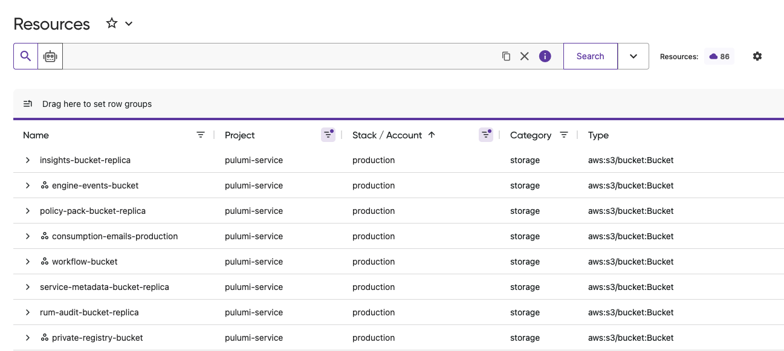
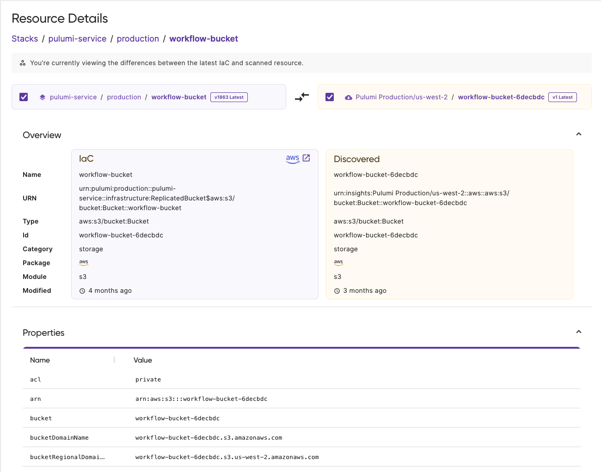
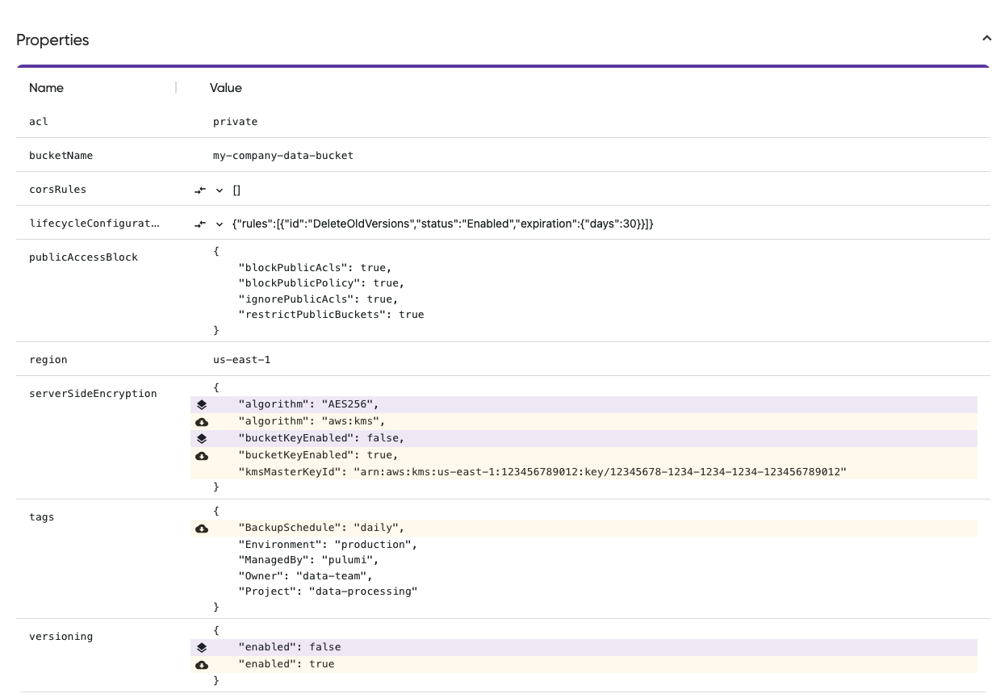

We're excited to announce unified resources in Pulumi Cloud. This powerful new feature automatically consolidates resources from multiple sources into single, comprehensive views. When the same AWS S3 bucket, Azure VM, or Google Cloud database appears in both your IaC stacks and Pulumi Insights, you'll now see one unified entry instead of duplicates cluttering your search results.

## Why We Built This

Cloud resources naturally exist across multiple contexts in modern organizations. The same S3 bucket might be imported into a Pulumi stack, discovered by Pulumi Insights, and referenced in multiple projects. Previously, this created fragmented views with duplicate search results that made it difficult to understand your true infrastructure footprint.

Teams told us they needed a way to see the complete picture of each resource without manually correlating information across different sources. They wanted accurate resource counts, clear visibility into management states, and faster access to all relevant information when troubleshooting issues.

Unified resources solve these challenges by automatically detecting when the same cloud resource appears across multiple sources and consolidating them intelligently.

## How It Works

When you search for resources in Pulumi Cloud, our system now automatically identifies duplicates across all sources including:

* Resources managed by Pulumi IaC
* Resources imported into Pulumi stacks
* Resources discovered through Pulumi Insights including resources managed outside of Pulumi IaC

Resources with multiple sources are marked with a distinctive  icon in search results. This visual indicator lets you immediately identify which resources have rich, multi-source information available.

The consolidation happens automatically. Your existing workflows continue unchanged, but now with cleaner, more actionable results.

## The New Unified Resource Details Page

The centerpiece of this release is the completely redesigned resource details page. Previously, clicking on a resource from different sources led to separate, disconnected views. Now, every resource has a single, unified details page that brings together all available information.

### Complete Source Visibility

The new details page shows every source where a resource appears:

* **Pulumi stacks**: See which stacks manage or import this resource
* **Insights accounts**: View all cloud accounts where the resource was discovered
* **Source metadata**: Access provider details, last update times, and source-specific details

### Comprehensive Property Views

Compare resource properties across all sources to:

* Detect configuration changes between IaC definitions and actual cloud state
* View complete metadata from both IaC and cloud discovery
* Track property changes over time

## Key Benefits for Your Team

**Accurate Infrastructure Inventory**
Get an accurate view of your resources without manual deduplication. Understand exactly what's running in your cloud accounts and how resources are distributed across regions and projects.

**Enhanced Compliance Visibility**
Instantly identify which resources are managed by IaC versus those created outside your governance processes. Track your progress in bringing unmanaged resources under control.

**Faster Incident Response**
When investigating issues, find all relevant information about a resource in one place. No more switching between multiple views or manually correlating data from different sources.

## Learn More

Unified resources are available now for all Pulumi Cloud users. Ready to see unified resources in action? Check out these resources:

* [Resource search documentation](/docs/insights/search/) for search tips and filtering options
* [API reference](/docs/pulumi-cloud/reference/resource-search/) for programmatic access
* [Pulumi Insights overview](/docs/insights/) for the complete platform capabilities

We'd love to hear your feedback as you explore unified resources. Share your thoughts in the [Pulumi Community Slack](https://slack.pulumi.com/) or connect with your customer success team.

Start exploring your unified resource inventory today in [Pulumi Cloud](https://app.pulumi.com/).
