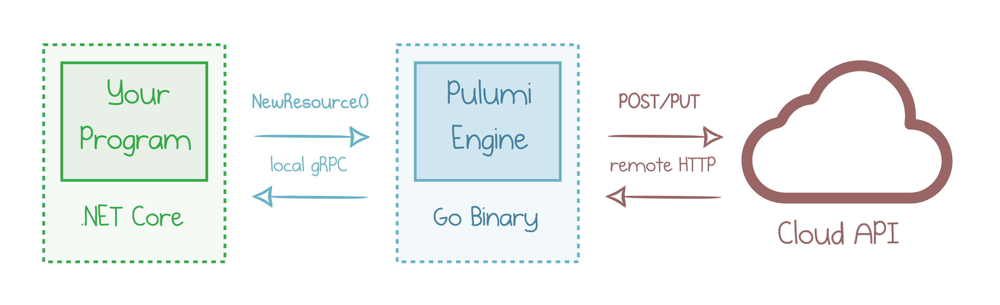
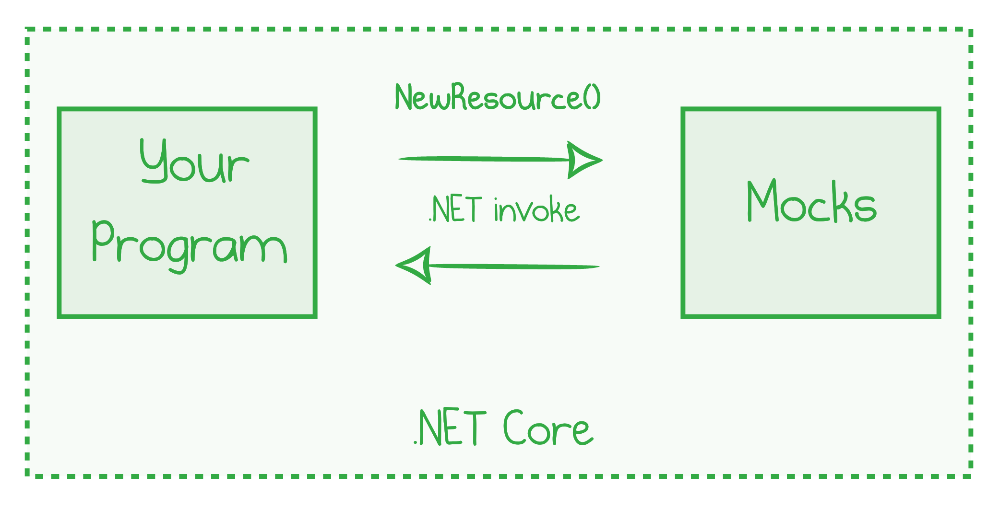

Because Pulumi uses general-purpose programming languages to provision cloud resources, you can take advantage of native tools and perform automated tests of your infrastructure. The full power of each language is available, including access to libraries and frameworks for testing.

This blog post takes a deeper dive into mock-based unit testing of Pulumi programs written in C# and F#.

<!--more-->

## How Unit Testing Works in Pulumi

Let's start with a picture showing how Pulumi components interact during a typical deployment process.



Whenever a new resource is instantiated in code, the program makes a remote call to the engine. The engine receives the resource's input values, validates them, and translates the request to an invocation of a cloud API. The API returns some data, which are translated to resource outputs and sent back to the program.

The remote calls may be slow, unreliable, and non-deterministic, which makes testing of these interactions hard.

Our [testing guide]() outlines several testing methods, but today I want to focus on unit testing.

The Pulumi SDK provides a hook to replace all the remote calls with mocks. Mocks run in the same process and can respond immediately with hard-coded or calculated on-the-fly data.



We can write fully deterministic and blazingly fast automated tests as all remote calls and uncertainty are eliminated. There is no cloud to respond to resource creation, so it's a developer's responsibility to mimic the cloud behavior with mocks adequately.

This blog post walks you through an example of unit testing and mocking with the .NET SDK.

## Define the Base Structure

In this article, I build a program that deploys a static website to Azure. I use TDD to add new tests and deployment components bit-by-bit.

Let's start with an empty project&mdash;go ahead and create a .NET Core Console Application with the .NET CLI or your favorite IDE.

### Install NuGet packages

You are free to choose your unit testing frameworks, mocking and assertions libraries. I'm using NUnit with FluentAssertions, and my program tests Azure resources, so this is my project file:



{}

```xml
<Project Sdk="Microsoft.NET.Sdk">

  <PropertyGroup>
    <OutputType>Exe</OutputType>
    <TargetFramework>netcoreapp3.1</TargetFramework>
    <Nullable>enable</Nullable>
  </PropertyGroup>

  <ItemGroup>
    <PackageReference Include="FluentAssertions" Version="5.10.2" />
    <PackageReference Include="Microsoft.NET.Test.Sdk" Version="16.5.0" />
    <PackageReference Include="NUnit" Version="3.12.0" />
    <PackageReference Include="NUnit3TestAdapter" Version="3.16.1" />
    <PackageReference Include="Pulumi.Azure" Version="3.*" />
  </ItemGroup>

</Project>
```

{}
{}

```xml
<Project Sdk="Microsoft.NET.Sdk">

    <PropertyGroup>
        <OutputType>Exe</OutputType>
        <TargetFramework>netcoreapp3.1</TargetFramework>
        <Nullable>enable</Nullable>
    </PropertyGroup>

    <ItemGroup>
        <PackageReference Include="FluentAssertions" Version="5.10.2" />
        <PackageReference Include="Microsoft.NET.Test.Sdk" Version="16.5.0" />
        <PackageReference Include="NUnit" Version="3.12.0" />
        <PackageReference Include="NUnit3TestAdapter" Version="3.16.1" />
        <PackageReference Include="Pulumi.Azure" Version="3.*" />
        <PackageReference Include="Pulumi.FSharp" Version="2.*" />
    </ItemGroup>

    <ItemGroup>
        <Compile Include="Testing.fs" />
        <Compile Include="WebsiteStack.fs" />
        <Compile Include="WebsiteStackTests.fs" />
    </ItemGroup>

</Project>
```

{}

### Stack

A Pulumi stack is the "unit" of our testing. Every test instantiates a stack, retrieves the resources that the stack defines, and makes assertions about them.

Here is my starting point in `WebsiteStack` file:



{}

```csharp
using System.IO;
using Pulumi;
using Pulumi.Azure.Core;
using Storage = Pulumi.Azure.Storage;

public class WebsiteStack : Stack
{
    public WebsiteStack()
    {
        // <-- Cloud resources go here
    }
}
```

{}
{}

```fsharp
namespace UnitTesting

open Pulumi
open Pulumi.FSharp
open Pulumi.Azure.Core

type WebsiteStack() =
    inherit Stack()

    // <-- Cloud resources go here
```

{}

This class is precisely what Pulumi expects to start deploying your resources to the cloud. Once the test suite is ready and green, you can deploy the stack with `pulumi up`.

### Mocks

As I explained above, unit tests replace the real Pulumi engine with mocks. Mocks get all calls and respond with predefined values.

A mock class has to implement two methods of `Pulumi.Testing.IMocks` interface. `NewResourceAsync` is called whenever a new resource is defined, while `CallAsync` is invoked when our program retrieves information about existing cloud resources. We'll focus on the former in this post, but we still need to define both.

While you are free to use your favorite mocking library, I'll keep it simple and define the mocks as a plain class.



{}

```csharp
using System.Collections.Immutable;
using System.Threading.Tasks;
using Pulumi;
using Pulumi.Testing;

namespace UnitTesting
{
    class Mocks : IMocks
    {
        public Task<(string id, object state)> NewResourceAsync(
            string type, string name, ImmutableDictionary<string, object> inputs, string? provider, string? id)
        {
            var outputs = ImmutableDictionary.CreateBuilder<string, object>();

            // Forward all input parameters as resource outputs, so that we could test them.
            outputs.AddRange(inputs);

            // <-- We'll customize the mocks here

            // Default the resource ID to `{name}_id`.
            id ??= $"{name}_id";
            return Task.FromResult((id, (object)outputs));
        }

        public Task<object> CallAsync(string token, ImmutableDictionary<string, object> inputs, string? provider)
        {
            // We don't use this method in this particular test suite.
            // Default to returning whatever we got as input.
            return Task.FromResult((object)inputs);
        }
    }
}
```

{}
{}

```fsharp
namespace UnitTesting

open System
open System.Collections.Immutable
open System.Threading.Tasks
open Pulumi.Testing

type Mocks() =
    interface IMocks with
        member this.NewResourceAsync(typeName: string, name: string, inputs: ImmutableDictionary<string, obj>, provider: string, id: string): Task<ValueTuple<string,obj>> =
            // Forward all input parameters as resource outputs, so that we could test them.
            let dict = inputs.ToImmutableDictionary() :> obj

            // <-- We'll customize the mocks here

            // Default the resource ID to `{name}_id`.
            let id = if id = null then sprintf "%s_id" name else id
            Task.FromResult(struct (id, outputs :> obj))

        member this.CallAsync(token: string, inputs: ImmutableDictionary<string, obj>, provider: string): Task<obj> =
            // We don't use this method in this particular test suite.
            // Default to returning whatever we got as input.
            Task.FromResult(null :> obj)
```

{}

Both methods receive several parameters and need to return a result. Notably, they get the list of `inputs`&mdash;the arguments that our program defined for the given resource. The goal of the mocks is to return the list of outputs, similarly to what a cloud provider would do.

My default implementation returns the outputs that include all the inputs and nothing else. That's a sensible default: usually, real outputs are a superset of inputs. We'll extend this behavior as we need later on.

### Test Fixture

The next class to add is the container for my future unit tests. I named the file `WebsiteStackTests.cs` and it defines a test container, called a "test fixture" in NUnit:



{}

```csharp
using System.Linq;
using System.Threading.Tasks;
using FluentAssertions;
using NUnit.Framework;
using Pulumi;
using Pulumi.Azure.Core;
using Storage = Pulumi.Azure.Storage;

namespace UnitTesting
{
	[TestFixture]
	public class WebserverStackTests
	{
        // <-- Tests go here

		private static Task<ImmutableArray<Resource>> TestAsync()
		{
			return Deployment.TestAsync<WebsiteStack>(new Mocks(), new TestOptions {IsPreview = false});
		}
    }
}
```

{}
{}

```fsharp
namespace UnitTesting

open System
open System.Collections.Immutable
open System.Threading.Tasks
open NUnit.Framework
open FluentAssertions
open Pulumi
open Pulumi.Azure.Core
open Pulumi.Azure.Storage
open Pulumi.Testing

[<TestFixture>]
type WebserverStackTests() =
    let runTest(): ImmutableArray<Resource> =
        let options = new TestOptions(IsPreview = Nullable<bool> false)
        Deployment.TestAsync<WebsiteStack>(new Mocks(), options)
        |> Async.AwaitTask
        |> Async.RunSynchronously

    // <-- Tests go here
```

{}

I defined a helper method `TestAsync` that points Pulumi's `Deployment.TestAsync` to our stack and mock classes.

As we progress through the article, I will add tests to this class one-by-one.

### Retrieve output values

Finally, I need a small extension method to extract values from outputs. Every Pulumi resource returns values wrapped inside an `Output<T>` container. While the real engine runs, those values may be known or unknown, but my mock-based tests always return known values. It's safe to get those values and convert them to a `Task<T>`:



{}

```csharp
public static class TestingExtensions
{
    public static Task<T> GetValueAsync<T>(this Output<T> output)
    {
        var tcs = new TaskCompletionSource<T>();
        output.Apply(v => { tcs.SetResult(v); return v; });
        return tcs.Task;
    }
}
```

{}
{}

```fsharp
let getValue(output: Output<'a>): 'a =
    let tcs = new TaskCompletionSource<'a>()
    output.Apply(fun v -> tcs.SetResult(v); v) |> ignore
    tcs.Task.Result
```

{}

To learn more about outputs, read [this article]().

## First Test

The setup is done, time to write my first unit test! True to the TDD spirit, I write the tests before I define any resources.

Every Azure resource has to live inside a resource group, so my first test checks that a new resource group is defined.



{}

```csharp
[Test]
public async Task SingleResourceGroupExists()
{
    var resources = await TestAsync();

    var resourceGroups = resources.OfType<ResourceGroup>().ToList();
    resourceGroups.Count.Should().Be(1, "a single resource group is expected");
}
```

{}
{}

```fsharp
[<Test>]
member this.SingleResourceGroupExists() =
    let resources = runTest()

    let resourceGroupCount = resources.OfType<ResourceGroup>() |> Seq.length
    resourceGroupCount.Should().Be(1, "a single resource group is expected") |> ignore
```

{}

This code is great to illustrate the overall structure of each test:

1. Call the `TestAsync` method to evaluate the stack.
2. Find the target resource in the collection of created resources.
3. Assert a property of the target resource.

In this case, the test validates that there is one and only one resource group defined.

I can run `dotnet test` and see the expected test failure:

```
$ dotnet test
...

X SingleResourceGroupExists [238ms]
  Error Message:
   Expected resourceGroups.Count to be 1 because a single resource group is expected, but found 0.
...
Total tests: 1
     Failed: 1
 Total time: 0.9270 Seconds
```

I go ahead and add the following definition to the `WebsiteStack` constructor.



{}

```csharp
var resourceGroup = new ResourceGroup("www-prod-rg");
```

{}
{}

```fsharp
let resourceGroup = new ResourceGroup("www-prod-rg")
```

{}

This change is enough to make the tests green!

```
$ dotnet test
...
Test Run Successful.
Total tests: 1
     Passed: 1
 Total time: 0.8462 Seconds
```

## Tags

For billing and lifecycle management, I want all my resource groups to be tagged. Therefore, my second test validates that the resource group has an `Environment` tag on it:



{}

```csharp
[Test]
public async Task ResourceGroupHasEnvironmentTag()
{
    var resources = await TestAsync();
    var resourceGroup = resources.OfType<ResourceGroup>().First();

    var tags = await resourceGroup.Tags.GetValueAsync();
    tags.Should().NotBeNull("Tags must be defined");
    tags.Should().ContainKey("Environment");
}
```

{}
{}

```fsharp
[<Test>]
member this.ResourceGroupHasEnvironmentTag() =
    let resources = runTest()
    let resourceGroup = resources.OfType<ResourceGroup>() |> Seq.head

    let tags = getValue resourceGroup.Tags
    tags.Should().NotBeNull("Tags must be defined") |> ignore
    tags.Should().ContainKey("Environment", null) |> ignore
```

{}

The test finds the resource group and then checks that the `Tags` dictionary is not null and contains a tag with the name `Environment`. Predictably, the test fails:

```
$ dotnet test
...
  X ResourceGroupHasEnvironmentTag [240ms]
  Error Message:
   Expected tags not to be <null> because Tags must be defined.
...
Test Run Failed.
```

Now, I edit the stack class and change the resource group definition.



{}

```csharp
var resourceGroup = new ResourceGroup("www-prod-rg", new ResourceGroupArgs
{
    Tags = { { "Environment", "production" } }
});
```

{}
{}

```fsharp
let resourceGroup =
    new ResourceGroup(
        "www-prod-rg",
        new ResourceGroupArgs(Tags = inputMap(["Environment", input "production"])))
```

{}

This change makes the test suite green again, and we are good to proceed.

## Storage Account

It's time to add a test for a second resource in the stack: a Storage Account. To make things more interesting, I want to check that the storage account belongs to our resource group.

There's no direct link between a storage account object and a resource group object. Instead, we need to check the `ResourceGroupName` property of the account. The test below expects the account to belong to a resource group called `www-prod-rg`.



{}

```csharp
[Test]
public async Task StorageAccountBelongsToResourceGroup()
{
    var resources = await TestAsync();
    var storageAccount = resources.OfType<Storage.Account>().SingleOrDefault();
    storageAccount.Should().NotBeNull("Storage account not found");

    var resourceGroupName = await storageAccount.ResourceGroupName.GetValueAsync();
    resourceGroupName.Should().Be("www-prod-rg");
}
```

{}
{}

```fsharp
[<Test>]
member this.StorageAccountBelongsToResourceGroup() =
    let resources = runTest()
    let storageAccount = resources.OfType<Account>() |> Seq.tryHead |> Option.toObj
    storageAccount.Should().NotBeNull("Storage account not found") |> ignore

    let resourceGroupName = getValue storageAccount.ResourceGroupName
    resourceGroupName.Should().Be("www-prod-rg", null) |> ignore
```

{}

Of course, the test fails. I try to fix it with what I think is the minimal change to make the test pass by adding a new resource to the stack and pointing it to the resource group.



{}

```csharp
var storageAccount = new Storage.Account("wwwprodsa", new Storage.AccountArgs
{
    ResourceGroupName = resourceGroup.Name,
});
```

{}
{}

```fsharp
let storageAccount =
    new Account(
        "wwwprodsa",
        new AccountArgs(ResourceGroupName = io resourceGroup.Name))
```

{}

However, when I rerun the test suite, all three tests fail. They complain about the missing required properties `AccountReplicationType` and `AccountTier` on the storage account, so I have to add those.



{}

```csharp
var storageAccount = new Storage.Account("wwwprodsa", new Storage.AccountArgs
{
    ResourceGroupName = resourceGroup.Name,
    AccountTier = "Standard",
    AccountReplicationType = "LRS",
    StaticWebsite = new Storage.Inputs.AccountStaticWebsiteArgs
    {
        IndexDocument = "index.html"
    }
});
```

{}
{}

```fsharp
let storageAccount =
    new Account(
        "wwwprodsa",
        new AccountArgs(
            ResourceGroupName = io resourceGroup.Name,
            AccountTier = input "Standard",
            AccountReplicationType = input "LRS",
            StaticWebsite = input (new AccountStaticWebsiteArgs(IndexDocument = input "index.html"))))
```

{}

I defined the `StaticWebsite` property as well: I'll leave testing these values as an exercise for the reader.

Two resource group tests are back to green again, but the storage account test fails with a new error message.

```
X StorageAccountBelongsToResourceGroup [84ms]
  Error Message:
   Expected resourceGroupName to be "www-prod-rg", but found <null>.
```

What's going on, and why is it `null`?

I defined the account name like this: `ResourceGroupName = resourceGroup.Name`. However, if we look closely, the `resourceGroup` resource doesn't have an input property `Name` defined. `www-prod-rg` is a logical name for Pulumi deployment, not the physical name of the resource.

Under normal circumstances, the Pulumi engine would use the logical name to produce the physical name of the resource group automatically (see [resource names]() for details). However, my mocks don't do that.

That's a good reason to change the `Mocks` implementation. I add the following lines to the `NewResourceAsync` method.



{}

```csharp
// Set the name to resource name if it's not set explicitly in inputs.
if (!inputs.ContainsKey("name"))
    outputs.Add("name", name);
```

{}
{}

```fsharp
let inputKVs = inputs |> Seq.map(fun kv -> kv.Key, kv.Value) |> Seq.toList
let nameKVs = if inputs.ContainsKey("name") then [] else [("name", name :> obj)]

let outputs = [inputKVs; nameKVs] |> Seq.concat |> Seq.map KeyValuePair
let dict = outputs.ToImmutableDictionary() :> obj
```

{}

Note that mocks operate on weakly-typed dictionaries, so I need to get the property name right. Pulumi SDKs are open source, so I looked [here](https://github.com/pulumi/pulumi-azure/blob/1fdcab88065175ced768d900e7dcedf3b1d1b0a7/sdk/dotnet/Core/ResourceGroup.cs#L90) to double-check the exact value.

After this change in `Mocks`, my tests go green again.

```
Test Run Successful.
Total tests: 3
     Passed: 3
```

## Website Files

The next step is to upload some files to the static website. Well, instead, to write an automated test that validates the upload with mocks.

I create a `wwwroot` folder with two HTML files in it and copy the folder to the build's output. Here is my change in the project file.

```xml
<ItemGroup>
    <None Update="wwwroot\**\*.*">
        <CopyToOutputDirectory>PreserveNewest</CopyToOutputDirectory>
    </None>
</ItemGroup>
```

Now, the test is straightforward: it expects two `Blob` resources in the stack.

{}



```csharp
[Test]
public async Task UploadsTwoFiles()
{
    var resources = await TestAsync();
    var files = resources.OfType<Storage.Blob>().ToList();
    files.Count.Should().Be(2, "Should have uploaded files from `wwwroot`");
}
```

{}
{}

```fsharp
[<Test>]
member this.UploadsTwoFiles() =
    let resources = runTest()
    let filesCount = resources.OfType<Blob>() |> Seq.length
    filesCount.Should().Be(2, "Should have uploaded files from `wwwroot`") |> ignore
```

{}

As intended, the test fails immediately.

```
X UploadsTwoFiles [95ms]
  Error Message:
   Expected files.Count to be 2 because Should have uploaded files from `wwwroot`, but found 0.
```

I extend my stack with the following loop that navigates through the files and creates a storage blob for each of them.



{}

```csharp
var files = Directory.GetFiles("wwwroot");
foreach (var file in files)
{
    var blob = new Storage.Blob(file, new Storage.BlobArgs
    {
        ContentType = "application/html",
        Source = new FileAsset(file),
        StorageAccountName = storageAccount.Name,
        StorageContainerName = "$web",
        Type = "Block"
    });
}
```

{}
{}

```fsharp
let files =
    let fileNames = Directory.GetFiles("wwwroot")
    fileNames
    |> Seq.map(fun file ->
        new Blob(
            file,
            new BlobArgs(
                ContentType = input "application/html",
                Source = input (new FileAsset(file) :> AssetOrArchive),
                StorageAccountName = io storageAccount.Name,
                StorageContainerName = input "$web",
                Type = input "Block")))
    |> List.ofSeq
```

{}

However, this change breaks the stack and all tests in the suite:

```
Error Message:
   Pulumi.RunException : Running program failed with an unhandled exception:
System.InvalidOperationException: Unsupported value when converting to protobuf: Pulumi.FileAsset
   at Pulumi.Serialization.Serializer.CreateValue(Object value)
...
```

Once again, our mocks fail to represent the behavior of the engine accurately. The Pulumi engine knows about the `FileAsset` class pointing to a file on the disk and how to convert it to an uploaded blob. But, the engine doesn't copy this property to outputs. I need to adjust the mocks again.

I'm not particularly interested in testing the binary contents of the files now, so I'll change the `Mocks` class to ignore the `source` property and not to include it into the output dictionary.



{}

```csharp
if (type == "azure:storage/blob:Blob")
{
    // Assets can't directly go through the engine.
    // We don't need them in the test, so blank out the property for now.
    outputs.Remove("source");
}
```

{}
{}

```fsharp
let outputs =
    [inputKVs; nameKVs]
    |> Seq.concat
    |> Seq.filter (fun (k, _) -> typeName <> "azure:storage/blob:Blob" || k <> "source")
    |> Seq.map KeyValuePair
```

{}

This change makes my test suite happy again.

```
Test Run Successful.
Total tests: 4
     Passed: 4
```

## Validate Website URL

So far, I've been validating the input parameters of resources. What if I want to test something that is usually done by the cloud provider?

For instance, when Azure creates a static website, it automatically assigns a public endpoint. The endpoint is then available in the `PrimaryWebEndpoint` property after the Pulumi program ran and resources are created. I may want to export this value from stack outputs and validate it in a unit test.



{}

```csharp
[Test]
public async Task StackExportsWebsiteUrl()
{
    var resources = await TestAsync();
    var stack = resources.OfType<WebsiteStack>().First();

    var endpoint = await stack.Endpoint.GetValueAsync();
    endpoint.Should().Be("https://wwwprodsa.web.core.windows.net");
}
```

{}
{}

```fsharp
[<Test>]
member this.StackExportsWebsiteUrl() =
    let resources = runTest()
    let stack = resources.OfType<WebsiteStack>() |> Seq.head

    let endpoint = getValue stack.Endpoint
    endpoint.Should().Be("https://wwwprodsa.web.core.windows.net", null) |> ignore
```

{}

This test doesn't even compile yet, so I have to define the `Endpoint` property and assign a value to it. Here is the complete implementation of the stack with the output property defined at the end.



{}

```csharp
public class WebsiteStack : Stack
{
    public WebsiteStack()
    {
        var resourceGroup = new ResourceGroup("www-prod-rg", new ResourceGroupArgs
        {
            Tags = { { "Environment", "production" } }
        });

        var storageAccount = new Storage.Account("wwwprodsa", new Storage.AccountArgs
        {
            ResourceGroupName = resourceGroup.Name,
            AccountTier = "Standard",
            AccountReplicationType = "LRS",
            StaticWebsite = new Storage.Inputs.AccountStaticWebsiteArgs
            {
                IndexDocument = "index.html"
            }
        });

        var files = Directory.GetFiles("wwwroot");
        foreach (var file in files)
        {
            var blob = new Storage.Blob(file, new Storage.BlobArgs
            {
                ContentType = "application/html",
                Source = new FileAsset(file),
                StorageAccountName = storageAccount.Name,
                StorageContainerName = "$web",
                Type = "Block"
            });
        }

        this.Endpoint = storageAccount.PrimaryWebEndpoint;
    }

    [Output] public Output<string> Endpoint { get; set; }
}
```

{}
{}

```fsharp
type WebsiteStack() =
    inherit Stack()

    let resourceGroup =
        new ResourceGroup(
            "www-prod-rg",
            new ResourceGroupArgs(Tags = inputMap(["Environment", input "production"])))

    let storageAccount =
        new Account(
            "wwwprodsa",
            new AccountArgs(
                ResourceGroupName = io resourceGroup.Name,
                AccountTier = input "Standard",
                AccountReplicationType = input "LRS",
                StaticWebsite = input (new AccountStaticWebsiteArgs(IndexDocument = input "index.html"))))

    let files =
        let fileNames = Directory.GetFiles("wwwroot")
        fileNames
        |> Seq.map(fun file ->
            new Blob(
                file,
                new BlobArgs(
                    ContentType = input "application/html",
                    Source = input (new FileAsset(file) :> AssetOrArchive),
                    StorageAccountName = io storageAccount.Name,
                    StorageContainerName = input "$web",
                    Type = input "Block")))
        |> List.ofSeq

    [<Output>]
    member val Endpoint = storageAccount.PrimaryWebEndpoint with get, set
```

{}

Now, the test compiles but fails when executed:

```
X StackExportsWebsiteUrl [85ms]
  Error Message:
   Expected endpoint to be "https://wwwprodsa.web.core.windows.net", but found <null>.
```

That's because there is no call to Azure to populate the endpoint. It's time to make the last change to my `Mocks` class to emulate that assignment.



{}

```csharp
// For a Storage Account...
if (type == "azure:storage/account:Account")
{
    // ... set its web endpoint property.
    // Normally this would be calculated by Azure, so we have to mock it.
    outputs.Add("primaryWebEndpoint", $"https://{name}.web.core.windows.net");
}
```

{}
{}

```fsharp
let endpointKVs =
    if typeName = "azure:storage/account:Account"
    then ["primaryWebEndpoint", sprintf "https://%s.web.core.windows.net" name :> obj]
    else []

let outputs =
    [inputKVs; nameKVs; endpointKVs]
// ...
```

{}

And that's it! My static website is ready and tested!

```
Test Run Successful.
Total tests: 5
     Passed: 5
 Total time: 0.9338 Seconds
```

Note that it still takes less than a second to run my test suite so that I can iterate very quickly.

## Get Started

The tests above cover the basics of unit testing with Pulumi .NET SDK. You can take it from here and apply the techniques and practices that you use while testing the application code. You may also try more advanced practices like property-based testing or behavior-driven development&mdash;we believe that the mocks enable many testing styles.

Here are several useful pointers to get started with testing in Pulumi:

- [Testing Guide]()
- Full code for this blog post: [C#](https://github.com/pulumi/examples/tree/72c9480f4c1240f795f6020f50801733fbef37f2/testing-unit-cs-mocks), [F#](https://github.com/pulumi/examples/tree/72c9480f4c1240f795f6020f50801733fbef37f2/testing-unit-fs-mocks).
- [Another example of unit testing in C#](https://github.com/pulumi/examples/tree/de060e659e1bb4af15d895fe4de7a3f10218b669/testing-unit-cs)
