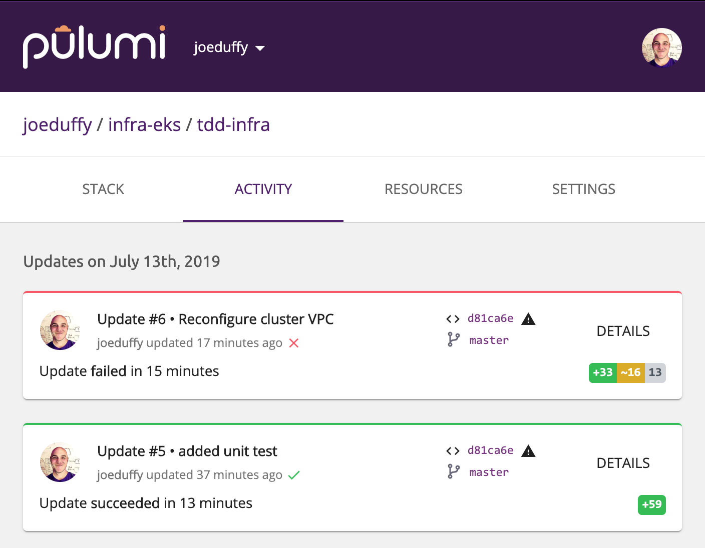
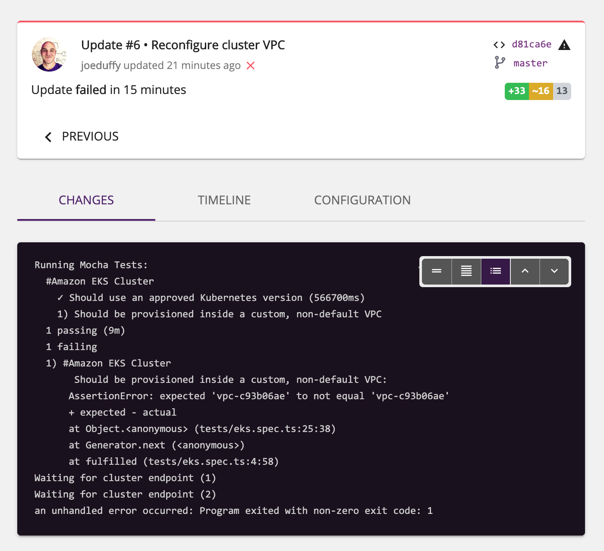

Testing your infrastructure using familiar tools like Node.js's Mocha
framework allows you to ensure configuration is correct before provisioning,
and that the resulting infrastructure has certain desirable properties
afterwards. This can enforce team standards, ensure security guidelines
are being followed, and so much more. Because Pulumi uses general purpose
languages, you can just embed tests alongside your infrastructure-as-code
definitions themselves, using a familiar authoring style and reporting
experience. In this post, we'll explore the ins and outs of unit testing
your infrastructure.
<!--more-->

## Test-Driven Infrastructure

We [previously explored many reasons and solutions](
https://www.pulumi.com/blog/testing-your-infrastructure-as-code-with-pulumi/) for
testing your infrastructure. In this post, we'll see a very simple approach that
leverages existing test tools and frameworks. For this blog post, we'll be using
Node.js with TypeScript, the Mocha test framework, and the Chai assertion library.

Our example will be testing two things about an Amazon EKS cluster; that it is

1. Running Kubernetes version 1.13.
2. Provisioned inside a private VPC, rather than the default one.

In true test-driven development (TDD) form, let's start with the tests themselves. If
you're familiar with Mocha and Chai, this should look like ordinary testing to you.
If you're not familiar with them, don't worry -- they are quite easy to read and learn:
[Mocha](https://mochajs.org/) and [Chai](https://www.chaijs.com/).

Here is the contents of our `tests/eks.spec.ts` test file:

```typescript
import * as aws from "@pulumi/aws";
import { expect } from "chai";
import * as pulumi from "@pulumi/pulumi";
import { promise } from "./";
import { cluster } from "../";

describe("#Amazon EKS Cluster", () => {
    it("Should use an approved Kubernetes version", async () => {
        const version = await promise(cluster.eksCluster.version);
        expect(version).to.equal("1.13");
    });
    it("Should be provisioned inside a custom, non-default VPC", async () => {
        const vpcId = await promise(cluster.core.vpcId);
        if (vpcId) {
            const defaultVpc = await aws.ec2.getVpc({ default: true });
            expect(vpcId).not.equals(defaultVpc.id);
        } else if (pulumi.runtime.isDryRun()) {
            pulumi.log.warn("Skipped VPC ID check: not known during preview -- will test after apply");
        } else {
            throw new Error("VPC unknown during deployment");
        }
    });
});
```

This code does a few things worth describing. First, it imports all the packages
that we're going to use. Notably, this includes the normal Chai package for assertions,
the AWS and Pulumi SDK packages, the EKS cluster provisioned by this project itself,
and a utility function `promise` that we'll dive into momentarily. Then it simply uses
the Mocha functions `describe` and `it` to register test cases that will be run.

The version test fetches a property from our EKS cluster, `cluster.eksCluster.version`,
and then uses the Chai assertion `expect(version).to.equal("1.13")`. This will fail the
test if the version is anything but `1.13` (including if it is unknown).

The VPC test is slightly more complex. For the most part, it is simply checking the
`cluster.core.vpcId` property and ensuring it doesn't equal the default VPC ID, which
we fetch with `aws.ec2.getVpc`. However, because we might be creating the custom VPC in the
program itself, it's possible we won't know the ID during previews. (A [preview](
https://www.pulumi.com/docs/reference/cli/pulumi_preview/) is when
Pulumi shows you a dry-run of your deployment without actually doing it yet.) That's why
we check `pulumi.runtime.isDryRun` and let things slide, with a little warning message.
We could always be conservative and fail the test, but in this case, we'll actually permit the
deployment to proceed -- but ensure we check it afterwards. This means we might fail the
test _after_ the bad cluster has been deployed, but that's better than not checking at all.

## Our Base (Failing) Program

Here is the program we'll be testing. Keeping with our TDD theme, let's start with the
tests failing to begin with (we are using the default VPC and not specifying a version):

```typescript
import * as eks from "@pulumi/eks";

// Create a basic EKS cluster.
export const cluster = new eks.Cluster("my-cluster", {
    desiredCapacity: 2,
    minSize: 1,
    maxSize: 2,
    storageClasses: "gp2",
    deployDashboard: false,
});
```

> If you want to create a fresh Pulumi project and follow along, simply
> [install the CLI](https://www.pulumi.com/docs/reference/install/), ensure it is
> [configured for your AWS account](https://www.pulumi.com/docs/reference/clouds/aws/setup/),
> and run `pulumi new aws-typescript` to create an empty project. Swap out the contents
> of `index.ts` with the above.

Before we add our tests, we can run a `pulumi preview` and all will work just fine:

```bash
$ pulumi preview
Previewing update (tdd-infra):

     Type                                          Name                                          Plan
 +   pulumi:pulumi:Stack                           infra-eks-tdd-infra                           create
 +   └─ eks:index:Cluster                          my-cluster                                    create
 +      ├─ eks:index:ServiceRole                   my-cluster-eksRole                            create
 +      │  ├─ aws:iam:Role                         my-cluster-eksRole-role                       create
 +      │  ├─ aws:iam:RolePolicyAttachment         my-cluster-eksRole-90eb1c99                   create
 +      │  └─ aws:iam:RolePolicyAttachment         my-cluster-eksRole-4b490823                   create
 +      ├─ eks:index:ServiceRole                   my-cluster-instanceRole                       create
 +      │  ├─ aws:iam:Role                         my-cluster-instanceRole-role                  create
 +      │  ├─ aws:iam:RolePolicyAttachment         my-cluster-instanceRole-03516f97              create
 +      │  ├─ aws:iam:RolePolicyAttachment         my-cluster-instanceRole-e1b295bd              create
 +      │  └─ aws:iam:RolePolicyAttachment         my-cluster-instanceRole-3eb088f2              create
 +      ├─ pulumi-nodejs:dynamic:Resource          my-cluster-cfnStackName                       create
 +      ├─ aws:iam:InstanceProfile                 my-cluster-instanceProfile                    create
 +      ├─ aws:ec2:SecurityGroup                   my-cluster-eksClusterSecurityGroup            create
 +      ├─ aws:ec2:SecurityGroupRule               my-cluster-eksClusterInternetEgressRule       create
 +      ├─ aws:eks:Cluster                         my-cluster-eksCluster                         create
 +      ├─ pulumi:providers:kubernetes             my-cluster-eks-k8s                            create
 +      ├─ pulumi-nodejs:dynamic:Resource          my-cluster-vpc-cni                            create
 +      ├─ kubernetes:core:ConfigMap               my-cluster-nodeAccess                         create
 +      ├─ aws:ec2:SecurityGroup                   my-cluster-nodeSecurityGroup                  create
 +      ├─ kubernetes:storage.k8s.io:StorageClass  my-cluster-gp2                                create
 +      ├─ aws:ec2:SecurityGroupRule               my-cluster-eksExtApiServerClusterIngressRule  create
 +      ├─ aws:ec2:SecurityGroupRule               my-cluster-eksClusterIngressRule              create
 +      ├─ aws:ec2:SecurityGroupRule               my-cluster-eksNodeIngressRule                 create
 +      ├─ aws:ec2:SecurityGroupRule               my-cluster-eksNodeInternetEgressRule          create
 +      ├─ aws:ec2:SecurityGroupRule               my-cluster-eksNodeClusterIngressRule          create
 +      ├─ aws:ec2:LaunchConfiguration             my-cluster-nodeLaunchConfiguration            create
 +      ├─ aws:cloudformation:Stack                my-cluster-nodes                              create
 +      └─ pulumi:providers:kubernetes             my-cluster-provider                           create

Resources:
    + 29 to create
```

As usual, this shows us all of the resources that Pulumi would provision were we to
proceed with a deployment. No tests yet, however.

## Adding the Test Harness Boilerplate

Now let's hook up the tests so they run anytime we do a `pulumi preview` or `pulumi up`.

Note that we won't be running these tests using the `mocha` CLI. Instead, we will
[run Mocha programmatically](https://github.com/mochajs/mocha/wiki/Using-Mocha-programmatically).
This lets us run the tests inside of our Pulumi program where all of the necessary functionality
is available. It also automatically coordinates test execution with previews and updates.

First, create a test file, `tests/index.ts`, that runs Mocha. This is basic boilerplate that
registers all of the test files in the `tests/` directory and will work for any project:

```typescript
import * as fs from "fs";
import * as Mocha from "mocha";
import * as path from "path";
import * as pulumi from "@pulumi/pulumi";

// runTests executes all test files (*.ts) in the current directory.
export function runTests() {
    // Create a new Mocha test runner (with a long timeout).
    const mocha = new Mocha({ timeout: 1000*60*30 });

    // Only keep the .ts files, and skip this file (index.ts).
    const testDir = __dirname;
    fs.readdirSync(testDir).
        filter(file => file.endsWith(".ts") && file !== "index.ts").
            forEach(file => { mocha.addFile(path.join(testDir, file)); });

    // Now actually run the tests with the desired reporter.
    console.log(`Running Mocha Tests: ${mocha.files}`);
    mocha.reporter("spec").run(failures => {
        process.exitCode = failures ? 1 : 0;
    });
}

// promise returns a resource output's value, even if it's undefined.
export function promise<T>(output: pulumi.Output<T>): Promise<T | undefined> {
    return (output as any).promise() as Promise<T>;
}
```

The `runTests` function creates an instance of the Mocha runner, registers all the test
files, configures the desired reporter, and runs the tests. We adjust the timeout to be
30 minutes, since provisioning things can take some time and we don't want Mocha to
timeout. For complete information on the options available, see [the Mocha documentation](
https://github.com/mochajs/mocha/wiki/Using-Mocha-programmatically); effectively, if you
can do it with the `mocha` CLI, there is a way to do it using the API.

This file also defines the `promise` function used to access resource properties in our
tests. We'll see why this is needed shortly.

## Running the Tests

Now that we have `runTests`, let's go back and add a call to it in our primary `index.ts` file.
First we need to import our custom function at the top of the file:

```typescript
import { runTests } from "./tests";
```

And now we'll add a call to `runTests` at the very bottom of the file:

```typescript
// Run deployment validation tests.
runTests();
```

That's it. Now when we run `pulumi up`, we will see that our tests are running!

```bash
$ pulumi up
Previewing update (tdd-infra):

     Type                                          Name                                          Plan       Info
 +   pulumi:pulumi:Stack                           infra-eks-tdd-infra                           create     1 error; 19 messages
 +   └─ eks:index:Cluster                          my-cluster                                    create
 +      ├─ eks:index:ServiceRole                   my-cluster-eksRole                            create
 +      │  ├─ aws:iam:Role                         my-cluster-eksRole-role                       create
 +      │  ├─ aws:iam:RolePolicyAttachment         my-cluster-eksRole-4b490823                   create
 +      │  └─ aws:iam:RolePolicyAttachment         my-cluster-eksRole-90eb1c99                   create
 +      ├─ eks:index:ServiceRole                   my-cluster-instanceRole                       create
 +      │  ├─ aws:iam:Role                         my-cluster-instanceRole-role                  create
 +      │  ├─ aws:iam:RolePolicyAttachment         my-cluster-instanceRole-03516f97              create
 +      │  ├─ aws:iam:RolePolicyAttachment         my-cluster-instanceRole-e1b295bd              create
 +      │  └─ aws:iam:RolePolicyAttachment         my-cluster-instanceRole-3eb088f2              create
 +      ├─ pulumi-nodejs:dynamic:Resource          my-cluster-cfnStackName                       create
 +      ├─ aws:iam:InstanceProfile                 my-cluster-instanceProfile                    create
 +      ├─ aws:ec2:SecurityGroup                   my-cluster-eksClusterSecurityGroup            create
 +      ├─ aws:ec2:SecurityGroupRule               my-cluster-eksClusterInternetEgressRule       create
 +      ├─ aws:eks:Cluster                         my-cluster-eksCluster                         create
 +      ├─ pulumi:providers:kubernetes             my-cluster-eks-k8s                            create
 +      ├─ aws:ec2:SecurityGroup                   my-cluster-nodeSecurityGroup                  create
 +      ├─ kubernetes:core:ConfigMap               my-cluster-nodeAccess                         create
 +      ├─ kubernetes:storage.k8s.io:StorageClass  my-cluster-gp2                                create
 +      ├─ pulumi-nodejs:dynamic:Resource          my-cluster-vpc-cni                            create
 +      ├─ aws:ec2:SecurityGroupRule               my-cluster-eksClusterIngressRule              create
 +      ├─ aws:ec2:SecurityGroupRule               my-cluster-eksNodeClusterIngressRule          create
 +      ├─ aws:ec2:SecurityGroupRule               my-cluster-eksNodeInternetEgressRule          create
 +      ├─ aws:ec2:SecurityGroupRule               my-cluster-eksNodeIngressRule                 create
 +      ├─ aws:ec2:SecurityGroupRule               my-cluster-eksExtApiServerClusterIngressRule  create
 +      ├─ aws:ec2:LaunchConfiguration             my-cluster-nodeLaunchConfiguration            create
 +      ├─ aws:cloudformation:Stack                my-cluster-nodes                              create
 +      └─ pulumi:providers:kubernetes             my-cluster-provider                           create

Diagnostics:
  pulumi:pulumi:Stack (infra-eks-tdd-infra):
    Running Mocha Tests: infra-eks/tests/eks.spec.ts
      #Amazon EKS Cluster
        1) Should use an approved Kubernetes version
        2) Should be provisioned inside a custom, non-default VPC
      0 passing (9s)
      2 failing
      1) #Amazon EKS Cluster
           Should use an approved Kubernetes version:
         AssertionError: expected undefined to equal '1.13'
          at Object.<anonymous> (tests/eks.spec.ts:19:35)
          at Generator.next (<anonymous>)
          at fulfilled (tests/eks.spec.ts:4:58)
      2) #Amazon EKS Cluster
           Should be provisioned inside a custom, non-default VPC:
          AssertionError: expected 'vpc-c93b06ae' to not equal 'vpc-c93b06ae'
          + expected - actual
          at Object.<anonymous> (tests/eks.spec.ts:25:38)
          at Generator.next (<anonymous>)
          at fulfilled (tests/eks.spec.ts:4:58)

    error: an unhandled error occurred: Program exited with non-zero exit code: 1
```

As expected, our tests fail for two reasons:

1. The Kubernetes version is `undefined` and not `1.13`.
2. The VPC ID is equal to the default VPC, since the EKS cluster uses that by default.

## Fixing Our Program

Now let's refactor our infrastructure so the tests start passing.

To fix the first problem, we simply need to pass the Kubernetes version explicitly when
creating our cluster. That's as simple as passing a new argument:

```typescript
export const cluster = new eks.Cluster("my-cluster", {
    ...
    version: "1.13",
});
```

Note that we could have done what we did with the VPC ID, and change the test to verify
that the version is correct _after_ provisioning. It turns out that at the time of this
writing, the default version is in fact `1.13`, so our test would then pass. But we'd
be depending on a brittle default that could change at any moment -- so it's probably
better for us to be explicit about this!

If we rerun `pulumi up`, we'll see that this test now passes -- huzzah:

```bash
Diagnostics:
  pulumi:pulumi:Stack (infra-eks-tdd-infra):
    Running Mocha Tests: infra-eks/tests/eks.spec.ts
      #Amazon EKS Cluster
        ✓ Should use an approved Kubernetes version (3704ms)
        1) Should be provisioned inside a custom, non-default VPC
      1 passing (4s)
      1 failing
      1) #Amazon EKS Cluster
           Should be provisioned inside a custom, non-default VPC:
          AssertionError: expected 'vpc-c93b06ae' to not equal 'vpc-c93b06ae'
          + expected - actual
          at Object.<anonymous> (tests/eks.spec.ts:25:38)
          at Generator.next (<anonymous>)
          at fulfilled (tests/eks.spec.ts:4:58)

    error: an unhandled error occurred: Program exited with non-zero exit code: 1
```

But the VPC test still fails. Let's fix that one by creating a custom VPC -- the
`awsx.ec2.Vpc` component makes this easy -- and then passing its resulting ID and
subnet IDs as arguments.

```typescript
const vpc = new awsx.ec2.Vpc("my-vpc");
export const cluster = new eks.Cluster("my-cluster", {
    vpcId: vpc.id,
    subnetIds: vpc.publicSubnetIds,
    ...
});
```

For reference, here is the complete corrected `index.ts` file we have now:

```typescript
import * as awsx from "@pulumi/awsx";
import * as eks from "@pulumi/eks";
import { runTests } from './tests';

// Create a basic EKS cluster.
const vpc = new awsx.ec2.Vpc("my-vpc");
export const cluster = new eks.Cluster("my-cluster", {
    vpcId: vpc.id,
    subnetIds: vpc.publicSubnetIds,
    desiredCapacity: 2,
    minSize: 1,
    maxSize: 2,
    storageClasses: "gp2",
    deployDashboard: false,
    version: "1.13",
});

// Run deployment validation.
runTests();
```

Now if we rerun `pulumi up`, we will see that the tests pass during the preview,
landing us at the prompt asking us whether to deploy our infrastructure:

```bash
$ pulumi up
Previewing update (tdd-infra):

     Type                       Name                    Plan
 +   pulumi:pulumi:Stack        infra-eks-tdd-infra     create
 +   ├─ awsx:x:ec2:Vpc          my-vpc                  create
...
 +   └─ eks:index:Cluster       my-cluster              create
...

Diagnostics:
  pulumi:pulumi:Stack (infra-eks-tdd-infra):
    Running Mocha Tests: infra-eks/tests/eks.spec.ts
      #Amazon EKS Cluster
        ✓ Should use an approved Kubernetes version (839ms)
        ✓ Should be provisioned inside a custom, non-default VPC
      2 passing (928ms)

    warning: Skipped VPC ID check: not known during preview -- will test after apply

Resources:
    + 59 to create

Do you want to perform this update?
  yes
> no
  details
```

They passed! Notice, however, that the VPC test was skipped. That's because we can't know
whether the resulting ID is going to end up resolving to the default VPC or not. There
are myriad ways that the program could have supplied the ID, including by querying and
looking up the default VPC ID dynamically and passing it as an argument.

If we choose `yes` and deploy the changes, we will a more confidently passing test:

```bash
Updating (tdd-infra):

     Type                       Name                    Status
 +   pulumi:pulumi:Stack        infra-eks-tdd-infra     created
 +   ├─ awsx:x:ec2:Vpc          my-vpc                  created
...
 +   └─ eks:index:Cluster       my-cluster              created
...

Diagnostics:
  pulumi:pulumi:Stack (infra-eks-tdd-infra):
    Running Mocha Tests: infra-eks/tests/eks.spec.ts
      #Amazon EKS Cluster
        ✓ Should use an approved Kubernetes version (666477ms)
        ✓ Should be provisioned inside a custom, non-default VPC (917ms)
      2 passing (11m)

Resources:
    + 59 created

Duration: 12m40s
```

Voila! A successfully stood up EKS cluster, with built-in TDD security safeguards.

## Keeping Track of Failures

Anytime we try to deploy a program that fails, Pulumi is keeping a record of it.

For instance, let's say somehow the VPC wasn't known at preview time, and ended up
resolving to the default VPC. Even though the deployment occurred, we'd want to
know that we now have an issue that we need to go track down.

We can very clearly see such failures on the Pulumi SaaS console:



And if we click into it, we'll see the complete Mocha test output:



We could even [use webhooks](https://www.pulumi.com/docs/reference/service/webhooks/) to
fire off a Slack alarm so that nobody misses the issue. This is often very helpful in
unattended scenarios, like [continuous deployment](https://www.pulumi.com/docs/reference/cd/).

Better to catch these things late than never!

## About Resource Properties and Outputs

A brief aside on resource properties is worthwhile, because they are "special" in some
important ways when writing test cases.

All properties on resources are of type `Output<T>`. This behaves a lot like a promise,
in that the value isn't readily available to your program. Instead, you use the `apply`
function to get at it, and Pulumi calls this when your resource's properties are known.

Sometimes, however, properties cannot be known. A good example is the VPC ID we're
using above. Amazon will automatically assign a VPC ID when the resource is provisioned.
That means that during previews, we won't actually have a known value -- it doesn't even
exist yet! We somehow need a way to deal with these situations.

The `Output<T>.apply` function tries to shield you from these circumstances. It would
be maddening to need to check inside of these functions whether a value is known or not,
and then you'd have all sorts of conditional code that differs between previews and updates --
generally an anti-pattern, because the entire point of a preview is to show you exactly
what will be done during an update. Any differences run the risk of showing different results.

Tests are special, however, in that you will need to think about what tests make sense
to run _before_ an update, versus those that should run _after_ an update.

That's why we need the `promise<T>` function defined earlier. It uses an internal
`promise()` property to get at the raw underlying promise for any resource property,
and returns it so you can either `await` it or call `then` in the usual promise ways.
This does mean we aren't hidden from the details of whether a preview is running or not.

> This function, or functionality like it, will be made available as an official SDK
> feature as soon as [pulumi/pulumi#2287](https://github.com/pulumi/pulumi/issues/2287)
> has been resolved.

By using this function in our tests, we have the following cases to consider:

* The value is known, which could be due to the following cases
    - It was explicitly supplied in our program
    - It was a default populated by the underlying resource provider during a preview
    - We are doing an update and the full outputs are available
* The value is `undefined`, which could be due to the following cases
    - We are in a preview and the value hasn't been computed yet
    - We have done an update and the property was not made available as an output value

In all cases, the `pulumi.runtime.isDryRun` function will return `true` during a preview.

In general, it's easiest to write tests that just run at deployment time, rather than during
a preview, when all of these different states are possible. That has the downside to not
catching problems before they get deployed, however. As with many things, this is a tradeoff.

For a more complete overview of `Output<T>`, please see the
[Pulumi Programming Model documentation](https://www.pulumi.com/docs/reference/programming-model/#outputs).

## Next Steps

In this post, we've seen how to test your infrastructure using familiar test driven
development (TDD) techniques and frameworks like Node.js's Mocha and Chai libraries.
This is a powerful capability that builds atop Pulumi's use of general purpose languages,
letting you apply existing software development best practices to your infrastructure.

Although we've just scratched the surface with our EKS cluster example, this capability
can be used to enforce a wide array of team standards, best practices, and security
guidelines. If you can express it in your favorite test framework, you can check it!

Everything we've seen in this article is open source and free to use --
[give Pulumi a try today](https://pulumi.com/docs/quickstart).
