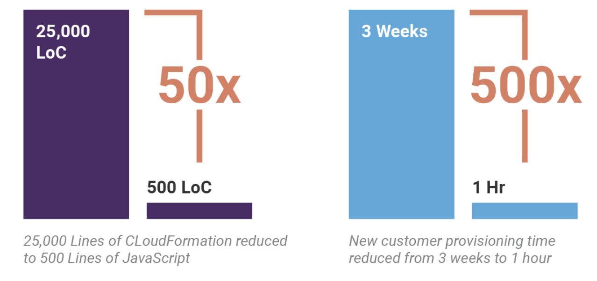

Pulumi is hosting [a webinar with AWS Fargate]() **on
February 5th, 10AM PST** (register
[here](https://pages.awscloud.com/acq_NAMER_IPC-Pulumi-February-2019-Registration-Page.html?sc_channel=el&sc_campaign=ContainersPulumiFebruary2019&sc_country=US&sc_geo=NAMER&sc_category=mult&sc_outcome=acq%20%20%20%20%20%20%20%20%20%20%20%20%20%20%20%20%20%20%20%20%20%20%20%20%20%20%20%20%20%20%20%20%20%20%20%20&trk=Partner_Website_Landing_Page)).
We'll be chatting about how to implement cloud native infrastructure
across your organization using [AWS and Pulumi](): general purpose programming
languages to deliver everything from VMs to Kubernetes to Serverless.
<!--more-->

## Register Now

[Registration link](https://pages.awscloud.com/acq_NAMER_IPC-Pulumi-February-2019-Registration-Page.html?sc_channel=el&sc_campaign=ContainersPulumiFebruary2019).
Specifically, you will learn:

- How using general-purpose programming languages provides familiar
  and powerful programming concepts to infrastructure-as-code
  challenges
- How Pulumi can help build a library of code packages to enhance
  efficiency when implementing standard policies, network best
  practices, and more
- Best practices for becoming a deployment-focused organization,
  rather than configuration-focused, to continuously deliver new
  cloud-native infrastructure with containerization

Joining us is Pulumi customer [Learning
Machine](https://www.learningmachine.com/). Adopting Pulumi helped
Learning Machine reduce 25,000 LoC of ad-hoc DevOps scripts to 500 LoC
of JavaScript, improving time to ship code, time to provision and
onboard new customers, and unify their Development and DevOps teams and
techniques.

[Download the case study](./AWS-Pulumi-CaseStudy.pdf)

This webinar will be useful to developers, System Architects, IT
managers and DevOps managers. (register
[here](https://pages.awscloud.com/acq_NAMER_IPC-Pulumi-February-2019-Registration-Page.html?sc_channel=el&sc_campaign=ContainersPulumiFebruary2019)).

Ask any questions you have to our speakers, Trevor Hansen (Startup
Partner Solutions Architect), Luke Hoban (CTO, Pulumi), and Kim Hamilton
Duffy (CTO & Principal Architect, Learning Machine).

To learn more about the webinar, check out our
[e-book](./AWS-Ebook.pdf) and [case study](./AWS-Pulumi-CaseStudy.pdf).
